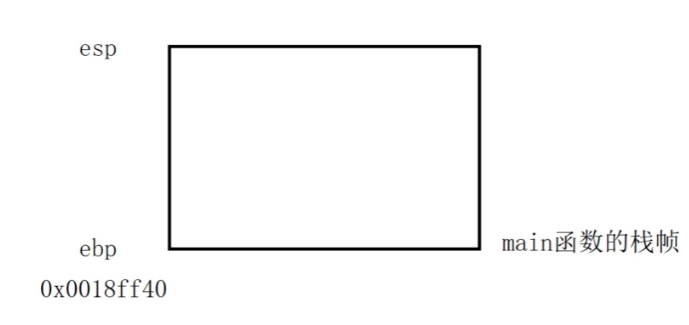
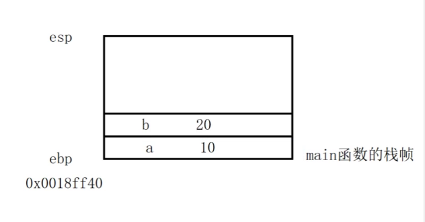
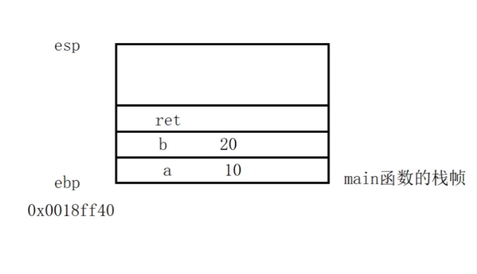
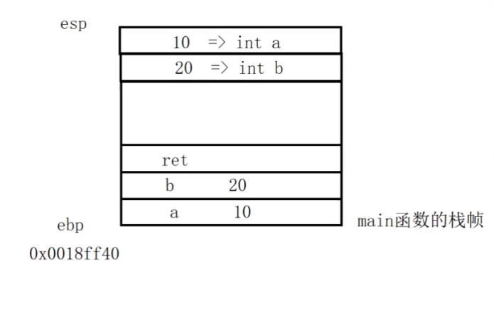
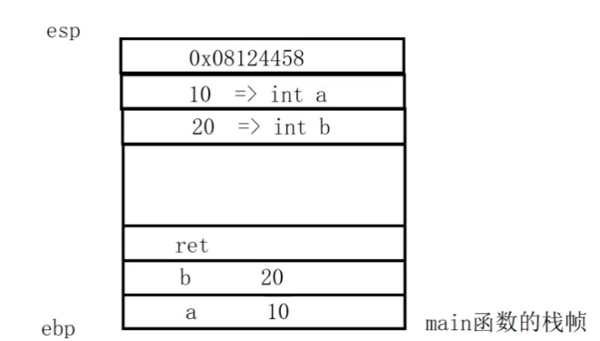
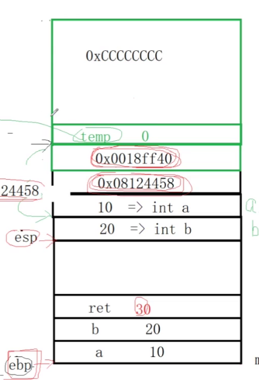
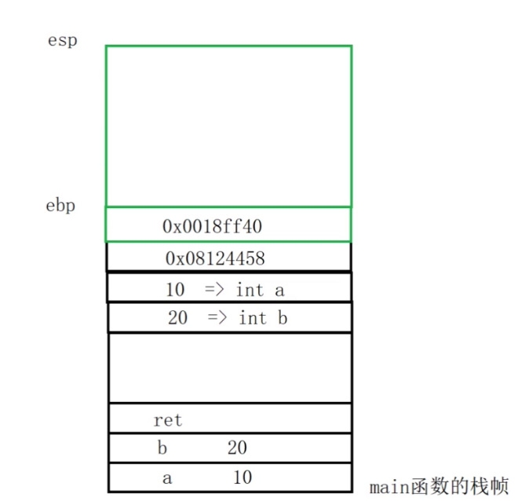
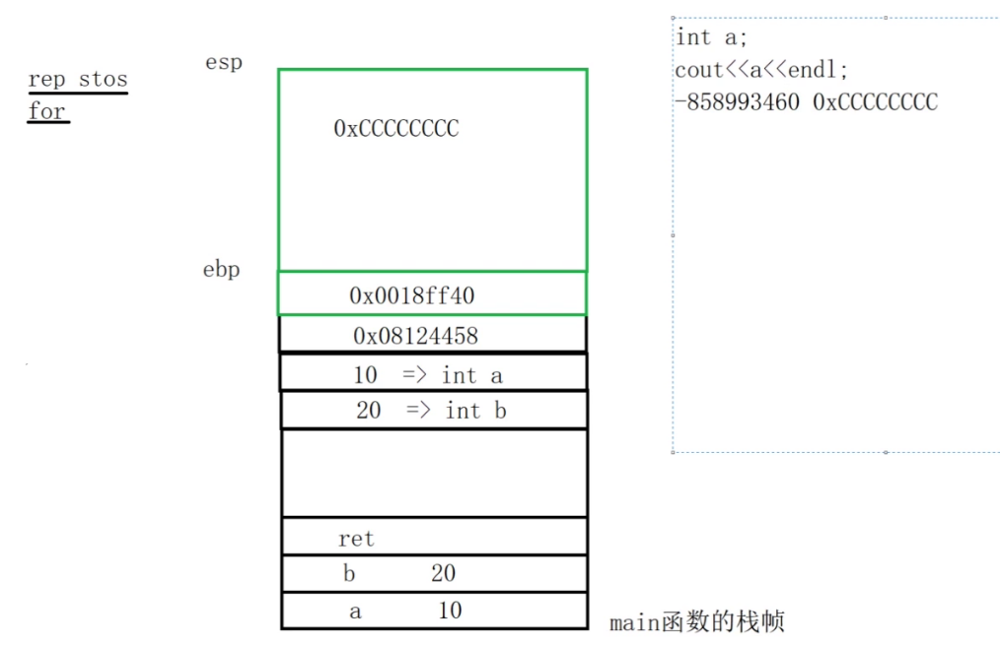
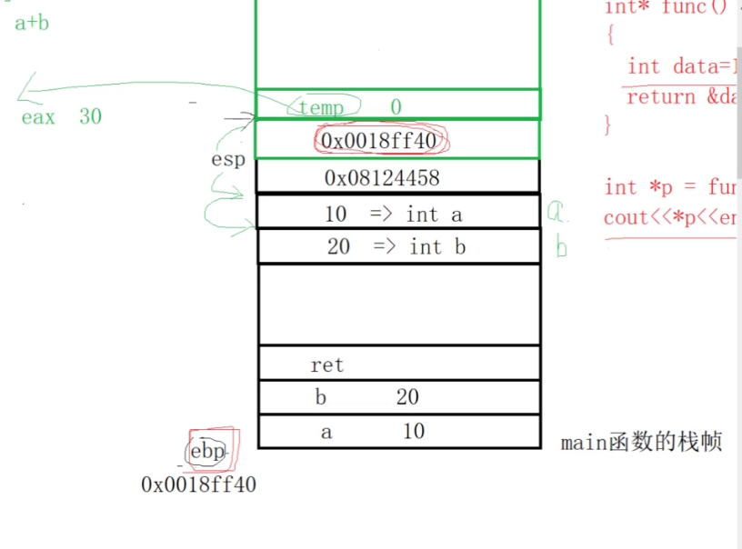
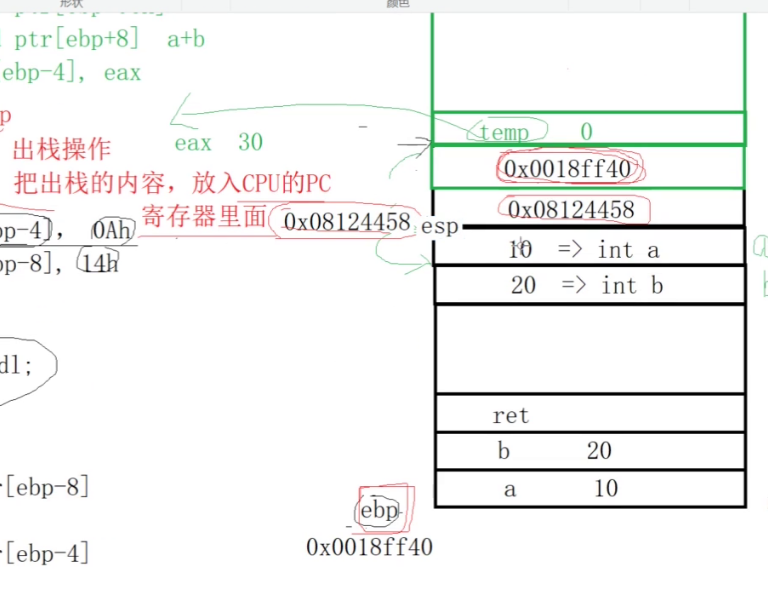

###  从指令角度掌握函数调用堆栈的过程


#### 实例代码段

```C++
#include <iostream>
using namespace std ; 

int sum(int a , int b )
{
    int temp = 0 ; 
    temp = a + b ; 
    return temp ; 
}

int main()
{
    int a = 10 ; 
    int b = 20 ; 
    
    int ret = sum(a , b ) ; 
    
    cout << "ret: " << ret << endl ; 
    
    return 0 ; 
    
}
```

> **以下分析均是基于上面的代码段进行展开**
>
> 问题1： main函数调用sum函数 ，sum函数执行完毕之后，怎么知道回到哪个函数进行执行？
>
> 问题2： sum函数执行完，回到main之后，怎么知道从哪一行指令继续运行？

#### 汇编知识

+ `esp`：栈指针寄存器(extended stack pointer)，其内存放着一个指针，该指针永远指向**系统栈最上面一个栈帧的栈顶** ,`esp` 指向的是栈的**最顶部元素**，**不是最顶部元素的下一个元素**
+ `ebp`：基址指针寄存器(extended base pointer)，其内存放着一个指针，该指针永远指向**系统栈最上面一个栈帧的底部**。
+  `pop ebp`:   将栈顶的四字节数据放入`ebp`寄存器中，之后栈顶指针**自增 ** 。 **主要流程**：
  + 将`esp` 指向的数据放入`ebp`寄存器中。 
  +  栈顶指针进行一个自增： `esp = esp + 4 ` (`esp`指向的是每一个数据的最小的地址) 。
+ `push ebp`：栈顶指针减少，并且将`ebp` 寄存器中的数据放入栈中。主要流程：
  + 栈顶指针进行一个自减：`esp = esp - 4 `  (`esp`指向的是每一个数据的最小的地址)  。
  + 将`ebp` 寄存器中的内容放到`esp` 指向的内存空间。
+ `call sum`  ： 
  + 将当前`call`指令的下一条指令的地址压入栈空间。
  + 跳转到sum函数对应的指令进行执行。
+ `ret ` :
  + 进行一次出栈
  + 将出栈内容放到程序计数器PC中。

#### 现在开始分析上述代码的执行流程：

+ 函数返回时否需要临时变量：看要返回的变量的大小，如果比寄存器的大小要小，直接通过**通用寄存器**返回，不需要创建临时变量

  > 返回值大小和内存之间的关系
  >
  > 1.    <= 4 字节     ， 通过`eax`通用寄存器.
  > 2. ​    \> 4 字节   <= 8字节  通过 `eax , ebx` 寄存器返回。
  > 3. ​    \> 8 字节， 产生临时量，带出返回值。 


+ `main函数段` ：

  + 程序段以及对应的指令。

  ```C++
  int main()
  {             
      int a = 10 ;                                mov dword ptr[ebp - 4] , 0Ah 
      int b = 20 ;                                mov dword ptr[dbp - 8] , 14h
      
      int ret = sum(a , b ) ;      // 这句代码比较复杂，下面会具体分析
      
      cout << "ret: " << ret << endl ;    // 这句汇编指令不重要
      
      return 0 ; 
      
  }
  ```

  + 在`main`函数执行的时候，执行到`{` 的时候，分配好**合适大小的**栈空间，下图中`ebp` 存储的是栈底地址，`esp` 指向的是栈顶。

    

  + 在执行完以下两行指令之后，`main`函数的栈帧空间是这样的：

    ```C++
    int a = 10 ;                                mov dword ptr[ebp - 4] , 0Ah 
    int b = 20 ;                                mov dword ptr[ebp - 8] , 14h
    ```

    

  > 需要注意：**这两行代码生成的是`mov`指令，不是push指令，所以我们直接将a , b 两个变量的值从栈底开始放**

  + 之后执行下面的代码，这个过程比较复杂。

    ```C++
    int ret = sum(a , b ) ; 
    
    
    
    这句话对应的指令【从上到下依次执行】:
    
    mov eax , dword ptr[ebp - 8]
    
    push eax                // 将参数b压栈
    
    mov eax , dword ptr[ebp - 4]
    
    push eax             // 将参数a压栈
    
    call sum    
        
    add esp , 8        // 设这条指令的地址为：0x08124458 ; 实际含义:将形参空间交还给系统 
    
    mov dword ptr[ebp - 0Ch] , eax                  //实际含义: 将函数的返回值通过eax直接赋值给ret对应的栈空间。
    
    
    
    ```

    定义了一个`ret` 局部变量【由于需要调用函数，先不标注其值】：

    ​	

    +  进行参数的压栈：并且是**从右向左进行压栈，这样使得左边的参数会比右边的参数更早出栈：**

      > `mov eax , dword ptr[ebp - 8]`
      >
      > `push eax`                // 将参数b压栈
      >
      > `mov eax , dword ptr[ebp - 4]`
      >
      > `push eax `              // 将参数a压栈

    

    +  执行`call sum` 的流程：

      + 先把下一条指令的地址也就是上面指令段`add esp , 8`指令的地址`0x08124458`压栈：

        

      + 之后进入sum函数进行执行。

    + `sum`函数返回之后继续执行：得到

      ```C++
      add esp , 8        // 设这条指令的地址为：0x08124458 ; 实际含义:将形参空间交还给系统 
      
      mov dword ptr[ebp - 0Ch] , eax              //实际含义: 将函数的返回值通过eax直接赋值给ret对应的栈空间。
      
      ```

      

    + 最后，退出`main`函数 , 将栈空间交还给系统。

+ `sum` 函数段：

  ```C++
  int sum(int a , int b )
  {
      int temp = 0 ; 
      temp = a + b ; 
      return temp ; 
  }
  
  
  左括号对应指令：
  push ebp                      将main函数栈底地址压栈，也就是将0x0018ff40压栈
  mov ebp , esp                 将栈底指针指向当前栈顶，为开辟sum函数的栈空间做准备
  sub esp , 4Ch                 为sum函数开辟栈空间。
      
  
  
  mov dword ptr[ebp - 4] , 0         int temp = 0 ;    
      
  
  
  mov eax , dword ptr[ebp + 0Ch]     temp = a + b ; 
  add eax , dword ptr[ebp + 8] 
  mov dword ptr[ebp - 4] , eax 
  
  
  mov eax , dword ptr[ebp - 4]       return temp ;
  
  
  }右括号对应指令: 
  
  mov esp , ebp               回退栈帧，相当于将为sum开辟的栈空间返回给操作系统。[注意：回退的时候不会对栈帧进行清理]
  pop ebp                     含义: 是的ebp指向main函数的栈底地址！！！
  
  ret                   这个指令也存在两个操作： 1.出栈操作，2.把出栈的内容放到CPU的PC程序计数器中。
      
  
  
  ```

  + 进入`sum`函数最先执行的是函数的`{` 所对应的指令 ， 执行完这三句指令后有下图：

    ```
    push ebp                      将main函数栈底地址压栈，也就是将0x0018ff40压栈
    mov ebp , esp                 将栈底指针指向当前栈顶，为开辟sum函数的栈空间做准备
    sub esp , 4Ch                 为sum函数开辟栈空间。
    ```

    

  > tips : 在sum函数的左括号对应的指令执行完之后，不同的平台对**新开辟的栈空间会有不同的操作**，`x86`体系32位`linux`环境下`gcc , g++`编译器不初始化栈空间，直接继续执行，而在`windows` 平台下vs系列的编译器会执行 `ret stos`这个类似于for循环的指令，将新开辟的栈帧的空间全部初始化为`0xCCCCCCCC` (-858993460)  [注：版本较新的vs系列编译器在执行`访问未初始化的局部变量`代码时会报错] 
  >
  > 

  + 之后执行以下指令，得到：

    ```C++ 
    mov eax , dword ptr[ebp + 0Ch]     temp = a + b ; 
    add eax , dword ptr[ebp + 8] 
    mov dword ptr[ebp - 4] , eax 
    
    
    mov eax , dword ptr[ebp - 4]       return temp ;
    
    mov esp , ebp               回退栈帧，相当于将为sum开辟的栈空间返回给操作系统。[注意：回退的时候不会对栈帧进行清理]
    pop ebp                     含义: 使得ebp指向main函数的栈底地址！！！
    ```



>  在执行完sum函数的除了`ret`的所有指令之后，得到的栈图见上，此时栈顶存放的是：原main函数要执行的下一条指令的地址。	
>
> 之后执行`ret` 指令得到的如图：
>
> ​	


**执行完`ret`指令之后，PC指令寄存器指向的是call sum 的下一个指令的地址也就是上图中的`0x08124458`，并且此时栈顶指向形参a对应的地址**   


