### 从编译器角度理解C++代码的编译和链接原理

##### 环境

+ `linux`下`gcc`编译器

#### 前置知识点。

+ `gcc` 是C的编译器，用来编译C语言的源文件。
+ `g++` 是C++的编译器，用来编译C++的源文件。

+ 带有`C++的库的源文件`不能用`gcc` 编译器进行**编译**。

+ 静态链接库文件: `xxx.a`表示的是`linux`下的静态库文件 ，`xxx.lib` 是`windows` 下的静态库文件。(在**链接阶段**载入到程序中)   

+ 动态链接库文件：`xxx.so` `linux`下的动态库文件 ， `xxx.dll` 是`windows`下的动态库文件库文件。(**动态链接库在程序运行时被加载**)

+ 汇编指令有两种体系：

  + `x86`体系的汇编。
  + `AT&T` 体系的汇编

+ `g++` 常用编译命令

  ```C++
  g++ source.cpp -o output      // 将 source.cpp 编译为可执行文件，并将输出文件命名为 output
  
  g++ source.cpp -std=c++11 -o output         // 使用 C++11 标准编译 source.cpp 文件。
  
  g++ source.cpp -I/path/to/include -o output    //  指定编译器在 /path/to/include 目录中查找头文件。
     
  g++ source.cpp -L/path/to/lib -lmylib -o output  // 指定编译器在 /path/to/lib 目录中查找动态库文件 libmylib.so（或 libmylib.dylib 在 macOS 上）。
      
  
  g++ source.cpp /path/to/lib/libmylib.a -o output   // 指定编译器链接静态库文件 libmylib.a。
      
   
  g++ source.cpp -g -o output           // 编译时包含调试信息，方便调试和跟踪错误。
      
  g++ source.cpp -O2 -o output   //开启优化选项，生成更高效的可执行文件。常见的优化选项包括 -O1、-O2 和 -O3。
      
      
  
  
  ```

  

#### 实例代码

```C++ 
/*main.cpp*/
extern int gdata ;                                       
int sum(int,int) ;

int data = 20;

int main()
{
	int a = gdata;
	int b = data;

	int ret =  sum(a,b);

	return 0;
}


/*sum.cpp*/

int gdata = 10;
int sum(int a, int b)
{
	return a+b;
}
```

#### g++编译器各阶段常用命令以及工具

+ 主要分为两个大的阶段：**编译过程** ， **链接过程**

+ ==**编译过程**==：**编译过程中，符号是不分配虚拟地址的**，在链接阶段才会对符号进行虚拟地址的分配。

  + **预编译(`Prepressing`**):  将`xxx.cpp` 文件转化为`xxx.i` 文件 命令如下：

    > `g++ -E main.cpp -o main.i `

    > 预编译过程主要处理那些源代码文件中`#`开头的预编译指令,例如：`#include<XXX>`、`#define XXX`、`#ifdef XXX`等；
    >
    > 对`xxx.cpp`文件的主要处理方式如下：
    >
    > + **将所有的"#define" 删除，并且展开所有的宏定义**。
    > + **处理所有条件预编译指令**，例如，`"#if" , "#ifdef" , "#elif" , "#else" , "#endif"` ; 
    > + **处理"#include" 预编译指令**，将被包含的文件插入到该预编译指令的位置。注意，这个过程是递归进行的，也就是说被包含的文件可能还包含其他文件，最先展开的文件是位于递归尾部的文件。
    > + **删除掉所有的注释**: "//" 和"/**/" ;
    > + **添加行号和文件名标识**，以便于编译时编译器产生调试用的行号信息以及用于编译时产生编译错误或警告时能够显示行号。
    > + **==保留所有"`#pragma`"编译器指令，因为编译器要使用它们==**

    ==Tips: `#pragma lib` , `#pragma link`等命令是在链接过程处理的== 。

  + **编译(`Compilation`)** : 编译过程就是把预编译后得到的`xxx.i`文件进行一系列==词法分析== ， ==语法分析== ， 以及==优化== ， 随后生产相应的==汇编代码==文件,得到的是`xxx.s` 文件。

    > `g++  -S  main.i  -o main.s  ` 

  + **汇编(Assembly)**: 汇编是将汇编代码转变为机器可以执行的指令的过程: `汇编代码->指令`；您可以使用 `as`（汇编器）或 `gcc`（GNU 编译器集合）中的 `-c` 选项将汇编文件 `.s` 编译为目标文件 `.o`。虽然 `gcc` 是用于编译和链接 C/C++ 程序的综合工具，但它也支持将汇编文件编译为目标文件的功能。请注意，如果您使用 `gcc` 命令，它将执行一些默认设置，例如检测源代码的语言类型并自动选择适当的编译器（如 G++），因此确保您在汇编文件中使用的语法和指令适用于所需的目标平台。

    > ```
    > as main.s -o main.o
    > 或者：
    > gcc -c main.s -o main.o 
    > 或者：
    > g++ -c main.s -o main.o 
    > 
    > ```

    >汇编完成后得到==二进制可重定位目标文件：`.o`文件==。
    >我们可以通过`objdump`命令来查看`.o`或者`.exe`文件的相关信息；

    > `objdump -t main.o`来查看`main.o`里面的符号表(symbol table)信息：
    >
    > 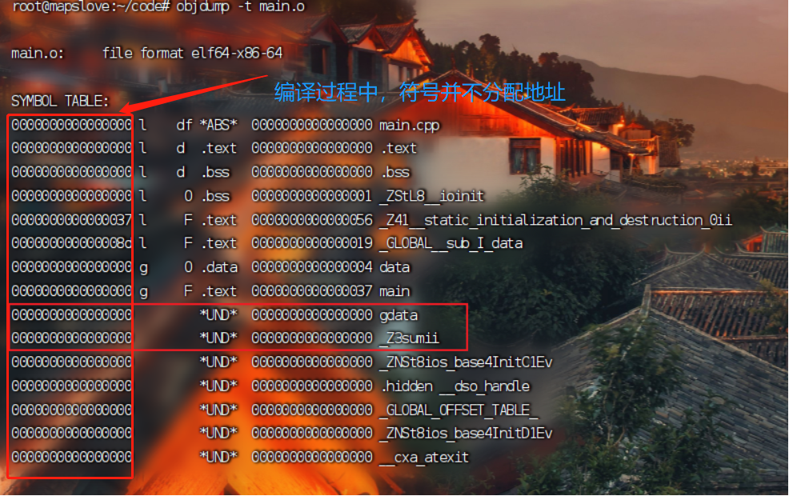
    >
    > 我们可以看到在`main.o`里面引用了外部文件的`gdata`变量和`sum`函数，在符号表中都是`UND`的，这是一种对符号的引用。也就是（`undefine`）；
    > 这就意味着==汇编器生成符号的时候在`main.cpp`文件中使用到了但是未找到`gdata`和`sum`的定义==，所以只能暂时存放在==`UND`段中。== 注意： `UND`段和`.data` 段处于一个相同的地位。
    >
    > ==上图中的第二列：==
    >
    > `l` :代表`local` 仅本文件可见。 
    >
    > `g` :代表`global` 表示其他文件也可以看到，**对于链接器来说，它只能看到各个文件的符号表内的global的符号** 
    >
    > 注意： static 的变量是当前文件可见的，也就是说其在符号表内部是`local` 的属性的。

    

    > 其次，我们会注意到，**符号表中关于sum的部分是`_Z3sumii`**，其实这就是C++生成符号的规则，具体细节我们不用去深究，但是可以看到其中包含了`函数名`和`形参列表`，这也是C++和C语言不一样的地方，如果我们相同的代码使用C语言来看看符号表，就会发现长这样：
    >
    > 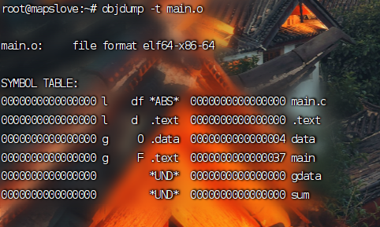

    >同理执行：
    >
    >`objdump -t sum.o`
    >
    >来查看`sum.o`文件里面的符号表信息:
    >
    >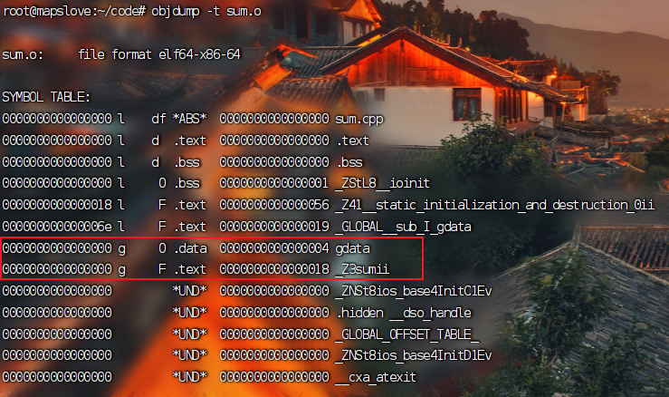
    >
    >在上图可以看到，变量`gdata`和函数`sum` 存在符号，并且分别位于`.data` 段和`.text` 段。

  + 使用`objdump -S main.o`查看`main.o`文件的`.text` 段的生成的指令:

    > 注意在使用这个命令之前，在生成`main.o` 文件时，需要执行：`g++ -c main.cpp -g`  , 加上`-g` 参数，表示生成了调试信息。这样方便查看`.text`段的指令。

    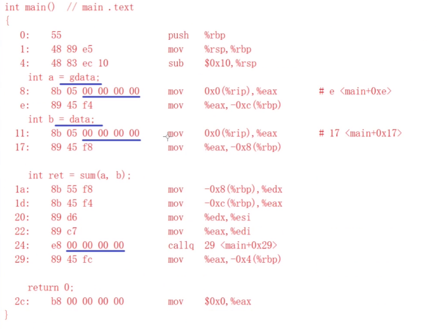

    > 从`main.o` 的`.text` 段的代码可以看出，对于在本文件使用**能够产生符号的变量**的地方，在指令中，其地址是`0x00000000` ,**因为此时符号还没有分配虚拟地址 ** ，**在链接过程中，会修改指令中的这一部分地址**  ， ==**这也是.o文件无法运行的原因之一**== 。 

**在讲解链接过程之前，先了解一下.o文件的组成**

##### `.o` 文件的组成格式：

> 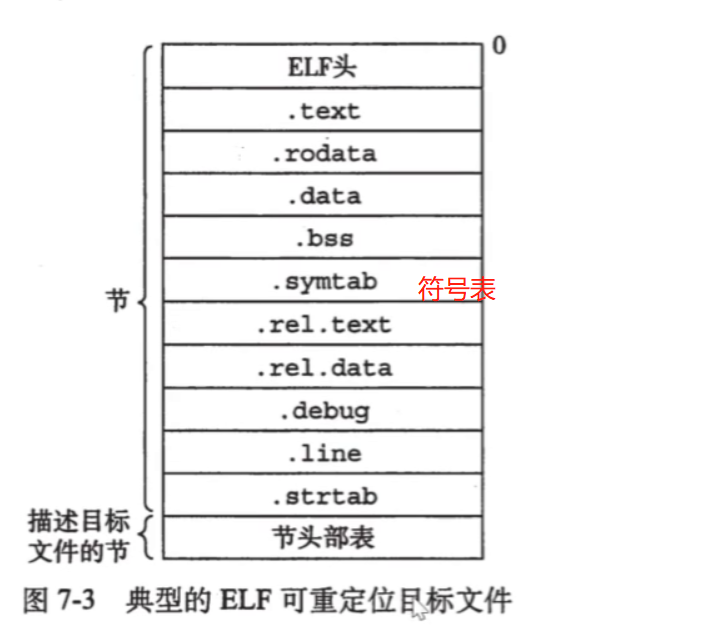


+ 可以使用`readelf -h main.o` 来查看`main.o` 文件的上图中的`ELF头`部分的内容

  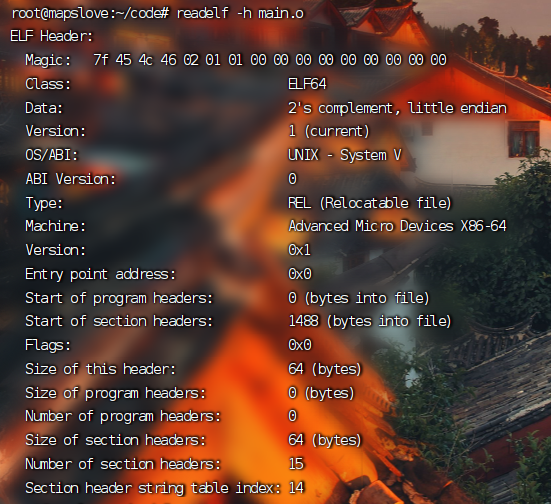

> 注意上图中的`Entry point address` 字段的值为`0x0` , 这是不正确的，因为0地址是不可访问的，在其`Type` 段的值，(REL) 可重定位文件，也印证了这不是一个可执行文件，仅仅只是一个**可重定位文件** 。

+ 执行**`objdump -s main.o`** 打印出`main.o` 文件的**常见的段**中的内容：

  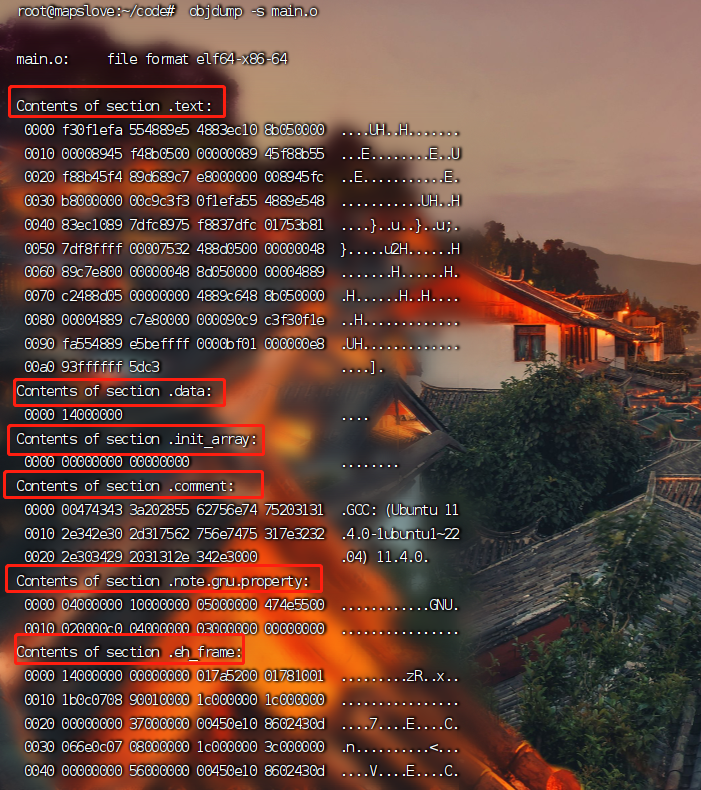

  > 注意，上图可能会和.o文件的组成有点出入，但我们不必太过在意。理解大概就行。	

+ 执行**`readelf  -S main.o`** , 查看**.o文件**的各个段的配置信息：

  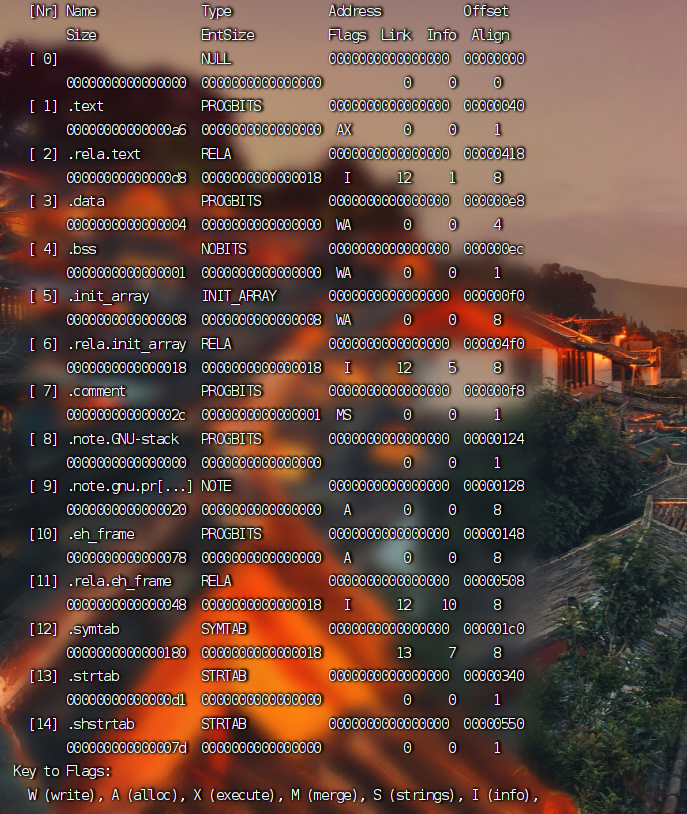

  > 因为`main.cpp`中不存在常量，所以上图没有`.rodata`段，如果存在的话，其一定不包含`w`属性。


+ ==**链接过程**== ： 将所有编译完成的`xxx.o`文件+`xxx.a`静态库文件 连接到一起。主要分为以下两个步骤：

  + 第一步骤：

    + 所有.o文件**段的合并** 

      > `main.o  sum.o` 的各个段之间进行合并; 这个阶段 最容易报错的是**符号表的合并**，例如：
      >
      > **第一种错误[变量名重复]**：有两个源文件 `test1.cpp , test2.cpp` 
      >
      > ```C++
      > /*test1.cpp*/
      > #include <iostream>
      > using namespace std ;
      > 
      > int maxt = 0 ; 
      > int main()
      > {
      > 
      > 	cout << "hello world" << endl ;  
      > 	return 0 ; 
      > }
      > 
      > /*test2.cpp*/
      > #include <iostream>
      > int maxt = 100; 
      > ```
      >
      >  在同一个项目执行的时候会出现：
      >
      > 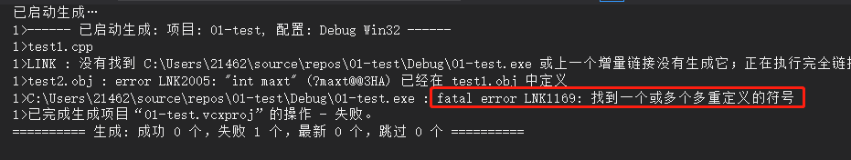
      >
      > **第二种错误:未定义变量**
      >
      > ```C++
      > /*test1.cpp*/
      > #include <iostream>
      > using namespace std ;
      > int sum(int, int); 
      > int main()
      > {
      > 
      > 	int a = 10;
      > 	int b = 20; 
      > 	
      > 	int ret = sum(a, b) ;  
      > 	return 0 ; 
      > }
      > 
      > /*test2.cpp*/
      > int maxt = 100 ;  
      > 
      > ```
      >
      > 在同一个项目中执行后出现：
      >
      > 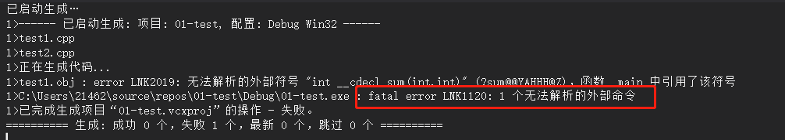 

      

    + 符号表合并之后，进行**符号解析** 

      > **符号解析**的含义： ==**所有的对符号的引用(在符号表中是`UND`的)，都要找到该符号定义的并且是唯一的一个地方**== ，就是找到是在`.text`段的符号，还是`.data`段的符号，在`main.o` 中，`sum` 和`gdata` 对应的符号是`UND`的，需要在其他的文件的符号表找**对应的符号的定义** , 如果没找到，会报错："无法解析的外部命令" ； 如果找到了多个，会报错："重复定义的符号" 。 

  + 第二步骤：**【链接的核心!】**
    + ==**符号的重定向(重定位) **==： 给所有的符号分配虚拟地址，修改`.text`段在编译过程中由于**符号还未分配虚拟地址而暂时填为`0x00000000`的指令**修改为此时为符号分配的虚拟地址。

  

  

  

  #### 可执行文件(.out文件)和可重定位文件(.o)在格式上的区别

  + 前者比后者多一个`program headers` 段，`.out` 文件并不会将所有的段都加载到内存中，**加载哪几个段进入内存主要取决于这个段的内容**

  

  

  

  

  #### 从整体来看可执行文件的加载过程。

  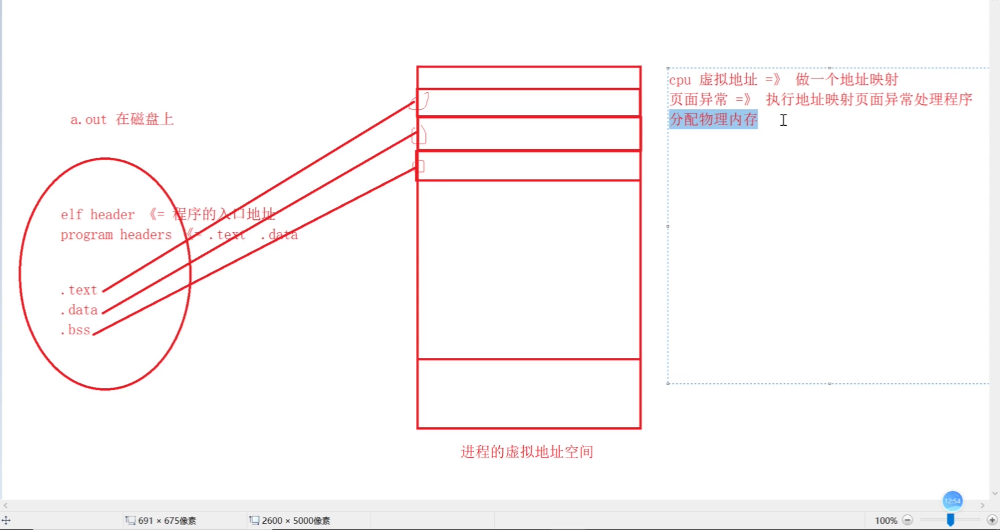

  

  + 程序的入口地址存储在`elf header` 段中。
  + `program header` 存储的是加载哪些内容到内存中。 

  

  

  

  

  

  

  

  

  