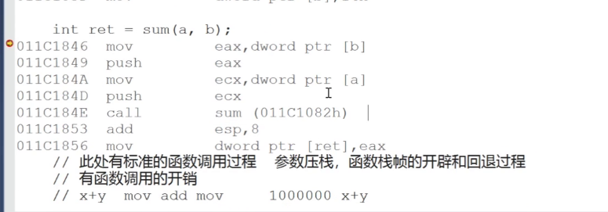
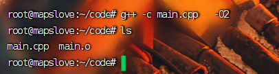
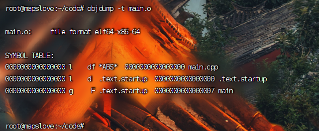

### 掌握`inline`内联函数

**`inline`内联函数**

+ 在编译过程中，就没有调用函数的开销了，**在函数调用点把函数的代码进行了展开处理 的方式是将==函数内的代码副本==直接插入到调用处**  ， 省却了函数的调用的开销。
+ `inline` 函数不再生成相应的函数符号
+ **`inline` 只是建议编译器把这个函数处理成为内联函数**，但是不是所有的`inline`都会被编译器处理成内联函数 比如：**递归**  或当函数内部写的代码过多，编译器也不会将函数处理为内联函数。**如果被调函数内部和调用方函数内部存在名称相同的变量，也是不能进行展开的，否则就造成了变量的重定义** 。 

+ debug版本上，`inline`是不起作用的,因为`debug`版本需要进行调试，如果直接展开的话不利于调试。`inline`只有在release版本下才能出现:

  

> 什么时候我们需要使用`inline` 关键字？
>
> 在函数调用过程中，需要先进行   实参的压栈，如果传入的不是立即数，一个实参的压栈需要两条指令`[mov , push]` ,再加上一个`call sum ` 指令，再加上栈帧的开辟(3个)和回退(3个)，一共11条指令。 如果函数比较复杂，函数体内部产生了成百上千的指令，那么调用函数所带来的开销自然可以忽略不计，**自然可以封装为函数**。但如果函数特别简单，例如下面的函数体内部(不包括左括号和右括号所产生的指令 )**只产生了两条指令**，如果在短时间内调用这个函数上万次，可以发现，**调用函数的所带来的开销比执行函数本身所带来的开销大很多** 。这时候就需要内联函数了。


```C++
/*
===> inline内联函数 和 普通函数的区别？？？
inline内联函数：在编译过程中，就没有函数的调用开销了，在函数的调用点直接
把函数的代码进行展开处理了

inline函数不再生成相应的函数符号

inline只是建议编译器把这个函数处理成内联函数
但是不是所有的inline都会被编译器处理成内联函数  -  递归

debug版本上，inline是不起作用的； inline只有在release版本下才能出现 

g++ -c main.cpp -O2   

// 反汇编main.o文件。
objdump -t main.o
*/

inline int sum(int x, int y)  // *.o   sum_int_int  .text
{
	return x + y ; 
  
    /*
    	mov eax , dword ptr[ebp + 0Ch]     temp = x + y ; 
		add eax , dword ptr[ebp + 8]   
		最终的返回值通过eax带出。
    */
    
}
int main()
{
	int a = 10;
	int b = 20;

	int ret = sum(a, b); 
	// 此处有标准的函数调用过程  参数压栈，函数栈帧的开辟和 回退过程
	
    // 有函数调用的开销   
	// x+y  mov add mov     1000000 x+y

	return 0;
}

```


#### `inline` 内联函数和普通函数的区别？

> 答： 普通函数的调用有着标准的开销，主要分为三个部分：**参数的从右向左进行压栈**，是否需要寄存器取决于我们传入的是立即数还是变量，如果是立即数直接压栈，如果是变量，需要先将其值放入通用寄存器中，再压栈。**在执行函数的左括号的时候函数的栈帧空间的开辟**：将调用方的==栈底指针压栈== ， 将栈底指针指向栈顶地址，将栈顶指针自减为栈开辟空间；                     
>
>  **在执行到右括号的时候，函数栈帧空间的回退** ： 修改栈顶指针指向栈底指针；将栈底指针指向原调用方栈底地址；将PC程序计数器指向**调用方下一条指令** 。 
>
> 
>
> ```
> 
> { 对应的指令：
> push ebp                      将调用方函数栈底地址压栈，
> mov ebp , esp                 将栈底指针指向当前栈顶，为开辟函数的栈空间做准备
> sub esp , 4Ch                 为函数开辟栈空间。
> 
> 
> 
> 
> 
> } 对应的指令：
> mov esp , ebp               回退栈帧，相当于将为函数开辟的栈空间返回给操作系统。[注意：回退的时候不会对栈帧进行清理]
> pop ebp                     含义: 是的ebp指向调用方函数的栈底地址！！！
> 
> ret                   这个指令也存在两个操作： 1.出栈操作，2.把出栈的内容放到CPU的PC程序计数器中。
> 
> 
> 
> ```
>
> 从符号表的角度来说：如果编译器内联函数成功了，那么函数不会产生符号了，而普通的函数一定会在符号表内存在函数。
>
> `inline`只是对编译器的一个建议，我们可以对生成的**二进制可重定向文件**通过执行`objdump -t  main.o` 进行对符号表的查看，如果发现不存在函数的符号，说明内联成功了。


####实验：在`linux`环境下使用g++编译器查看上述代码中的`sum` 函数是否为内联函数

+ 创建源文件`main.cpp`:

  ```C++
  inline int sum(int x, int y)  // *.o   sum_int_int  .text
  {
  	return x + y ; 
  }
  int main()
  {
  	int a = 10;
  	int b = 20;
  
  	int ret = sum(a, b); 
  	return 0;
  }
  
  ```

  

+ 编译生成`main.o` 文件：

  >`g++  -c main.cpp  -O2 `          // 注意这里不要加上 -g 选项(加上-g就是调试版本了)，如果加上的话会造成内联函数的失效 ， `-O2`相当于是指定编译器对代码的优化等级；
  >
  >
  >
  >

+ 使用命令`objdump -t main.o` 反汇编出`main.o`文件的符号表的内容：

   


==**从上图中，没有看到`sum`函数的符号，说明内联成功，反之，内联失败**==

