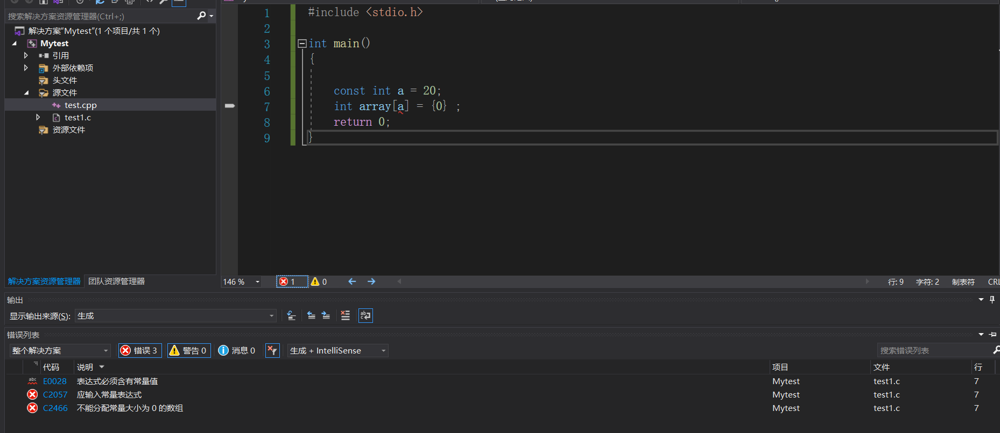

### 全面掌握const的用法


+ `const`怎么理解？

  > `const` 修饰的变量不能够再作为**左值** ， 初始化完成之后，**值不能被修改** 。 

+ `C和C++中const的区别是什么?`

  > + C中，`const` 修饰的量就是当做一个变量来编译生成指令的 ,  我们在加上`const` 在声明变量的时候，**可以不进行初始化** ，`const` 修饰的变量**无法作为左值** , 在`C` 中使用`const` 修饰的量叫做**常变量** ， 和变量的唯一区别在于前者**不能作为左值了** ， 因为变量不能作为数组的大小，所以`常变量` 也不能作为数组的大小。
  >
  >   > 注意下图中的被`const` 修饰的a虽然**不能作为左值**， 但**a所代表的内存块却仍然是可以被修改的** 。`const` 只是语法上的保证a不能作为左值被修改，但在内存层面还是能被修改的。
  >
  >   
  >
  >   面试题：有如下代码，问打印出的答案是什么？
  >
  >   ```C++
  >   #include <stdio.h> 
  >   
  >   int main()
  >   {
  >   	const int a = 20;  
  >   	
  >       int *p = (int*)&a ; 
  >       *p = 30 ; 
  >       printf("%d %d %d" , a , *p , *(&a) ) ; 
  >      
  >       return 0; 
  >   }
  >   
  >   
  >   答案为: 30 30 30 
  >   
  >   ```
  >
  >   > 解析：在`int *p = (int*)&a` 这个语句中，实现**p指向了a所代表的内存块** , 因为**内存块中的东西是能被修改的** ，所以此时`a` 所代表的内存块的数据就为30了，所以最终的 `a` , `*p` , `*(&a)` 的值都是30。
  >
  >   
  >
  > + `C++` 中，`const` 修饰的量，叫做**常量** 。如果不是外部的(也就是没有`extern`修饰) ，则**必须进行初始化** ； **常量可以用来定义数组的大小 **。
  >
  >   面试题：有如下代码，问打印出的答案是什么？
  >
  >   ```C++
  >   
  >   #include <iostream>
  >   int main()
  >   {
  >   	const int a = 20  ;  
  >       int *p = (int*)&a ; 
  >       *p = 30 ; 
  >   	std::cout << a << ' ' << *p << ' ' << *(&a) << std::endl ;  
  >       return 0; 
  >   }
  >   
  >   
  >   答案为: 20 30 20 
  >   
  >   ```
  >
  >   > 解析： 相同逻辑的代码，在C语言中和在C++语言中有着不同的结果。原因在于：`const` 的编译方式不同，C中，`const` 修饰的量在编译器角度是按照`变量` 的方式来生成指令；`C++` 中，**编译过程中所有直接使用`const`修饰的常量的地方，都被常量的初始化值替换了** 。
  >   >
  >   >  上面的代码相当于：
  >   >
  >   > ```C++
  >   > #include <iostream>
  >   > int main()
  >   > {
  >   > 	const int a = 20  ;      
  >   >     int *p = (int*)&a ; 
  >   >     *p = 30 ;      
  >   > 	std::cout << 20 << ' ' << *p << ' ' << 20 << std::endl ;  
  >   >     return 0; 
  >   > }
  >   > 
  >   > 对于 *(&a) 编译器并不会先去取地址再解引用，而是进行优化之后，直接把值掏了出来。
  >   > ```
  >
  >   + 当用一个变量来初始化常量的时候：`const` 常量就会退化为**常变量** 。 (除了不能当做左值，其余特性和常量相同)
  >
  >   ```C++
  >   #include <iostream>
  >   int main()
  >   {
  >   	int b = 20 ; 
  >   	const int a = b  ;      
  >       int *p = (int*)&a ; 
  >       *p = 30 ;      
  >   	std::cout << a << ' ' << *p << ' ' << *(&a) << std::endl ;  
  >       return 0; 
  >   }
  >   
  >   
  >   答案: 30 30 30 
  >   ```
  >
  >   > `const` 常量退化为了**常变量** 。 
  >
  >   

  

