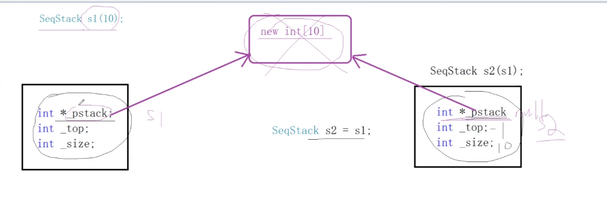
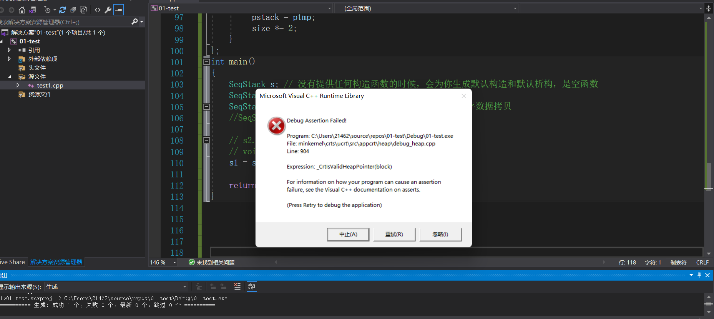
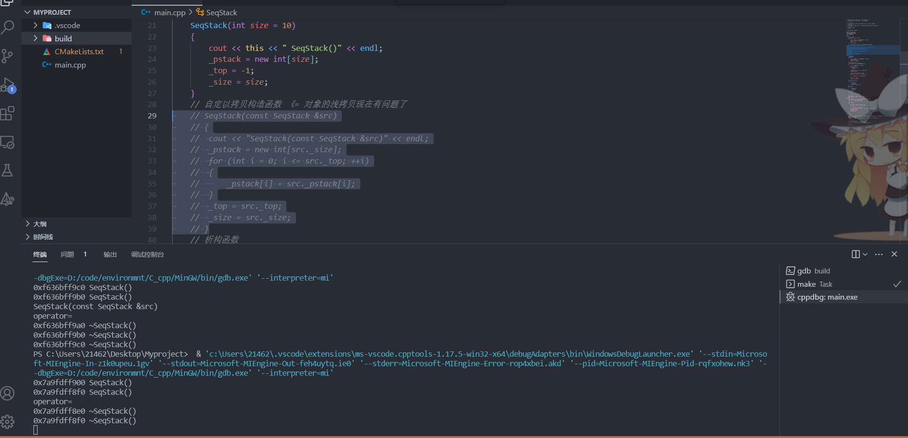

注： `shift+tab` 格式化代码块代码

### 对象的浅拷贝和深拷贝

+ 最终版本示例代码

```cc
/*
this指针 =》 类-》很多对象  共享一套成员方法
成员方法，方法的参数都会添加一个this指针

构造函数：
	定义对象时，自动调用的；可以重载的；构造完成，对象产生了
析构函数：
	不带参数，不能重载，只有一个析构函数；析构完成，对象就不存在了
.data对象
heap new delete
stack
对象的浅拷贝和深拷贝
*/
class SeqStack
{
public:
   // 构造函数 
   SeqStack(int size = 10)
   {
      cout << this << " SeqStack()" << endl;
      _pstack = new int[size];
      _top = -1;
      _size = size;
   }
   // 自定以拷贝构造函数 《= 对象的浅拷贝现在有问题了
   SeqStack(const SeqStack &src)
   {
      cout << "SeqStack(const SeqStack &src)" << endl;
      _pstack = new int[src._size];
      for (int i = 0; i <= src._top; ++i)
      {
         _pstack[i] = src._pstack[i];
      }
      _top = src._top;
      _size = src._size;
   }


   // 析构函数
   ~SeqStack() 
   {
      cout << this << " ~SeqStack()" << endl;
      delete[]_pstack;
      _pstack = nullptr;
   }
   
   
   // 赋值重载函数 s1 = s1;
   void operator=(const SeqStack &src)
   {
      cout << "operator=" << endl;
      // 防止自赋值
      if (this == &src)
      return ;
      // 需要先释放当前对象占用的外部资源 ， 防止内存泄漏
      delete[]_pstack;

      _pstack = new int[src._size];
      for (int i = 0; i <= src._top; ++i)
      {
         _pstack[i] = src._pstack[i];
      }
      _top = src._top;
      _size = src._size;
   }
   
   
   void push(int val)
   {
      if (full())
         resize();
      _pstack[++_top] = val;
   }
   void pop()
   {
      if (empty())
         return;
      --_top;
   }
   int top()
   {
      return _pstack[_top];
   }
   bool empty() { return _top == -1; }
   bool full() { return _top == _size - 1; }
private:
   int *_pstack; // 动态开辟数组，存储顺序栈的元素
   int _top; // 指向栈顶元素的位置
   int _size; // 数组扩容的总大小

   void resize()
   {
      int *ptmp = new int[_size * 2];
      for (int i = 0; i < _size; ++i)
      {
         ptmp[i] = _pstack[i];
      } // memcpy(ptmp, _pstack, sizeof(int)*_size); realloc
      delete[]_pstack;
      _pstack = ptmp;
      _size *= 2;
   }
};	
int main()
{

   SeqStack s; // 没有提供任何构造函数的时候，会为你生成默认构造和默认析构，是空函数
   SeqStack s1(10);
   SeqStack s2 = s1; // #1  调用 拷贝构造函数  而不是   拷贝赋值运算符
   //SeqStack s3(s1); // #2  调用拷贝构造函数

   // s2.operator=(s1) 
   // void operator=(const SeqStack &src)
   s1 = s1; // 默认的赋值函数 =》 做直接的内存拷贝 

   return 0;
}
```


+ **`.data`,`.bss` ,`.stack` ,`.heap` 上的类对象的生存周期**
  + `.data` :  程序启动的时候构造 ，程序结束的时候析构
  + `.heap` : 在`new`的时候构造，在`delete` 的时候析构
  + `.stack` ： 在函数内执行到对象定义的语句构造，在函数栈结束的时候析构
  + `.bss`： 因为类对象在定义的时候会调用构造函数，**所以类对象不会存储到`.bss`段**


+ 类的对象的内存中存储的都是自己本身的**数据**(内存计算按照**内存对齐规则**计算)，但方法是**所有类的对象**所共的。==成员方法通过隐式的`this`指针区分调用方的身份== ， 【**成员方法一旦编译，方法的第一个参数之前都会添加一个`this`指针**】
+ **构造函数**：
  + 用户未定义构造函数时，**编译器**会自动生成一个**默认构造函数**
  + 定义对象时，自动调用的
  + 可以根据函数参数的不同进行**重载**
  + 构造完成，**对象产生**。
+ **析构函数**：
  + 用户未定义析构函数时，**编译器**会自动生成一个**默认析构函数**
  + 无参数
  + 不能重载
  + 析构完成，对象就不存在了。
  + 从语法上讲，对象可以自己调用析构函数，但我们最好不要这样做。


+ **拷贝构造函数**：
  + 用户未定义拷贝构造函数时，**编译器**会自动生成一个拷贝构造函数，但编译器生成的拷贝构造函数是**浅拷贝**的。


+ **浅拷贝**

  + 出现的原因：

    

    如图：`s1`和`s2`指向的是同一块在`.heap` 段的内存，如果首先析构`s2` 对象，导致堆内存已经被释放了，但此时`s1`中仍然存储着释放掉的内存的地址 ，当`s1` 析构的时候就会造成释放**野指针** 。

  + 造成的后果：程序通过了编译，但运行的时候会挂掉：

    

    

  + 解决方式：**如果在类定义的时候，含有指针引用等关联外部资源的数据** ，我们需要为其自定义**拷贝构造，拷贝赋值** ,从而避免出现**浅拷贝**，而实现**深拷贝**:每个对象含有的都是属于自己的外部资源。

    ```C++
    /*拷贝构造函数*/
    SeqStack(const SeqStack &src)
    {
       cout << "SeqStack(const SeqStack &src)" << endl;
       _pstack = new int[src._size];
       for (int i = 0; i <= src._top; ++i)
       {
          _pstack[i] = src._pstack[i];
       }
       _top = src._top;
       _size = src._size;
    }
    
    
    /*拷贝赋值运算符*/
    void operator=(const SeqStack &src)
    {
       cout << "operator=" << endl;
       // 防止自赋值
       if (this == &src)
          return;
    
       // 需要先释放当前对象占用的外部资源 ， 防止内存泄漏
       delete[]_pstack;
    
       _pstack = new int[src._size];
       for (int i = 0; i <= src._top; ++i)
       {
          _pstack[i] = src._pstack[i];
       }
       _top = src._top;
       _size = src._size;
    }
    
    ```

    


+ **为什么第[30,33]行代码和[93,96]行代码使用的是循环赋值而不是直接调用`memcpy(ptmp, _pstack, sizeof(int)*_size);`**?
  + 先说结论，在示例代码中，`_pstack`指向的数组是`int`类型的，在这种情况下使用`memcpy(ptmp, _pstack, sizeof(int)*_size);` 没问题。  但如果这里面存储的是**含有指针的对象** ， 指针指向另一块`.heap`内存资源，直接使用`memcpy` 还是会造成浅拷贝的问题。这就不好搞了。**当我们确认存储在数组中的内容不会使用到外部资源，当然可以使用`memcpy`**
  + 当使用**循环赋值**的时候， 当存储的对象的类重载了`=` 的时候就能避免**浅拷贝**的发生！


