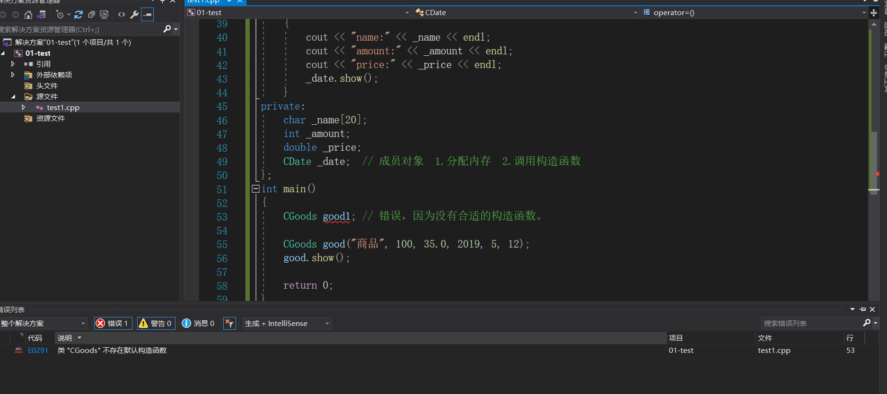
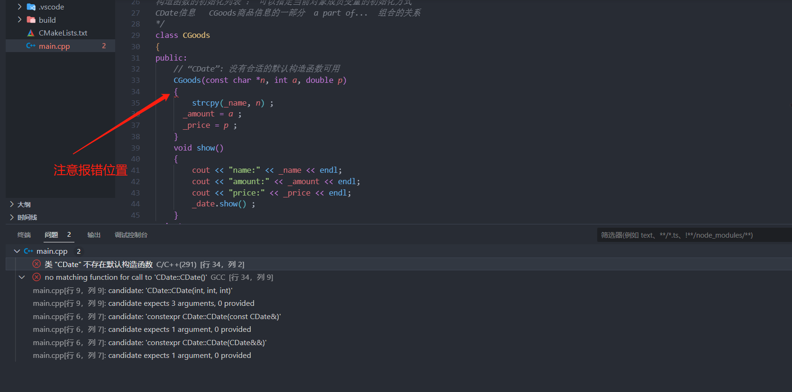
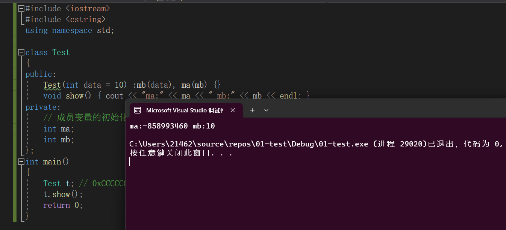

### 掌握构造函数的初始化列表

+ 示例代码

```C++


/*
日期类
*/
class CDate
{
public:
	CDate(int y, int m, int d) // 自定义了一个构造函数，编译器就不会再产生默认构造了
	{
		_year = y;
		_month = m;
		_day = d;
	}
	void show()
	{
		cout << _year << "/" << _month << "/" << _day << endl;
	}
private:
	int _year;
	int _month;
	int _day;
};

/*
构造函数的初始化列表 ： 可以指定当前对象成员变量的初始化方式
CDate信息   CGoods商品信息的一部分  a part of...  组合的关系
*/
class CGoods
{
public:
	// “CDate”: 没有合适的默认构造函数可用
	CGoods(const char *n, int a, double p, int y, int m, int d)
		:_date(y, m, d)
		,_amount(a) // int _amount = a;
		,_price(p) // #1 构造函数的初始化列表
	{
		// #2 当前类类型构造函数体
		strcpy(_name, n);
	}
	void show()
	{
		cout << "name:" << _name << endl;
		cout << "amount:" << _amount << endl;
		cout << "price:" << _price << endl;
		_date.show();
	}
private:
	char _name[20];
	int _amount;
	double _price;
	CDate _date;  // 成员对象  1.分配内存  2.调用构造函数
};
int main()
{
	CGoods good("商品", 100, 35.0, 2019, 5, 12);
	good.show();

	return 0;
}
```

### 知识点

+ **一旦我们自定义了构造函数，编译器就不会生成默认构造函数了**，如下代码：

  ```C++
  #include <iostream>
  #include <cstring> 
  using namespace std ;
  
  class CDate
  {
  public:
  	CDate(int y, int m, int d) // 自定义了一个构造函数，编译器就不会再产生默认构造了
  	{
  		_year = y;
  		_month = m;
  		_day = d;
  	}
  	void show()
  	{
  		cout << _year << "/" << _month << "/" << _day << endl;
  	}
  private:
  	int _year;
  	int _month;
  	int _day;
  };
  
  
  class CGoods
  {
  public:
  	// “CDate”: 没有合适的默认构造函数可用 
     // 注意: 在新的版本的编译器中，只能使用const char* 指向常量，而不能用char*指向常量。
  	CGoods(const char *n, int a, double p, int y, int m, int d)
  		:_date(y, m, d)
  		,_amount(a) // int _amount = a;
  		,_price(p) // #1 构造函数的初始化列表
  	{
  		// #2 当前类类型构造函数体
  		strcpy(_name, n);
  	}
  	void show()
  	{
  		cout << "name:" << _name << endl;
  		cout << "amount:" << _amount << endl;
  		cout << "price:" << _price << endl;
  		_date.show();
  	}
  private:
  	char _name[20];
  	int _amount;
  	double _price;
  	CDate _date;  // 成员对象  1.分配内存  2.调用构造函数
  };
  int main()
  {
     CGoods good1 ; // 错误，因为没有合适的构造函数。
     
  	CGoods good("商品", 100, 35.0, 2019, 5, 12);
  	good.show();
  
  	return 0;
  }
  
  ```

  


+ 构造函数的执行顺序：如果存在初始化列表，先按照成员变量定义顺序 执行初始化列表，之后执行构造函数的函数体。

  ```C++
  CGoods(const char *n, int a, double p, int y, int m, int d)
     	:_date(y, m, d)
        ,_price(p) // #1 构造函数的初始化列表
     {
        // #2 当前类类型构造函数体
        strcpy(_name, n) ; 
       
        _amount = a ; 
       
     }
  
  
  CGoods(const char *n, int a, double p, int y, int m, int d)
     	:_date(y, m, d)   // CDate _date(y , m , d) 
        ,_amount(a) // int _amount = a;
        ,_price(p) // #1 构造函数的初始化列表
     {
        // #2 当前类类型构造函数体
        strcpy(_name, n);
     }
  
  
  ```

  > + 在初始化列表中我们只能执行简单的初始化
  >
  > + 在**初始化列表**中进行初始化和在**函数体内部**执行初始化有很大的区别 ，
  >
  >   + 前者相当于是在定义的时候直接进行了初始化： `int _amount = a ` 
  >   + 后者是先定义，再赋值：`int _amount ; _amount = a;` 
  >
  >   + 当我们反汇编之后，如果**类型为简单类型**可以发现两者产生的指令是一样的，没有什么区别。如果**类型为复杂类型**比如自己定义的类对象，这效率就有很大的差别了：
  >     + 前者相当于就执行了一次构造函数。
  >     + 后者相当于先在执行初始化列表的时期执行默认构造函数(这一步可能会报错，因为成员对象可能不存在默认构造函数)，再在执行函数体的时候执行一次拷贝构造函数.
  >   + 所以，我们在构造类的时候，**一定要最大限度的使用初始化列表**。


+ 类中可以嵌套类，在示例代码中`CGoods` 类中嵌套了`CDate` , `CDate` 称为**成员对象** ，如果`CDate` 有自定义的构造函数，从而导致`CDate` 类没有默认构造函数：

  > `Version1`
  >
  > ```C++
  > 
  > class CDate
  > {
  > public:
  > 	CDate(int y, int m, int d) // 自定义了一个构造函数，编译器就不会再产生默认构造了
  > 	{
  > 		_year = y;
  > 		_month = m;
  > 		_day = d;
  > 	}
  > 	void show()
  > 	{
  > 		cout << _year << "/" << _month << "/" << _day << endl;
  > 	}
  > private:
  > 	int _year;
  > 	int _month;
  > 	int _day;
  > };
  > 
  > /*
  > 构造函数的初始化列表 ： 可以指定当前对象成员变量的初始化方式
  > CDate信息   CGoods商品信息的一部分  a part of...  组合的关系
  > */
  > class CGoods
  > {
  > public:
  > 	// “CDate”: 没有合适的默认构造函数可用
  > 	CGoods(const char *n, int a, double p)
  > 	{
  > 		strcpy(_name, n) ; 
  >       _amount = a ; 
  >       _price = p ; 
  > 	}
  > 	void show()
  > 	{
  > 		cout << "name:" << _name << endl;
  > 		cout << "amount:" << _amount << endl;
  > 		cout << "price:" << _price << endl;
  > 		_date.show() ; 
  > 	}
  > private:
  > 	char _name[20];
  > 	int _amount;
  > 	double _price;
  > 	CDate _date;  // 成员对象  1.分配内存  2.调用构造函数
  > };
  > int main()
  > {
  > 	CGoods good("商品", 100, 35.0 ) ;
  > 	good.show() ; 
  > 
  > 	return 0;
  > }
  > ```
  >
  >  
  >
  > **原因** ： 
  >
  > 对象的生成有两部分：
  >
  > > + 分配内存
  > > + 调用构造函数
  >
  > 在`CGoods` 类的构造函数中，我们没有指定成员对象`CDate` 的构造函数，所以编译器会尝试调用**默认构造函数**，又因为默认构造函数没有生成，所以会报错。
  >
  > **解决方式**： 通过**初始化列表**指定成员对象`CDate` 的构造方式，也正是其初始化方式。
  >
  > 
  >
  > `Version2`
  >
  > ```C++
  > class CDate
  > {
  > public:
  > 	CDate(int y, int m, int d) // 自定义了一个构造函数，编译器就不会再产生默认构造了
  > 	{
  > 		_year = y;
  > 		_month = m;
  > 		_day = d;
  > 	}
  > 	void show()
  > 	{
  > 		cout << _year << "/" << _month << "/" << _day << endl;
  > 	}
  > private:
  > 	int _year;
  > 	int _month;
  > 	int _day;
  > };
  > 
  > class CGoods
  > {
  > public:
  > 	CGoods(const char *n, int a, double p, int y, int m, int d)
  > 		:_date(y, m, d)
  > 		,_amount(a) 
  > 		,_price(p) 
  > 	{
  > 		strcpy(_name, n);
  > 	}
  > 	void show()
  > 	{
  > 		cout << "name:" << _name << endl;
  > 		cout << "amount:" << _amount << endl;
  > 		cout << "price:" << _price << endl;
  > 		_date.show();
  > 	}
  > private:
  > 	char _name[20];
  > 	int _amount;
  > 	double _price;
  > 	CDate _date;  // 成员对象  1.分配内存  2.调用构造函数
  > };
  > int main()
  > {
  > 	CGoods good("商品", 100, 35.0, 2019, 5, 12);
  > 	good.show();
  > 
  > 	return 0;
  > }
  > ```

+ 初始化列表的执行顺序是**按照类成员定义的顺序**进行执行的，而不是按照成员在初始化列表中的顺序执行的

  ```C++
  #include <cstring>
  class Test
  {
  public:
  	Test(int data = 10) :mb(data), ma(mb) {}
  	void show() { cout << "ma:" << ma << " mb:" << mb << endl; }
  private:
  	// 成员变量的初始化和它们定义的顺序有关，和构造函数初始化列表中出现的先后顺序无关！
  	int ma;
  	int mb;
  };
  int main()
  {
  	Test t; // 0xCCCCCCCC  -858993460  在windows下的vs系列的编译器会将开辟的栈帧的数据初始化为0XCCCCCCCC
  	t.show() ; 
  	return 0;
  }
  ```

  

  **从上图可知，在执行初始化列表中，我们先执行的是`ma`成员的初始化，之后执行的是`mb`成员的初始化**


#### 扩展

+ 根据上述示例代码，辨析区分`CGoods good1` 和`CGoods good1()` 的区别

> 该警告信息表明，编译器将空括号解释为函数声明的一种模棱两可的方式。这种情况可能导致代码的理解和编译结果不同于您原本的意图。
>
> 这个警告通常发生在以下情况下：
>
> 1. 函数声明：如果您在声明函数时没有提供参数列表，即出现空括号`()`，编译器可能会将其解释为函数声明。例如：
>
>    ```C++
>    void foo(); // 函数声明
>    ```
>
> **如果想要声明一个不接收参数的函数，建议使用`void foo(void);`来明确指定函数没有参数。**
>
> 2. 对象声明：如果您在声明一个对象时使用了空括号，编译器可能会将其解释为一个默认构造函数声明。例如：
>
>    ```C++
>    MyClass obj(); // 默认构造函数声明
>    ```
>
> 如果您想要声明一个对象而不是默认构造函数，可以移除空括号：
>
> ```C++
> MyClass obj; // 对象声明
> ```
>
>
> 要解决这个警告，您可以考虑以下建议：
>
> 1.  对于函数声明，确保提供正确的参数列表，如果函数不接收参数，可以使用`void`来明确表示。例如：`void foo(void);`。
>
> 2.  对于对象声明，请确保不要在空括号中声明对象，而是直接使用对象的名称进行声明。
>
> 3.  如果您确定使用空括号是您的意图，并且编译器给出的结果符合您的预期，则可以忽略此警告。您可以在编译选项中禁用此警告，具体方式取决于您使用的编译器和开发环境。
>
> 总之，这个警告提示您在空括号的使用上存在一些潜在的模糊性和歧义，为了代码的清晰性和可读性，建议在声明函数或对象时尽量避免使用空括号。


### `C++primer关于构造函数初始值列表`

+ 就对象的数据成员而言，初始化和赋值也有类似的区别。如果没有在构造函数的初始值列表中显式地初始化成员，**该成员将在构造函数体之前执行默认初始化**。


+ 构造函数的初始值有时必不可少

  + 如果成员是`const` 或者是引用的话，必须将其初始化。类似的，当成员属于某种类类型且该类没有定义默认构造函数时，也必须将这个成员初始化。例如：

    ```C++
    class ConstRef{
    public:
       ConstRef(int ii) ; 
    private:
       int i;
       const int ci ; 
       int &ri ; 
    } ;
    ```

    和其他常量对象或者引用一样，成员`ci`和`ri` 都必须被初始化。因此,如果我们没有为它们提供构造函数初始值的话将引发错误：

    ```C++
    ConstRef::ConstRef(int ii)
    { // 赋值
    	i = ii ;  // 正确
    	ci = ii ;  // 错误: 不能给const赋值
    	ri = i ;  // 错误: ri 没有初始化
    }
    ```

    **随着构造函数体一开始执行，初始化就完成了。**我们初始化`const` 或者引用类型的数据成员的 唯一机会就是通过构造函数初始值。所以正确形式应该是：

    ```C++
    ConstRef::ConstRef(int ii): i(ii) , ci(ii) , ri(i) {}
    ```


**总结** ： 如果成员是`const` , 引用，或者属于某种未提供默认构造函数的类类型，我们必须通过构造函数初始值列表来为这些成员提供初始值。


#### 析构函数的执行顺序：先执行析构函数体内的代码，再执行各个成员变量的析构函数(如果存在的话)。

