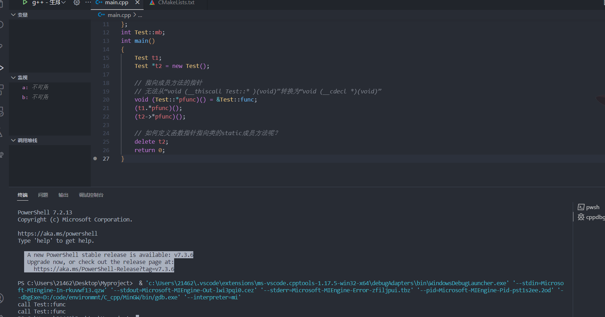
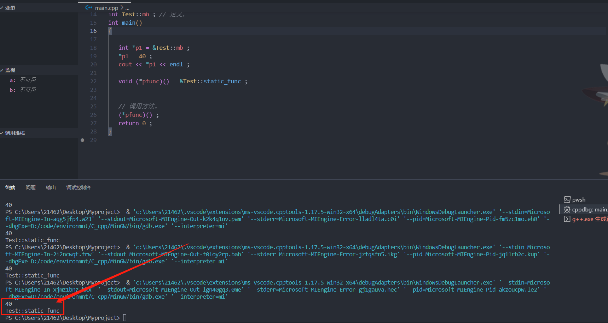

#### 指向类成员的指针

+ 指向成员变量的指针

  > ```C++
  > #include <iostream>
  > using namespace std ;
  > class Test
  > {
  > public:
  > 	void func() { cout << "call Test::func" << endl; }
  > 
  > static void static_func() { cout << "Test::static_func" << endl; }
  > 
  > 	int ma;
  > 
  > static int mb;
  > };
  > int Test::mb; 
  > int main()
  > {
  > 	// int a=10; int *p=&a; *p=30;
  > 
  > Test t1 ; 
  > Test *t2 = new Test();
  > 
  > // 错误写法
  > //无法从“int Test::* ”转换为“int *”
  > /*
  > 
  > int* p = &Test::ma ; 
  > 
  > */
  > 
  > //正确写法
  > int Test::*p = &Test::ma;
  > 
  > // 在访问的时候一定是对 对象的访问！
  > t1.*p = 20;
  > 
  > cout << t1.*p << endl;
  > 
  > 	t2->*p = 30;
  > 	cout << t2->*p << endl;
  > 
  > 	int *p1 = &Test::mb;
  > 	*p1 = 40;
  > 	cout << *p1 << endl;
  > 
  >    delete t2 ; 
  > 
  > 	return 0 ; 
  > }
  > 
  > ```
  >
  > + 定义指向成员方法的指针方式，可以理解为：`p`是一个指向`Test` 类的`ma`属性的`int` 类型的指针。
  >
  >   ```C++
  >   int Test::*p = &Test::ma ; 
  >   ```
  >
  > + **根据指针访问指定的对象的属性**
  >
  >   ```C++
  >   Test t1 ;   // .stack 段
  >   Test *t2 = new Test() ; // .heap段
  >
  >   int Test::*p = &Test::ma ; 
  >
  >   t1.*p = 20 ;  // 相当于是 t1.ma 
  >   t20->*p = 30 ;
  >   ```
  >
  > 
  >
  > 


####指向成员方法的指针

> ```C++
> #include <iostream>
> using namespace std ; 
> class Test
> {
> public:
> 	void func() { cout << "call Test::func" << endl; }
> 	static void static_func() { cout << "Test::static_func" << endl; }
> 
> 	int ma;
> 	static int mb;
> };
> int Test::mb;
> int main()
> {
> 	Test t1;
> 	Test *t2 = new Test();
> 
> 	// 指向成员方法的指针
> 	// 无法从“void (__thiscall Test::* )(void)”转换为“void (__cdecl *)(void)”
> 	void (Test::*pfunc)() = &Test::func;
> 	(t1.*pfunc)();
> 	(t2->*pfunc)();
> 
> 	// 如何定义函数指针指向类的static成员方法呢？
> 	delete t2;
> 	return 0;
> }
> ```
>
> + 定义指向成员方法的指针的方式:**`pfunc`是一个指向`Test`作用域内的函数指针**
>
>   ```C++
>   void (Test::*pfunc)() = &Test::func ; 
>   ```
>   
> + 成员指针的使用方式
>
>   ```C++
>   Test t1;
>   Test *t2 = new Test();
>   
>   void (Test::*pfunc)() = &Test::func ; 
>   
>   (t1.*pfunc)() ;   // 使用成员方法的指针的时候必须指定是哪个对象调用的。相当于 t1.func() 
>   (t2->*pfunc)() ; 
>   
>   ```
>
> 
>
> 


#### 指向类的静态成员和静态成员方法

> ```C++
> #include <iostream>
> using namespace std ;
> class Test
> {
>    public:
>    void func() { cout << "call Test::func" << endl; }
> 
>    static void static_func() { cout << "Test::static_func" << endl; }
> 
>    int ma;
> 
>    static int mb;
> };
> int Test::mb ; // 定义， 
> int main()
> {
>    
>    int *p1 = &Test::mb ;
>    *p1 = 40 ;
>    cout << *p1 << endl ; 
>    
>    void (*pfunc)() = &Test::static_func() ; 
>    
>    
>    // 调用方法。
>    (*pfunc)() ; 
>    return 0 ; 
> }
> 
> ```
>
> + 指向类的静态成员的指针:
>
>   ```C++
>   int *p1 = &Test::mb ;
>   
>   // 使用
>   *p1 = 40 ;
>   ```
>
> + 指向类的静态方法的指针：
>
>   ```C++
>    void (*pfunc)() = &Test::static_func ; 
>   
>   // 使用
>   (*pfunc)() ; 
>   ```
>
> 


