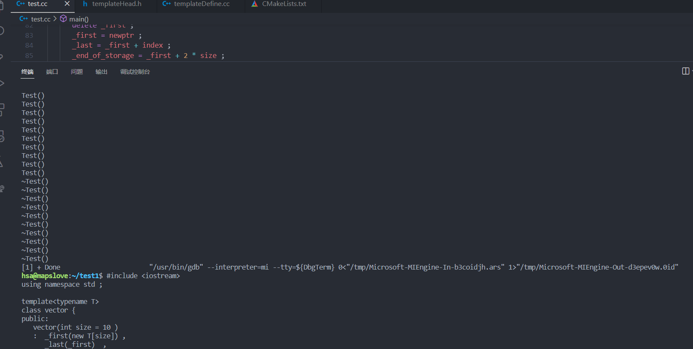
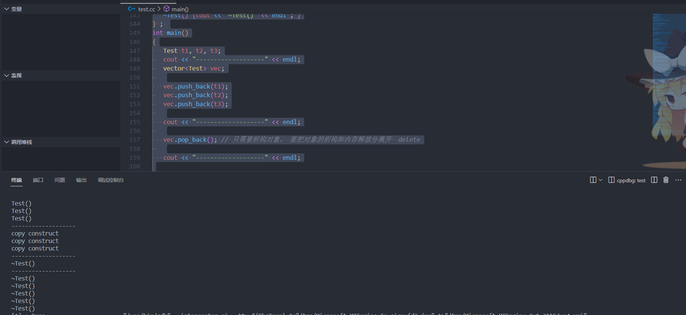
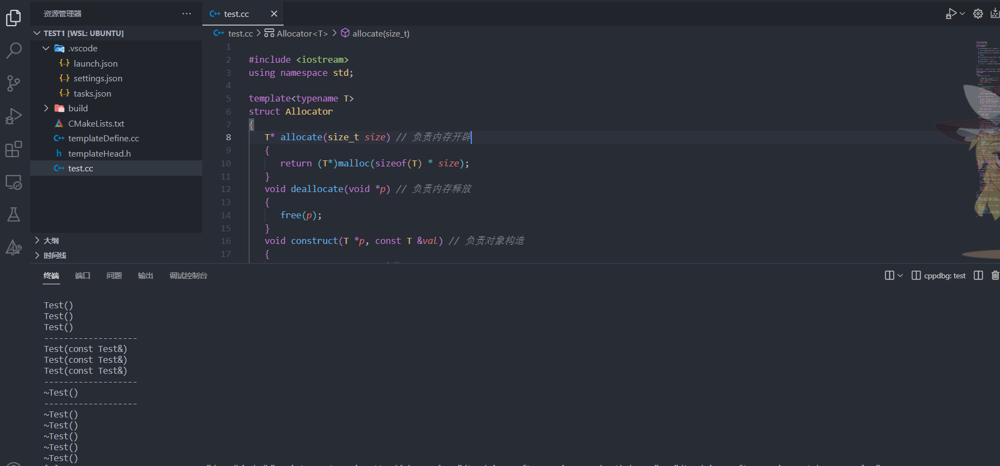

### `STL` 中为什么要使用空间配置器


`new` 一个数组： 

+ 分配内存。
+ 在分配好的内存上构造对象。


**定位new**

> 含义：在指定的空间之上调用**构造函数** ， 从而构造对象。
>
> ```C++
> new (p) T(val); // 定位new
> 
> 在指定的地址p上构造用val进行初始化的对象。
> ```
>
> 


// 析构容器有效的元素，然后释放`_first`的堆内存


空间配置器`allocator`位于头文件`<memory>`的常用函数的功能

> C++中的空间分配器（Allocator）是用于管理内存分配和释放的抽象类，允许用户自定义内存分配策略。以下是一些`std::allocator`空间分配器类的常用函数：
>
> 1.  `allocator::allocate(n)`：  
>     **分配能够容纳 n 个对象的未初始化内存空间**，并返回**指向首个对象**的指针。
>     
> 2.  `allocator::deallocate(p, n)`：  
>     释放之前分配的内存空间，**其中 p 是通过 allocate 分配得到的指针，而 n 是分配的对象数目**
>     
> 3.  `allocator::construct(p, args...)`：  
>     在指定的内存位置 p 处，使用构造函数构造一个对象。`args `是**构造函数的参数**。
>     
> 4.  `allocator::destroy(p)`：  
>     销毁指定位置的对象，p 是对象的指针。注意，**该函数只会调用对象的析构函数，不会释放内存空间**
>
> 除了上述函数，`std::allocator`还提供了其他一些成员函数和类型别名，用于**辅助内存管理**。一些常用的成员函数和类型别名包括：
>
> *   `allocator::rebind<U>::other`：  
>     用于为不同类型 U 进行重新绑定，以便在同一个allocator对象上分配不同类型的内存。
> *   `allocator::max_size()`：  
>     返回当前分配器能够分配的最大对象数目，通常是一个很大的值，表示内存的可用限制。
>     
> *   `allocator::select_on_container_copy_construction()`：  
>     返回一个分配器对象，用于容器的拷贝构造函数中选择分配器。默认情况下，该函数返回自身。
> *   `allocator::reallocate(p, oldSize, newSize)`==（C++20 新增）==：  
>     重新分配内存空间，将已分配内存的大小从` oldSize` 扩展到 `newSize`，返回**指向新内存空间的指针**。**老的元素的值也会被自动移动到新的内存区域。**
>
> 这些函数和类型别名提供了对`std::allocator`空间分配器的一些常用操作，帮助管理内存分配和释放，以及对象的构造和销毁。


#### 上一篇中的`vector`模版存在的问题

> ```C++
> #include <iostream>
> using namespace std ;
> 
> template<typename T>
> class vector {
> public:
>    vector(int size = 10 ) // 需要把内存分配和对象构造分离开！
>    :  _first(new T[size]) ,
>       _last(_first)  , 
>       _end_of_storage(_first + size )  
>    {}
>    
>    ~vector()
>    {
>       delete[] _first ; 
>       _first = _last = _end_of_storage = nullptr ; 
>    }
> 
>    vector(const vector &rhs )
>    {
>       int size = rhs._end_of_storage - rhs._first ;  // ****
>       _first = new T[size] ; 
>       int len = rhs._last - rhs._first ; // 有效元素的个数
>       for(int i = 0 ; i < len ; ++ i )
>       {
>          _first[i] = rhs._first[i] ; 
>       }
>       _last = _first + len ; 
>       _end_of_storage = _first + size ; 
>    
>    }
> 
>    vector& operator=(const vector& rhs )
>    {
>       if(this == &rhs ) return *this ; 
>       delete []_first ; 
> 
>       int size = rhs._end_of_storage - rhs._first ;  // ****
>       _first = new T[size] ; 
>       int len = rhs._last - rhs._first ; // 有效元素的个数
>       for(int i = 0 ; i < len ; ++ i )
>       {
>          _first[i] = rhs._first[i] ; 
>       }
>       _last = _first + len ; 
>       _end_of_storage = _first + size ; 
> 
>    }
>    void push_back(const T &val )
>    {
>       if(full() ) expand() ;
>       *_last++ = val ; 
>    }
>    void pop_back() // 从容器末尾删除元素
>    {
>       if(empty() ) return ; 
>       --_last ; 
>    }
> 
>    T back() const {
>       return *(_last - 1 ) ; 
>    }
> 
>    bool full() const { return _last == _end_of_storage ; }
>    bool empty() const {return _last == _first ; }
> 
>    int size() const {return _last - _first ;} ; 
> 
> private:   
>    T* _first ;
>    T* _last ; 
>    T* _end_of_storage ; 
>    void expand() 
>    {
>       int size = _end_of_storage - _first ; 
>       T* newptr = new T[size * 2 ] ;
>       int index = 0 ; 
>       for(T* iter = _first ; iter != _last ; ++iter , ++index )
>       {
>          newptr[index] = *iter ;  
>       }
>       delete _first ; 
>       _first = newptr ; 
>       _last = _first + index ; 
>       _end_of_storage = _first + 2 * size ; 
>    }
> } ;  
> class Test{
> public:
>    Test() {cout << "Test()" << endl ; }
>    ~Test() {cout << "~Test()" << endl ; }
> } ; 
> int main()
> {
>    vector<Test> vec ; 
>    return 0 ;  
> }
> ```
>
> 如果我们使用自定义类型`Test` 作为`vector` 容器中的元素类型。运行之后，会出现以下的情况：
>
> 
>
> **发现我们调用了十次构造函数，之后又调用了十次析构函数** ！ 
>
> ==**标准库中的`vector`按照以下步骤进行：**==
>
> + 分配空间
> + 在分配好的空间上构造对象
>
> 我们的`vector` 把分配空间和构造对象这两步合并到一起了！！**这就是症结所在**
>
> 这种写法可能导致的问题：
>
> > + 如果`Test` 类中又使用了外部资源，例如堆内存。但我们在`pop_back()`的时候，仅仅是下标的回退，**对于最后一个元素并没有调用其析构函数** ，造成==内存泄漏==！
> > + 在构造函数中直接使用`new` 运算符，造成**`vector`的内存多大就默认构造了多少个`Test`对象，之后又要析构那么多次，这是非常低效率的!** 【同时也是违背常理的，我们并没有向`vector` 中添加元素，就不应该存在构造函数的调用】, 之后的`push_back()` 都相当于执行的是`Test` 类的拷贝赋值运算符了。
> >
> > + 在析构函数中直接使用`delete` 这会造成**编译器将当前`vector` 上的内存都作为对象进行析构** ，可能造成未定义行为！
> >


**下面，通过模拟`allocator`空间配置器的`allocate` 和`construct`和`deallocate` 和 `destroy`**从而实现`vector` 类向`STL`中的`vector` 模板类靠拢。

**模拟实现`Allocator` 模版类**;【注：`malloc`和`free` 位于`<stdlib.h>`头文件中 】

```C++
// 定义容器的空间配置器，和C++标准库的allocator实现一样
template<typename T> 
struct Allocator{
   // 分配内存
   T* allocate( size_t n ) 
   {
      T* ptr = malloc( n * sizeof(T) ) ; 
      return ptr ; 
   }

   // 构造对象 , 使用  定位new
   void construct(T *p , const T& val)
   {
      new (p)(val) ;     
   }
   
   // 析构对象
   void destroy(T *p ) 
   {
      p->~T(); 
   }

  	// 释放内存 
	void deallocate(void *p) 
   {
      free(p) ; 
   }
   
} ;
```


最终版自己实现的代码：

```C++
#include <iostream>
using namespace std ;

template<typename T> 
struct Allocator{
   // 分配内存
   T* allocate( size_t n ) 
   {
      T* ptr = (T*)malloc( n * sizeof(T) ) ; 
      return ptr ; 
   }

   // 构造对象 , 使用  定位new
   void construct(T *p , const T& val)
   {
      new (p)T(val) ;     
   }
   
   // 析构对象
   void destroy(T *p ) 
   {
      p->~T(); 
   }

  	// 释放内存 
	void deallocate(void *p ) // 这里为什么要使用  void*  
   {
      free(p) ; 
   }
   
} ;


template<typename T , typename Alloc = Allocator<T> >
class vector {
public:
   vector(int size = 10 )
   {
      _first = alloc.allocate(size) ; 
      _last = _first ;
      _end_of_storage = _first + size ; 
   }
   ~vector()
   {
      for(T* iter = _first ; iter != _last ; ++iter )
      {
         alloc.destroy(iter) ; 
      }
      alloc.deallocate(_first )  ;

   }

   vector(const vector &rhs )
   {
      int size = rhs._end_of_storage - rhs._first ;  // ****
     
      _first = alloc.allocate(size) ; 
      int len = rhs._last - rhs._first ; // 有效元素的个数
      for(int i = 0 ; i < len ; ++ i )
      {
         alloc.construct(_first + i , rhs[i] ) ; 
      }
      _last = _first + len ; 
      _end_of_storage = _first + size ; 
      
   }

   vector& operator=(const vector& rhs )
   {
      if(this == &rhs ) return *this ; 

      //delete[]_first;
		for (T *p = _first; p != _last; ++p)
		{
			alloc.destroy(p); // 把_first指针指向的数组的有效元素进行析构操作
		}
		alloc.deallocate(_first) ;  

       int size = rhs._end_of_storage - rhs._first ;  // ****
     
      _first = alloc.allocate(size) ; 
      int len = rhs._last - rhs._first ; // 有效元素的个数
      for(int i = 0 ; i < len ; ++ i )
      {
         alloc.construct(_first + i , rhs[i] ) ; 
      }
      _last = _first + len ; 
      _end_of_storage = _first + size ; 
   }
   void push_back(const T &val )
   {
      if(full() ) expand() ;
      alloc.construct(_last , val ) ; 
      _last ++ ; 
   }
   void pop_back() // 从容器末尾删除元素
   {
      if(empty() ) return ; 
      alloc.destroy(--_last ) ; 
   }

   T back() const {
      return *(_last - 1 ) ; 
   }

   bool full() const { return _last == _end_of_storage ; }
   bool empty() const {return _last == _first ; }

   int size() const {return _last - _first ;} ; 

private:   
   T* _first ;
   T* _last ; 
   T* _end_of_storage ; 
   Alloc alloc ; 
   void expand() 
   {
      int size = _end_of_storage - _first ; 
      T* newptr = alloc.allocate(size * 2 ) ; 
      int index = 0 ; 
      for(T* iter = _first ; iter != _last ; ++iter , ++index )
      {
         alloc.construct(iter , newptr[index] )   ; 
      }
      
      //delete [] _first ;
      for(T* iter = _first ; iter != _last ; ++iter ) 
      {
         alloc.destroy(iter ) ; 
      }

      _first = newptr ; 
      _last = _first + index ; 
      _end_of_storage = _first + 2 * size ; 
   }
} ;  
class Test{
public:
   Test() {cout << "Test()" << endl ; }
   Test(const Test& val ) {
      cout << "copy construct" << endl ; 
   }
   ~Test() {cout << "~Test()" << endl ; }
} ; 
int main()
{
   Test t1, t2, t3;
	cout << "-------------------" << endl;
	vector<Test> vec;
	
   vec.push_back(t1);
	vec.push_back(t2);
	vec.push_back(t3);
	
   cout << "-------------------" << endl;
	
   vec.pop_back(); // 只需要析构对象。 要把对象的析构和内存释放分离开  delete
	
   cout << "-------------------" << endl;


   return 0 ;  
}
```




**老师的源码**：

```C++
#include "pch.h"
#include <iostream>
using namespace std;

template<typename T>
struct Allocator
{
	T* allocate(size_t size) // 负责内存开辟
	{
		return (T*)malloc(sizeof(T) * size);
	}
	void deallocate(void *p) // 负责内存释放
	{
		free(p);
	}
	void construct(T *p, const T &val) // 负责对象构造
	{
		new (p) T(val); // 定位new
	}
	void destroy(T *p) // 负责对象析构
	{
		p->~T(); // ~T()代表了T类型的析构函数
	}
};

/*
容器底层内存开辟，内存释放，对象构造和析构，都通过allocator空间配置器来实现
*/
template<typename T, typename Alloc = Allocator<T>>
class vector
{
public:
	vector(int size = 10)
	{
		// 需要把内存开辟和对象构造分开处理
		//_first = new T[size];
		_first = _allocator.allocate(size);
		_last = _first;
		_end = _first + size;
	}
	~vector()
	{
		// 析构容器有效的元素，然后释放_first指针指向的堆内存
		// delete[]_first ;
		for (T *p = _first; p != _last; ++p)
		{
			_allocator.destroy(p); // 把_first指针指向的数组的有效元素进行析构操作
		}
		_allocator.deallocate(_first); // 释放堆上的数组内存
		_first = _last = _end = nullptr;
	}
	vector(const vector<T> &rhs)
	{
		int size = rhs._end - rhs._first;
		//_first = new T[size];
		_first = _allocator.allocate(size);
		int len = rhs._last - rhs._first;
		for (int i = 0; i < len; ++i)
		{
			//_first[i] = rhs._first[i];
			_allocator.construct(_first+i, rhs._first[i]);
		}
		_last = _first + len;
		_end = _first + size;
	}
	vector<T>& operator=(const vector<T> &rhs)
	{
		if (this == &rhs)
			return *this;

		//delete[]_first;
		for (T *p = _first; p != _last; ++p)
		{
			_allocator.destroy(p); // 把_first指针指向的数组的有效元素进行析构操作
		}
		_allocator.deallocate(_first);

		int size = rhs._end - rhs._first;
		//_first = new T[size];
		_first = _allocator.allocate(size);
		int len = rhs._last - rhs._first;
		for (int i = 0; i < len; ++i)
		{
			//_first[i] = rhs._first[i];
			_allocator.construct(_first + i, rhs._first[i]);
		}
		_last = _first + len;
		_end = _first + size;
		return *this;
	}
	void push_back(const T &val) // 向容器末尾添加元素
	{
		if (full())
			expand();
		//*_last++ = val;   _last指针指向的内存构造一个值为val的对象
		_allocator.construct(_last, val);
		_last++;
	}
	void pop_back() // 从容器末尾删除元素
	{
		if (empty())
			return;
		//--_last; // 不仅要把_last指针--，还需要析构删除的元素
		--_last;
		_allocator.destroy(_last);
	}
	T back()const // 返回容器末尾的元素的值
	{
		return *(_last - 1);
	}
	bool full()const { return _last == _end; }
	bool empty()const { return _first == _last; }
	int size()const { return _last - _first; }
private:
	T *_first; // 指向数组起始的位置
	T *_last;  // 指向数组中有效元素的后继位置
	T *_end;   // 指向数组空间的后继位置
	Alloc _allocator; // 定义容器的空间配置器对象

	void expand() // 容器的二倍扩容
	{
		int size = _end - _first;
		//T *ptmp = new T[2 * size];
		T *ptmp = _allocator.allocate(2*size);
		for (int i = 0; i < size; ++i)
		{
			//ptmp[i] = _first[i];
			_allocator.construct(ptmp+i, _first[i]);
		}
		//delete[]_first;
		for (T *p = _first; p != _last; ++p)
		{
			_allocator.destroy(p);
		}
		_allocator.deallocate(_first);
		_first = ptmp;
		_last = _first + size;
		_end = _first + 2 * size;
	}
};

class Test
{
public:
	Test() { cout << "Test()" << endl; }
	~Test() { cout << "~Test()" << endl; }
	Test(const Test&) { cout << "Test(const Test&)" << endl; }
};
int main()
{
	Test t1, t2, t3;
	cout << "-------------------" << endl;
	vector<Test> vec;
	vec.push_back(t1);
	vec.push_back(t2);
	vec.push_back(t3);
	cout << "-------------------" << endl;
	vec.pop_back(); // 只需要析构对象。 要把对象的析构和内存释放分离开  delete
	cout << "-------------------" << endl;

	return 0;
}
```




**我自己写的和老师的源码输出的结果是一样的!**


+ **问题**

```C++

   vector& operator=(const vector& rhs )
   {
      if(this == &rhs ) return *this ; 
      delete []_first ; 

      int size = rhs._end_of_storage - rhs._first ;  // 这个地方为什么可以访问私有变量。???
      _first = new T[size] ; 
      int len = rhs._last - rhs._first ;
      for(int i = 0 ; i < len ; ++ i )
      {
         _first[i] = rhs._first[i] ; 
      }
      _last = _first + len ; 
      _end_of_storage = _first + size ; 

   }


```

> 在上述代码中，`test`类中的拷贝构造函数通过传入一个同类型的`rhs`参数来创建一个新对象。在**拷贝构造函数的实现中，可以直接访问类的私有成员`data`。**
>
> **被同一类的成员函数（包括拷贝构造函数）所访问的私有成员是合法的**。私有成员是指限定了访问权限的类成员，**只能在类的成员函数内部访问或者通过友元关系进行访问**。在这个例子中，拷贝构造函数是作为类的成员函数实现的，因此可以直接访问类的私有成员。
>
> 在C++中，**类的成员函数可以在类的其他成员函数内部访问私有成员，因为它们都属于同一个类的成员**。这是C++的封装特性的一部分，它**允许类自由地访问它自己的私有成员**。
>
> 需要注意的是，**私有成员只能在类的成员函数内部直接访问。如果在类的外部（如`main`函数中）想要访问私有成员，需要通过公有成员函数或友元函数来间接地进行访问**。
>
> 


```C++
void deallocate(void *p ) // 这里为什么要使用  void*  因为free函数的原型是: free(void *) 
   {
      free(p) ; 
   }
  // 以及当我们释放是数组指针的时候为什么可以直接使用free(p) , 这里涉及到的free的底层原理是什么？
```


