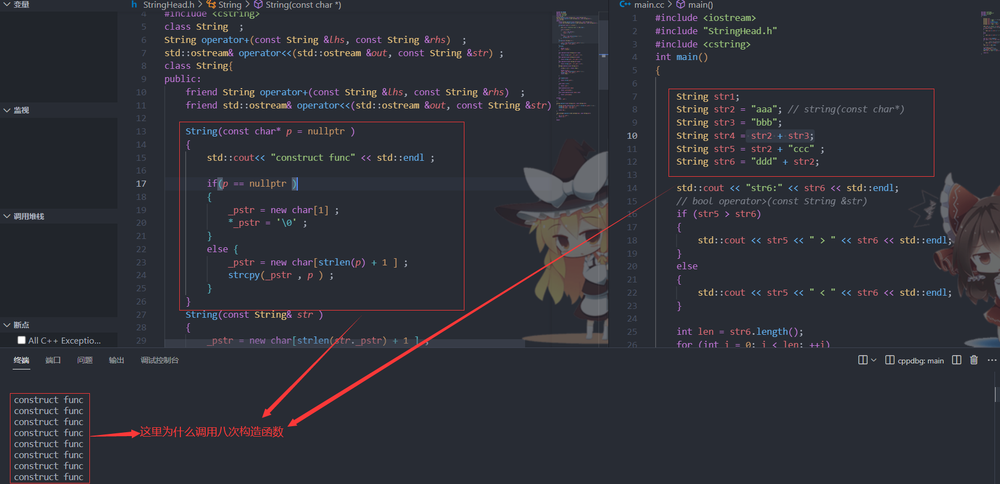
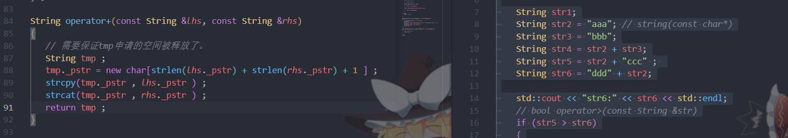

### 模拟实现`C++ string` 类


#### 根据需求写出对应的`string` 类的所需要的函数的代码

```C++ 
	// member    
   String(const char* = nullptr )  
   String(const String& val)    
   ~String() 
   
   bool operator>(const String &str)const
   bool operator<(const String &str)const
   bool operator==(const String &str)const
   String& operator=(const String &str)
     
   int length()const 
	const char* c_str() const 
	char& operator[](int index)
	const char& operator[](int index) const 
   
         
   // global 
   String operator+(const String &lhs, const String &rhs) 
	ostream& operator<<(ostream &out, const String &str)  
```

需要用到的底层函数

> 下面是 `strcmp()`、`strcpy()` 和 `strcat()` 函数的函数原型（函数声明）。
>
> 1.  `strcmp()` 函数原型：
>
>     ```C++
>     int strcmp(const char* str1, const char* str2);
>     ```
>
> `strcmp()` 函数用于比较两个字符串 `str1` 和 `str2` 的大小。**它返回一个整数值，表示两个字符串的比较结果**。返回值为0表示两个字符串相等，**小于0表示 `str1` 小于 `str2`**，大于0表示 `str1` 大于 `str2`。
>
> 2.  `strcpy()` 函数原型：
>
>     ```C++
>     char* strcpy(char* destination, const char* source);
>     ```
>
> `strcpy()` 函数用于将 `source` 字符串复制到 `destination` 字符串中，==**包括空字符 ‘\\0’**==。它返回指向 `destination` 字符串的指针。
>
> 3.  `strcat()` 函数原型：
>
>     ```C++
>     char* strcat(char* destination, const char* source);
>     ```
>
> `strcat()` 函数用于将 `source` 字符串追加到 `destination` 字符串的末尾，**包括两个字符串的空字符 ‘\\0’**。它返回指向 `destination` 字符串的指针。
>
> **需要注意的是，上述函数的原型来自于 C 语言的 `<string.h>` 头文件。在 C++ 中，可以直接使用这些函数，但更推荐使用 `<cstring>` 头文件中的对应 C++ 版本的函数，它们提供了更好的类型安全性和兼容性。**

###源文件

`stringHead.h`

```C++
#ifndef MY_STRING
#define MY_STRING
#include <iostream>
#include <cstring> 
class String  ;  
String operator+(const String &lhs, const String &rhs)  ; 
std::ostream& operator<<(std::ostream &out, const String &str) ; 
class String{
public:
    friend String operator+(const String &lhs, const String &rhs)  ; 
    friend std::ostream& operator<<(std::ostream &out, const String &str) ;

    String(const char* p = nullptr ) 
    {
        std::cout<< "construct func" << std::endl ; 
        
        if(p == nullptr )
        {
            _pstr = new char[1] ; 
            *_pstr = '\0' ; 
        }
        else {
            _pstr = new char[strlen(p) + 1 ] ; 
            strcpy(_pstr , p ) ; 
        }
    } 
    String(const String& str )  
    {
        _pstr = new char[strlen(str._pstr) + 1 ] ; 
        strcpy(_pstr , str._pstr) ;  
    }
    ~String()
    {   
        delete []_pstr ; 
        _pstr = nullptr ; 
    } 

    bool operator>(const String &str) const 
    {
        return strcmp(_pstr , str._pstr ) > 0 ; 
    }
    bool operator<(const String &str)const 
    {
        return strcmp(_pstr , str._pstr ) < 0 ; 
    } 
    bool operator==(const String &str)const
    {
        return strcmp(_pstr , str._pstr ) == 0 ;  
    }
    String& operator=(const String &str) 
    {
        if(this == &str ) return *this ; 

        delete []_pstr ; 
        _pstr = new char[strlen(str._pstr) + 1 ] ; 
        strcpy(_pstr , str._pstr) ;  
        return *this ; 
    }

    int length()const  
    {
        return strlen(_pstr) ; 
    }

    const char* c_str()
    {
        return _pstr ; 
    }  
    char& operator[](int index) 
    {
        return _pstr[index] ; 
    }
    const char& operator[](int index) const
    {
        return _pstr[index]; 
    }

private:
    char*  _pstr ; 

} ; 

String operator+(const String &lhs, const String &rhs)
{   
    String tmp(new char[strlen(lhs._pstr) + strlen(rhs._pstr) + 1 ]) ; 
    strcpy(tmp._pstr , lhs._pstr ) ; 
    strcat(tmp._pstr , rhs._pstr ) ; 

    return tmp ;     
}   

std::ostream& operator<<(std::ostream &out, const String &str)
{
    out << str._pstr ; 
    return out ; 
}

#endif 
```

`main.cc`

```C++
#include <iostream>
#include "StringHead.h"
#include <cstring> 
int main()
{

	String str1;
	String str2 = "aaa"; // string(const char*)
	String str3 = "bbb";
	String str4 = str2 + str3;
	String str5 = str2 + "ccc" ; 
	String str6 = "ddd" + str2;

	std::cout << "str6:" << str6 << std::endl;
	// bool operator>(const String &str)
	if (str5 > str6)
	{
		std::cout << str5 << " > " << str6 << std::endl;
	}
	else
	{
		std::cout << str5 << " < " << str6 << std::endl;
	}

	int len = str6.length();
	for (int i = 0; i < len; ++i)
	{
		//    char& str6.operator[](i)
		std::cout << str6[i] << " ";
	}
	std::cout << std::endl;

	// string -> char*
	char buf[1024] = { 0 };
	strcpy(buf, str6.c_str());
	std::cout << "buf:" << buf << std::endl;

	return 0;    
}
```


> + `String`类的构造函数的实现思路及优点
>
>   ```C++
>   String(const char* p = nullptr ) 
>   {
>      if(p == nullptr )
>      {
>         _pstr = new char[1] ; 
>         *_pstr = '\0' ; 
>      }
>      else {
>         _pstr = new char[strlen(p) + 1 ] ; 
>         strcpy(_pstr , p ) ; 
>      }
>   } 
>   ```
>
>   即使传入的指针是`nullptr`的情况下`_pstr` 依然为`\0`的优点：
>
>   + 减少了在其他函数，比如拷贝构造函数，拷贝赋值运算符函数中的，判断`_pstr` 是否为空的这一环节，从而提高了代码的质量。
>
> + 重载运算符`+`的实现思路以及一步一步的优化过程。
>
>   ```C++
>   String operator+(const String &lhs, const String &rhs)
>   {   
>       String tmp(new char[strlen(lhs._pstr) + strlen(rhs._pstr) + 1 ]) ; 
>       strcpy(tmp._pstr , lhs._pstr ) ; 
>       strcat(tmp._pstr , rhs._pstr ) ; 
>       return tmp ;     
>   }   
>
>   // 注意上图写法，是不安全的！！！！ 
>   // 第三行中的new 申请的空间根本没有被释放！！！
>
>   // 第一版本: 这一版本需要调用 3次new 和两次delete 效率底下(多出来的一次是从temp返回的时候拷贝用到的)
>   String operator+(const String &lhs, const String &rhs)
>   {   
>      // 需要保证tmp申请的空间被释放了。
>      char* tmp =   new char[strlen(lhs._pstr) + strlen(rhs._pstr) + 1 ] ;
>      strcpy(tmp , lhs._pstr ) ; 
>      strcat(tmp , rhs._pstr ) ; 
>      String temp(tmp) ; 
>     	delete []tmp ; 
>      return temp ; 
>   }
>    //第二版本: 通过友元函数的性质来进行优化, 只进行一次new 和一次delete 
>     String operator+(const String &lhs, const String &rhs)
>     {   
>        // 需要保证tmp申请的空间被释放了。
>        String tmp ; 
>        tmp._pstr = new char[strlen(lhs._pstr) + strlen(rhs._pstr) + 1 ] ; 
>        strcpy(tmp._pstr , lhs._pstr ) ; 
>        strcat(tmp._pstr , rhs._pstr ) ;
>        return tmp ; 
>     }
>   ```
>
>  + 在使用`cout << ptr` 的时候,如果`ptr` 是字符指针的话，打印出的内容**不是地址**,而是**字符串** 。
>
> + 关于构造函数的调用次数
>
>   
>
>   `operator+` 见下图左侧
>
>   
>
>   > 罗列出哪八次调用的构造函数： 以下行数指的是`main`函数中的行号
>   >
>   > + 第7行一次
>   > + 第8行一次
>   > + 第9行一次
>   > + 第10行等号右侧进入`operator+` 函数中一次
>   > + 第11行等号右侧`ccc`字符隐式构造调用一次，进入`operator+`函数调用一次
>   > + 第11行等号右侧`ddd`字符隐式构造调用一次，进入`operator+`函数调用一次
>   >
>   > 一共八次。


