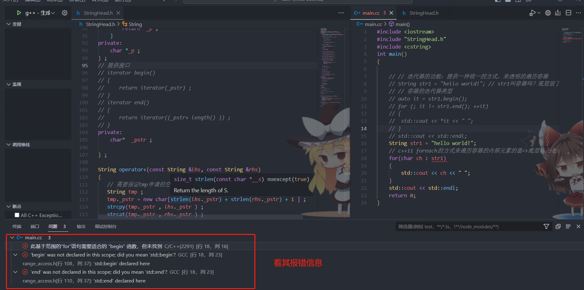

### `string`字符串对象的迭代器


**迭代器概念理解**

> + 迭代器属于**容器类型(容器，置物之所也)**的嵌套类，提供了一套**统一标准的遍历容器的接口**。
> + 迭代器在`STL`库中是连接**容器**和**泛型算法**的桥梁，**算法**通过迭代器对容器进行**增，删，改，查** ，通过**迭代器**一种容器几乎能对所有的算法产生反应。
> + 对于迭代器，我们在判断是否完全遍历容器的时候使用的是`!=` 而不是`<` 因为绝大部分迭代器都对`!=` 进行了重载。 而有相当一部分迭代器没有对`<`进行重载。
> + 迭代器可以透明的访问容器内部的元素，不同的容器底层有着不同的数据结构，但通过迭代器我们在使用的时候就好像容器内部的元素是**线性排列**的。

#### `string`类的迭代器构造

```C++
class iterator
{
public:
   iterator(char *p = nullptr) :_p(p) {}
   // 这个迭代内部并没有重载 < 运算符
   bool operator!=(const iterator &it)
   {
      return _p != it._p;
   }
   void operator++()  // 前置++
   {
      ++_p;
   }
   char& operator*() { return *_p; }
private:
   char *_p ; // 迭代器内部封装的是字符指针
};
```

#### 源代码

`StringHead.h`

```C++
#ifndef MY_STRING
#define MY_STRING
#include <iostream>
#include <cstring> 
class String  ; 
String operator+(const String &lhs, const String &rhs)  ; 
std::ostream& operator<<(std::ostream &out, const String &str) ; 
class String{
public:
    friend String operator+(const String &lhs, const String &rhs)  ; 
    friend std::ostream& operator<<(std::ostream &out, const String &str) ;

    String(const char* p = nullptr ) 
    {
        std::cout<< "construct func" << std::endl ; 

        if(p == nullptr )
        {
            _pstr = new char[1] ; 
            *_pstr = '\0' ; 
        }
        else {
            _pstr = new char[strlen(p) + 1 ] ; 
            strcpy(_pstr , p ) ; 
        }
    } 
    String(const String& str )  
    {
        _pstr = new char[strlen(str._pstr) + 1 ] ; 
        strcpy(_pstr , str._pstr) ;  
    }
    ~String()
    {   
        delete []_pstr ; 
        _pstr = nullptr ; 
    } 

    bool operator>(const String &str) const 
    {
        return strcmp(_pstr , str._pstr ) > 0 ; 
    }
    bool operator<(const String &str)const 
    {
        return strcmp(_pstr , str._pstr ) < 0 ; 
    } 
    bool operator==(const String &str)const
    {
        return strcmp(_pstr , str._pstr ) == 0 ;  
    }
    String& operator=(const String &str) 
    {
        if(this == &str ) return *this ; 

        delete []_pstr ; 
        _pstr = new char[strlen(str._pstr) + 1 ] ; 
        strcpy(_pstr , str._pstr) ;  
        return *this ; 

    }

    int length()const  
    {
        return strlen(_pstr) ; 
    }

    const char* c_str()
    {
        return _pstr ; 
    }  
    char& operator[](int index) 
    {
        return _pstr[index] ; 
    }
    const char& operator[](int index) const
    {
        return _pstr[index]; 
    }
class iterator{
public:
    iterator(char* p = nullptr ) : _p(p){} 
    bool operator!=(const iterator &it )
    {
        return _p != it._p ; 
    }
    void operator++()
    {
        ++_p ; 
    }
    char& operator*() {
        return *_p ; 
    }
private:
    char *_p ;  
} ; 
// 提供接口
iterator begin()
{
    return iterator(_pstr) ; 
}
iterator end()
{
    return iterator((_pstr+ length() )) ;  
}
private:
    char*  _pstr ; 

} ; 

String operator+(const String &lhs, const String &rhs)
{   
   // 需要保证tmp申请的空间被释放了。
   String tmp ; 
   tmp._pstr = new char[strlen(lhs._pstr) + strlen(rhs._pstr) + 1 ] ; 
   strcpy(tmp._pstr , lhs._pstr ) ; 
   strcat(tmp._pstr , rhs._pstr ) ;
   return tmp ; 
}  

std::ostream& operator<<(std::ostream &out, const String &str)
{
    out << str._pstr ; 
    return out ; 
}

```

`main.cpp`

```C++
#include <iostream>
#include "StringHead.h"
#include <cstring> 
int main()
{

	// 迭代器的功能：提供一种统一的方式，来透明的遍历容器
	String str1 = "hello world!"; // str1叫容器吗？底层放了一组char类型的字符
	// 容器的迭代器类型
	auto it = str1.begin();
	for (; it != str1.end(); ++it )
	{
		std::cout << *it << " ";
	}
	std::cout << std::endl;
	for(char ch : str1 )
	{
		std::cout << ch << " ";
	}
	std::cout << std::endl;
	return 0;
}
```


> ```C++
> for(char ch : str1) ; 
> 
> // 类似于
> for(auto iter ; iter != str1.begin() ; ++iter ) ; 
> ```
>
> **这种遍历形式内部还是通过迭代器来遍历我们的容器的**，验证:
>
> 将`begin()`和`end()`方法禁用之后：
>
> 
>
> **得到验证！**

