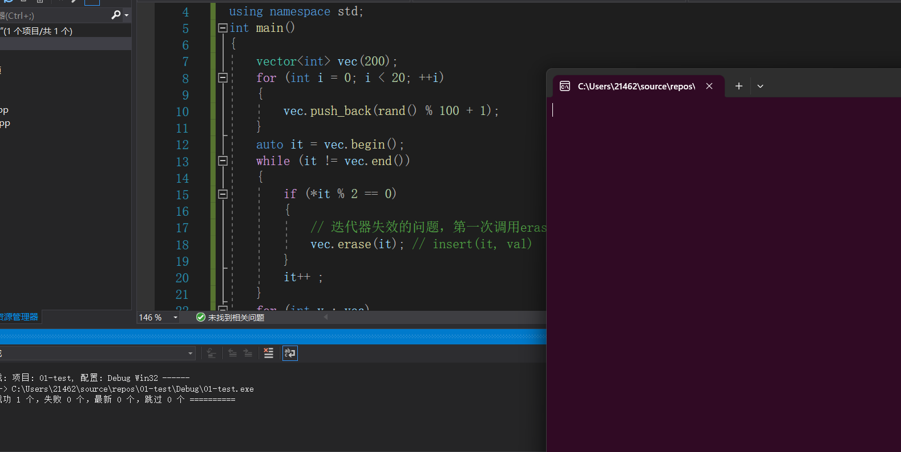
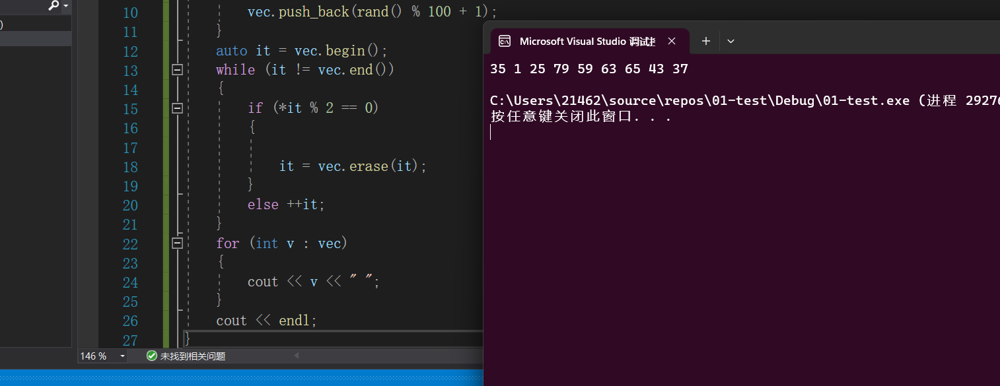
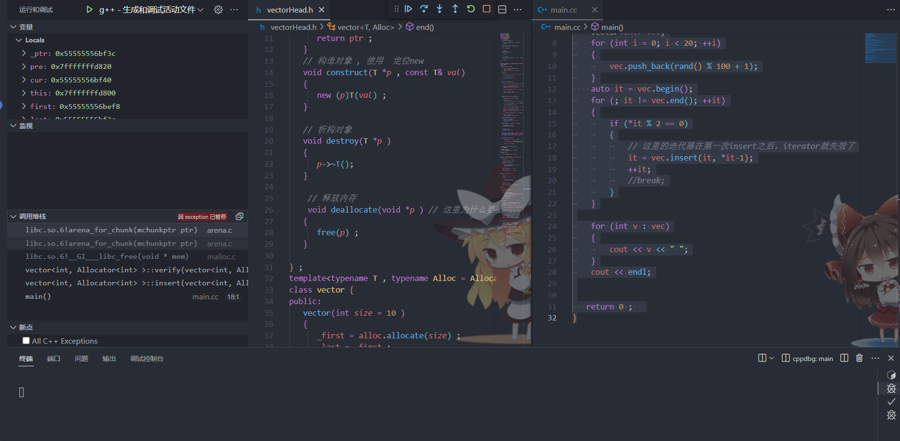

### 迭代器失效的问题

`迭代器失效`的效果实际上是通过容器的迭代器中通过添加一些代码，从而导致插入点或删除点之后的迭代器会失效。也就是说，迭代器失效这种现象是人为规定的！

**不同容器的迭代器是不能进行比较的，这是没有意义的行为**

#### 标准库容器`vector`中常见的接口的原型

```C++
v.insert(iterator, value)：在指定迭代器位置之前插入元素 value，返回指向插入的元素的迭代器。
v.erase(iterator)：删除指定迭代器位置的元素，返回指向下一个元素的迭代器。
   
v.reserve(new_capacity)：修改 vector 的容量为至少 new_capacity，以便能够存储至少 new_capacity 个元素，如果指定的容量小于当前容量，则不会进行任何操作 
   
v.resize(new_size)：修改 vector 的大小为 new_size，如果 new_size 大于当前大小，则新增元素用默认初始化值填充，如果 new_size 小于当前大小，则删除多余的元素。
   
v.at(index)：以引用形式返回 vector 中索引为 index 的元素，提供了边界检查，如果索引超出范围，
   
```

上述接口中的`insert`和`erase`会造成**迭代器失效**

+ `insert`函数插入点之后(包括插入点)的所有迭代器全部失效，不能再进行其成员函数的调用。**当`insert`的时候发生扩容的时候会造成全部元素的迭代器失效。**
+ `erase` 函数删除点之后的(包括删除的元素)所有元素的迭代器全部失效，不能再进行其成员函数的调用。

#### 用标准库中的`vector`的`erase`接口来展示迭代器的失效问题

```C++
#include <vector>
#include <iostream>

using namespace std;
int main()
{
	vector<int> vec(200);
	for (int i = 0; i < 20; ++i)
	{
		vec.push_back(rand() % 100 + 1);
	}
	auto it = vec.begin();
	while (it != vec.end())
	{
		if (*it % 2 == 0)
		{
			// 迭代器失效的问题，第一次调用erase以后，迭代器it就失效了
			vec.erase(it); // insert(it, val)   erase(it)
		}
		it++ ; 
	}
	for (int v : vec)
	{
		cout << v << " ";
	}
	cout << endl;
}
```



程序启动之后没有任何反应，这就是迭代器失效的现象。


### 迭代器失效的解决方式

+ 根据`insert`或`erase` 的返回值更新迭代器

  ````C++
  #include <vector>
  #include <iostream>
  
  using namespace std ; 
  int main()
  {
  	vector<int> vec(200);
  	for (int i = 0; i < 20 ; ++i)
  	{
  		vec.push_back(rand() % 100 + 1);
  	}
  	auto it = vec.begin();
  	while (it != vec.end())
  	{
  		if (*it % 2 == 0)
  		{
  			it = vec.erase(it);
  		}
        else ++it ;  
  	}
  	for (int v : vec)
  	{
  		cout << v << " ";
  	}
  	cout << endl;
  }
  ````
  


### 迭代器失效的底层实现原理

**主要实现思路**

> + 在`vector` 容器的数据域定义一个`iteratorBase` 结构体，实现一个链表：**存储所有构造出来的迭代器的指针**
>
>   ```C++
>   struct Iterator_Base
>   {
>      Iterator_Base(iterator *c=nullptr, Iterator_Base *n=nullptr)
>         :_cur(c), _next(n) {}
>      iterator *_cur ; // 数据域，存储的是每一个构造出来的迭代器的指针
>      Iterator_Base *_next; // 指针域
>   };
>   Iterator_Base _head ; 
>   ```
>
> + 在`iterator`的构造函数的函数体内，一旦我们构造一个`iterator` 对象,就把该对象的地址放到`vector`容器的**迭代器指针链表中，**为了区分是哪个容器，在`iterator`容器有成员变量`vector<T , alloc<T> >* ` 从而区分是哪个容器：
>
>   ```C++
>   iterator(vector<T, Alloc> *pvec=nullptr, T *ptr = nullptr)
>      :_ptr(ptr), _pVec(pvec)
>      {
>         Iterator_Base *itb = 
>            new Iterator_Base(this, _pVec->_head._next);
>         _pVec->_head._next = itb;
>      }
>   ```
>
> + 在**容器**的成员方法中，添加`verify`函数，用来将**应该失效的迭代器内部封装的元素指针置为`nullptr`** 
>
>   ```C++
>   // 将元素指针位于区间内的所有的迭代器变为失效。
>   void verify(T *first, T *last ) 
>   	{
>   		Iterator_Base *pre = &this->_head;
>   		Iterator_Base *it = this->_head._next;
>   		while (it != nullptr)
>   		{
>   			if (it->_cur->_ptr > first && it->_cur->_ptr <= last)
>   			{
>   				// 迭代器失效，把iterator持有的容器指针置nullptr
>   				it->_cur->_pVec = nullptr;
>   				// 删除当前迭代器节点，继续判断后面的迭代器节点是否失效
>   				pre->_next = it->_next;
>   				delete it;
>   				it = pre->_next;
>   			}else{
>   				pre = it;
>   				it = it->_next;
>   			}
>   		}
>   	}
>   ```
>   
> + 在`iterator`的每一个重载运算符的方法中，我们都首先判断**当前迭代器是否有效**。无效抛出异常。
>
>   ```C++
>  bool operator!=(const iterator &it)const
>   {
>      // 检查迭代器的有效性
>      if (_pVec == nullptr || _pVec != it._pVec)
>      {
>         throw "iterator incompatable!";
>      }
>      return _ptr != it._ptr;
>   }
>   ```
> 
>   ==**注：迭代器是否失效我们判断的是迭代器内部的指向容器的指针`_pVec`是否为空，如果为空，说明迭代器失效了**==
>
> + 在`erase`和`insert`方法中，先执行`verify`函数，再执行相应的逻辑操作。
>
>   `erase`
>
>   ```C++
>  iterator erase(iterator it)
>   {
>      verify(it._ptr - 1, _last);
>      T *p = it._ptr;
>      while (p < _last-1)
>      {
>         _allocator.destroy(p);
>         _allocator.construct(p, *(p + 1));
>         p++;
>      }
>      _allocator.destroy(p) ; 
>      _last--;
>      return iterator(this, it._ptr);
>   }
>   ```
> 
>   `insert`
>
>   ```C++
>  iterator insert(iterator it, const T &val)
>   	{
>   		verify(it._ptr - 1, _last);
>   		T *p = _last;
>   		while (p > it._ptr)
>   		{
>   			_allocator.construct(p, *(p-1));
>   			_allocator.destroy(p - 1);
>   			p--;
>   		}
>   		_allocator.construct(p, val);
>   		_last++;
>   		return iterator(this, p); 
>   	}
>   ```
> 
> 


`vectorHead.h` 头文件中的`iterator`实现

```C++
class iterator{
public:
    friend class vector<T , Alloc> ; 
    iterator(T* ptr = nullptr , vector<T , Alloc>* _pvec = nullptr )
    : _ptr(ptr ) , _pVec(_pvec)
    {
        iterator_Base* node = new iterator_Base(this , _pVec->head._next ) ;  
        _pVec->head._next = node ; 
    }
    bool operator!= (const iterator&  it ) const 
    {
        if(_pVec == nullptr || _pVec != it._pVec )
        {
            throw "iterator imcompatable" ; 
        }
        return _ptr != it._ptr ; 
    }
    void operator++()
    {
        if(_pVec == nullptr )
        {
            throw "iterator is invaild"; 
        }
        ++_ptr ; 
    }

    T& operator*() {
        if(_pVec == nullptr )
        {
            throw "iterator is invaild"; 
        }
        return *_ptr ; 
    } 
    const T& operator*() const {
        if(_pVec == nullptr )
        {
            throw "iterator is invaild"; 
        }
        return *_ptr ; 
    } // 只读
private:
    T* _ptr ; 
    vector<T , Alloc>* _pVec ; 
} ;

```


### 总的代码实现

`vectorHead.h`

```C++
#ifndef MY_VECTOR
#define MY_VECTOR
#include <iostream>
#include <cstring> 
template<typename T> 
struct Allocator{
   // 分配内存
   T* allocate( size_t n ) 
   {
      T* ptr = (T*)malloc( n * sizeof(T) ) ; 
      return ptr ; 
   }
   // 构造对象 , 使用  定位new
   void construct(T *p , const T& val)
   {
      new (p)T(val) ;     
   }
   
   // 析构对象
   void destroy(T *p ) 
   {
      p->~T(); 
   }

  	// 释放内存 
	void deallocate(void *p ) // 这里为什么要使用  void*  
   {
      free(p) ; 
   }
   
} ;
template<typename T , typename Alloc = Allocator<T> >
class vector {
public:
   vector(int size = 10 )
   {
      _first = alloc.allocate(size) ; 
      _last = _first ;
      _end_of_storage = _first + size ; 
   }
   ~vector()
   {
      for(T* iter = _first ; iter != _last ; ++iter )
      {
         alloc.destroy(iter ) ; 
      }
      alloc.deallocate(_first )  ;

   }

   vector(const vector &rhs )
   {
      int size = rhs._end_of_storage - rhs._first ;  // ****
     
      _first = alloc.allocate(size) ; 
      int len = rhs._last - rhs._first ; // 有效元素的个数
      for(int i = 0 ; i < len ; ++ i )
      {
         alloc.construct(_first + i , rhs[i] ) ; 
      }
      _last = _first + len ; 
      _end_of_storage = _first + size ; 
   
   }

   vector& operator=(const vector& rhs )
   {
      if(this == &rhs ) return *this ; 

      //delete[]_first;
		for (T *p = _first; p != _last; ++p)
		{
			alloc.destroy(p); // 把_first指针指向的数组的有效元素进行析构操作
		}
		alloc.deallocate(_first) ;  

       int size = rhs._end_of_storage - rhs._first ;  // ****
     
      _first = alloc.allocate(size) ; 
      int len = rhs._last - rhs._first ; // 有效元素的个数
      for(int i = 0 ; i < len ; ++ i )
      {
         alloc.construct(_first + i , rhs[i] ) ; 
      }
      _last = _first + len ; 
      _end_of_storage = _first + size ; 
   }
   void push_back(const T &val )
   {
      if(full() ) expand() ;
      alloc.construct(_last , val ) ; 
      _last ++ ; 
   }
   void pop_back() // 从容器末尾删除元素
   {
      if(empty() ) return ; 
      alloc.destroy(--_last ) ; 
   }

   T back() const {
      return *(_last - 1 ) ; 
   }

   bool full() const { return _last == _end_of_storage ; }
   bool empty() const {return _last == _first ; }
   int size() const {return _last - _first ;} 


   T& operator[](int index )
   {
        if(index < 0 || index >= size() ) 
        {
            throw index + "OutOfRangeException" ; 
        }
        return _first[index] ; 
   }

   //迭代器一般实现为容器的嵌套类型
class iterator{
public:
    friend class vector<T , Alloc> ; 
    iterator(T* ptr = nullptr , vector<T , Alloc>* _pvec = nullptr )
    : _ptr(ptr ) , _pVec(_pvec)
    {
        iterator_Base* node = new iterator_Base(this , _pVec->head._next ) ;  
        _pVec->head._next = node ; 
    }
    bool operator!= (const iterator&  it ) const 
    {
        if(_pVec == nullptr || _pVec != it._pVec )
        {
            throw "iterator imcompatable" ; 
        }
        return _ptr != it._ptr ; 
    }
    void operator++()
    {
        if(_pVec == nullptr )
        {
            throw "iterator is invaild"; 
        }
        ++_ptr ; 
    }

    T& operator*() {
        if(_pVec == nullptr )
        {
            throw "iterator is invaild"; 
        }
        return *_ptr ; 
    } 
    const T& operator*() const {
        if(_pVec == nullptr )
        {
            throw "iterator is invaild"; 
        }
        return *_ptr ; 
    } // 只读
private:
    T* _ptr ; 
    vector<T , Alloc>* _pVec ; 

} ;

iterator begin() {
    return iterator(_first , this ) ; 
}
iterator end()
{
    return iterator(_last , this ) ; 
}

iterator insert(iterator it , const T& val)
{
    verify(it._ptr , _last ) ;
    
    // 从后向前
   
   if(it.ptr == _last ) push_back(val) ; 
   
    T* cur = _last - 1 ;  
    while(cur != it._ptr ) 
    {
        alloc.construct(cur + 1 , *cur ) ;
        alloc.destroy(cur ) ; 
        cur -- ;  
    }
    alloc.construct(cur , val ) ; 
    _last ++ ; 
    return iterator(cur , this ) ;
}

iterator erase(iterator it )
{
    verify(it._ptr , _last ) ;
    T* cur = it._ptr ; 
    while(cur != _last - 1 )
    {
        alloc.destroy(cur) ; 
        alloc.construct(cur , *(cur + 1) ) ;
        cur ++ ;  
    }
    alloc.destroy(cur) ;
    _last -- ; 
    return iterator(it._ptr , this ) ; 
}
private:   
   T* _first ;
   T* _last ; 
   T* _end_of_storage ; 
   Alloc alloc ; 

   struct iterator_Base{
        iterator_Base(iterator* cur = nullptr , iterator_Base* next = nullptr )
        : _cur(cur ) , _next(next) {}
        iterator *_cur ; 
        iterator_Base* _next ; 
   };  
   iterator_Base head ; 

void expand() 
{
    int size = _end_of_storage - _first ; 
    T* newptr = alloc.allocate(size * 2 ) ; 
    int index = 0 ; 
    for(T* iter = _first ; iter != _last ; ++iter , ++index )
    {
        alloc.construct(iter , newptr[index] )   ; 
    }
    
    //delete [] _first ;
    for(T* iter = _first ; iter != _last ; ++iter ) 
    {
        alloc.destroy(iter ) ; 
    }
    alloc.deallocate(_first) ;  
    _first = newptr ; 
    _last = _first + index ; 
    _end_of_storage = _first + 2 * size ; 
}

void verify(T* first , T*last )
{
    iterator_Base* pre = &head ;  
    iterator_Base* cur = pre->_next ;
    while(cur != nullptr )
    {
        T* _ptr = cur->_cur->_ptr ; 
        if(_ptr  >= first && _ptr <= last )
        {
            cur->_cur->_pVec = nullptr ; 
            
            pre->_next = cur->_next ; 
            delete cur ; 
            cur = pre->_next ; 
        }
        else {
            pre = cur ; 
            cur = cur->_next ; 
        }
    } 
}
} ;  


#endif 
```

`main.cc`

```C++

#include <iostream>
#include <string>
#include "vectorHead.h"
using namespace std ;   
int main()
{
    vector<int> vec;
	for (int i = 0; i < 20; ++i)
	{
		vec.push_back(rand() % 100 + 1);
	}
    auto it = vec.begin();
	for (; it != vec.end(); ++it)
	{
		if (*it % 2 == 0)
		{
			// 这里的迭代器在第一次insert之后，iterator就失效了
			it = vec.insert(it, *it-1);
			++it;
			//break;
		}
	}

	for (int v : vec)
	{
		cout << v << " ";
	}
	cout << endl;


   return 0 ;  
}
```



**出现异常，说明我们的迭代器失效的效果被实现了。**  


**易错点：**

在实现`vector`的`insert`函数的时候需要注意不能这样写：

```C++
// 错误写法:当容器仅仅开辟内存之后如果这样插入insert(vec.begin() , val ) ; 会造成数组越界 , 因为当容器
// 内部没有元素的时候_frist = _last  此时cur 的初值就是第一块合法内存的前一块内存了,之后在while循环中就会造成死循环了.
iterator insert(iterator it , const T& val)
{
    verify(it._ptr , _last ) ;
    // 从后向前
   if(it.ptr == _last ) push_back(val) ; 
   
    T* cur = _last - 1 ;       
    while(cur != it._ptr ) 
    {
        alloc.construct(cur + 1 , *cur ) ;
        alloc.destroy(cur ) ; 
        cur -- ;  
    }
    alloc.construct(cur , val ) ; 
    _last ++ ; 
    return iterator(cur , this ) ;
}
// 正确写法
iterator insert(iterator it , const T& val)
{
    verify(it._ptr , _last ) ;
    
    // 从后向前
   
   if(it.ptr == _last ) push_back(val) ; 
   
    T* cur = _last ;       
    while(cur != it._ptr ) 
    {
        alloc.construct(cur , *(cur - 1)) ;
        alloc.destroy(cur - 1 ) ; 
        cur -- ;  
    }
    alloc.construct(cur , val ) ; 
    _last ++ ; 
    return iterator(cur , this ) ;
}
```


