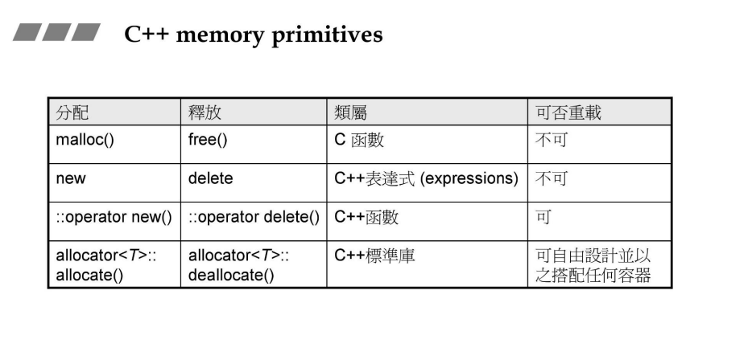
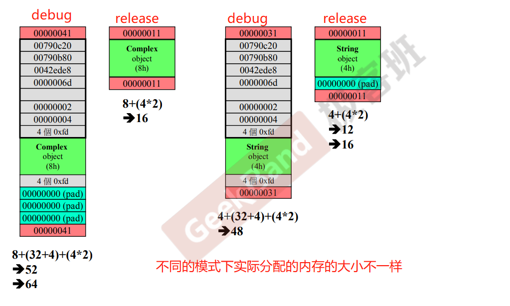
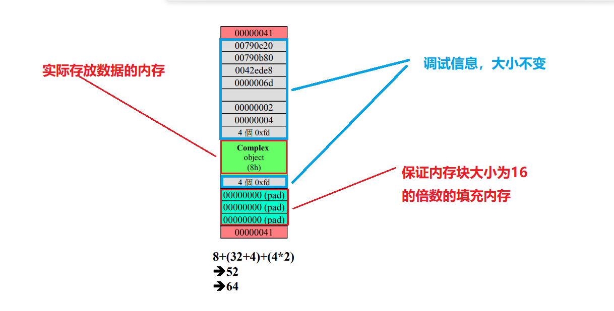
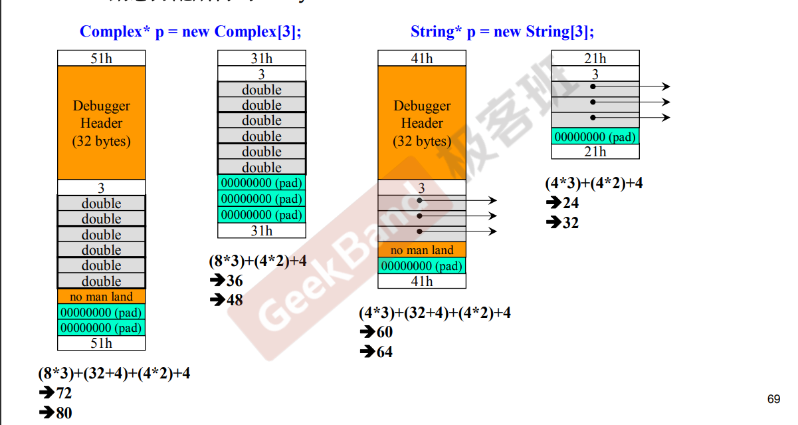
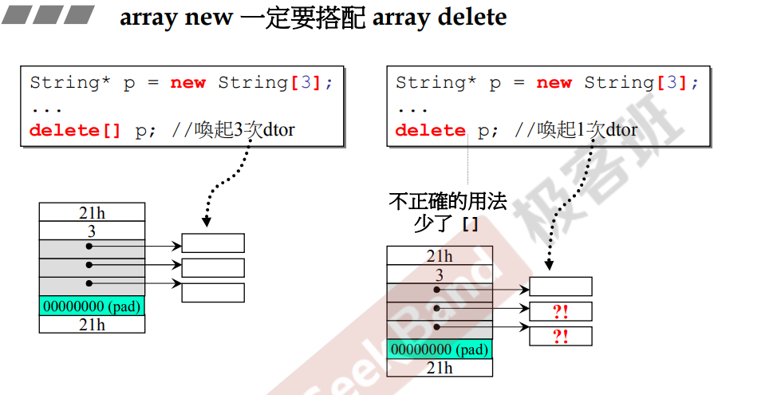
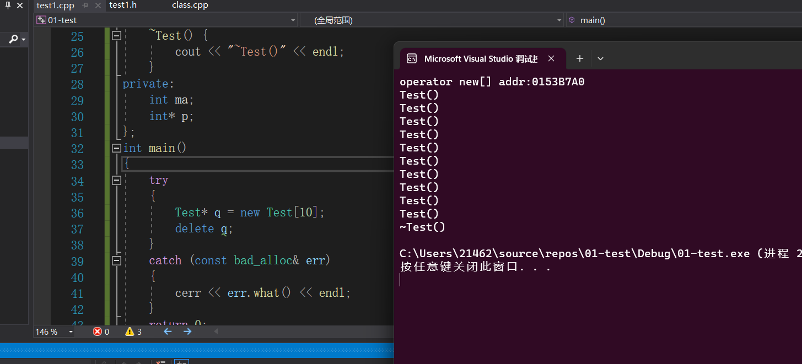
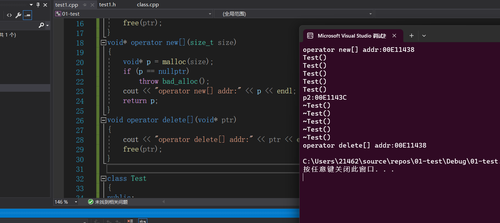

### `new和delete`底层原理


#####`malloc`和`new`以及`free`和`delete`的区别

+ `malloc`按 ==字节==开辟内存，`new`开辟内存的时候需要指定类型 `new int [10]`  , 所以`malloc`开辟内存返回的都是`void*` , 而`new`

  返回的就是对应类型的指针。`new` 不仅仅具有`malloc`的功能，还可以进行数据的初始化。

+ `malloc`开辟内存失败返回`nullptr`指针；new抛出的是`bad_alloc`类型的异常:

  **需要将`new`**包括在`try catch` 中，进行异常的捕获。

+ `delete p ` :调用析构函数；再`free(p)` : **如果指针`p`**指向的是内置类型，则`delete p`和`free p ` 没有什么区别，但如果指针指向的是对象，则两者还是存在很大的区别。



#### `vc6.0`编译器`new`和`delete` 所执行的具体步骤

`new Complex(1 , 2 )`  【注: `Complex` 类内部只有两个`double`(一个`double`四字节)类型的变量】

```C++
void* mem = operator new( sizeof(Complex) ); //分配內存，内部调用malloc(sizeof(Complex) ) ; 
pc = static_cast<Complex*>(mem); // 转型
pc->Complex::Complex(1,2);  //构造函数 Complex::Complex( pc , 1 , 2 ) ; 
return pc ; 
// 注意pc指向的是  对象的地址 ， 而不是分配的内存的起始地址。
```



以最左侧的一块内存块为例，我们剖析一下上图中的内存块的性质：

> + 每一格是四个字节的大小。	
> + 内存块字节数一定是`16`的倍数
> + 最上四字节和最下四字节是`cookie` 存储的是**当前内存块的大小，因为内存块的大小为16的倍数，并且所以后四位的值一定是0，此时我们规定后四位如果为1则表示这块内存正在被使用，为0表示这块内存被回收。**
>
> + `pad` 是填充字节，为了使内存块的大小为16的倍数
> + 灰色格子为**包含一些调试信息的内存块**，上面有8块，下面有1块，一共36字节。
> + 中间的绿色的格子用来存储**`Complex`**的实际内存。
>
> 

`delete pc ` 其中`pc` 为`Complex* pc = new  Complex(1 , 2 )` ; 

```C++
// 这里仅仅调用一次析构函数
Complex::~Complex(pc); // 析构函数
operator delete(pc); // 释放内存 ， 内部调用free(pc) 
```

**`array new`和`array delete`**

`Complex* p = new Complex[3];` 

```C++
void* mem = operator new( sizeof(Complex) * 3 ); //分配內存，内部调用malloc(sizeof(Complex) * 3 ) ; 
pc = static_cast<Complex*>(mem); // 转型

//构造函数 Complex::Complex( pc , 1 , 2 ) , 这里会调用三次构造函数
pc->Complex::Complex(1,2) ; 
return pc ; 
```

> 



`delete []p` ： `[]` 相当于告诉编译器：需要释放的是一个数组，请在`p` 地址的前四个地址中取出需要析构的对象的个数。并且从free(p - 40) 字节开始进行`free`内存。

```C++
// 这里调用三次析构函数, 根据第一个对象地址的前方的四个字节确定需要调用析构函数的次数
Complex::~Complex(pc); // 析构函数
operator delete(pc); // 释放内存 ，根据cookie的大小内部调用free(pc)归还当前块的内存 
```

**`array new` 一定要搭配`array delete` 的原因**



**如果对象含有外部资源**，对于`array new` 使用`delete` 的话只会唤醒一次`析构函数` ， 虽然对象的内存块被正确回收了，但一部分对象的外部资源没有被回收，造成内存泄漏。**对于普通的编译器内置类型 new/delete[]   new[]/delete**。


**混用`new`和`delete` 造成内存泄漏**

```C++
#include <iostream> 
using namespace std ; 
void* operator new[](size_t size)  
{
	void *p = malloc(size) ; 
	if (p == nullptr)
		throw bad_alloc();
	cout << "operator new[] addr:" << p << endl;
	return p;
}
void operator delete[](void *ptr)
{
	cout << "operator delete[] addr:" << ptr << endl;
	free(ptr);
}
class Test
{
public:
	Test(int data = 10 ) 
   : p(new int[100])
   {
      cout << "Test()" << endl;
   }
	
   ~Test() {
      cout << "~Test()" << endl;
   }
private:
	int ma ;
   int *p ; 
} ;
int main()
{
	try
	{
		int *q = new Test[10];
		delete q ;
	}
	catch (const bad_alloc &err)
	{
		cerr << err.what() << endl;
	}
	return 0;
}
```



**可以看出，我们只进行了一次析构函数，其余的9个对象虽然其内存已经归还给操作系统，但每一个对象内部的指针指向的资源并没有被释放！**【执行之后代码运行会崩溃掉！】


重载`operator new` 和`operator delete` 来实现自己的`new`和`delete`

```C++
#include <iostream>
using namespace std; 
void* operator new(size_t size)
{
	void* p = malloc(size);
	if (p == nullptr)
		throw bad_alloc();
	cout << "operator new addr:" << p << endl;
	return p;
}
// delete p;  调用p指向对象的析构函数、再调用operator delete释放内存空间
void operator delete(void* ptr)
{
	cout << "operator delete addr:" << ptr << endl;
	free(ptr);
}
int main()
{
	try
	{
		int* p = new int;
		delete p; 
	}
	catch (const bad_alloc& err)
	{
		cerr << err.what() << endl;
	}
	return 0;
}
```


重载`operator new[]`和`operator delete[]`来实现自己的`new[]`和`delete[]`

```C++
#include <iostream>
using namespace std ; 
void* operator new[](size_t size)
{
	void *p = malloc(size) ; 
	if (p == nullptr)
		throw bad_alloc();
	cout << "operator new[] addr:" << p << endl;
	return p;
}
void operator delete[](void *ptr)
{
	cout << "operator delete[] addr:" << ptr << endl;
	free(ptr);
}
class Test
{
public:
	Test(int data = 10) { cout << "Test()" << endl; }
	~Test() { cout << "~Test()" << endl; }
private:
	int ma ;
} ;
int main()
{
	try
	{
		int *q = new Test[10];
		delete []q ;
	}
	catch (const bad_alloc &err)
	{
		cerr << err.what() << endl;
	}
	return 0;
}
```


### 在`VS2019`下的内存块的布局： 和`VC6.0` 不同的是，`vs`系列的编译器在`debug`模式下没有`cookie`和调试信息的内存块。

`delete []p` : `[]`告诉编译器，执行[p - 4] 次析构函数，并且从 p - 4 地址处将内存归还给操作系统。 

```C++
#include <iostream>
using namespace std ; 

void* operator new(size_t size)
{
	void *p = malloc(size);
	if (p == nullptr)
		throw bad_alloc();
	cout << "operator new addr:" << p << endl;
	return p;
}

// delete p;  调用p指向对象的析构函数、再调用operator delete释放内存空间
void operator delete(void *ptr)
{
	cout << "operator delete addr:" << ptr << endl;
	free(ptr);
}
void* operator new[](size_t size)
{
	void *p = malloc(size);
	if (p == nullptr)
		throw bad_alloc();
	cout << "operator new[] addr:" << p << endl;
	return p;
}
void operator delete[](void *ptr)
{
	cout << "operator delete[] addr:" << ptr << endl;
	free(ptr);
}

class Test
{
public:
	Test(int data = 10) { cout << "Test()" << endl; }
	~Test() { cout << "~Test()" << endl; }
private:
	int ma;
};
int main()
{

   
	Test *p2 = new Test[5] ; 
	cout << "p2:" << p2 << endl;
   
	delete[] p2; // Test[0]对象析构， 直接free(p2)
	return 0;
}
```



> `p2:00E1143C` 指向的是第一个对象的地址，
>
> `operator new[] addr:00E11438`表示的是分配的内存的起始地址。
>
> **两者之间的4字节内存用来存储对象的个数！**

