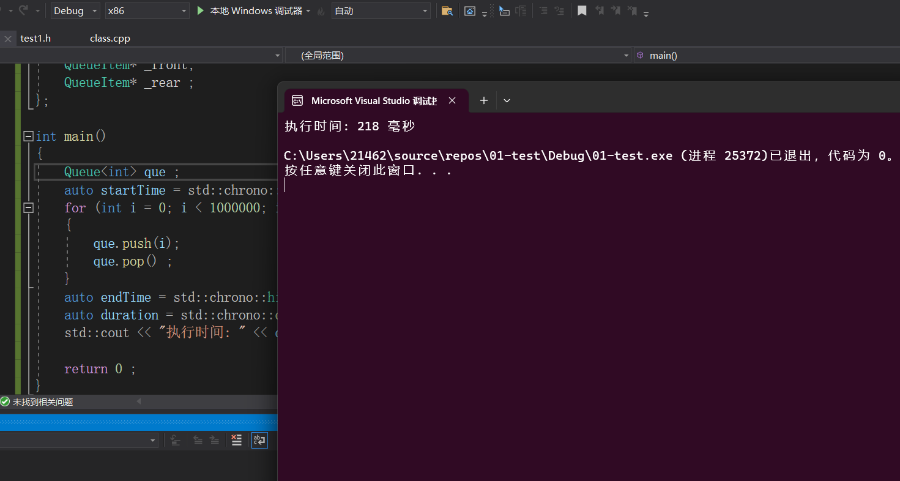
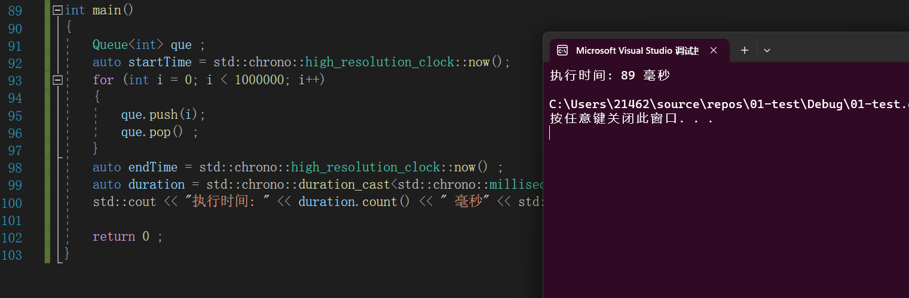

==**增加代码实现将对象池剩余的空间还给操作系统**==   (待解决)

```C++
//~QueueItem()
		//{
		//	QueueItem* p = _itemPool ; 
		//	int size = sizeof(QueueItem ) ; 
		//	while (p != nullptr )
		//	{ 
		//		
		//		char* ptr =(char*)p ;  
		//		for (int i = 0; i < size ; ++i ) 
		//		{
		//			char* now = ptr ; 
		//			
		//			// 这里先自增再归还内存
		//			++ptr ; 
		//			delete now ; 
		//		}
		//		p = p->_next ; 
		//	}
		//}
```


### `new`和`delete` 重载实现对象池的应用

五大池： 内存池，进程池，线程池，连接池，对象池。

`C++11`支持在类内定义`static const ` 静态常量 。

**测试时间代码**

> 在 C++ 中，您可以使用 `<chrono>` 头文件中的**时间库**来测试代码的执行时间。以下是一个示例代码，演示**如何使用 C++ 测量代码块的执行时间** ：
>
> ```C++
> #include <iostream>
> #include <chrono>
> 
> int main() {
>     // 获取当前时间点
>     auto startTime = std::chrono::high_resolution_clock::now();
> 
>     // 执行要测试的代码块
>     // ...
> 
>     // 获取当前时间点
>     auto endTime = std::chrono::high_resolution_clock::now();
> 
>     // 计算代码执行时间
>     auto duration = std::chrono::duration_cast<std::chrono::milliseconds>(endTime - startTime);
> 
>     // 输出执行时间
>     std::cout << "执行时间: " << duration.count() << " 毫秒" << std::endl;
> 
>     return 0;
> }
> ```
>
>
> 在上述示例中，我们使用了 `<chrono>` 头文件中的 `high_resolution_clock` 类来获取时间点。我们通过调用 `now()` 函数获取开始和结束时间点，并计算它们之间的时间差。然后，我**们使用 `duration_cast` 将时间差转换为毫秒**，并使用 `count()` 函数获取持续时间的值。
>


**使用标准库的`operator new`和`operator delete`的版本**

```C++
#include <iostream>
#include <chrono> 

template<typename T>
class Queue {
public:
	Queue()
	{
		_front = _rear = new QueueItem() ;  // 初始时内部存在一个节点。
	}

	~Queue()
	{
		QueueItem* cur = _front; 
		while (cur != nullptr)
		{
			_front = _front->_next ; 
			delete cur ; 
			cur = _front ;  
		}
	}

	void push(const T& val)
	{
		QueueItem* node = new QueueItem(val) ; 
		_rear->_next = node ; 
		_rear = node ;  
	}
	void pop()
	{
		if (empty()) return; 
		QueueItem* cur = _front->_next  ;  
		_front->_next = cur->_next ; 
		if (_front->_next == nullptr)
		{
			_rear = _front ;  
		}
		delete cur ;  // 释放当前节点。 
	}
	T back()const {return _rear._data ; }
	T front()const {return _front->_next->_data; }
	bool empty()const {return _rear == _front ; }

private:
	struct QueueItem {
		template<typename T>
		friend class Queue; 
		QueueItem(T data = T() ) 
			: _data(data ) , _next(nullptr) {}
	private:
		T _data; 
		QueueItem* _next ;  
	};
	QueueItem* _front; 
	QueueItem* _rear ;
};

int main()
{ 
	Queue<int> que ; 
	auto startTime = std::chrono::high_resolution_clock::now();
	for (int i = 0; i < 1000000; i++)
	{
		que.push(i); 
		que.pop() ;  
	}
	auto endTime = std::chrono::high_resolution_clock::now() ; 
	auto duration = std::chrono::duration_cast<std::chrono::milliseconds>(endTime - startTime);
	std::cout << "执行时间: " << duration.count() << " 毫秒" << std::endl;

	return 0 ; 
}
```



**使用自定义的`operator new` 和`operator delete`的版本**

```C++
#include <iostream>
#include <chrono> 

template<typename T>
class Queue {
public:
	Queue()
	{
		_front = _rear = new QueueItem() ;  // 初始时内部存在一个节点。
	}

	~Queue()
	{
		QueueItem* cur = _front; 
		while (cur != nullptr)
		{
			_front = _front->_next ; 
			delete cur ; 
			cur = _front ;  
		}
	}

	void push(const T& val)
	{
		QueueItem* node = new QueueItem(val) ; 
		_rear->_next = node ; 
		_rear = node ;  
	}
	void pop()
	{
		if (empty()) return; 
		QueueItem* cur = _front->_next  ;  
		_front->_next = cur->_next ; 
		if (_front->_next == nullptr)
		{
			_rear = _front ;  
		}
		delete cur ;  // 释放当前节点。 
	}
	T back()const {return _rear._data ; }
	T front()const {return _front->_next->_data; }
	bool empty()const {return _rear == _front ; }

private:
	struct QueueItem {
		template<typename T>
		friend class Queue; 
		QueueItem(T data = T() ) 
			: _data(data ) , _next(nullptr) {}
		void* operator new (size_t size)
		{
			if ( _itemPool == nullptr )
			{ 
				_itemPool =(QueueItem*) new char[POOL_ITEM_SIZE * sizeof(QueueItem ) ] ;
				QueueItem* p = _itemPool ; 
				for (; p < _itemPool + POOL_ITEM_SIZE - 1 ; ++p)
				{
					p->_next = p + 1 ;  
				}
				p->_next = nullptr ; 
			}
			QueueItem* p = _itemPool ; 
			_itemPool = p->_next ; 
			return p ;  
		}
		void operator delete(void* ptr)
		{
			QueueItem* p = (QueueItem*)ptr ; 
			p->_next = _itemPool ; 
			_itemPool = p ;  
		}

	private:
		T _data; 
		QueueItem* _next ;  

		static const int POOL_ITEM_SIZE = 1000000 ; 
		static QueueItem* _itemPool ;  
	};
	QueueItem* _front; 
	QueueItem* _rear ;
};

// 静态变量的定义
template<typename T> 
typename Queue<T>::QueueItem* Queue<T>::QueueItem::_itemPool = nullptr; 


int main()
{ 
	Queue<int> que ; 
	auto startTime = std::chrono::high_resolution_clock::now();
	for (int i = 0; i < 1000000; i++)
	{
		que.push(i); 
		que.pop() ;  
	}
	auto endTime = std::chrono::high_resolution_clock::now() ; 
	auto duration = std::chrono::duration_cast<std::chrono::milliseconds>(endTime - startTime);
	std::cout << "执行时间: " << duration.count() << " 毫秒" << std::endl;

	return 0 ; 
}
```



**对比可以得出**：对象池的优势十分巨大！


