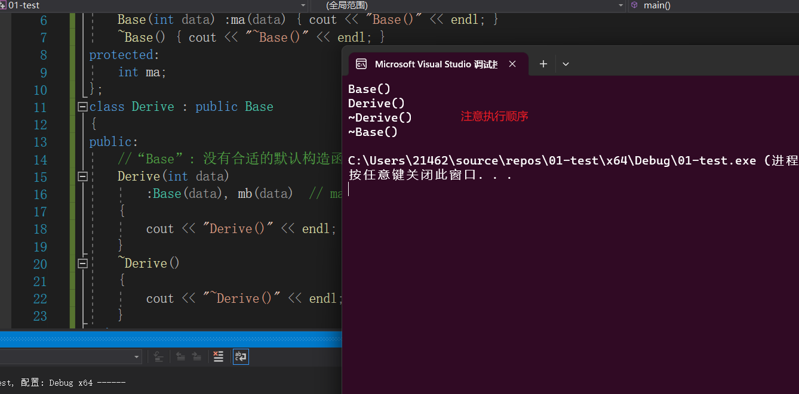

### 派生类的构造过程


**派生类从基类可以继承来所有的成员(变量和方法)，除过构造函数和析构函数**

==对于派生类的对象的构造，我们不允许直接对继承而来的成员在派生类的初始化列表中进行直接初始化:==

> ```C++
> class Base
> {
> public:
> 	Base(int data) :ma(data) { cout << "Base()" << endl; }
> 	~Base() { cout << "~Base()" << endl; }
> protected:
> 	int ma;
> };
> class Derive : public Base
> {
> public:
> 	//  “Derive”: 非法的成员初始化:“ma”不是基或成员
> 	Derive(int data)   
> 		:ma(data) , mb(data)  // ma(data)
> 	{
> 		cout << "Derive()" << endl;
> 	}
> 	~Derive()
> 	{
> 		cout << "~Derive()" << endl;
> 	}
> private:
> 	int mb;
> };
> int main()
> {
> 	Derive d(20);
> 
> 	return 0;
> }
> ```
>
> `Derive`对于基类变量`ma` (无论`ma`在基类中的访问权限是什么)进行了直接初始化！ 这是==**非法的**==，**对于派生类对象中的基类的部分内存，必须显式或隐式的调用基类的构造函数去构造**。【注：基类的构造是在执行派生类的初始化列表的过程中进行**显式或隐式**的执行的】
>
> ```C++
> class Base
> {
> public:
> 	Base(int data) :ma(data) { cout << "Base()" << endl; }
> 	~Base() { cout << "~Base()" << endl; }
> protected:
> 	int ma;
> };
> class Derive : public Base
> {
> public:
> 	//  “Derive”: 非法的成员初始化:“ma”不是基或成员
> 	Derive(int data)   
> 		:Base(data) , mb(data)  // ma(data)
> 	{
> 		cout << "Derive()" << endl;
> 	}
> 	~Derive()
> 	{
> 		cout << "~Derive()" << endl;
> 	}
> private:
> 	int mb;
> };
> int main()
> {
> 	Derive d(20);
> 
> 	return 0;
> }
> ```
>
> 


**派生类的构造函数和析构函数，负责初始化和清理派生类部分，派生类从基类继承来的成员，的初始化和清理由谁负责呢？是由基类的构造和析构函数来负责**

> ==首先介绍一下析构函数==：
>
> > 析构函数执行与构造函数相反的操作:**构造函数初始化对象的非 static 数据成员还可能做一些其他工作**:==析构函数释放对象使用的资源,并销毁对象的非 static 数据成员==。析构函数是类的一个成员函数，名字由波浪号接类名构成。它没有返回值，也不接受参数:
> >
> > ```C++
> > class Foo{
> > public:
> > 	~Foo() ;    
> > } ;
> > ```
> >
> > **由于析构函数不接受参数，因此它不能被重载**。对一个给定类，只会有唯一一个析构函数。
> >
> > ==析构函数完成什么工作==:
> > 		如同构造函数有一个**初始化部分**和一个**函数体**(参见7.5.1 节，第257 页)，**析构函数**也有一个**函数体**和一个**析构部分**。**在一个构造函数中，成员的初始化是在函数体执行之前完成的，且按照它们在类中出现的顺序进行初始化。在一个析构函数中，首先执行函数体，然后销毁成员。==成员按初始化顺序的逆序销毁。==**
> >
> > ​		在对象最后一次使用之后，**析构函数的函数体可执行类设计者希望执行的任何收尾工作。通常，析构函数释放对象在生存期分配的所有资源。**
> >
> > ​		在一个析构函数中，==不存在类似构造函数中初始化列表的东西来控制成员如何销毁==，**析构部分是隐式的。**成员销毁时发生什么完全依赖于成员的类型。**销毁类类型的成员需要执行成员自己的析构函数。内置类型没有析构函数，因此销毁内置类型成员什么也不需要做。**
> >
> > ==隐式销毁一个内置指针类型的成员不会 delete 它所指向的对象。==
> >
> > ==什么时候会调用析构函数==:
> >
> > > 无论何时一个对象被销毁，就会**自动调用**其析构函数:
> > >
> > > + 变量在离开其作用域时被销毁。
> > > + 当一个对象被销毁时，其成员被销毁。
> > > + 容器(无论是标准库容器还是数组)被销毁时，其元素被销毁。
> > > + 对于动态分配的对象,当对指向它的指针应用 `delete` 运算符时被销毁,**对于临时对象，当创建它的完整表达式结束时被销毁由于析构函数自动运行**.
> >
> > 例如，下面代码片段定义了四个 Sales data 对象:
> >
> > ```C++
> > { // 新作用城
> > 	// p和p2 指向动态分配的对象
> > 	Sales_data *p = new Sales_data;// P是一个内置指针
> >    auto p2 = make_shared<Sales data>(); // p2是一个shared_ptr
> >    Sales_data item(*p) ; //拷贝构造函数将 *p 拷贝到 item中
> >    vector<Sales_data> vec;// 局部对象
> > 	vec.push_back(*p2) ;  // 拷贝 p2 指向的对象 
> >    delete p; //对p指向的对象执行析构西数
> > }
> > //退出局部作用域;对 item、p2和vec 调用析构函数
> > // 销毁 p2 会递减其引用计数;如果引用计数变为 0，对象被释放
> > //销毁 vec 会销毁它的元素
> > ```
> >
> > ​		每个`Sales_data` 对象都包含一个 `string` 成员，它分配动态内存来保存 `bookNo` 成员中的字符。但是，我们的代码唯一需要直接管理的内存就是我们直接分配的 `Sales_data`对象。我们的代码只需直接释放绑定到 `p`的动态分配对象。
> > ​		其他 `Sales_data` 对象会在离开作用域时被**自动销毁**。当程序块结束时，`vec、p2`和 `item` 都离开了作用域，意味着在这些对象上分别会执行 `vector、shared_ptr` 和`Sales_data` 的析构函数。`vector` 的析构函数会**销毁**我们添加到` vec` 的元素。	    		`shared_ptr` 的析构函数会递减 `p2` 指向的对象的引用计数。在本例中，引用计数会变为0，因此 `shared_ptr` 的析构函数会 `delete p2` 分配的 `Sales_data` 对象。
> >
> > ​		在所有情况下,`Sales_data` 的析构函数都会隐式地销毁`bookNo` 成员。销毁`bookNo`会调用 `string` 的析构函数，它会释放用来保存 `ISBN` 的内存。
> >
> > ==当指向一个对象的引用或指针离开作用域时，对象的析构函数不会执行。==
>
> 派生类的构造函数和析构函数，负责初始化和清理派生类部分
> **派生类从基类继承来的成员，的初始化和清理由谁负责呢？是由基类的构造和析构函数来负责**
>
> ```C++
> class Base
> {
> public:
> 	Base(int data) :ma(data) { cout << "Base()" << endl; }
> 	~Base() { cout << "~Base()" << endl; }
> protected:
> 	int ma;
> };
> class Derive : public Base
> {
> public:
> 	//“Base”: 没有合适的默认构造函数可用
> 	Derive(int data) 
> 		:Base(data), mb(data)  // ma(data)
> 	{
> 		cout << "Derive()" << endl;
> 	}
> 	~Derive()
> 	{
> 		cout << "~Derive()" << endl;
> 	}
> private:
> 	int mb;
> };
> int main()
> {
> 	Derive d(20);
> 
> 	return 0;
> }
> ```
>
> 
>
>  **派生类对象构造和析构的过程是**：
>
> + 构造过程
>   + 派生类调用基类的构造函数，初始化从基类继承来的成员
>   + 调用派生类自己的构造函数，初始化派生类自己特有的成员
>
> + 析构过程
>   + 调用派生类的析构函数，释放派生类成员可能占用的外部资源（堆内存，文件）
>   + 调用基类的析构函数，释放派生类内存中，从基类继承来的成员可能占用的外部资源（堆内存，文件）


###示例代码

```C++

class Base
{
public:
	Base(int data) :ma(data) { cout << "Base()" << endl; }
	~Base() { cout << "~Base()" << endl; }
protected:
	int ma;
};
class Derive : public Base
{
public:
	//“Base”: 没有合适的默认构造函数可用
	Derive(int data) 
		:Base(data), mb(data)  // ma(data)
	{
		cout << "Derive()" << endl;
	}
	~Derive()
	{
		cout << "~Derive()" << endl;
	}
private:
	int mb;
};
int main()
{
	Derive d(20);

	return 0;
}
```

