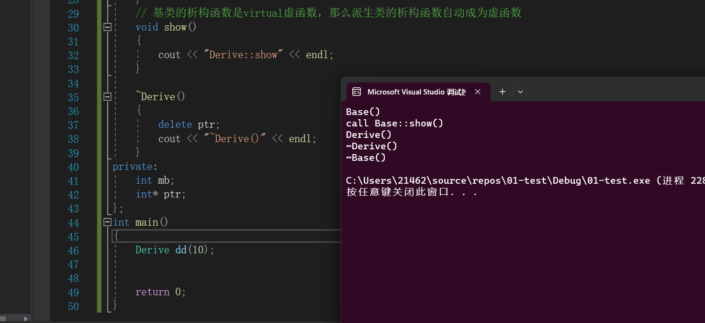
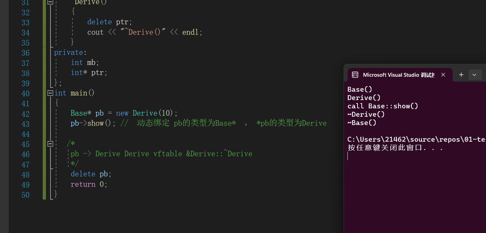

### 虚析构函数


#### 哪些函数不能实现为虚函数

> 虚函数依赖：
>
> + 虚函数能产生地址，存储在`vftable`当中
> + 对象必须存在,`(vfptr -> vftable -> 虚函数地址)`
>
> ==构造函数不能成为虚函数，且在构造函数中即使调用了虚函数，也不会发生动态绑定==：**构造函数执行完毕之后，对象才产生，不满足第二项依赖**
>
> > 在 C++ 中，构造函数不能被声明为虚函数是由于以下几个原因：
> >
> > + 含有虚函数的类的类的对象都需要有一个虚指针，**虚指针其实是存储在对象的内存空间的**。如果构造函数是虚函数，就需要通过虚函数表中对应的虚函数指针（编译期间生成属于类）来调用，可对象目前还没有实例化，也即是还没有内存空间，何来的虚指针，所以构造函数不能是虚函数；
> > + 虚函数的作用在于通过父类的指针或者引用来调用它的成员函数的时候，能够根据动态类型来调用子类相应的成员函数。**而构造函数是在创建对象时自动调用的**，不可能通过父类的指针或者引用去调用，所以构造函数不能是虚函数；
> >
> > **在构造函数内部调用虚函数也不会发生动态绑定，此时对象还未构造完成，不能通过虚函数指针来访问虚函数表**:
> >
> > 派生类对象构造过程  1.先调用的是基类的构造函数 2.才调用派生类的构造函数 ，如果动态绑定了，那调用的就是派生类的方法了，但派生类的的成员并没有被构造，你光调个几把的方法有屁用。
> >
> > ```C++
> > #include <iostream>
> > #include <typeinfo> 
> > using namespace std; 
> > class Base
> > {
> > public:
> > 	Base(int data) :ma(data) { 
> > 		cout << "Base()" << endl;
> > 		show() ;  // 即使在这里调用了虚函数，也不会发生动态绑定
> > 	}
> > 	// 虚析构函数
> > 	virtual ~Base() { cout << "~Base()" << endl; }
> > 	virtual void show() { cout << "call Base::show()" << endl; }
> > protected:
> > 	int ma;
> > }; // &Base::~Base   &Base::show
> > class Derive : public Base // &Derive::~Derive   &Base::show 
> > {
> > public:
> > 	Derive(int data)
> > 		:Base(data), mb(data), ptr(new int(data))
> > 	{
> > 		cout << "Derive()" << endl;
> > 	}
> > 	// 基类的析构函数是virtual虚函数，那么派生类的析构函数自动成为虚函数
> > 	void show()
> > 	{
> > 		cout << "Derive::show" << endl; 
> > 	}
> > 
> > 	~Derive()
> > 	{
> > 		delete ptr;
> > 		cout << "~Derive()" << endl;
> > 	}
> > private:
> > 	int mb;
> > 	int* ptr;
> > };
> > int main()
> > {
> > 	Derive dd(10); 
> > 	return 0;
> > }
> > ```
> >
> > 
>
> ==`static`静态成员方法也不能为虚函数==：静态成员方法并不依赖于对象。注意，访问虚函数的步骤是，先找对象内存中的虚指针，再从虚函数表中找到虚函数的地址进行调用。但**静态成员方法并不依赖于对象** 。 


#### 虚析构函数

> 虚析构函数 析构函数调用的时候，对象是存在的。
>
> **什么时候把基类的析构函数必须实现成虚函数？**
> ==基类的指针（引用）指向堆上new出来的派生类对象的时候==， `delete pb`(基类的指针)，它调用析构函数的时候，必须发生动态绑定。否则会导致派生类的析构函数无法调用【如果派生类的成员有外部资源，这时候会造成内存泄漏】。
>
> > + ==如果基类的析构函数为虚函数，那么派生类的析构函数就隐式的变为了虚函数。==
>
> ```C++
> class Base
> {
> public:
> 	Base(int data) :ma(data) { cout << "Base()" << endl; }
> 	
>    // 虚析构函数
> 	virtual ~Base() { cout << "~Base()" << endl; }
> 	
>    virtual void show() { cout << "call Base::show()" << endl; }
> protected:
> 	int ma;
> }; 
> // &Base::~Base   &Base::show
> 
> 
> class Derive : public Base // &Derive::~Derive   &Base::show 
> {
> public:
> 	Derive(int data)
> 		:Base(data), mb(data), ptr(new int(data))
> 	{
> 		cout << "Derive()" << endl;
> 	}
> 	// 基类的析构函数是virtual虚函数，那么派生类的析构函数自动成为虚函数
> 	~Derive()
> 	{
> 		delete ptr;
> 		cout << "~Derive()" << endl;
> 	}
> private:
> 	int mb;
> 	int *ptr;
> };
> int main()
> {
> 	Base *pb = new Derive(10);
> 	pb->show(); //  动态绑定 pb的类型为Base*  ， *pb的类型为Derive
> 	
>    /*
> 	pb -> Derive Derive vftable &Derive::~Derive
> 	*/
>    delete pb ; 
> 	return 0;
> }
> ```
>
> 
>
> 上图证明：我们的**析构函数调用的是派生类的析构函数，实现了动态绑定**。


