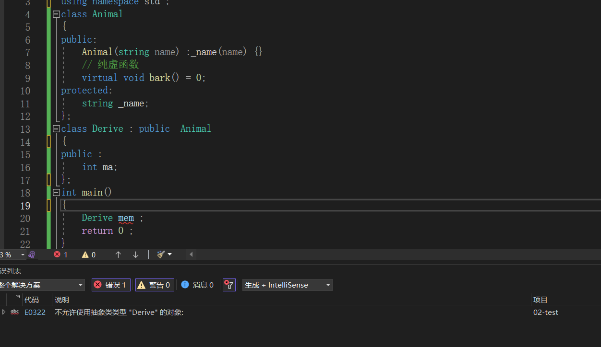
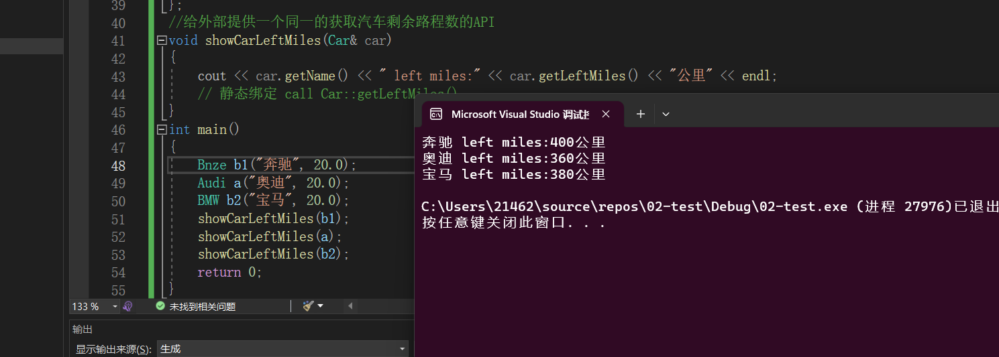

### 抽象类


####成为抽象类的条件

> 拥有纯虚函数的类，叫做抽象类:
>
> ```C++
> class Animal 
> {
> public:
> 	Animal(string name) :_name(name) {}
> 	// 纯虚函数
> 	virtual void bark() = 0 ; 
> protected:
> 	string _name;
> };
> ```
>
> **特点**：
>
> + 抽象类不能定义对象。
> + 抽象类可以定义指针和引用变量
>
> **如果派生类在继承的时候没有覆盖基类的所有虚函数，则派生类也为抽象类**:
>
> ```C++
> #include <iostream>
> #include <typeinfo> 
> using namespace std ; 
> class Animal
> {
> public:
> 	Animal(string name) :_name(name) {}
> 	// 纯虚函数
> 	virtual void bark() = 0;
> protected:
> 	string _name;
> };
> class Derive : public  Animal 
> {
> public :
> 	int ma;
> };
> int main()
> {	
> 	Derive mem ;    
> 	return 0 ;  
> }
> 
> ```
>
> 

#### 抽象类和普通类的区别

> 定义`Animal`的初衷，==并不是让`Animal`抽象某个实体的类型==：
>
> + `string _name;` 让所有的动物实体类通过继承Animal直接复用该属性。
> + 给所有的派生类保留统一的覆盖/重写接口。

#### 一般把什么类设计为抽象类

> 一般把基类设计为抽象类 , 基类相当于是我们抽象出来的一类事物的共同属性。从程序员的角度出发，不需要定义基类的实例化对象，这时候就能把基类设计为抽象类了。

```C++

// 汽车的基类
class Car // 抽象类
{
public:
	Car(string name, double oil) :_name(name), _oil(oil) {}
	// 获取汽车剩余油量还能跑的公里数
	double getLeftMiles()  // 在普通函数内部发生动态绑定
	{
		// 1L 10  *  oil
		return _oil * this->getMilesPerGallon(); // 发生动态绑定了
	}
	string getName()const { return _name; }
protected:
	string _name;
	double _oil;
	virtual double getMilesPerGallon() = 0; // 纯虚函数
};
class Bnze : public Car
{
public:
	Bnze(string name, double oil) :Car(name, oil) {}
	double getMilesPerGallon() { return 20.0; }
};
class Audi : public Car
{
public:
	Audi(string name, double oil) :Car(name, oil) {}
	double getMilesPerGallon() { return 18.0; }
};
class BMW : public Car
{
public:
	BMW(string name, double oil) :Car(name, oil) {}
	double getMilesPerGallon() { return 19.0; }
};
//给外部提供一个同一的获取汽车剩余路程数的API
void showCarLeftMiles(Car &car)
{
	cout<<car.getName() << " left miles:" << car.getLeftMiles() << "公里" <<endl;
	 // 静态绑定 call Car::getLeftMiles()
}
int main()
{
	Bnze b1("奔驰", 20.0);
	Audi a("奥迪", 20.0);
	BMW b2("宝马", 20.0);
	showCarLeftMiles(b1) ; 
	showCarLeftMiles(a) ;
	showCarLeftMiles(b2) ;
	return 0;
}
```

