### 虚基类和虚继承


#### 虚基类定义

> `virtual` 可以修饰继承方式，是虚继承，被虚继承的类，称为==虚基类==。
>
> 下面代码中，`A`就是虚基类
>
> ```C++
> class A{
> public:
> 
> private:
>    int ma ; 
> } ; 
> 
> class B : virtual public A 
> {
> public:
> 
> private:
>    int mb ;
> }
> 
> ```
>
> 存在虚继承的类的内存布局情况(以`B`为例):
>
> + 首先看`A`的内存布局：
>
>   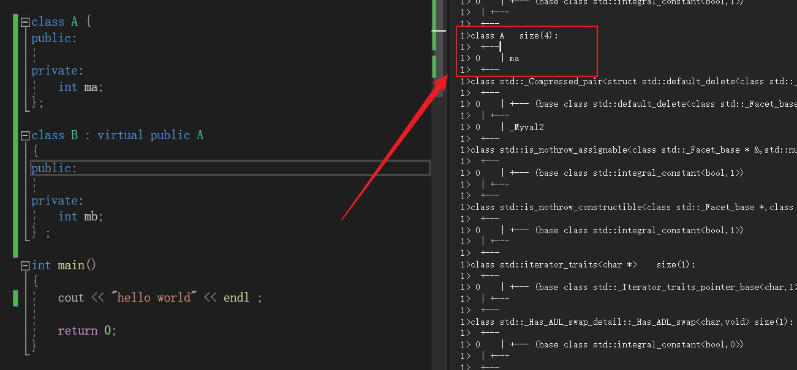
>
> + `B`的内存布局：
>
>   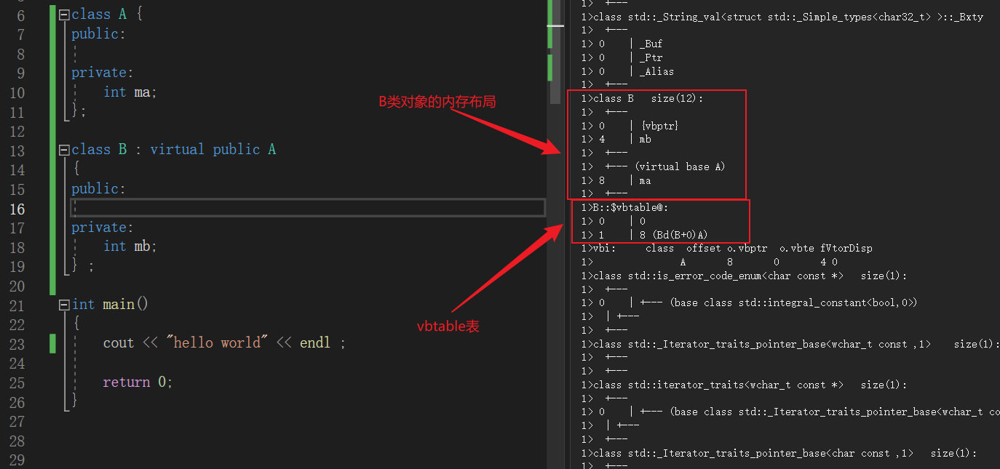
>
>   > ==虚基类的数据在派生类中一定是存储在派生类内存的最后面==，在本应该出现基类数据的内存存储的是`vbptr`： `vbptr` 是虚基类指针，指向的是虚基类表`vbtable` 。
>   >
>   > `vbtable` ：存储两个偏移量，第一个偏移量代表的是`vbptr` 相对于对象起始地址的偏移量，第二个代表的是虚基类成员地址相对于`vbptr`的偏移量【也就是说，起始地址+偏移量=`vbptr`的地址，`vbptr`地址+偏移量=虚基类成员地址】，==和`vftable`一样，都是在编译时期生成，在运行时期放入到`.rodata`区。==
>
> ==当我们想画出存在虚继承的类的内存布局的时候，可以先画出普通继承的内存布局，之后先将虚基类的数据移到最末尾，在原地添加一个`vbptr`==。【并且,`vbptr`在是属于派生类的一部分。】
>
> **一个类虚继承多个类的内存布局。**
>
> 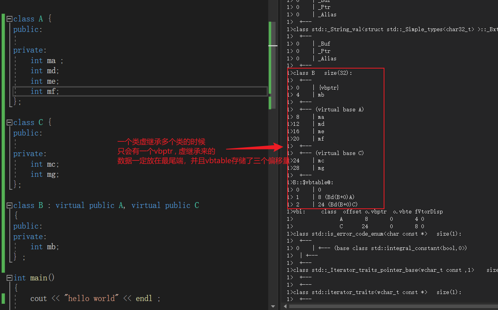
>
> **一个类虚继承含有虚函数的类的内存布局**：
>
> 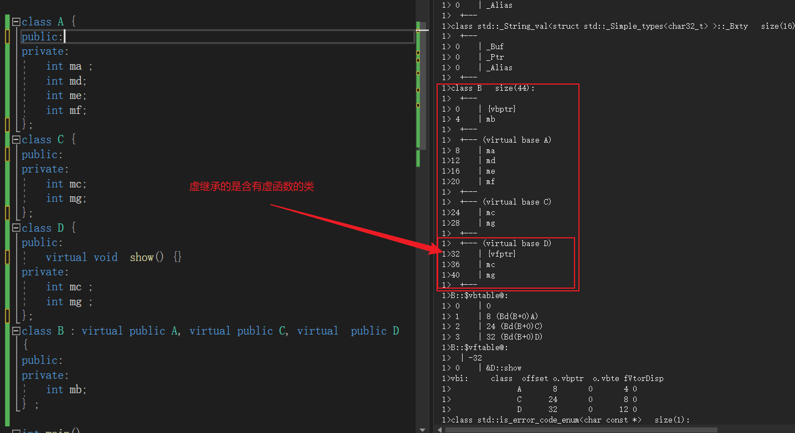


#### 虚继承不会影响动态绑定

> ````C++
> 
> class A
> {
> public:
> 	virtual void func() { cout << "call A::func" << endl; }
> private:
> 	int ma;
> };
> class B : virtual public A
> {
> public:
> 	void func() { cout << "call B::func" << endl; }
> 
> private:
> 	int mb;
> };
> 
> int main()
> {
> 	A* p = new B(); 
> 	p->func() ; 
> 
> 
> 	delete p ;  
> 	return 0;
> }
> 
> ````
>
> 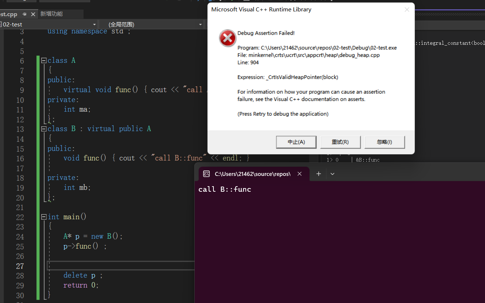
>
> 首先，在执行`p->func()`的时候并没有问题，也就是说==虚继承并不影响动态绑定==，但这里报错表示：==堆操作存在问题==。从而表明在`delete`的时候出现问题：
>
> > **`p`指针指向的是基类内存的起始地址，不是派生类内存的起始地址，这是为了保证动态绑定能够成功，但在`delete p` 的时候，因为没有虚析构函数，这里只调用了基类的析构函数，==在堆上的时候，`p`指向的内存地址开始释放，而不是从分配的起始地址释放，操作系统认为这是非法的操作会报错；如果是在栈上的时候，在栈帧结束的时候，操作系统会进行一个回收，这样写也是可以的==**。
> >
> > 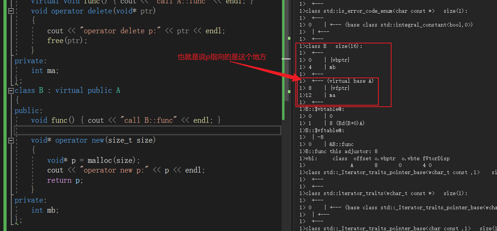
> >
> > **注意在执行`delete p` 的时候，p指向的是派生类对象中的基类的起始地址，当派生类对象分配的是堆上的内存的时候，在`Windows VS`系列编译器会出现错误，但如果在`Linux g++` 编译器下，其会将`p` 自动偏移到派生类对象的起始地址处：**
> >
> > > 在`Linux 编译器下验证`：
> > >
> > > ```C++
> > > 
> > > #include<iostream>
> > > using namespace std ;  
> > > class A
> > > {
> > > public:
> > > 	virtual void func() { cout << "call A::func" << endl; }
> > > private:
> > > 	int ma;
> > > };
> > > class B : virtual public A
> > > {
> > > public:
> > > 	void func() override { cout << "call B::func" << endl; }
> > > 
> > > private:
> > > 	int mb;
> > > };
> > > 
> > > int main()
> > > {
> > > 	A* p = new B(); 
> > > 	p->func() ; 
> > > 	delete p ;  
> > > 	return 0 ; 
> > > }
> > > 
> > > ```
> > >
> > > 验证结果：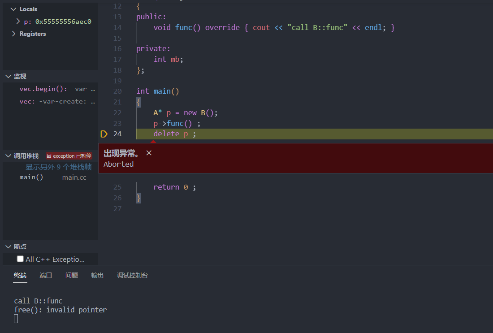
> > >
> > > 结论：**在C++中，对于使用虚继承（virtual inheritance）的情况，派生类对象在堆上分配时，在`delete`的时候编译器不会自动调整指向该对象的指针。** 
> >
> > 验证代码【在堆上new一个派生类对象】：
> >
> > ```C++
> > class A
> > {
> > public:
> > 	virtual void func() { cout << "call A::func" << endl; }
> > 	void operator delete(void *ptr)
> > 	{
> > 		cout << "operator delete p:" << ptr << endl;
> > 		free(ptr);
> > 	}
> > private:
> > 	int ma;
> > };
> > class B : virtual public A
> > {
> > public:
> > 	void func() { cout << "call B::func" << endl; }
> > 
> > 	void* operator new(size_t size)
> > 	{
> > 		void *p = malloc(size);
> > 		cout << "operator new p:" << p << endl;
> > 		return p;
> > 	}
> > private:
> > 	int mb ; 
> > };
> > 
> > int main()
> > {
> >    A* p = new B();
> > 	p->func();
> > 	delete p ; // 当派生类对象是在堆上的时候，如果类中有指针或者引用，需要将基类的析构函数实现为虚析构函数。
> > 	return 0;
> > }
> > ```
> >
> > 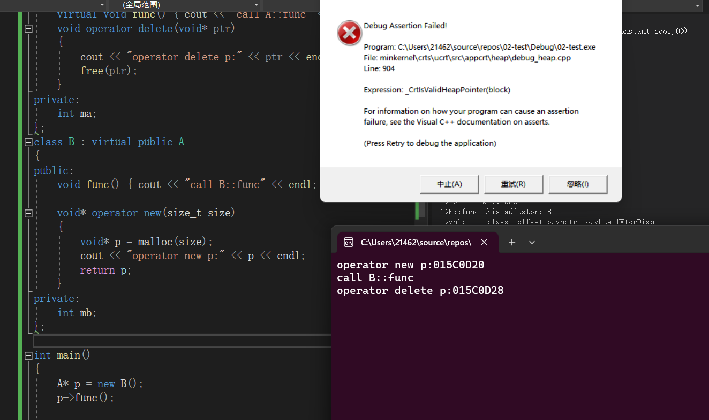
> >
> > ==成功验证:无论虚继承与否，当基类指针指向派生类对象的时候，指向的是基类的内存起始地址。==
> >
> > 派生类对象在栈上的时候：==当派生类对象在栈上的时候，这样写也是`ok`的。==
> >
> > 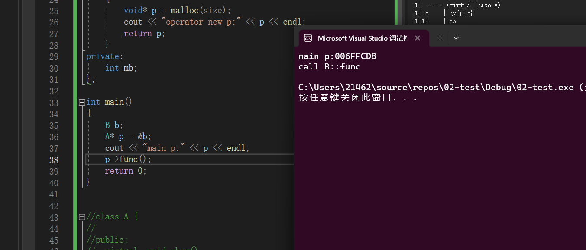


#### `vfptr`在内存中的布局

> + 派生类本身没有虚函数，只从基类继承：
>
>   ```C++
>   class A{
>   public:
>   	virtual void show()
>      {
>         cout << "hello world" << endl ;  
>      }
>   };
>   
>   class B : public A
>   {
>   private:
>      int mb ;
>   } ;
>   ```
>
>   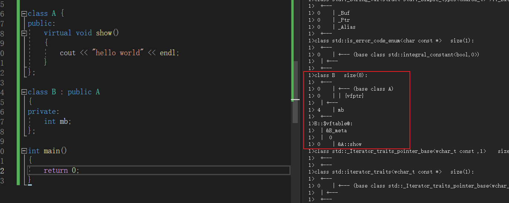
>
>   因为虚函数是继承下来的，基类中有虚函数，派生类中也有虚函数，所以为了节省内存`vfptr`就在`Base class A` 的作用域之下。`vftable`中函数的地址该覆盖就覆盖。
>
> + 派生类本身有虚函数，并且从基类也继承了虚函数：
>
>   ```C++
>   class A{
>   public:
>   	virtual void show()
>      {
>         cout << "hello world" << endl ;  
>      }
>   };
>   
>   class B : public A
>   {
>      virtual void test(){}
>   private:
>      int mb ;
>   } ;
>   ```
>
>   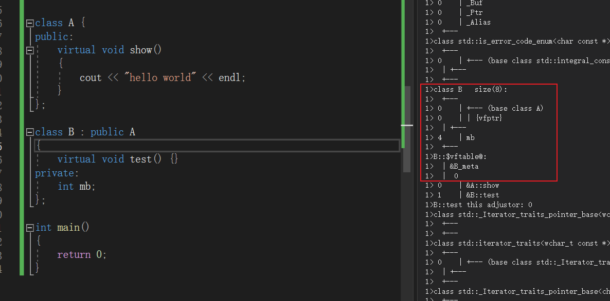
>
> + 派生类本身有虚函数，并且不从基类继承虚函数：
>
>   ```C++
>   class A{
>   public:
>   	void show()
>      {
>         cout << "hello world" << endl ;  
>      }
>   };
>   
>   class B : public A
>   {
>      virtual void test(){}
>   private:
>      int mb ;
>   } ;
>   ```
>
>   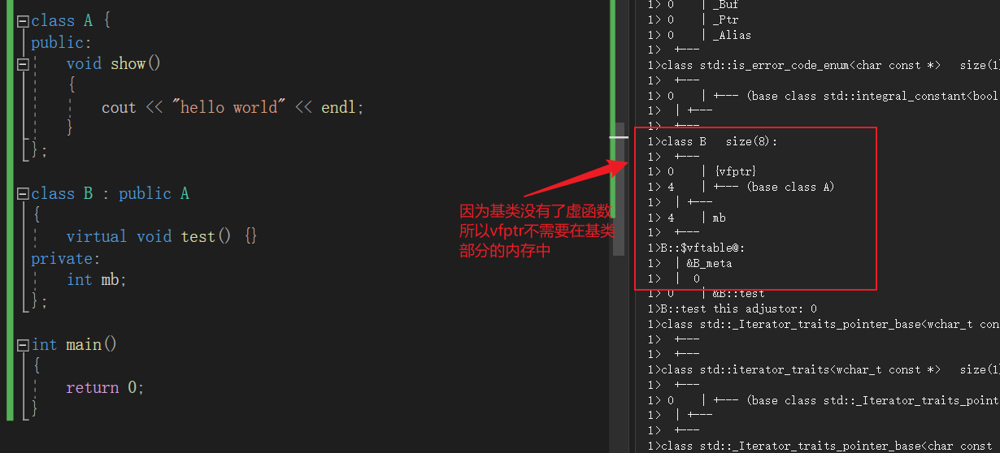

