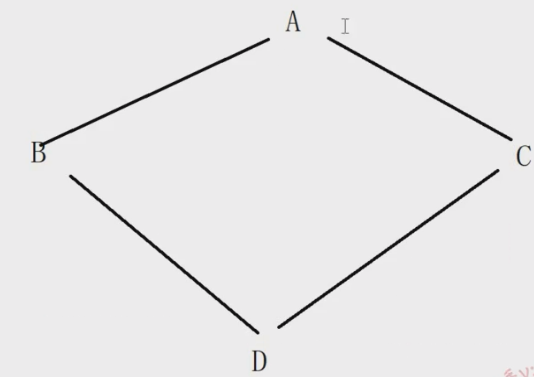
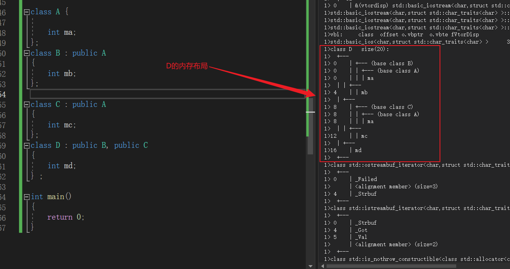
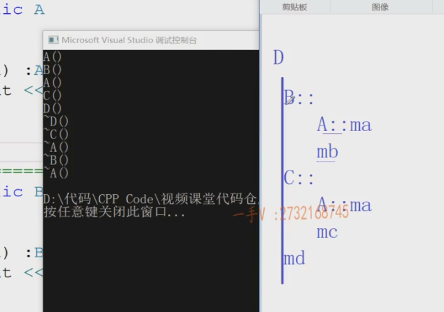
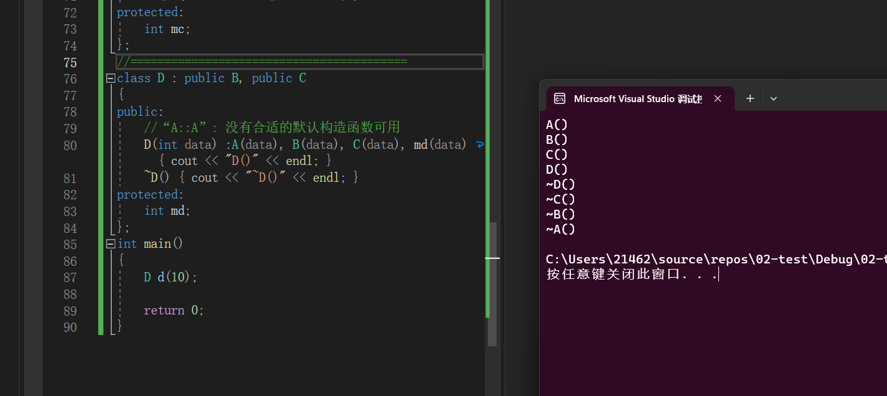
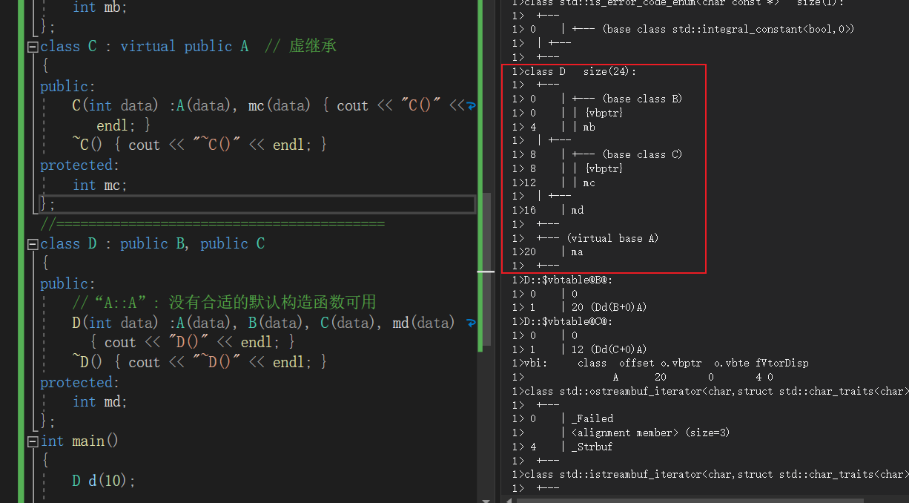
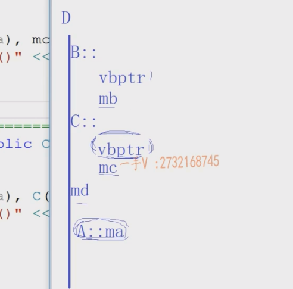

### 菱形继承的问题

#### 菱形继承

> 
>
> ```C++
> class A{
> 	
> int ma ; 
> };
> class B: public A 
> {
>    int mb ; 
> };
> 
> class C : public A
> {
>    int mc ; 
> } ; 
> class D : public B , public C 
> {
>    int md ; 
> }
> ```
>
> `B`和`C`是`D`的直接基类，`A`是`D`的直接基类.
>
> 查看`D`的内存布局为：
>
> 
>
> 类似于这种排列方式：
>
> 
>
> 这在软件设计上存在很大的问题：==如果`ma`表示的是唯一的属性，就不应该有多份对应的数据。== 其次，如果基类中含有的数据比较多，内存开销也非常大！	
>
> **解决方式：虚继承**
>
> > ```C++
> > /*
> > C++的多重继承 - 菱形继承的问题  派生类有多份间接基类的数据 设计的问题
> > 好处，可以做更多代码的复用   D -> B,C    B *p = new D()   C *p = new D()
> > */
> > class A
> > {
> > public:
> > 	A(int data) :ma(data) { cout << "A()" << endl; }
> > 	~A() { cout << "~A()" << endl; }
> > protected:
> > 	int ma;
> > };
> > //=======================================
> > class B : virtual public A  // 虚继承
> > {
> > public:
> > 	B(int data) :A(data), mb(data) { cout << "B()" << endl; }
> > 	~B() { cout << "~B()" << endl; }
> > protected:
> > 	int mb;
> > };
> > class C : virtual public A  // 虚继承
> > {
> > public:
> > 	C(int data) :A(data), mc(data) { cout << "C()" << endl; }
> > 	~C() { cout << "~C()" << endl; }
> > protected:
> > 	int mc;
> > };
> > //=========================================
> > class D : public B, public C
> > {
> > public:
> > 	//“A::A”: 没有合适的默认构造函数可用
> > 	D(int data) :A(data), B(data), C(data), md(data) { cout << "D()" << endl; }
> > 	~D() { cout << "~D()" << endl; }
> > protected:
> > 	int md;
> > };
> > int main()
> > {
> > 	D d(10);
> > 
> > 	return 0;
> > }
> > ```
> >
> > 执行结果：
> >
> > 
> >
> > 查看`D`的内存布局:
> >
> > 
> >
> > 类似于：
> >
> > 
> >
> > 编译器将`B::`下的`A::ma`移到内存的最后面，之后在`B::`下添加`vbptr` 。编译器将`C::`下的`A::ma`移到内存的最后面的时候发现已经有一份`A::ma`就直接使用这一份，之后在`B::`下添加`vbptr`。==需要注意的是，两个`vbptr`指向的是不同的`vbtable`【上图可以看到】== 。
> >
> > **==因为此时`A::ma`位于D的直接作用域，其需要`D`进行初始化：==**
> >
> > ```C++
> > class D : public B, public C
> > {
> > public:
> >    // 这里需要执行A(data) 的原因，如果不执行A(data)，除非A类有默认构造函数。
> > 	D(int data) :A(data), B(data), C(data), md(data) { cout << "D()" << endl; }
> > 	~D() { cout << "~D()" << endl; }
> > protected:
> > 	int md;
> > };
> > ```
> >
> >  
> >
> > 


