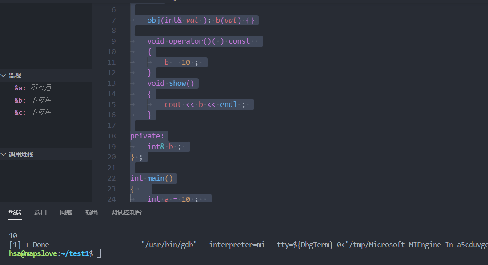

什么是Lambda表达式
------------

优点：即用即写，相比于函数对象需要定义一个类的操作，其更加轻量化，和`function`结合之后可以更加灵活的使用。

最常见的`lambda`的表达式写法如下

    auto plus = [] (int v1, int v2) -> int { return v1 + v2; }
    int sum = plus(1, 2);

这里只是计算两个数的和，我们一般情况下肯定是不会这么用的，更多的时候，我们都是和`stl`的一些算法结合使用，例如自定义一个结构体的排序规则和打印。

```C++
struct Item
{
    Item(int aa, int bb) : a(aa), b(bb) {} 
    int a;
    int b;
};
	
int main()
{
    std::vector<Item> vec;
    vec.push_back(Item(1, 19));
    vec.push_back(Item(10, 3));
    vec.push_back(Item(3, 7));
    vec.push_back(Item(8, 12));
    vec.push_back(Item(2, 1));

    // 根据Item中成员a升序排序
    std::sort(vec.begin(), vec.end(),
        [] (const Item& v1, const Item& v2) { return v1.a < v2.a; });

    // 打印vec中的item成员
    std::for_each(vec.begin(), vec.end(),
        [] (const Item& item) { std::cout << item.a << " " << item.b << std::endl; });
	return 0;
}
```

这样的写法让我们代码更加简洁、清晰，可读性更强。

在c++的官方文档中，给出了`lamda`表达式的四种写法，这里知乎的排版有点难用，所以直接在[官方文档](https://link.zhihu.com/?target=https%3A//en.cppreference.com/w/cpp/language/lambda)上截了一个图。


下面介绍一下`lambda`的四种表达式的含义，以及表达式中各个成分的，其实说白就是在自己理解的基础上翻译一下官方文档。

### **四种表达式的含义**

（1）完整的`lambda`表达式，包含了`lambda`表达式的所有成分。

（2）常量`lambda`表达式，捕获的变量都是常量，不能在`lambda`表达式的`body`中进行修改。

（3）和（2）基本一致，唯一的区别就是，`lambda`表达式的函数返回值可以通过函数体推导出来。一般情况函数返回值类型明确或者没有返回值的情况下可以这样写。

（4）`lambda`表达式的函数没有任何参数，但是可以添加`lambda-specifiers`，`lambda-specifiers`是什么我们后续再介绍。

### **lambda表达式各个成员的解释**

**`captures` 捕获列表，**lambda可以把上下文变量以值或引用的方式捕获，在body中直接使用。

**`tparams `模板参数列表**(c++20引入)，让lambda可以像模板函数一样被调用。

**`params` 参数列表**，有一点需要注意，在c++14之后允许使用auto左右参数类型。

**`lambda-specifiers`lambda说明符**_，_ 一些可选的参数，这里不多介绍了，有兴趣的读者可以去官方文档上看。这里比较常用的参数就是`mutable`和`exception`。其中，表达式(1)中没有`trailing-return-type`，是因为包含在这一项里面的。

**_trailing-return-type_ 返回值类型**，一般可以省略掉，由编译器来推导。

**_body_ 函数体**，函数的具体逻辑。

捕获列表
----

上面介绍完了`lambda`表达式的各个成分，其实很多部分和正常的函数没什么区别，其中最大的一个不同点就是捕获列表。我在刚开始用`lambda`表达式的时候，还一直以为这个没啥用，只是用一个 \[\] 来标志着这是一个`lambda`表达式。后来了解了才知道，原来这个捕获列表如此强大，甚至我觉得捕获列表就是lambda表达式的灵魂。下面先介绍几种常用的捕获方式。

**\[\]** 什么也不捕获，无法lambda函数体使用任何

**\[=\]** 按值的方式捕获所有变量

**\[&\]** 按引用的方式捕获所有变量

**\[=, &a\]** 除了变量a之外，按值的方式捕获所有局部变量，变量a使用引用的方式来捕获。这里可以按引用捕获多个，例如 \[=, &a, &b,&c\]。这里注意，如果前面加了=，后面加的具体的参数必须以引用的方式来捕获，否则会报错。

**\[&, a\]** 除了变量a之外，按引用的方式捕获所有局部变量，变量a使用值的方式来捕获。这里后面的参数也可以多个，例如 \[&, a, b, c\]。这里注意，如果前面加了&，后面加的具体的参数必须以值的方式来捕获。

**\[a, &b\]** 以值的方式捕获a，引用的方式捕获b，也可以捕获多个。

**\[this\]** 在成员函数中，也可以直接捕获this指针，其实在成员函数中，\[=\]和\[&\]也会捕获this指针。

  

```C++
#include <iostream>

int main()
{
    int a = 3;
    int b = 5;
    
    // 按值来捕获
    auto func1 = [a] { std::cout << a << std::endl; };
    func1();

    // 按值来捕获
    auto func2 = [=] { std::cout << a << " " << b << std::endl; };
    func2();

    // 按引用来捕获
    auto func3 = [&a] { std::cout << a << std::endl; };
    func3();

    // 按引用来捕获
    auto func4 = [&] { std::cout << a << " " << b << std::endl; };
    func4();
}
```

编译器如何看待Lambda表达式
----------------

我们把`lambda`表达式看成一个函数，那编译器怎么看待我们写的`lambda`呢？

其实，编译器会把我们写的lambda表达式翻译成一个类，并重载 operator()来实现。比如我们写一个lambda表达式为

```C++
auto plus = [] (int a, int b) -> int { return a + b; }
int c = plus(1, 2);
```

那么编译器会把我们写的表达式翻译为

```C++
// 类名是我随便起的
class LambdaClass
{
public:
    int operator () (int a, int b) const
    {
        return a + b;
    }
};

LambdaClass plus;
int c = plus(1, 2);
```

调用的时候编译器会生成一个Lambda的对象，并调用`opeartor ()`函数。（**备注：这里的编译的翻译结果并不和真正的结果完全一致，只是把最主要的部分体现出来，其他的像类到函数指针的转换函数均省略**）

上面是一种调用方式，那么如果我们写一个复杂一点的`lambda`表达式，表达式中的成分会如何与类的成分对应呢？我们再看一个 值捕获 例子。

```C++
int x = 1; int y = 2;
auto plus = [=] (int a, int b) -> int { return x + y + a + b; };
int c = plus(1, 2);
```

编译器的翻译结果为

```C++
class LambdaClass
{
public:
    LambdaClass(int xx, int yy)
    : x(xx), y(yy) {}

    int operator () (int a, int b) const
    {
        return x + y + a + b;
    }

private:
    int x;
    int y;
}

int x = 1; int y = 2;
LambdaClass plus(x, y);
int c = plus(1, 2);
```

  


其实这里就可以看出，值捕获时，编译器会把捕获到的值作为类的成员变量，并且变量是以值的方式传递的。需要注意的时，==如果所有的参数都是值捕获的方式，那么生成的operator()函数是`const`函数的，是无法修改捕获的值的==，哪怕这个修改不会改变lambda表达式外部的变量，如果想要在函数内修改捕获的值，需要加上关键字 mutable。向下面这样的形式。

```C++
int x = 1; int y = 2;
auto plus = [=] (int a, int b) mutable -> int { x++; return x + y + a + b; };
int c = plus(1, 2);
```

  


我们再来看一个引用捕获的例子。

```C++
int x = 1; int y = 2;
auto plus = [&] (int a, int b) -> int { x++; return x + y + a + b;};
int c = plus(1, 2);
```

编译器的翻译结果为

```C++
class LambdaClass
{
public:
    LambdaClass(int& xx, int& yy)
    : x(xx), y(yy) {}

    int operator () (int a, int b)
    {
        x++;
        return x + y + a + b;
    }

private:
    int &x;
    int &y;
};
```

我们可以看到以引用的方式捕获变量，和值捕获的方式有3个不同的地方：1. 参数引用的方式进行传递; 2. 引用捕获在函数体修改变量，会直接修改lambda表达式外部的变量；3. `opeartor()函数不是const的`。

针对上面的集中情况，我们把`lambda`的各个成分和类的各个成分对应起来就是如下的关系:

**捕获列表**，对应`LambdaClass`类的**private成员**。

**参数列表**，对应`LambdaClass`类的成员函数的operator()的形参列表

**mutable**，对应` LambdaClass`类成员函数 **operator() 的`const`属性 ，但是只有在捕获列表捕获的参数不含有引用捕获的情况下才会生效，**因为捕获列表只要包含引用捕获，那operator()函数就一定是非`const`函数**。**

**返回类型**，对应 `LambdaClass`类成员函数 **operator() 的返回类型**

**函数体，**对应 `LambdaClass`类成员函数 **operator() 的函数体。**

**引用捕获和值捕获不同的一点就是，对应的成员是否为引用类型。** 


==在常方法中可以修改类中普通引用成员变量==

> ```C++
> #include <iostream>
> #include <functional>
> using namespace std;
> class obj{
> public:
> 
> 	obj(int& val ): b(val) {}
> 
> 	void operator()(int & p ) const  
> 	{
> 		b = 10 ; 
> 	}
> 	void show()
> 	{
> 		cout << b << endl ; 
> 	}
> 
> private:
> 	int& b ; 
> } ;
> 
> int main()
> {	
> 	int a = 10 ;  
> 	obj t1(a) ; 
>    t1() ; 
> 	t1.show() ; 
> 
> 
>    return 0 ; 
> }
> ```
>
> 


  