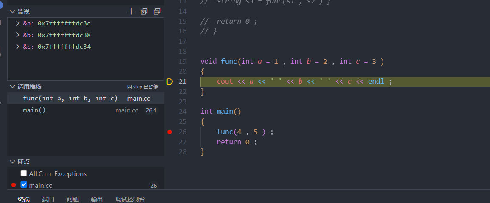
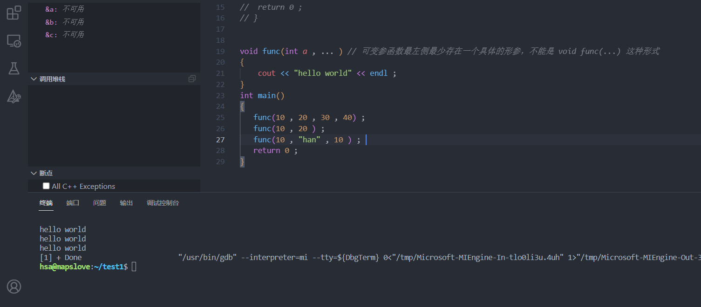
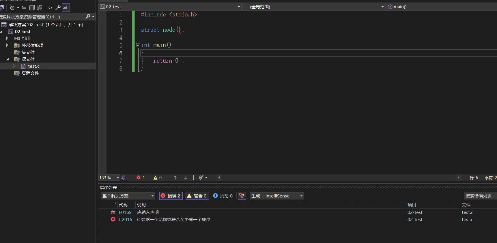
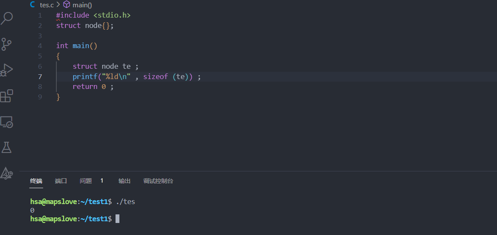
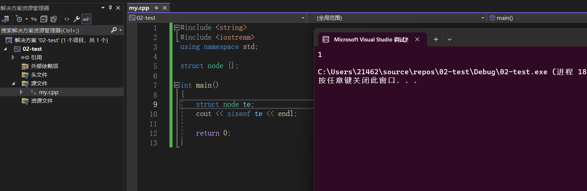
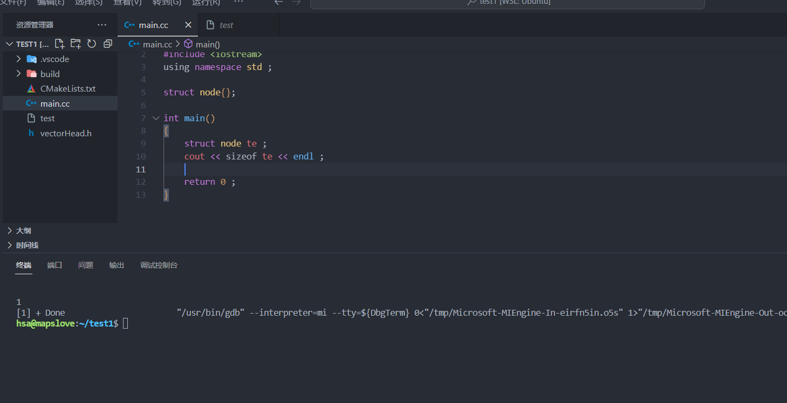

### 常见面经问题总结


+ 函数调用参数怎么传递的？

  > + 堆内存和栈内存的区别：
  >
  >   > 堆内存只能通过`malloc` 和`new` 才能能进行分配，通过`free`和`delete`进行释放。其分配和释放是由程序员自己进行管理，如果管理不当，可能会造成内存泄漏。
  >   >
  >   >  栈内存的分配和释放通常发生在函数的调用的时候，函数调用的时候走到`{`的时候先将调用方的地址进行压栈，之后进行函数栈帧的开辟，在执行完函数体之后，遇到`}` 的时候进行栈内存的回收，栈的开辟和回收都是由系统进行管理的。
  >
  > + 数据结构的堆内存和栈内存的区别：
  >
  >   > 栈是一种先进后出的线性的数据结构，堆是一种具有某种特性的二叉树(分为大根堆和小根堆) ， `STL`中的`priority_queue` 默认情况下就是一种`大根堆`。

+ 函数调用的参数什么顺序压栈？

  > 从右向左进行函数的参数的压栈，如果想要进行对参数的访问，通过`ebp`指针的偏移进行取参数。如果函数的形参都存在缺省值，并且提供的参数的个数和形参的个数不相等，编译器先把靠右的一部分的形参的缺省值进行压栈，之后靠左的一部分压入栈的不是缺省值而是提供的实参。
  >
  > **主要看`a , b , c` 的内存地址的大小，验证了从右向左进行压栈**
  >
  > 

+ 为什么函数调用的参数要从右向左压栈？

  > 主要是`C/C++`需要支持**可变参函数**，所以要从右向左进行压栈
  >
  > **可变参函数语法**：
  >
  > > ```C++
  > > void func(int a , ... ) // 可变参函数最左侧最少存在一个具体的形参，不能是 void func(...) 这种形式
  > > {
  > > 	cout << "hello world" << endl ; 
  > > }
  > > int main()
  > > {
  > >    // 调用的是同一个函数，但可变参部分的个数和类型都可以不同
  > >    func(10 , 20 , 30 , 40) ; 
  > >    func(10 , 20 ) ; 
  > >    func(10 , "han" , 10) ; 
  > >    return 0 ; 
  > > }
  > > 
  > > // printf(const char * , ...) ; 这个打印的函数实际上就是可变参函数
  > > ```
  > >
  > > 
  >
  > 从右向左压栈的原因：
  >
  > > 因为`C/C++`需要支持**可变参函数**，看下面一个例子：
  > >
  > > ```C++
  > > void func(int a , ... ) // 可变参函数最左侧最少存在一个具体的形参，不能是 void func(...) 这种形式
  > > {
  > > 	int temp = a + 10 ;  
  > > }
  > > int main()
  > > {
  > >    func(10 , 20 , 30 , 40) ; 
  > >    func(10 , 20 ) ; 
  > >    func(10 , "han" , 10) ; 
  > >    return 0 ; 
  > > }
  > > ```
  > >
  > > ​	==编译时期，需要将`func`函数进行一个编译，`{`生成的汇编指令不再赘述，在生成第3行的代码所对应的汇编指令的时候，需要生成从内存中取出`a`的值的指令，形似于`mov eax  [ebp - x]`如果参数是从左向右压栈，在编译期，编译器无法确定`x`的值是多少！，因为后面有可变形参`...`,向函数传递的参数的个数需要到第7,8,9行指令才能生成实参压栈的指令，但此时已经生成了函数的指令了！已经晚了。==
  > >
  > > ​	如果是从右向左进行压栈 ，则可以规避上面的问题。因为约定为从右向左压栈，在生成`func`的指令的时候编译器可以确定取可变参函数的第一个参数的值的指令为 `mov eax [ebp + 8]` ,就可以在**编译阶段**生成正确的指令了。
  >
  > 同样的在`printf(const char* , ...)` 中，因为是从右向左压栈，`const char*`位于栈顶，所以能够访问第一个格式化字符串，编译器就根据`const char*` 中的**占位符的类型和个数**，就可以继续向内存中取出参数。

+ 有一个函数：

  ```C++
  string fun(string s1 , string s2 ) 
  {
     string tmp = s1 + s2 ; 
     return tmp ; 
  }
  
  int main()
  {
     string s1 = "han" ; 
     string s2 = "shen" ; 
     string s = fun(s1 , s2 ) ;
     return 0; 
  }
  ```

  问：**第11行的函数调用中，一共调用了几次构造函数？几次析构函数**

  > ==任意的`C++`编译器都会做一个优化：**如果使用临时对象构造新对象**，那么临时对象就不产生了，直接构造新对象==
  >
  > + 实参`s2` 到形参`s2` 的**拷贝构造**
  > + 实参`s1` 到形参`s1`的**拷贝构造**
  > +  `s1+s2`到`tmp`的**拷贝构造**
  > + 使用`tmp`到`s`的**拷贝构造**。【根据上述黄字结论，第`11`行的函数调用点，不会产生临时对象】
  > + 执行到`fun`的`}`之后，调用析构函数析构`tmp s1 s2` 从左到右执行三次**析构函数**
  > + 执行到`main`的`}` 之后，调用析构函数析构`s s2 s1`从左到右执行三次**析构函数**


​	改写为：

```C++
 string fun(string s1 , string s2 ) 
{
   return s1 + s2 ;
}

int main()
{
   string s1 = "han" ; 
   string s2 = "shen" ; 
   string s = fun(s1 , s2 ) ; // 这里不需要产生一个临时对象去接受函数的返回值。
   return 0; 
}
```


问：**第11行的函数调用中，一共调用了几次构造函数？几次析构函数**

> + 实参`s2` 到形参`s2` 的**拷贝构造**
> + 实参`s1` 到形参`s1`的**拷贝构造**
> + 使用`s1 + s2`到`s`的**拷贝构造**。【根据上述黄字结论，第`10`行的函数调用点，不会产生临时对象】
> + 执行到`fun`的`}`之后，调用析构函数析构` s1 s2` 从左到右执行两次**析构函数**
> + 执行到`main`的`}` 之后，调用析构函数析构` s2 s1`从左到右执行两次**析构函数**


+ 根据上述的代码的执行情况得出优化策略：
  + 参数传对象按引用传递
  + 返回对象时，直接返回结果，不要先定义，再返回。


+ 空结构体的大小的探索：

  > + windows 下的vs2013 , 15 , 17 , 19 , 20  ，22`.c` 文件 中，不允许定义空的结构体(**这并不是C语言的标准**，==C语言标准（C11），空结构体是允许的。==)：
  >
  >   > 
  >   >
  >   > **linux/unix下，`gcc`却可以定义空的结构体** ,并且空结构体的大小也是`0`
  >   >
  >   > 
  >
  > + windows vs系列编译器，`linux`下的`gcc`和`g++`编译器，==在`.cpp或.cc`文件==中，空结构体的大小为1【这和空的`class`一个样。】
  >
  >   > 
  >   >
  >   > 
  >
  > **`C++`中的对象区别于`C`语言中的变量的的最大区别：除了分配内存，前者还会存在一步==构造==的步骤。**


