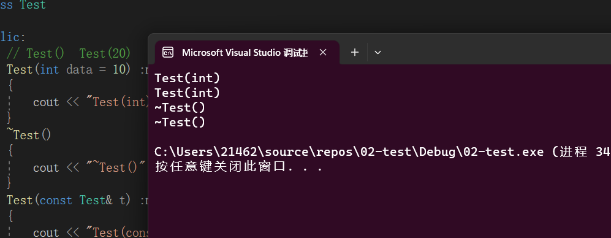

示例源码：


**根据上一节中的在`Windows 平台下的VS2019`的结果进行优化**

```C++
#include "pch.h"
#include <iostream>
using namespace std;

class Test
{
public:
	// Test()  Test(20)
	Test(int data = 10) :ma(data)
	{
		cout << "Test(int)" << endl;
	}
	~Test()
	{
		cout << "~Test()" << endl;
	}
	Test(const Test &t):ma(t.ma)
	{
		cout << "Test(const Test&)" << endl;
	}
	void operator=(const Test &t)
	{
		cout << "operator=" << endl;
		ma = t.ma;
	}
	int getData()const { return ma; }
private:
	int ma;
};
Test GetObject(Test &t) 
{
	int val = t.getData();
	return Test(val); 
}
int main()
{
	Test t1;
	Test t2 = GetObject(t1);	
	return 0;
}

```

+  **函数参数传递过程中，对象优先按引用传递，不要按值传递**

  > 原形式：
  >
  > ```C++
  > Test GetObject(Test t) 
  > {
  > 	int val = t.getData();
  > 	return Test(val); 
  > }
  > ```
  >
  > 优化后：
  >
  > ```C++
  > Test GetObject(Test &t) 
  > {
  > 	int val = t.getData();
  > 	return Test(val); 
  > }
  > ```
  >
  > 优点：==减少了一次拷贝构造函数和一次析构函数调用==

+ **函数返回对象的时候，应该优先返回一个临时对象，而不要返回一个定义过的对象**

  > 原形式：
  >
  > ```C++
  > Test GetObject(Test t) 
  > {
  > 	int val = t.getData();
  >    Test tmp(val) ; 
  > 	return tmp ;  
  > }
  > ```
  >
  > 优化后:
  >
  > ```C++
  > Test GetObject(Test &t) 
  > {
  > 	int val = t.getData();
  > 	return Test(val); 
  > }
  > ```
  >
  > 优点：
  >
  > > 返回是==临时对象==，因为需要在`main`函数栈帧中创建一个==新的临时对象==接收，编译器此时进行优化，直接用==返回的临时对象的数据==，初始化==新的临时对象==  总结下来就是：**`Test(val)`并不会构造一个临时对象，而是使用`val`直接在`main`函数中创建一个临时对象。省去了`tmp` 的构造和析构** 

+ **接收返回值是对象的函数调用的时候，优先按初始化的方式接收，不要按赋值的方式接收**

  > 原形式：
  >
  > ```C++
  > Test t2 ;
  > t2 = GetObject(t1);	
  > ```
  >
  > 优化后：
  >
  > ```C++
  > Test t2 = GetObject(t1);	
  > ```
  >
  > 优点：不产生临时对象，省去了一个临时对象的构造和析构。

优化后代码：

```C++
#include "pch.h"
#include <iostream>
using namespace std;

class Test
{
public:
	// Test()  Test(20)
	Test(int data = 10) :ma(data)
	{
		cout << "Test(int)" << endl;
	}
	~Test()
	{
		cout << "~Test()" << endl;
	}
	Test(const Test &t):ma(t.ma)
	{
		cout << "Test(const Test&)" << endl;
	}
	void operator=(const Test &t)
	{
		cout << "operator=" << endl;
		ma = t.ma;
	}
	int getData()const { return ma; }
private:
	int ma;
};
Test GetObject(Test &t) 
{
	int val = t.getData();
	return Test(val); 
}
int main()
{
	Test t1;
	Test t2 = GetObject(t1);	
	return 0;
}

```



> + `t1`构造调用`Test(int)`
> + `t2`构造调用`Test(int)`
> + 析构`t2` 调用`~Test()`
> + 析构`t1`调用`~Test()`