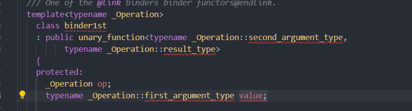

### `C++ STL` 中的绑定器

```C++
bind1st : operator()的第一个形参变量绑定成一个确定的值
bind2nd : operator()的第二个形参变量绑定成一个确定的值
```

**适用于上述两个绑定器的可调用对象一定是二元的，具有一定的局限性**

> + 两个绑定器不能绑定`lambda`表达式,例如,这种形式：
>
>   ```C++
>   bind1st([](int a , int b ) -> bool {return a > b ; } , 70 ) 
>   ```
>
>   **因为在`lambda`中，我们没有定义一个名称为`first_argument_type`的类型别名，而`bind1st(bind2nd同理)`需要访问到：**
>
>   

`<functional> `包含了C++标准库中所有的函数对象, `<algorithm>`包含了标准库的所有的泛型算法。


####绑定器的底层实现原理

```C++
#include <vector>
#include <algorithm>
#include <functional>
#include <iostream>
#include <ctime>   
using namespace std ; 

template <typename Container>
void ShowContainer(Container &con )  
{
	typename Container::iterator iter = con.begin() ; // 这里需要程序员保证传入的是一个含有迭代器的容器。

	for( ; iter != con.end() ; ++iter )
	{
		cout << *iter << ' ' ; 
	}
	cout << endl ; 
}

template<typename Iterator , typename Compare>
Iterator my_find_if(Iterator first , Iterator last , Compare comp )
{
	for( ; first != last ; ++first )
	{
		if( comp(*first ) )  // 调用函数对象的 operator()
		{
			return first ; 
		}
	}
	return last ; 
}
template<typename Compare , typename T>
class _mybind1st{
public:
	_mybind1st( Compare comp ,  T val )
	:_comp(comp) , _val(val){}	

	bool operator()(const T& second )
	{
		return _comp(_val , second ) ; 
	} 
private:
	Compare _comp ; 
	T _val ; 
} ;

template<typename Compare , typename T>
class _mybind2nd{
public:
	_mybind2nd( Compare comp ,  T val )
	:_comp(comp) , _val(val){}	

	bool operator()(const T& first )
	{
		return _comp( first , _val) ; 
	} 
private:
	Compare _comp ; 
	T _val ; 
} ;


// 绑定器的实现
template<typename Compare , typename T >
_mybind1st<Compare , T>  mybind1st( Compare comp , const T& val )
{
	return _mybind1st<Compare , T>(comp , val) ;   // 实例化出一个模版类，并且创建其对象
}

template<typename Compare , typename T >
_mybind2nd<Compare , T>  mybind2nd( Compare comp , const T& val )
{
	return _mybind2nd<Compare , T>(comp , val) ;  
}

int main()
{
	vector<int> vec ; 
	srand(time(nullptr)) ; 
	for(int i = 0 ; i < 20 ; ++i)
	{
		vec.push_back(rand()%100 + 1 ) ; 
	}
	ShowContainer(vec) ; 


	sort(vec.begin() , vec.end() , greater<int>() ) ;  //默认从小到大进行排序 , 使用greater<int>()实现降序排序
	ShowContainer(vec) ; 
	// 把70按照顺序插入到容器中。
	auto iter = my_find_if(vec.begin() , vec.end() , mybind1st(greater<int>() , 70) ) ; 
	auto iter2 = my_find_if(vec.begin() , vec.end() , mybind2nd(less<int>() , 70 ) ) ;
   
	if(iter == iter2 && iter2 == iter && iter != vec.end() ) 
	{
		cout << *iter << endl ; 
	}
	vec.insert( iter , 70 ) ; 
	ShowContainer(vec) ; 

	return 0 ; 
}
```

**总结：`bind1st和bind2nd`的原理可以这样理解，两者都是模版函数，返回类型是一个根据传入`bind1st`和`bind2nd`的函数对象类型和参数类型实例化出来的类的一个对象，也就是说：返回的是一个实例化后的类模板的对象，在实例化的类中，存在`operator()`重载函数，其内部原理实际上就是调用填充参数后的函数对象。**


