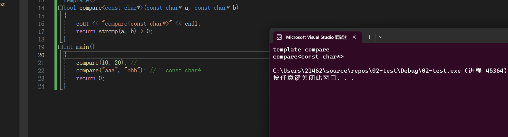
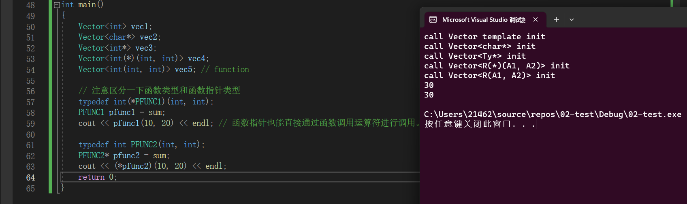
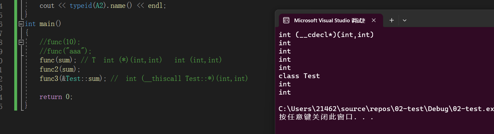

### 模版的部分特例化和完全特例化

#### 完全特例化

```C++
template<typename T>
bool compare(T a, T b)
{
	cout << "template compare" << endl;
	return a > b;
}

// 完全特例化
template<>
bool compare<const char*>(const char*a, const char*b) 
{
	cout << "compare<const char*>" << endl;
	return strcmp(a, b) > 0;
}
int main()
{
	compare(10, 20); // 
	compare("aaa", "bbb"); // T const char*
	return 0;
}
```



#### 部分特例化

```C++
template<typename T>
class Vector 
{
public:
	Vector() { cout << "call Vector template init" << endl; }
};
// 下面这个是对char*类型提供的完全特例化版本  #1
template<>
class Vector<char*>
{
public:
	Vector() { cout << "call Vector<char*> init" << endl; }
};

// 下面这个是对指针类型提供的部分特例化版本  #2
template<typename Ty>
class Vector<Ty*>
{
public:
	Vector() { cout << "call Vector<Ty*> init" << endl; }
};


// 指针函数指针（有返回值，有两个形参变量）提供的部分特例化
template<typename R, typename A1, typename A2>
class Vector<R(*)(A1, A2)>
{
public:
	Vector() { cout << "call Vector<R(*)(A1, A2)> init" << endl; }
};


// 针对函数（有一个返回值，有两个形参变量）类型提供的部分特例化
template<typename R, typename A1, typename A2>
class Vector<R(A1, A2)>
{
public:
	Vector() { cout << "call Vector<R(A1, A2)> init" << endl; }
};

// 如果存在同类型的函数模版，优先使用现成的函数。	
int sum(int a, int b) { return a + b; }

int main()
{
	Vector<int> vec1;
	Vector<char*> vec2;
	Vector<int*> vec3;
	Vector<int(*)(int, int)> vec4;
	Vector<int(int, int)> vec5; // function

	// 注意区分一下函数类型和函数指针类型
	typedef int(*PFUNC1)(int, int);
	PFUNC1 pfunc1 = sum;
	cout << pfunc1(10, 20) << endl ; // 函数指针也能直接通过函数调用运算符进行调用。

	typedef int PFUNC2(int, int);
	PFUNC2 *pfunc2 = sum;
	cout << (*pfunc2)(10, 20) << endl;
	return 0;
}
```



####针对成员函数的部分特例化，模版实参推演

```C++
#include <iostream>
#include <typeinfo>
using namespace std;

/*
模板的完全特例化和非完全（部分）特例化
模板的实参推演 => 基本概念很简单
*/
int sum(int a, int b) { return a + b; }
// T包含了所有的大的类型  返回值，所有形参的类型都取出来
template<typename T>  
void func(T a)
{
	cout << typeid(T).name() << endl;
}
template<typename R, typename A1, typename A2>
void func2(R (*a)(A1, A2))
{
	cout << typeid(R).name() << endl;
	cout << typeid(A1).name() << endl;
	cout << typeid(A2).name() << endl;
}
class Test
{
public:
	int sum(int a, int b) { return a + b; }
};
template<typename R, typename T, typename A1, typename A2>
void func3(R(T::*a)(A1, A2))
{
	cout << typeid(R).name() << endl;
	cout << typeid(T).name() << endl ; // 可以根据这个方式推断出类的类型  
	cout << typeid(A1).name() << endl;
	cout << typeid(A2).name() << endl;
}
int main()
{
	//func(10);
	//func("aaa");
	func(sum); // T  int (*)(int,int)   int (int,int)
	func2(sum); 
	func3(&Test::sum); //  int (__thiscall Test::*)(int,int)

	return 0;
}
```

