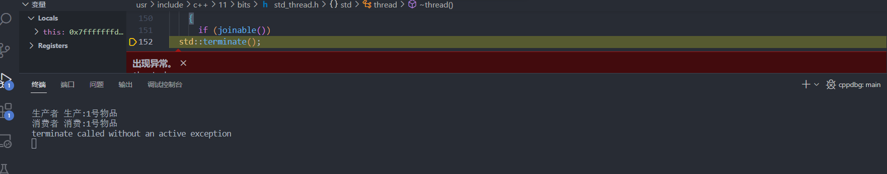
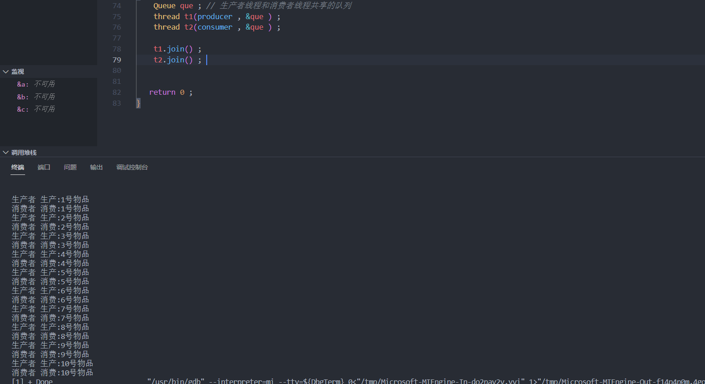

==写在前面==: `C++STL`中的所用容器都不是线程安全的，不能直接使用在多线程的环境中。

### 线程间的同步通信机制

**线程间的同步通信**

如果线程之间不存在同步机制，线程的执行顺序完全受到操作系统的调用，无法确定线程间的运行顺序。

**生产者消费者模型**

`version1`:

```C++
#include <iostream>
#include <mutex>
#include <thread>
#include <queue>
using namespace std ; 

mutex mtx ; 
class Queue{
public:
	void put(int val ) // 生产物品
	{
		lock_guard<mutex> lock(mtx) ;  
		que.push(val) ; 
		cout << "生产者 生产:" << val << "号物品" << endl ;  
	}
	int get() // 消费物品
	{
		lock_guard<mutex> lock(mtx) ; 
		int val = que.front() ;
		que.pop() ;
		cout << "消费者 消费:" << val << "号物品" << endl ; 
		return val ;
	}

private:
	queue<int> que ; 

} ;

void producer(Queue *que ) // 生产者线程
{
	for(int i = 1 ; i <= 10 ; i ++ ) // 生产10个物品，编号依次为1~10。
	{
		que->put(i) ; 
		std::this_thread::sleep_for(std::chrono::milliseconds(100) ) ; 

	}
}

void consumer(Queue *que ) // 消费者线程
{
	for(int i = 1 ; i <= 10 ; i ++ ) // 消费10个物品
	{
		que->get() ; 
		std::this_thread::sleep_for(std::chrono::milliseconds(100) ) ; 

	}
}

int main()
{
	Queue que ; // 生产者线程和消费者线程共享的队列
	thread t1(producer , &que ) ; 
	thread t2(consumer , &que ) ; 


   return 0 ; 
}
```



> 存在的问题：如果生产者并没有生产物品，但消费者此时获得锁资源，执行`que.front()`会出错，这时就需要线程之间的相互通信了。

`version2` ：实现生产者生产一个物品，通知消费者消费一个物品，消费完了，消费者再通知生产者继续生产。

```C++
#include <iostream>
#include <mutex>
#include <thread>
#include <queue>
#include <condition_variable>  // 条件变量位于的头文件
using namespace std ; 

mutex mtx ; // 做线程间的互斥操作
condition_variable cv ; // 做线程间的同步通信
class Queue{
public:
	void put(int val ) // 生产物品
	{
		unique_lock<mutex> lck(mtx) ;  // 在构造的时候会隐式的执行mtx.lock()上锁,在析构的时候会自动释放锁资源
		while(!que.empty() ) 
		{
			// que不为空，生产者应该通知消费者去消费，消费完毕后，再继续生产 ， 生产者线程应该进入阻塞状态，并且把mtx释放掉。
			
			// #1 当前线程进入等待状态，并且把lck管理的 mtx锁给释放掉。
			cv.wait(lck) ; 
		}  
		que.push(val) ; 
		// 生产完毕之后，通知其余所有线程进行消费
		/*
			notify_one(): 通知另外的一个线程
			notify_all(): 通知其他的所有的线程
			其他线程得到该通知，就会从等待状态  ==> 阻塞状态, 如果此时没有获取到互斥锁，则处于阻塞状态
			获取到互斥锁之后，继续执行。
		*/ 
		cv.notify_all() ; 
		cout << "生产者 生产:" << val << "号物品" << endl ;  
	}
	int get() // 消费物品
	{
		unique_lock<mutex> lck(mtx) ; 
		while(que.empty() ) 
		{
			//#当前线程进入等到状态，把互斥锁mtx释放。
			cv.wait(lck) ; 
		}
		int val = que.front() ;
		que.pop() ;

		cv.notify_all() ; // 通知生产者线程，生产者从等待状态到阻塞状态。
		
		cout << "消费者 消费:" << val << "号物品" << endl ; 
		return val ;
	}

private:
	queue<int> que ; 

} ;

void producer(Queue *que ) // 生产者线程
{
	for(int i = 1 ; i <= 10 ; i ++ ) // 生产10个物品，编号依次为1~10。
	{
		que->put(i) ; 
		std::this_thread::sleep_for(std::chrono::milliseconds(100) ) ; 

	}
}

void consumer(Queue *que ) // 消费者线程
{
	for(int i = 1 ; i <= 10 ; i ++ ) // 消费10个物品
	{
		que->get() ; 
		std::this_thread::sleep_for(std::chrono::milliseconds(100) ) ; 

	}
}

int main()
{
	Queue que ; // 生产者线程和消费者线程共享的队列
	thread t1(producer , &que ) ; 
	thread t2(consumer , &que ) ; 


   return 0 ; 
}
```




