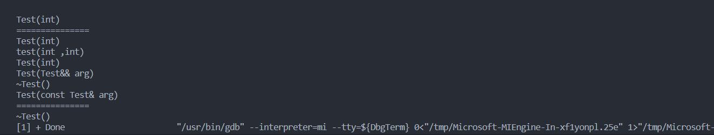

### `emplace_back()` 或者`emplace()` 原理剖析

`emplace()方法簇`是从`C++11`标准引入的，其和`push()方法簇`最大的不同在于：**其可以接受容器所存储对象的构造函数的参数类型的参数，从而直接在容器内部构建对象，不用产生临时对象。**


==以下以`vector`容器的`emplace_back()`为例，阐述`emplace()方法簇`的原理，因为无论是`emplace_back()`或者`emplace()`，其内部的原理是一样的。==


**如果传入的是对象，无论是右值对象，还是左值对象，`emplace_back()`和`push_back()`所调用的函数是一样的。**

```C++
#include <iostream>
#include <vector>

using namespace std ;
class Test
{
public :
   Test(int a ){ cout << "Test(int)" << endl ; }
   Test(int a , int b ) {cout << "test(int ,int)" << endl ; }
   Test(const Test& arg) {cout << "Test(const Test& arg)" << endl ; }
   Test(Test&& arg ) {cout << "Test(Test&& arg)" << endl ; }
   ~Test() {cout << "~Test()" << endl ; }
} ;
int main()
{
   Test t1(10) ;
   vector<Test> v ;
   
   v.reserve(100) ;
   
   cout << "===============" << endl ; 
   v.push_back(t1) ;   // C++11后，如果容器存在push_back 则容器也存在 emplace_back 
   v.emplace_back(t1) ;  // 如果存在insert() 也存在 emplace() 	
   cout << "===============" << endl ; 
   v.push_back(Test(10) ) ;
   v.emplace_back(Test(10)) ; 
   cout << "===============" << endl ; 
   
   return 0 ;
}
```


**emplace_back()可以接受容器内对象的构造所需要的参数作为参数**

```C++
#include <iostream>
#include <vector>

using namespace std ;
class Test
{
public :
   Test(int a ){ cout << "Test(int)" << endl ; }
   Test(int a , int b ) {cout << "test(int ,int)" << endl ; }
   Test(const Test& arg) {cout << "Test(const Test& arg)" << endl ; }
   Test(Test&& arg ) {cout << "Test(Test&& arg)" << endl ; }
   ~Test() {cout << "~Test()" << endl ; }
} ;
int main()
{
   Test t1(10) ;
   vector<Test> v ;
   
   v.reserve(100) ; 
   cout << "===============" << endl ; 
	
   // 如果传入的是构造函数的参数，这里不会产生临时对象
   v.emplace_back(10 ) ;   // Test(int a)
	v.emplace_back(10 , 20 ) ; // Test(int a , int b )
	
   
   
   v.emplace_back(Test(100)) ; // Test(Test&& arg )
   v.emplace_back(t1) ;  // Test(const Test& arg ) 

   // emplace 在map中的使用
   /*
   	map<int,string> m ; 
   	m.insert(make_pair(10 , "hanshenao")) ;
   	上一行代码等价于：
   	m.emplace(10 , "hanshenao") ; // 比 m.insert(make_pair(10 , "hanshenao")) ;更有效率，因为其在map底层相应位置直接调用构造函数，没有临时对象的产生
   */
   
   
   
   cout << "===============" << endl ; 
   
   
   return 0 ;
}
```


#### 手动实现`emplace_back()`的底层原理

```C++
#include <iostream>

using namespace std ;

template <typename _Ty> 
class Allocator
{
public:
	_Ty* allocate(int size )
	{
		return (_Ty*)malloc(size * sizeof(_Ty) )  ; 
	}

   // 注意这种模版参数包的语法
	template<typename ...Types> 
	void construct( _Ty* ptr , Types&&...args )
	{
		new (ptr)_Ty(std::forward<Types>(args)...) ; 
	}


}; 


template<typename T  , typename allocator = Allocator<T> >  
class  vector
{
public:
	void reserve(int size )
	{
		first = alloc.allocate(size ) ; 
		cur = first ; 
		last = first + 100 ; 
	}
	template<typename Ty>
	void push_back(Ty&& arg )
	{
		alloc.construct(cur , std::forward<Ty>(arg) ) ; 	
		cur ++ ; 
	}

	template<typename ...Types>
	void emplace_back(Types&&... args ) // 通过引用折叠，保持原来的类型
	{
		alloc.construct(cur , std::forward<Types>(args)...) ; 
		cur ++ ; 
	}
private:
	allocator alloc ; 
	T* cur ; 
	T* first ;  
	T* last ; 
	T* capitiay ;  
} ; 

class Test
{
public :
   Test(int a ){ cout << "Test(int)" << endl ; }
   Test(int a , int b ) {cout << "test(int ,int)" << endl ; }
   Test(const Test& arg) {cout << "Test(const Test& arg)" << endl ; }
   Test(Test&& arg ) {cout << "Test(Test&& arg)" << endl ; }
   ~Test() {cout << "~Test()" << endl ; }
} ;
int main()
{
   Test t1(10) ;
   vector<Test> v ;
   
   v.reserve(100) ; 
   cout << "===============" << endl ; 
	v.emplace_back(10 ) ; 
	v.emplace_back(10 , 20 ) ; 
	v.emplace_back(Test(100)) ; 
   v.emplace_back(t1) ; 
   cout << "===============" << endl ; 
   
   return 0 ;
}
```



> 实际上`emplace_back()`的实现原理就是根据模版可变参和完美转发和引用折叠来实现的，从而保证调用的定位`new`的参数为传入的实际参数，根据参数个数和类型，编译器决定调用相应的构造函数进行对象的构造。