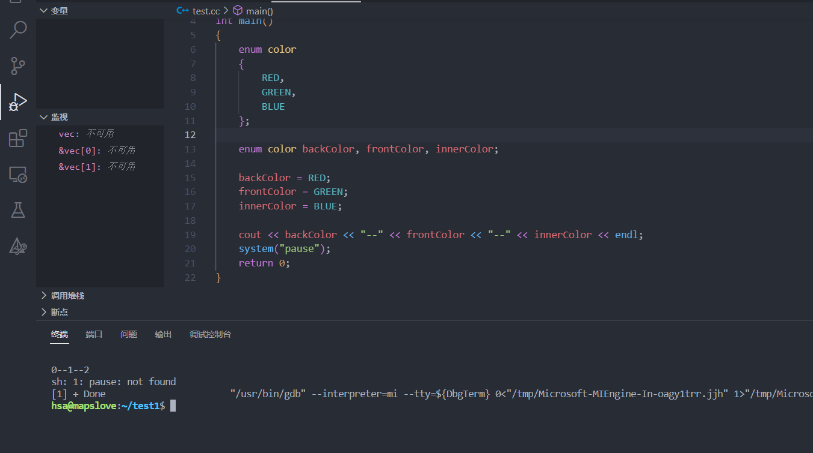
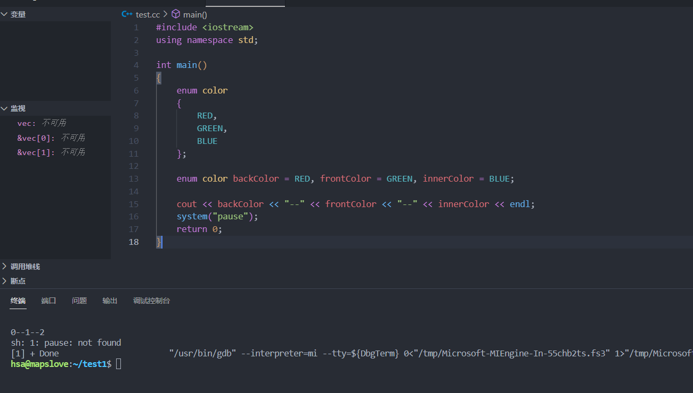

## 一.什么是枚举enum(WHAT)

枚举([enumeration](https://so.csdn.net/so/search?q=enumeration&spm=1001.2101.3001.7020))和类相似，能够定义一种新的数据类型，不同的是，枚举是将一组==整型常量==组织在一起，所以和类的使用方法有一些类似之处。

### 相关操作

枚举变量的值只能取枚举常量表中所列的值，就是整型数的一个子集。

枚举变量占用内存的大小与整型数相同。

枚举变量只能参与赋值和关系运算以及输出操作，参与运算时用其本身的整数值。

## 二.使用枚举enum的场景(WHEN and WHERE)

实际中经常使用枚举来做**数据的标识**，可以实现对**数据的分类**，打个比方类似于用`Ture`和`False`区分是与非，而枚举也可以在此基础上也用`整型常量`的方式对数据进行更多的分类。


## 三.如何使用枚举enum(HOW)

### 1）枚举的定义

**1.不限定作用域的枚举**

```c++
enum color
{
   RED,
   GREEN,
   BLUE
};
```

#### 2.限定作用域的枚举

在enum后面加关键字`class`或者`struct`

```c++
enum class color
{
   RED,
   GREEN,
   BLUE
};
```

**3.二者区别** 

解决[枚举值](https://so.csdn.net/so/search?q=枚举值&spm=1001.2101.3001.7020)重名的问题，保持代码的可读性

```c++
//定义两种枚举
enum class color_inner
{
   RED,
   GREEN,
   BLUE
};

enum color_out
{
   RED,
   GREEN,
   BLUE
};

//声明并赋值
color_out backColor = RED; //正确
color_inner forntColor = RED; //错误，默认使用了out中的RED，没有指定作用域

color_out backColor = color_out::RED; //正确，out也可以显示指定作用域
color_inner forntColor = color_inner::RED;  //正确，inner必须指定作用域
```


### 2）枚举的初始化

**1.默认情况下，枚举值从0开始，依次加1**

```cpp
enum color
{
   RED,  //默认是0
   GREEN, //默认是1
   BLUE  //默认是2
};
```

#### 2.手动指定枚举值

**a.可以全部指定**

```c++
enum color
{
   RED=1,  
   GREEN=5, 
   BLUE=7  
};
```

**b.可以部分指定，未被初始化的枚举值的值默认将比其前面的枚举值大1**

```c++
enum color
{
   RED=2,  
   GREEN,  //默认值是3，比前一个多1
   BLUE=7  
};
```

**c.可以重复指定**

```c++
enum color
{
   RED=8,  
   GREEN=5, 
   BLUE=8  //重复指定
};
```

### 3）指定[枚举类型](https://so.csdn.net/so/search?q=枚举类型&spm=1001.2101.3001.7020)

C++11中，还可以指定给枚举类型赋值的整数类型，在`enum`的名字后面加上冒号以及指定的类型，==限定作用域枚举==默认为32位整形，在某些情况下，甚至没必要用到32位，为了节省开销，甚至可以用8位整形`unsigned char`，将类型指定成后，枚举变量变成了8位整型，减少了内存使用。==不限定作用域的枚举类型==，其成员不存在默认类型，只需要知道潜在类型是足够大的，肯定能容纳枚举值就行。

需要注意的是，不能指定为`float`或者`double`等类型，因为枚举量必须是一个整数，`float`和`double`都不是整数。

```c++
enum color:unsigned long
{
   RED=1,  
   GREEN=5, 
   BLUE=7  
};
```

### 4)声明枚举对象

**a.先声明变量，再对变量赋值**

````c++
#include <iostream>
using namespace std;
 
int main()
{
	enum color
	{
		RED,
		GREEN,
		BLUE
	};
 
	enum color backColor, frontColor, innerColor;
 
	backColor = RED;
	frontColor = GREEN;
	innerColor = BLUE;
 
	cout << backColor << "--" << frontColor << "--" << innerColor << endl;
	system("pause");
	return 0;
}
````



**b.声明变量的同时赋初值**

```c++
#include <iostream>
using namespace std;
 
int main()
{
	enum color
	{
		RED,
		GREEN,
		BLUE
	};
 
	enum color backColor = RED, frontColor = GREEN, innerColor = BLUE;
 
	cout << backColor << "--" << frontColor << "--" << innerColor << endl;
	system("pause");
	return 0;
}
```



**c.定义类型的同时声明变量，然后对变量赋值**

```c++
#include <iostream>
using namespace std;
 
int main()
{
	enum color
	{
		RED,
		GREEN,
		BLUE
	}backColor, frontColor, innerColor;
 
	backColor = RED;
	frontColor = GREEN;
	innerColor = BLUE;
 
	cout << backColor << "--" << frontColor << "--" << innerColor << endl;
	system("pause");
	return 0;
}
```

**d.类型定义，变量声明，赋初值同时进行**

```c++
#include <iostream>
using namespace std;
 
int main()
{
	enum color
	{
		RED,
		GREEN,
		BLUE
	}backColor = RED, frontColor = GREEN, innerColor = BLUE;
 
	cout << backColor << "--" << frontColor << "--" << innerColor << endl;
	system("pause");
	return 0;
}
```

### 5)枚举对象赋值问题

**a.不能将非枚举量赋给枚举变量，能将枚举量赋给非枚举变量，因为枚举量是符号常量，编译器会自动把枚举量转换为int类型**

```c++
int a;
a=RED;
```

b.**枚举变量不能进行算术运算，对于枚举，只定义了赋值运算符，没有为枚举定义算术运算，错误的算数计算会导致范围超限问题**

```c++
RED++;  //错误
RED=GREEN+BLUE;  //错误
```

**c.赋值超限问题**

```c++
backColor = color(2); //等同于backColor = BLUE;
backColor = color(10);  //错误，超过color元素上限
```

### 6）枚举的取值范围

**上限：**需要知道枚举量的最大值。找到大于这个最大值的、最小的2的幂，将它减去1，得到的便是取值范围的上限

```c++
enum color:unsigned long
{
   RED=1,  
   GREEN=5, 
   BLUE=7  //上限是8-1=7
};

backColor = color(7); //所以可以取到7
```

**下限：**枚举量的最小值不小于0，则枚举下限取0；枚举量的最小值小于0，则枚举下限是 ==小于最小枚举量的 最大的2的幂==，加上1。

```c++
enum color:unsigned long
{
   RED=-1,  
   GREEN=-5, 
   BLUE=-7  //下限是-8+1=-7
};

backColor = color(-7); //所以可以取到-7
```

## 四.枚举enum的应用

**1.常和Switch搭配使用**

```c++
enum color{RED, GREEN, BLUE}backColor=RED;

switch (backColor)

{

case RED:{...;break;}

case GREEN:{...;break;}

case BLUE:{...;break;}

default:break;

}
```

**2.if...else搭配使用**

````c++
enum color{RED, GREEN, BLUE};
 
color backColor=RED;
 
void SetColor(color color)
{
    backColor = color ;
}
 
if(backColor==RED)
{
    cout<<"color is RED"<<endl;
}
else if(backColor==GREEN)
{
    cout<<"color is GREEN"<<endl;
}
else if(backColor==BLUE)
{
    cout<<"color is BLUE"<<endl;
}
else
{
    cout<<"color is OTHER"<<endl;
}
````

