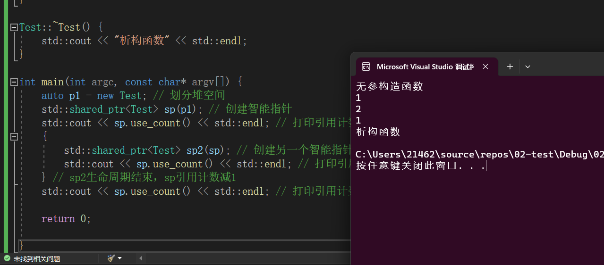
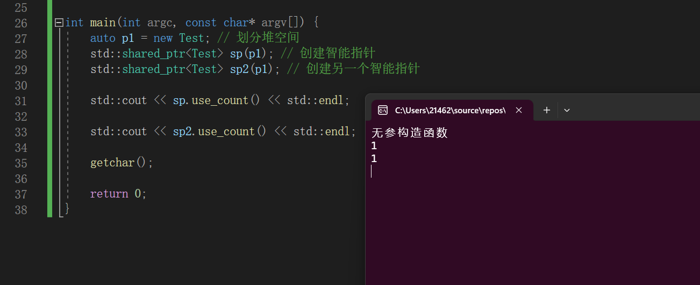
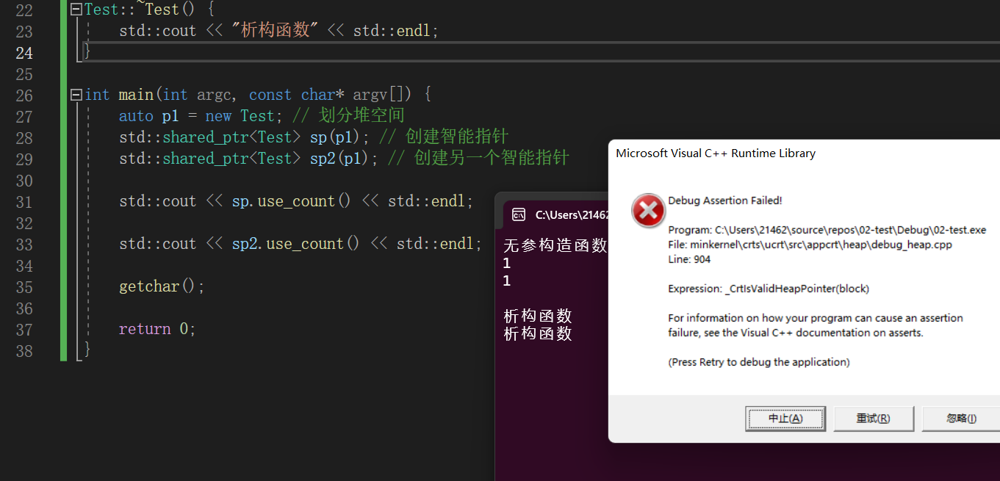
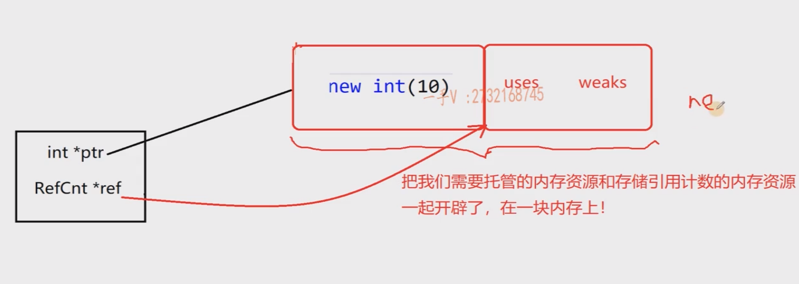
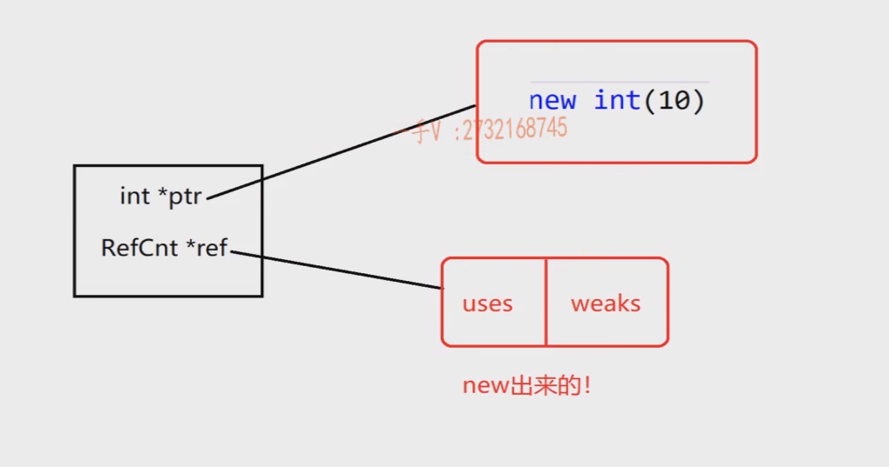

 

C++内存分四大块

1.  全局 主函数运行前使用，初始化
  
2.  静态 变量第一次使用前，初始化  
    以上两块内存都会在程序结束后自动释放
    
3.  堆区 由程序员管理，C++管理方法有new delete等关键字
  
4.  栈区 由编译器管理，存放程序的局部变量和参数
  

因此我们需要关注堆区的内存管理。内存管理经常会碰到忘记释放造成的内存泄露。 
在C++中引入了[智能指针](https://so.csdn.net/so/search?q=%E6%99%BA%E8%83%BD%E6%8C%87%E9%92%88&spm=1001.2101.3001.7020)，有`shared_ptr`，`unique_ptr`和`weak_ptr`。

### `shared_ptr`

工作中`shared_ptr`用得比较多，今天做个总结 
使用智能指针，需要引入头文件，`shared_ptr`顾名思义是多个指针指向一块内存。 
被管理对象有一个引用计数，这个计数记录在每个指针上，几个`shared_ptr`指向它，这个数字就是几，当没有任何`shared_ptr`指向它时，引用计数为0，这时，自动释放对象。 
**其功能在于当所有指针都释放（或是不再指向对象）的时候，自动释放对象**

即，当一个所有指向这块内存的指针生命周期结束时，这块内存会被释放 
智能指针的唯一作用，就是自动`delete`对象，即C++11的新特性，内存管理机制。 
智能指针既然会自动`delete`对象，我们就不能再去手动`delete`对象了，否则，也会发生多次释放的问题

例：

```C++
#include <iostream>
#include <memory>
 
class Test {
public:
    // 无参构造函数
    Test();
    // 有参数的构造函数
    explicit Test(int a);
    // 析构函数
    ~Test();
};
 
Test::Test() {
    std::cout << "无参构造函数" << std::endl;
}
 
Test::Test(int a) {
    std::cout << "有参构造函数，a=" << a << std::endl;
}
 
Test::~Test() {
    std::cout << "析构函数" << std::endl;
}
 
int main(int argc, const char * argv[]) {
    auto p1 = new Test; // 划分堆空间
    std::shared_ptr<Test> sp(p1); // 创建智能指针
    std::cout << sp.use_count() << std::endl; // 打印引用计数
    {
        std::shared_ptr<Test> sp2(sp); // 创建另一个智能指针
        std::cout << sp.use_count() << std::endl; // 打印引用计数
    } // sp2生命周期结束，sp引用计数减1
    std::cout << sp.use_count() << std::endl; // 打印引用计数
    
    return 0;
    
} 
```


​      


### [make\_shared](https://so.csdn.net/so/search?q=make_shared&spm=1001.2101.3001.7020)的引入

一个坑


```c++
#include <iostream>
#include <memory>
 
class Test {
public:
    // 无参构造函数
    Test();
    // 有参数的构造函数
    explicit Test(int a);
    // 析构函数
    ~Test();
};
 
Test::Test() {
    std::cout << "无参构造函数" << std::endl;
}
 
Test::Test(int a) {
    std::cout << "有参构造函数，a=" << a << std::endl;
}
 
Test::~Test() {
    std::cout << "析构函数" << std::endl;
}

int main(int argc, const char * argv[]) {
   auto p1 = new Test; // 划分堆空间
   std::shared_ptr<Test> sp(p1); // 创建智能指针
   std::shared_ptr<Test> sp2(p1); // 创建另一个智能指针
	
   std::cout << sp.count() << std::endl ; 
   
   std::cout << sp2.count() << std::endl ; 
   
   getchar() ; 
   
   return 0;
}
```


这段程序会抛出异常 `double free detected`

`new`关键字返回的是对应的指针类型。

此处用了两个智能指针管理同一块内存，==因为`sp` 和`sp2`不知道彼此的存在，所以也会重复释放==。

(通过打印`sp` 和`sp2` 的引用计数的个数，可以看到问题之所在)



(当输入回车符后，程序继续执行，此时会出现异常，因为重复释放了资源)



同一个对象只能用同一套内存管理体系，如果它已经有智能指针了，那么再创建智能指针时，需要通过原来已有的指针创建，而不能重复用原始空间来创建。

[STL库](https://so.csdn.net/so/search?q=STL%E5%BA%93&spm=1001.2101.3001.7020)提供了`make_shared`函数，其原型为

```c++
template <typename T, typename ...Args>
std::shared_ptr<T> std::make_shared(Args && ...args)
```


官方鼓励用`make_shared`函数来创建对象，而不要手动去`new`，这样就可以防止我们去使用原始指针创建多个引用计数体系。

例

```c++
int main(int argc, const char * argv[]) {
    auto sp = std::make_shared<int>(); // 分配堆空间，创建智能指针
    auto sp2 = sp; // 创建另一个智能指针
    
    return 0;
}
```


`make_shared` 构造和调用`shared_ptr` 构造的不同之处

> + `make_shared` 构造的时候，引用计数的内存和资源的内存是==构造在同一块内存==上的：
>
> 
>
> + 相较于`shared_ptr` 的优点：
>   + 内存分配效率较高，只需要进行一次`new` 
>   + 防止了资源的泄漏
> + 相较于`shared_ptr`缺点：
>   + `make_shared` 无法自定义删除器
>   + 导致托管的资源延迟释放: 即使当`uses`为0的时候，这块托管的内存资源也不能释放，必须等到`weaks` 也为0的时候，才能对这一整块内存进行释放。

> `shared_ptr` 的构造：
>
> 
>
> ==引用计数==的内存和==托管的资源==的内存是分开存放的，当`uses` 引用计数的个数为0的时候，对==托管的资源==进行释放
>
> + 存在的问题:  在构造的时候，如果`new int(10)` 成功了，但`new uses`的时候失败了 ，这样`shared_ptr` 对象就生成失败了，`shared_ptr `就不会调用析构函数了，从而`new int(10)` 这一块内存也就无法释放了，造成了==内存泄漏==