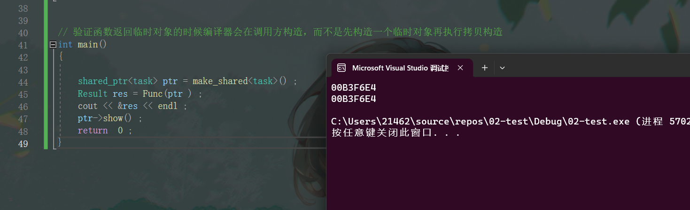

###验证函数返回临时对象的时候编译器会在调用方构造，而不是先构造一个临时对象再执行拷贝构造

```C++
#include <iostream>
#include <memory>
#include <iostream>
using namespace std ; 

class Result ;  
class task {
public: 
	void setVal(Result* ptr_) {
		ptr = ptr_; 
	}
	void show() // 打印出当前task 对象内部存储的Result* 的值
	{
		cout << ptr << endl ; 
	}
private : 
	Result* ptr ;  
};

class Result
{
public:
	Result(shared_ptr<task> tas)
	{
		ptr_ = tas ;  
		tas->setVal(this) ;  
	}

	
private:
	shared_ptr<task> ptr_ ;  
}; 

Result Func(shared_ptr<task> tas )
{
	return Result(tas) ;  
}


// 验证函数返回临时对象的时候编译器会在调用方构造，而不是先构造一个临时对象再执行拷贝构造
int main()
{

	shared_ptr<task> ptr = make_shared<task>() ; 
	Result res = Func(ptr ) ; 
	cout << &res << endl ; 
	ptr->show() ; 
	return  0 ;  
}
```

# **验证成功:**

 

 