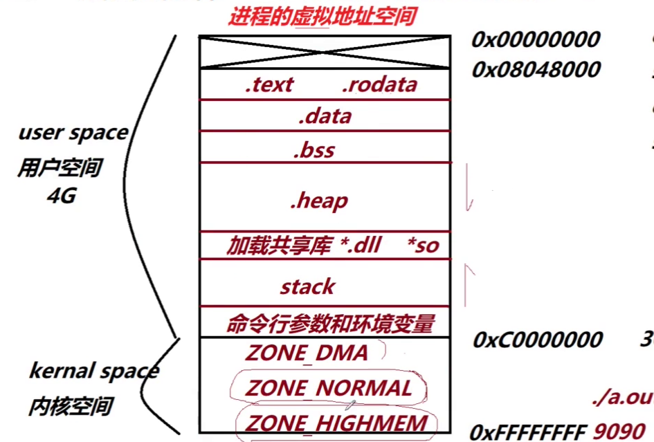
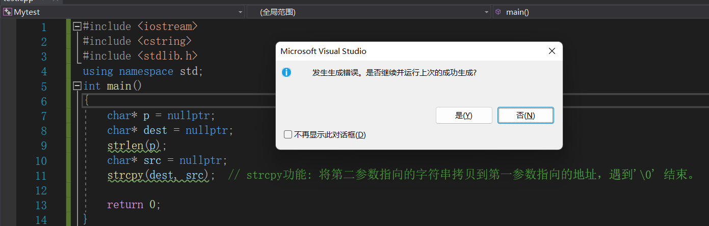
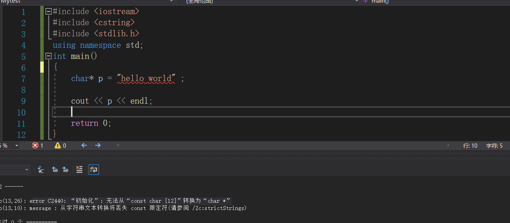
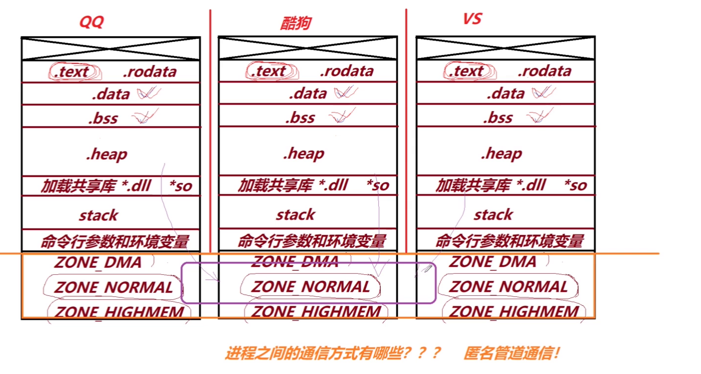

### 进程虚拟地址空间划分


#### 环境条件

> `x86`体系 ， 32位`linux`环境下的C/C++编程 ， 在此环境下`os`会给每一个进程分配$2^{32}$ 也就是`4GB`大小的一块虚拟空间 . 
>
> 给进程分配的虚拟地址空间的大小取决于环境，不同的环境会分配不同大小的虚拟地址空间。


####主要介绍这个**进程的虚拟地址空间**

+ **物理** ， **透明** ， **虚拟** ， **被删除了**    【来自`IBM`的某一期的黑板报】

  + 物理：它存在，你能看见。
  + 透明：它存在，你看不见。
  + 虚拟：它不存在，你却看的见。
  + 被删除了：你看不见，它也不存在。

+ **`4GB`虚拟地址空间的内部划分** 

  + 主要分为两部分：**用户空间[前`3GB`]** ， **kernel 空间[后`1GB`]** 
  + 图示：

  

  + **`0x00000000` ~`0x08048000` ** : 这一段地址空间是不可访问的 ，如果非法访问，程序会报错。例如下面的测试代码：

    ```C++
    #include <iostream>
    #include <cstring>
    #include <stdlib.h> 
    using namespace std ; 
    int main()
    {
    	char *p = nullptr ; 
    	char *dest = nullptr ; 
    	strlen(p) ; 
    	char *src = nullptr ; 
    	strcpy(dest , src ) ;  // strcpy功能: 将第二参数指向的字符串拷贝到第一参数指向的地址，遇到'\0' 结束。
    }
    
    
    //报错原因: nullptr 的值与 0x00000000 相等，我们无法访问这个地址，虽然编译的时候不会出问题，但运行时程序会直接崩溃。
    
    
    需要注意的是，在一些比较新的编译器中 , 不允许普通指针指向常量字符串的
    
    
    
    
    ```

  + 

  >Tips: 在一些编译器中不允许普通指针指向常量字符串[需要加上`const`修饰]：
  >
  >

  + `0x08048000~0xC0000000` 的内容:

    + **`.text`段 和 `.rodata`段** ： 这两段中的内容**不允许修改** ，只能读，不能写。 `.text段` 这段存储的是你编写的代码中的指令。什么是指令？一份代码是由数据和指令组成的，除了数据之外都叫做指令 ， `.rodata段`（read only data） 存放常量字符串，例如上图中的`hello world`   。 【注：**操作系统分配内存都是以页为单位的，`.text`和`.rodata`段的分配的内存页的属性都是`只可读的`** ， `.data`和`.bss`内存页都是可读可写的】

    + **`.data`段** ：这段存储的就是代码中的各种数据了，包括**全局变量**，**静态全局变量**，**静态局部变量**。但是需要注意的是，必须是**已经初始化且初始化不为0**的数据才存储在该段中。

    + **`.bss`段** ： ==存放在当前段的数据，都会被`os` 置为0。==存放**未初始化的**以及**初始化为0**的 **全局变量**， **静态全局变量** ， **静态局部变量** 。 

    + **`.heap`段** ： 程序刚开始运行的时候`.heap` 段并不存在，当执行到`new `或者` malloc` 这类动态分配内存的函数，才会分配堆空间。堆空间的生长方向是从**低地址到高地址** 。 

    + 预留空间1：存放加载的共享库`*.dll(windows)`  ， `*.so(linux) `   。 

    + **`stack`段** ： 函数运行时需要在栈上分配空间 ， 每个线程也存在其独有的栈空间。与其他段不同的栈段的增长方向是从**高地址向低地址增长** 。 

    + 预留空间2： 最后一部分用户空间用来存放**命令行参数**和**环境变量** 。例如：

      > 在命令行执行： `./a.out`   123456               // 后面的123456 就是传入的参数，存放在这部分 预留空间。
      >
      > 
      >
      > 命令行参数和环境变量简要介绍
      >
      > 我们在写main函数的时候一般都是这么写：
      >
      > ```C++
      > int main()
      > {
      >     return 0;
      > }
      >  
      > 或
      > int main(int argc,char **argv)
      > {
      >     return 0;
      > }
      > ```
      >
      > 其实它的原型长这样：
      >
      > `int main （int argc, char** argv, char**environ）`
      >
      > 前两个参数大家应当都很熟悉，`argc`（argument count）是**命令行参数的个数**，不指定时默认为1，是当前文件名，`argc` 至少为1，因为程序名称本身也被计算在参数数量中。`char** argv`（argument vector）也可以写成`char *argv[]`,==其中`argv[0]`默认保存的就是程序的名字==。如果在执行程序时后面跟随指令，则`argc`的值和`argv[]`中的元素就会发生变化。然而这第三个参数是什么意思呢？**在我们调用一些系统库函数的时候，我们需要使用预处理指令#include。但是我们系统怎么知道去哪个路径寻找这些头文件的函数定义呢？就是通过char\** environ（环境变量）来实现的**
      >
      > 话说回来，命令行参数就是我们的`argv`了。里面存放着我们的程序名，以及参数（如果你给了的话）。

  + `kernel空间[0xC0000000 ~ 0xFFFFFFFF]` (了解一下就好)：

    + `ZONE_DMA(16MB)`:  全名`ZONE_DirectMemoryAccess`(直接内存访问)，可以加快磁盘和内存之间数据的交换，不需要经过CPU的寄存器，这时CPU可以去干别的事，大大增加了效.
    + `ZONE_NORMAL (892MB)` :   内核中最重要最常用的部分。
    + `ZONE_HIGHMEM (128MB)` : 所说的高端内存，用于在**内核中**映射高于`1G`的物理内存时使用。64位系统则没有该段（根本不需要，因为64位操作系统给内核空间分配的内存达到`512G`）。

+ 辅助代码段：

```C++

// 全局变量
int gdata1 = 10 ;  .data段: 初始化不为0 
int gdata2 = 0 ;   .bss段: 初始化为 0
int gdata3 ;       .bss段: 未初始化


// 全局静态变量
static int gdata4 = 11; .data段: 初始化不为0
static int gdata5 = 0:  .bss段: 初始化为0
static int gdata6 ;     .bss段: 未初始化 
‘
/* 以上全局的变量都会在符号表中存在符号 */ 

int main()   // 这一行代码产生的也是指令，放在.text段
{
    // 局部变量 ， 函数内部的局部变量不会生成符号，其对应的是指令 。 
    int a = 12 ;   mov dword ptr[a] , 0Ch  
    int b = 0 ;    mov dword ptr[b] , 0h
    int c ;
    // 这三个局部变量的指令存放在.text段 。  
    
    
    // 静态局部变量
    static int e = 13;  .data段
    static int f = 0:   .bss段
    static int g;       .bss段
   
    return 0 ; 
}


/*
当函数运行的时候，系统会为其开辟一个栈帧，比如main函数运行的时候系统就会为其开辟一个栈帧。
*/
```


+ 进程之间的**虚拟地址空间**之间的联系
  + ==每个进程的`user`空间是私有的，每个进程的`kernel` 空间是共享的==。
  + 进程之间难以进行通信的原因：**用户空间之间是隔离的** 
  + **匿名管道通信** ： 一种进程通信的方式，**在内核空间划分出一段内存，不同的进程在这块内存进行数据的读取与写入从而实现进程之间的通信** 。 

