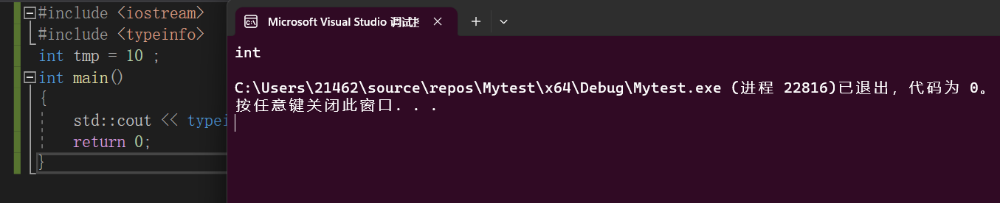
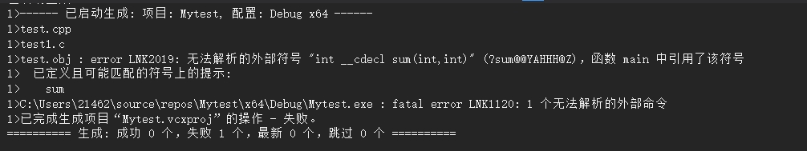
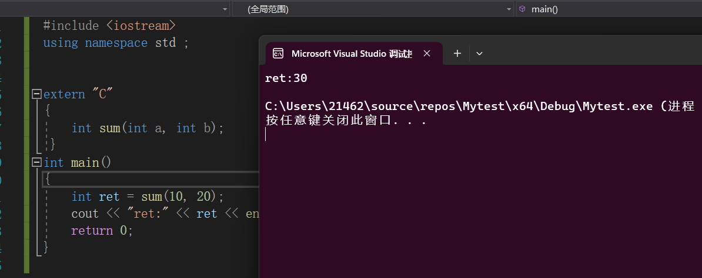
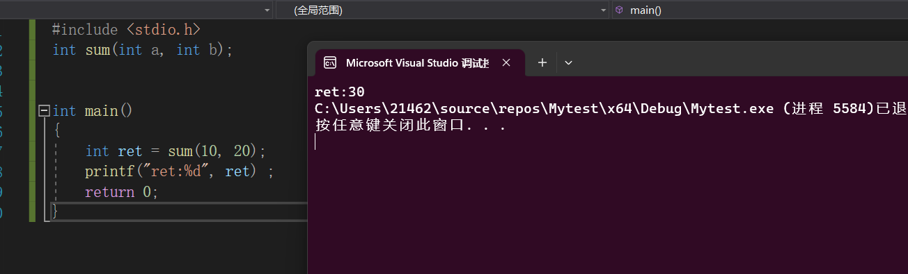
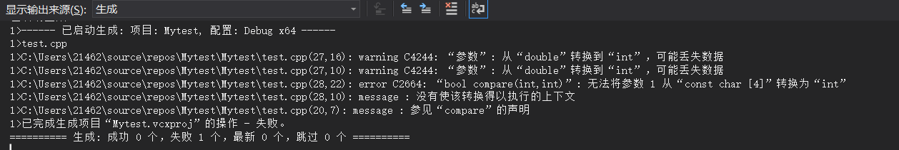
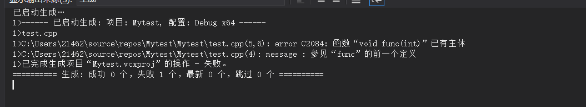

### 详解函数重载


#### 前置知识

+ `C++` 文件`#include <typeinfo> ` 之后，通过调用这个头文件里面的`API` 我们可以查看变量的类型。例如：

  >源文件内容：
  >
  >```C++
  >#include <iostream> 
  >#include <typeinfo> 
  >int tmp = 10 ;  
  >int main()
  >{
  >	std::cout << typeid(tmp).name() << std::endl ; 
  >	return 0;
  >}
  >```
  >
  >执行结果：
  >
  >
  >
  >可以看到我们通过调用`<typeinfo>` 头文件内部的`API` 可以实现对变量类型的输出。

+ `C++` 编译器内部定义了一系列的宏,常见的如下几个：

  ```
  1.__cplusplus：
  该宏用于指示编译器正在编译的源文件是否符合 C++ 标准。它的值代表 C++ 的版本，例如，C++03 标准的值为 199711L，C++11 标准的值为 201103L，C++14、C++17、C++20 标准分别为 201402L、201703L、202002L。
  
  2.__FILE__：  该宏展开为当前源文件的相对路径或文件名。
  
  3.__LINE__：  该宏展开为当前代码行的行号。
  
  4.__FUNCTION__ 或 __func__： 该宏展开为当前函数的名称。
  
  5.__DATE__：该宏展开为包含当前编译日期的字符串，格式为 "MMM DD YYYY"。
  
  6.__TIME__： 该宏展开为包含当前编译时间的字符串，格式为 "HH:MM:SS"。
  
  7.__STDC__： 该宏用于指示编译器是否符合 C 标准。
  
  8._WIN32：该宏在 Windows 系统上定义，可以用于条件编译。
  
  
  ```


+ C++和C语言代码之间如何互相调用 ? 

  > + `C++`代码调用`C`代码
  >
  >   ```C++
  >   /*test1.cpp 内容: */
  >   #include <iostream> 
  >   using namespace std ;  
  >   int sum(int a, int b) ; 
  >
  >   int main()
  >   {
  >   	int ret = sum(10, 20);
  >   	cout << "ret:" << ret << endl;
  >   	return 0;
  >   }
  >
  >   /*test2.c  内容：*/
  >   int sum(int a , int b )
  >   {
  >       return a + b ; 
  >   }
  >   ```
  >
  >   如果按照上面的代码，在同一个项目中创建`test1.cpp` 和`test2.c` 文件，进行编译和链接，之后运行会得到：
  >
  >   
  >
  > 
  >
  >   **原因：还是符号表生成函数名规则不同的问题。`.c`文件和`.cpp`都会作为一个独立的编译单元进行编译，在`.cpp` 文件中 ， 生成的`sum`函数的名称类似于`sum_int_int` 而在`.c` 文件中定义的`sum`函数生成的符号类似于`_sum` 。所以，在`.cpp` 文件中的对`sum`函数生成的符号的引用找不到其定义，所以会报错** 
  >
  > 
  >
  >   下一版本：
  >
  >   ```C++
  >   /*test1.cpp 内容: */
  >   #include <iostream> 
  >   using namespace std ;  
  > 
  >   extern "C"
  >   {
  >   	int sum(int a, int b) ; 
  >   }
  > 
  > 
  >   int main()
  >   {
  >   	int ret = sum(10, 20);
  >   	cout << "ret:" << ret << endl;
  >   	return 0;
  >   }
  > 
  >   /*test2.c  内容：*/
  >   int sum(int a , int b )
  >   {
  >       return a + b ; 
  >   }
  >   ```
  >
  >   这一版本相较于上一版本区别在于：将`sum` 函数的声明放到了`extern "C" ` 的作用域中：
  >
  >   > ==`extern "C"` 是**C++编译器所特有的，在其他的编译器无法起作用**==， 其表示**将自身作用域中的代码按照C语言的方式来生成符号** ，在上述`test1.cpp`中 生成的`sum` 函数的符号是**按照C语言的符号命令规则**
  >
  >   
  >
  > + `C`代码调用`C++` 代码
  >
  >   ```C++
  >   /*test1.cpp 内容: */  
  >     extern "C"
  >     {
  >         int sum(int a , int b )
  >         {
  >             return a + b ; 
  >         }
  >     }
  >   ```
  >
  > 
  >
  >     /*test2.c  内容：*/
  >
  >   #include <stdio.h>
  >
  >     int sum(int a, int b);
  >     
  >     int main()
  >     {
  >     	int ret = sum(10, 20);
  >     	printf("ret:%d", ret) ;  
  >     	return 0;
  >     }
  >   ```
  > 
  >  我们不能在`C`语言文件中使用  `extern "C" `, 因为 `extern "C" ` 只能被`C++` 编译器处理；我们需要：**在C++源码中使用`extern "C",将函数的定义按照C语言的符号生成规则来生成符号`** 。 
  > 
  >    
  > 
  >   这一个版本还能进行优化：
  > 
  >   ```C++
  >   /*test1.cpp 内容: */
  > 
  >   #ifdef __cplusplus
  >   extern "C" {
  >   #endif
  >   	int sum(int a, int b) // sum  .text
  >   	{
  >   		return a + b;
  >   	}
  >   #ifdef __cplusplus
  >   }
  >   #endif
  > 
  >   /*test2.c  内容：*/
  >   #include <stdio.h> 
  >   int sum(int a, int b);
  > 
  > 
  >   int main()
  >   {
  >   	int ret = sum(10, 20);
  >   	printf("ret:%d", ret) ;  
  >   	return 0;
  >   }
  >   ```
  >
  >   在`test1.cpp` 中，我们使用`__cplusplus` 这个宏实现了：**无论我们处于`C`编译器还是`C++` 编译器得到的可重定向文件，都能和其他的C文件进行链接** `test1.cpp` 中的代码这时候也可以放入`test2.c` 文件中了。

#### 函数重载

+ ==一组函数，其中函数名相同，处于同一个作用域 ， 参数列表的个数或者类型不同，那么这一组函数就称为-**函数重载**==

  > ```C++
  > 
  > /*在C++源文件中，每个函数生成的符号大概如下注释*/
  > 
  > #include <iostream> 
  > using namespace std ;   
  > bool compare(int a, int b) // compare_int_int
  > {
  > 	cout << "compare_int_int" << endl;
  > 	return a > b;
  > }
  > bool compare(double a, double b) // compare_double_double
  > {
  > 	cout << "compare_double_double" << endl;
  > 	return a > b;
  > }
  > bool compare(const char *a, const char *b) // compare_const char*_const char*
  > {
  > 	cout << "compare_char*_char*" << endl;
  > 	return strcmp(a, b) > 0;
  > }
  > int main()
  > {
  > 	bool compare(int a, int b); // 函数的声明   
  >     
  >     
  >     //下面的三个函数调用都是调用  compare_int_int , 当我们在调用函数的时候，当前作用域的同名函数会覆盖其他作用域的		//同名函数，当调用的时候会直接调用当前作用域的函数。即使参数类型不匹配。
  >     
  >     compare(10, 20); // call compare_int_int
  > 	compare(10.0, 20.0); // double -> int
  > 	compare("aaa", "bbb"); // const char* => int 这一步会报错。
  > 	return 0;
  > }
  > ```
  >
  > 

+ `const`或者`volatile` 的时候是怎样影响参数类型的。

  > + ==下面的这段代码会报错==，因为**函数进行了重复的定义** ， 我们可以通过`typeid()` 来查看`int` 和`const int ` 的区别：**在编译器眼中，函数的顶层 `const` 修饰符对重载解析不具备区别性 , 相当于形参类型都是`int`** 所以会导致重复定义，报错。
  >
  > ```C++
  >  
  > #include<typeinfo>
  > #include <iostream>
  > using namespace std ;  
  > void func(int a) {}  
  > void func(const int a ) {}  
  > int main()
  > {
  > 	int a = 10;
  > 	const int b = 10;
  > 
  > 	cout << typeid(a).name() << endl;
  > 	cout << typeid(b).name() << endl;
  > 
  > 	return 0;
  > }
  > ```
  >
  > 
  >
  > **关于`const`的更加详细的知识和`volatile`的知识在后面会介绍到** 。 

+ ==一组函数，函数名相同，参数列表也相同，仅仅是返回值不同?不叫重载。==

####需要思考的问题

+ C++为什么支持函数重载，C语言不支持函数重载？

  > C++代码产生函数符号的时候，产生符号的规则是：**符号由函数名+参数列表类型组成的** 
  > C代码产生函数符号的时候，产生符号的规则是: **符号只由函数名来决定** 
  >
  > 所以从符号表的角度来说：`C++` 支持函数重载，`C` 语言不支持函数重载。


+ ==解释一下什么是多态？==

  > 请你解释一下，什么是多态？ 
  > **静态（编译时期）的多态**：**函数重载** [在编译时期确定的我们需要调用哪一个函数，生成的.o文件中已经指定了要调用的函数的符号]   ，**模版**  。 
  >
  > **动态（运行时期）的多态**：