### 掌握`const` 和一二级指针的应用

+ `const` 修饰的量和普通变量之间的区别：
  + 编译方式不同
  + 不能作为左值

+ `const`修饰的量常出现的错误是

  + 常量不能再作为左值  《=  直接修改常量的值 。 

  + 不能把**常量的地址**泄露给一个**普通的指针**或者**普通的引用变量** 《= 可以间接修改常量的值 。 

    > 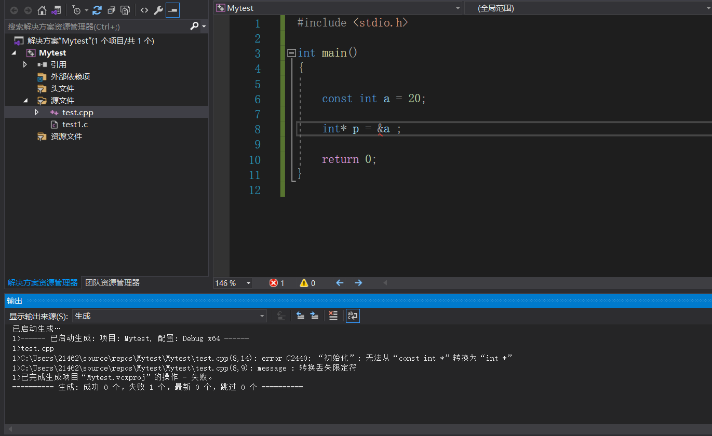
    >
    > ```
    > int *   <-   const int *       错误!
    > ```


**==`C++`语言规范：`const` 修饰的是离它最近的类型。==**

+ `const` 和一级指针的结合 , **==`const`如果右边没有指针*的话，`const`是不参与类型的==**

  > 在形式上有四种：
  >
  > + `const int *p `  ： `const` 修饰的是`int` , **`*p` 不能再被赋值**，但p可以再被赋值。【可以任意指向不同的`int`类型的内存，但不能通过指针间接的修改】 。 
  >
  >   >```C++
  >   >// 正确
  >   >int a = 0 ;
  >   >const int *p = &a ;    //   const int* <- int* 
  >   >```
  >   >
  >   >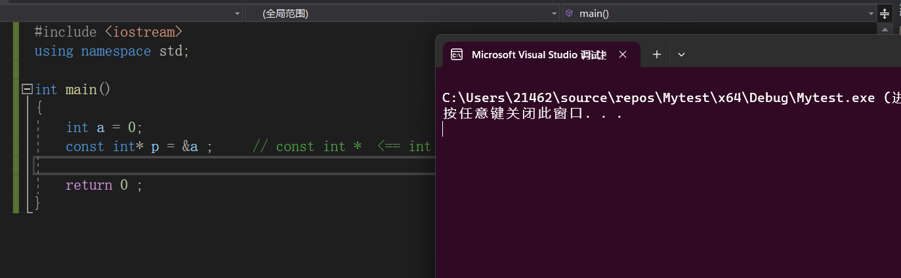
  >   >
  >   >```C++
  >   >// 正确
  >   >const int a = 0 ; 
  >   >const int *p = &a ;  // const int *  <== const int *
  >   >```
  >   >
  >   >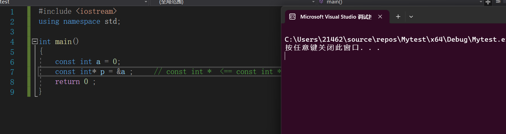
  >   >
  >   >==**注意，这种形式下，我们不能将*p作为左值了**== 。 
  >   >
  >   >
  >
  >   
  >
  > + `int const* p ` ： `const` 修饰的是`int` , `*p` 不能再被赋值。
  >
  >   > **这种情况和上一种情况相同，`const` 修饰的都是`int` 和上一种的使用特性相同**  。 
  >
  > + `int *const p `： `const` 修饰的是`int*` ,` p` 不能再被赋值 , **也就是说`p`不能作为左值了** ，但由于对于`*p` 没有限制，我们可以修改`*p` 的值，**也就是修改p指针指向的内存的值** ， 假如允许这种指针指向`const int` 的类型，那其内存中的值可能被修改，这是和`const int` 的特点相违背，所以`C++` 编译器认为：不能把**常量的地址**泄露给一个**普通的指针**或者**普通的引用变量**
  >
  >   > ```C++
  >   > // 错误
  >   > const int a = 10 ; 
  >   > int * const p = &a ;      // int * <- const int*       错误，
  >   > ```
  >   >
  >   > 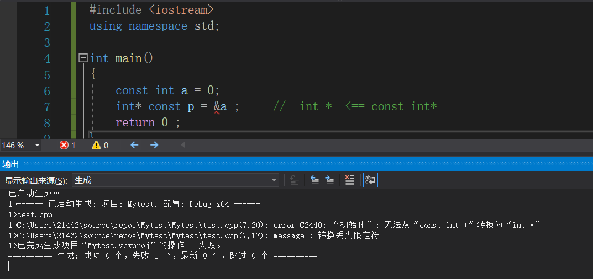
  >   >
  >   > ```C++
  >   > // 正确
  >   > int a = 100 ; 
  >   > int b = 100 ; 
  >   > int * const p = &a ;    //  正确   int * <- int * 
  >   > *p = 110 ;       
  >   > ```
  >   >
  >   > 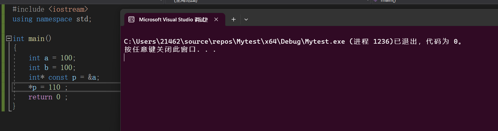
  >
  > + `const int *const p` :  第一个`const` 是**底层`const`** 表示指针指向的是一个常量(可以指向一个普通变量，因为不能通过指针非法修改内存，) ，第二个`const` 是**顶层`const`** ， 表示指针是一个常量，不能修改指针内的值。
  >
  >   > ```C++
  >   > //正确
  >   > int a = 10 ; 
  >   > const int *const p = &a ;      // const int* <- int * 
  >   > ```
  >   >
  >   > 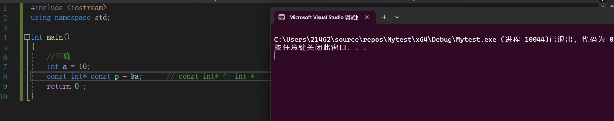
  >   >
  >   > ```C++
  >   > // 正确
  >   > const int a = 10 ; 
  >   > const int *const p = &a ;          // const int* <- const int * 
  >   > ```
  >   >
  >   > 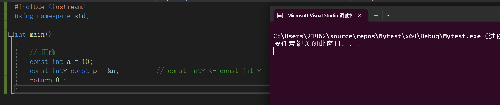
  >
  > + 在和指针的结合过程中`顶层const` 是不参与类型的：
  >
  >   > ```C++
  >   > #include <iostream>
  >   > #include <typeinfo> 
  >   > using namespace std ; 
  >   > int main()
  >   > {
  >   >     int *q1 = nullptr ;          // 以后都用nullptr ; 
  >   > 	int *const q2 = nullptr ; 
  >   > 
  >   > 	cout << typeid(q1).name() << endl ; 
  >   > 	cout << typeid(q2).name() << endl ;  
  >   > 	
  >   >     return 0 ; 
  >   > }
  >   > ```
  >   >
  >   > 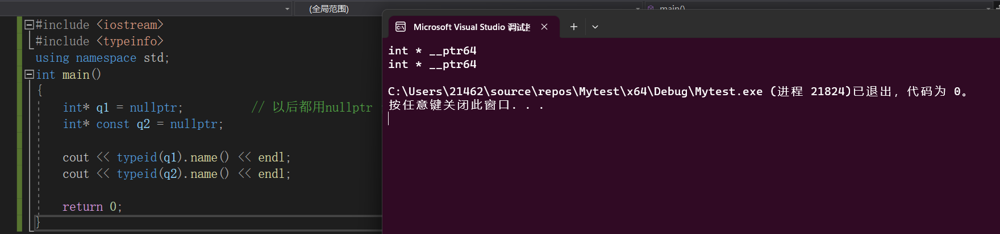
  >   >
  >   > 结论：**`const`如果右边没有指针*的话,`const` 是不参与类型的，`q2`的类型相当于是`int*`** 
  >
  > + 总结`const` 和指针的类型转换公式。
  >
  >   ```C++
  >   int * <- const int *          // 错误           
  >   const int * <= int *          // 正确
  >   ```
  >
  >   
  >
  > + **面试题问**：下述代码中，`p` 是不是放的是`a`的地址 , 将`p` 中的内容放到`q`  ， 那`a` 是一个普通的变量，将一个`int` 类型的地址放到`int*` 类型的指针内，这有什么错误的？
  >
  >   ```C++
  >   int main{
  >   	int a = 10 ; 
  >       const int *p = &a ;  
  >       int *q = p ;       
  >   
  >   	return 0 ; 
  >   }
  >   ```
  >
  >   > 解析：`int *q = p` 这句话和`a`根本就没关系，即使改为下面的代码，这种转换也是错误的。
  >   >
  >   > ```C++
  >   > int main{ 
  >   >     
  >   >     const int *p = nullptr ;   // p的类型为 const int * (int const * ) 
  >   >     
  >   >     int *q = p ;        // int *  <-  const int* 
  >   > 
  >   > 	return 0 ; 
  >   > }
  >   > 
  >   > 
  >   > 
  >   > ```
  >   >
  >   > **无论`p` 指向的数据是`int` 还是`const int ` ， 在执行`int *q = p ` 的时候编译始终认为`p` 指向的是`const int ` 类型的数据，而`C++` 编译器认为将一个整型常量的地址给一个普通指针`int* q` 可能会造成非法 修改内存值，所以是错误的。**


+ `const` 和二级指针的结合使用。

  > 类型转换公式：
  >
  > ```C++
  > int** <- const int**      // 错误的: 防止const 修饰的量的内存值被意外修改。
  > const int** <- int**      // 错误的
  > 
  > int ** <= int *const*     // 这种情况是const和一级指针的结合，const 这时候只和其后面的*结合。也是错误的。
  >    
  > int*const * <= int **    // 这种情况是可以的相当于: const* <- * 
  > ```
  >
  > 实例：
  >
  > ```C++
  > int main()
  > {
  > 	int a = 10 ; 
  > 	int *p = &a ; 
  > 	const int **q = &p ;     // const int** <=  int**  根据公式其是错误的
  > 	return 0 ; 
  > }
  > ```
  >
  > 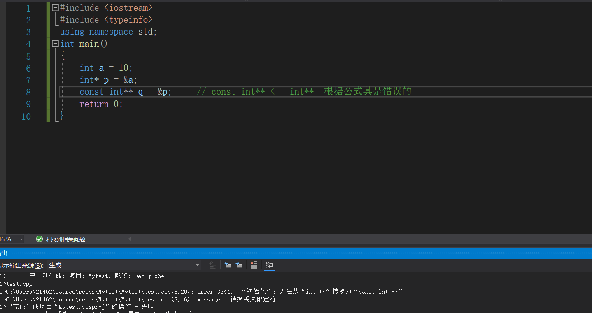
  >
  > > 解析：
  > >
  > > ```C++
  > > int main()
  > > {
  > > 	int a = 10 ; 
  > > 	int *p = &a ; 
  > > 	const int **q = &p ;     // const int** <=  int**  根据公式其是错误的
  > > 	return 0 ; 
  > > }
  > > /*
  > > 	const int *  *p : 离变量最近的*号表示p是一个指针，前面的一部分表示指针指向的类型。
  > > 
  > > 
  > > 	首先 *q 的类型是 const int * 
  > > 	*q 和 p 指向的内存都是一级指针的内存。
  > > 	
  > > 	从*q的角度来讲，我们可以给*q一个 const int 的变量的地址。
  > > 	const int b = 10 ;
  > > 	*q = &b ; 
  > > 	
  > > 	因为*q 和 p 指向的是同一块内存，但指向这块内存的变量b是const int的，因为p的类型为int* , 就会导致常量的地址泄	  露给了普通的指针，会导致非法修改内存，所以 const int** <= int**是错误的。
  > > */
  > > ```
  > >
  > > 问题的解决方式：
  > >
  > > ```C++
  > > // 第一种：错误的原因是*q被给了一个const int的地址 ， 我们直接将p修改为 const int * 解决问题
  > > int main()  
  > > {
  > > 	int a = 10 ; 
  > > 	const int *p = &a ; 
  > > 	const int **q = &p ;     // const int** <= const int**  没毛病
  > > 	return 0 ; 
  > > }
  > > 
  > > // 第二种：错误的原因是*q被给了一个const int的地址，在此版本我们不允许给*q赋值，完美杜绝这种问题。
  > > int main()
  > > {
  > > 	int a = 10 ; 
  > > 	int *p = &a ; 
  > > 	const int *const*q = &p ;     // const int** <=  int**  根据公式其是错误的
  > > 	return 0 ; 
  > > }
  > > ```
  > >
  > > **第一种**：
  > >
  > > 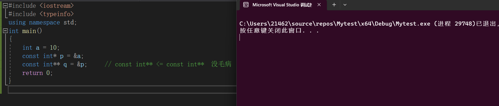
  > >
  > > **第二种**：
  > >
  > > 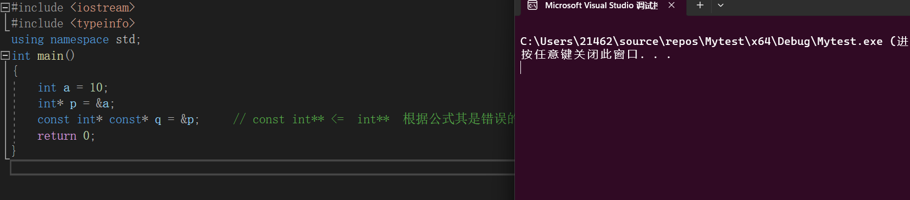
  >
  > 在形式上有四种种结合方式
  >
  > + `const int **q`: `const` 修饰`int` , `**q` 不能作为左值，`*q` 和`**q` 都可以作为左值。     
  >
  >   > ```C++
  >   > int main()
  >   > {
  >   > 	int a = 10 ; 
  >   > 	const int *p = &a ; 
  >   > 	const int **q = &p ;
  >   >     **q = 10 ; 
  >   > 	return 0 ; 
  >   > }
  >   > ```
  >   >
  >   > 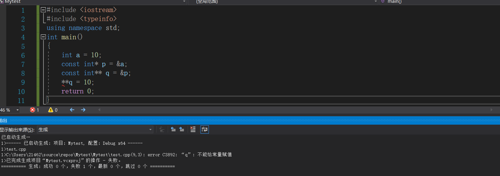
  >   >
  >   > 
  >
  > + `int const **q`  ：`const` 修饰`int` , `**q` 不能作为左值，`*q` 和`**q` 都可以作为左值。和上一种情况相同。
  >
  >   > ```C++
  >   > int main()
  >   > {
  >   > 	int a = 10 ; 
  >   > 	const int *p = &a ; 
  >   > 	int const **q = &p ;
  >   >     **q = 10 ; 
  >   > 	return 0 ; 
  >   > }
  >   > ```
  >   >
  >   > 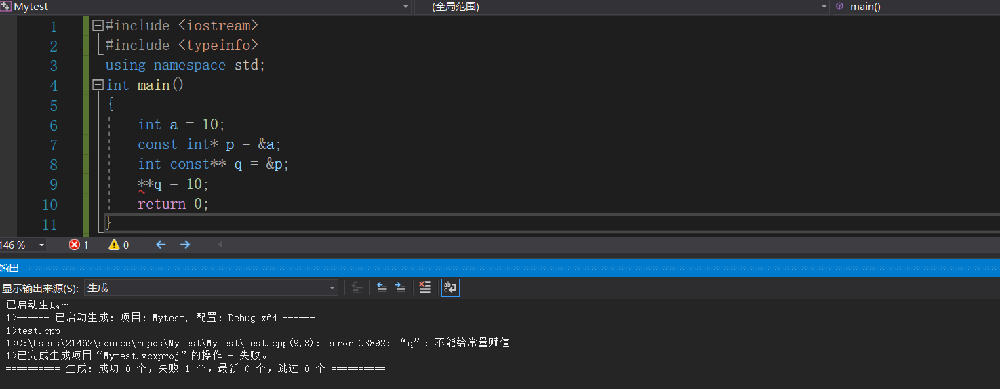
  >
  > + `int *const* q` ：`const` 修饰`int *` , `*q` 不能作为左值，`q` 和`**q` 都可以作为左值 被修改。
  >
  >   >```C++
  >   >int main()
  >   >{
  >   >	int a = 10 ; 
  >   >	int b = 100 ; 
  >   >    int *p = &a ; 
  >   >	int *const*q = &p ;
  >   >    
  >   >    *q = &b ; 
  >   >	return 0 ; 
  >   >}
  >   >```
  >   >
  >   >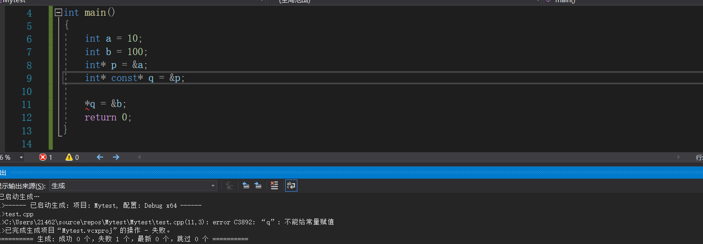
  >
  > + `int **const q ` ： `const` 修饰`int **` , `q`不能作为左值 ， `*q` 和`**q` 可以作为左值被修改。
  >
  >   >  ```C++
  >   > int main()
  >   > {
  >   > 	int a = 10 ; 
  >   >     
  >   >     int *p = &a ;
  >   >     int *t = &a ;
  >   >     
  >   > 	int **const q = &p ;
  >   >     
  >   >     q = &t ; 
  >   > 	return 0 ; 
  >   > }
  >   >  ```
  >   >
  >   > 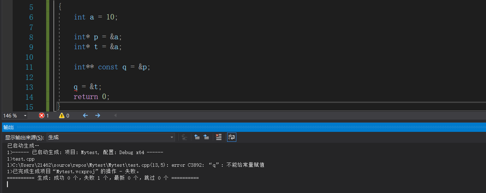

