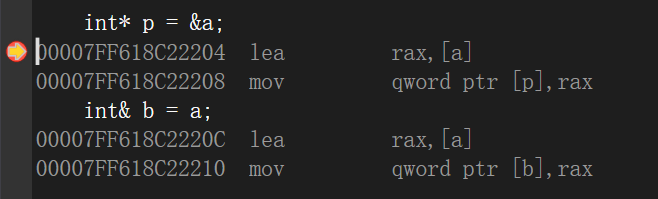
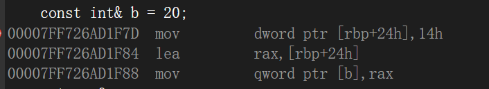
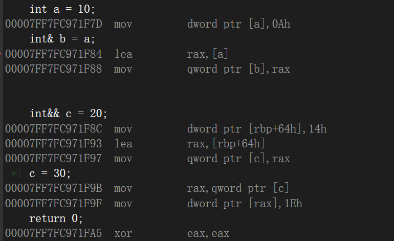

### 掌握`C++`的左值引用和初识右值引用。


+ 左值和右值的定义：

  + 左值：有内存，有名字，值可以修改， 右值引用不能用左值初识化。
  + 右值：没有内存，没名字 ， 左值引用不能用右值初始化 。 

+ 汇编指令`lea`

  ```
  在x86-64汇编语言中，lea（Load Effective Address）指令用于将有效地址加载到目标寄存器中。它并不执行内存访问操作，而是计算内存地址并将其存储在目标寄存器中。
  指令lea rax, [rbp+24h]的作用是将相对于rbp寄存器偏移量为24h的内存地址计算出来，并将该地址存储在rax寄存器中。
  解释该指令的执行过程如下：
  
  1.获取当前rbp寄存器的值，该寄存器通常用作栈帧指针，指向当前函数的基址。
  2.将偏移量24h添加到rbp寄存器的值上。
  3.计算得到的地址存储在rax寄存器中。
  
  请注意，lea指令通常用于进行地址计算，而不是加载内存中的具体值。如果你想要加载指令地址中对应的内存值，可以使用mov指令。
  需要强调的是，具体的指令和指令格式可能会受到汇编语言和体系结构的差异而有所不同。上述示例基于x86-64的汇编语言，并假设了rbp寄存器作为栈帧指针。实际情况可能有所不同，具体指令和操作数也可能会有所调整。
  ```

  **lea指令通常用于进行地址计算，而不是加载内存中的具体值。**

+ 引用和指针的区别

  > + 引用是一种更安全的指针 ；
  >
  >   > ```C++
  >   > int main()
  >   > {
  >   >     int a = 10;
  >   >     int *p = &a ; 
  >   >     int &b = a ; 
  >   >     *p = 20 ; 
  >   >     // 20 20 20 a *p b 
  >   >     cout << a << " " << *p << " " << b << endl ; 
  >   >     b = 30 ; 
  >   >     // 30 30 30 a *p b 
  >   >     cout << a << " " << *p << " " << b << endl ; 
  >   >     
  >   >     return 0 ; 
  >   > }
  >   > ```
  >   >
  >   > `a , *p , b ` 指向的是同一块内存。
  >   >
  >   > 
  >
  > + 引用是**必须初始化**的，指针可以**不初始化** ； 
  >
  > + 引用只有一级引用，没有多级引用 ；指针可以有一级指针，也可以有多级指针 ； 
  >
  > + 定义一个引用变量，和定义一个指针变量，其**汇编指令是一模一样**的；**通过引用
  >   变量修改所引用内存的值，和通过指针解引用修改指针指向的内存的值，其底层
  >   指令也是一模一样的 **； 
  >
  >   > ```C++
  >   > int main()
  >   > {
  >   >     int a = 10;
  >   >     int *p = &a ; 
  >   >     int &b = a ; 
  >   >     *p = 20 ; 
  >   >     // 20 20 20 a *p b 
  >   >     cout << a << " " << *p << " " << b << endl ; 
  >   >     b = 30 ; 
  >   >     // 30 30 30 a *p b 
  >   >     cout << a << " " << *p << " " << b << endl ; 
  >   >     
  >   >     return 0 ; 
  >   > }
  >   > ```
  >   >
  >   > 汇编代码：
  >   >
  >   > 
  >   >
  >   > 在上图中可以看到：**在汇编指令层次，定义一个引用变量和定义一个指针变量其汇编指令是相同的**
  >
  > + 对于**引用的定义**：
  >
  >   + 第一，我们需要进行初始化。
  >   + 第二，初始化的值一定要能够取地址(**就是说不能用立即数初始化引用**)，因为我们需要将其地址放入引用的底层。方便后面的对引用的赋值。
  >
  > + 对于引用的赋值，**其底层还是用指针进行实现的**：
  >
  >   + 先拿到引用的底层的地址
  >   + **之后的隐式的做一个解引用的操作，**给其代表的内存赋值。

+ 左值引用

  > 左值引用具有上述引用的所有的特点。
  >
  > 实例：使用左值引用代替指针。
  >
  > ```C++
  > 
  > // 指针版本
  > void swap(int *x, int *y)
  > {
  > 	int temp = *x;
  > 	*x = *y;
  > 	*y = temp;
  > }
  > 
  > // 引用版本
  > void swap(int &x, int &y)
  > {
  > 	int temp = x ; // 将引用x 中的内存地址取出来，之后做一个解引用，将值给temp。
  > 	x = y;
  > 	y = temp;
  > }
  > 
  > int main()
  > {
  > 	int a = 10;
  > 	int b = 20;
  > 	//swap(&a, &b) ; 
  > 	swap(a, b);
  > 	cout << "a:" << a << " b:" << b << endl;
  > 	return 0 ;  
  > }
  > ```
  >
  > 好处：第一，引用比指针简单一点；第二，引用比指针更加的安全。
  >
  > **问题**：下面的代码输出什么。
  >
  > ```C++
  > int main()
  > {
  > 	int array[5] = {} ; 
  >     int *p = array ; 
  >     
  >     // 定义一个引用变量来引用array
  >     int (&q)[5] = array ; 
  >     
  >     cout << sizeof(array) << endl ;   
  >     
  >     cout << sizeof(p) << endl ;        
  >     
  >     cout << sizeof(q) << endl ; 
  >     return 0 ; 
  > }
  > 
  > 答案: 
  > /*
  >  20 
  >  4 
  >  20
  > */
  > ```
  >
  > **从上例可以看出** ： ==当引用`q`引用的是数组的时候，其大小和指针不相同，`q`的大小相当于是数组的大小。== 也恰好印证了：**引用是变量的别名!**
  >
  > **当加上`const`关键字的时候，左值引用可以被右值初始化**
  >
  > > ```C++
  > > int main()
  > > {
  > >     
  > > 	const int &b = 20 ;   // 常引用。
  > >     return 0 ;
  > > }
  > > ```
  > >
  > > 
  > >
  > > **上图的指令，和右值引用产生的指令是相同的！！！**
  > >
  > > ```C++
  > > 00007FF726AD1F7D  mov         dword ptr [rbp+24h],14h   // 创建一个临时量，将20放进去。
  > > 00007FF726AD1F84  lea         rax,[rbp+24h]            // 将临时量的地址放入 rax寄存器中
  > > 00007FF726AD1F88  mov         qword ptr [b],rax       // 将rax寄存器中的值放入b中。
  > > ```
  > >
  > > 这种形式的左值引用虽然产生的汇编指令和右值引用相同，但两者还是有所不同的：
  > >
  > > + **前者不能作为左值**。
  > > + **后者可以作为一个左值被修改，因为右值引用本身也是一个变量。**
  > >
  > > 

+ 右值引用

  > + `int &&c = 20;` 专门用来引用右值类型，指令上，可以自动产生临时量 , 然后直接引用临时量 c = 40 ;
  >
  >   > ```C++
  >   > int main()
  >   > {
  >   > 	int a = 10; // 左值，它有内存，有名字，值可以修改的
  >   > 	int &b = a;
  >   > 
  >   > 	//int &c = 20; // 20是右值：没内存，没名字
  >   > 	//C++11提供了右值引用
  >   > 	int &&c = 20;
  >   > 	c = 30 ;   
  >   >     
  >   >     int &e = c; // 一个右值引用变量，本身是一个左值
  >   > 	
  >   >     return 0;
  >   > }
  >   > ```
  >   >
  >   > 产生的汇编指令：
  >   >
  >   > 
  >   >
  >   > 主要分析第二句和第三句代码产生的指令：
  >   >
  >   > ```C++
  >   > 	int& b = a;
  >   > 00007FF7FC971F84  lea         rax,[a]      // 将a的地址放入 rax寄存器中。
  >   > 00007FF7FC971F88  mov         qword ptr [b],rax   // 将寄存器中的值放入内存b中
  >   > 
  >   > 	
  >   > 	int&& c = 20;
  >   > 00007FF7FC971F8C  mov         dword ptr [rbp+64h],14h  // 在栈帧中 开辟一个临时量，将20放进去
  >   > 00007FF7FC971F93  lea         rax,[rbp+64h]     // 将临时量的地址放入 rax 寄存器中
  >   > 00007FF7FC971F97  mov         qword ptr [c],rax  // 将rax寄存器中的值放入c中	
  >   > ```
  >   >
  >   > 
  >
  > + **右值引用变量本身是一个左值，只能用左值引用来引用它**。
  >
  > + **不能用一个右值引用去引用一个左值  ** ：因为右值引用在汇编指令阶段汇产生一个临时量，将临时量的地址放入引用中，而左值本身就存在地址，不需要这个临时量，所以种方式不行。


