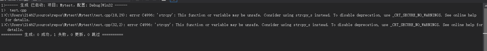
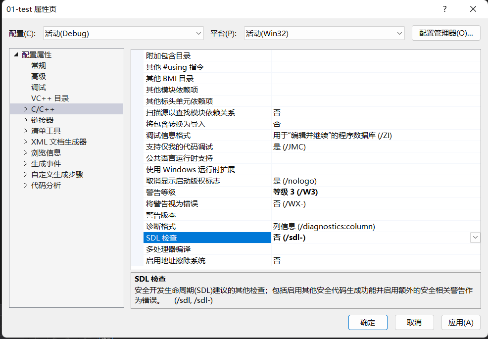
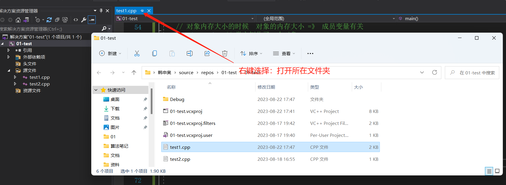
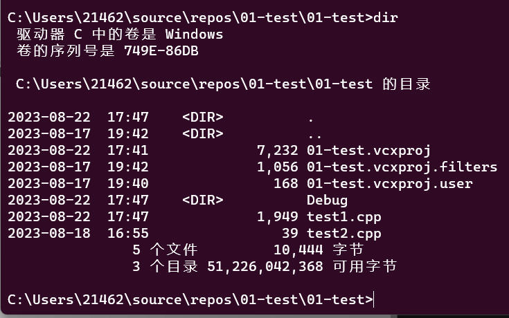
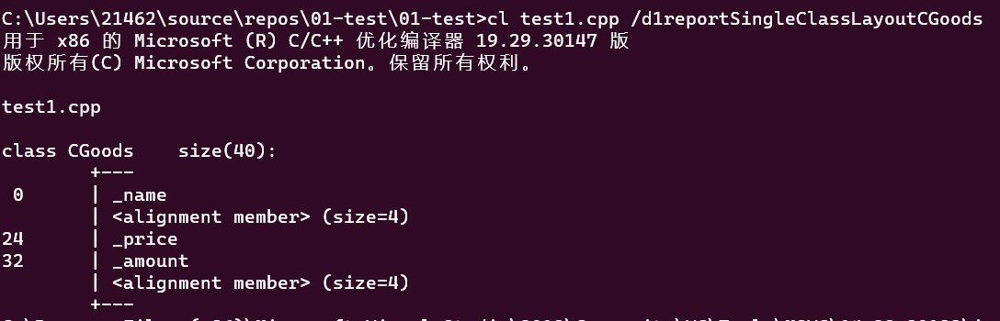

### 类和对象和`this` 指针

 #### 前置知识

+ 对于`vs`编译器报错的解决方式。

  > 
  >
  > 编译器认为`c`语言的`strcpy()` 函数不安全 , 这是编译器的问题，可以通过关闭`SDL` 检查来解决。
  >
  > 路径： `项目->属性-> C/C++` 将当前路径下的 `SDL` 检查关闭。
  >
  > 
  >
  > 


`OOP` 语言的四大特征：

+ `抽象` ： 
+  `封装（隐藏）` ： 通过`访问限定符` 实现。
+ `继承` ： 
+  `多态` ：  

类：`实体的抽象类型` 。

```
实体（属性、行为）       ====>       ADT(abstract data type)
 |                                 |
对象[占用内存空间]  <=====(实例化)  类(属性->成员变量  行为->成员方法)[不占用内存空间]
```

 类内命名方式：

+ 属性：以`_` 开头，用英文意思进行命名。
+ 方法：第一个单词小写，后面的单词首位英文字母大写。


示例代码：

```C++
/*
类 -》 商品实体
访问限定符：public公有的 private私有的 protected保护的
*/
const int NAME_LEN = 20 ; 
class CGoods  // 类名的每个单词都是大写的。
{
public: // 给外部提供公有的成员方法，来访问私有的属性
	
	
    void init(const char *name, double price, int amount);
    // 对于常量字符串，我们需要定义一个const char * 去接收。
    
	// 打印商品信息
	void show();
    
    
	// 给成员变量提供一个getXXX或setXXX的方法 类体内实现的方法，自动处理成inline内联函数
	void setName(char *name) { strcpy(_name, name); }
	void setPrice(double price) { _price = price; }
	void setAmount(int amount) { _amount = amount; }

	const char* getName() { return _name; }   // 注意这里是返回值的类型为const char*: 防止对象的私有属性被修改
	double getPrice() { return _price; }
	int getAmount() { return _amount; }
private: // 属性一般都是私有的成员变量
	char _name[NAME_LEN];
	double _price;
	int _amount;
};
void CGoods::init(const char *name, double price, int amount)
{
	strcpy(this->_name, name);  // 如果我们加上this-> 编译器就不加了，如过我们不加，那么编译器就帮我们加上。
	this->_price = price;
	this->_amount = amount;
}
void CGoods::show()
{
	cout << "name:" << this->_name << endl;
	cout << "price:" << this->_price << endl;
	cout << "amount:" << this->_amount << endl;
}
int main()
{
	/*
	CGoods可以定义无数的对象，每一个对象都有自己的成员变量
	但是它们共享一套成员方法

	show() => 怎么知道处理哪个对象的信息？
	init(name, price, amount) => 怎么知道把信息初始化给哪一个对象的呢？
	
	*/
	// cl 02C++面向对象.cpp /d1reportSingleClassLayoutCGoods
	// 对象内存大小的时候  对象的内存大小 =》 成员变量有关
	CGoods good1; // 类实例化了一个对象

	// init(&good1, "面包", 10.0, 200)
	good1.init("面包", 10.0, 200);
	// show(&good1)
	good1.show();

	good1.setPrice(20.5);
	good1.setAmount(100);
	good1.show();

	CGoods good2;// 类实例化了一个对象
	good2.init("空调", 10000.0, 50);
	good2.show();

    return 0; 
}
```


类的特点：

+ 类的方法是共享的，对象的属性是私有的，每个对象都有其自身的属性。

+ `init(name, price, amount) => 怎么知道把信息初始化给哪一个对象的呢？`:类的成员方法一经编译，所有的方法参数，都会加一个this指针，接收调用该方法的对象的地址  ， 

  > 例如上述代码编译后，编译器在参数列表的最前方加上一个`this`指针 ， `this` 指针指向的是当前对象的地址。  
  >
  >  ```C++
  > init( CGoods *this , price , amount ); 
  > 调用处
  > good1.init("面包", 10.0, 200);   
  > 在编译完成之后的形式类似于: 
  > init(&good1 , 10.0 , 200 ) ;  
  >  ```

+ **类内部实现的方法会被自动的处理成为内联函数。**

+ 如何快速计算对象的内存大小 

  > + **对象的内存大小之和成员变量有关** ，再根据内存对齐的规则进行计算。
  >
  >   >  内存对齐规则：
  >   >
  >   > **对齐数 = 编译器默认的一个对齐数与该成员大小的较小值。 32位系统的对齐系数是4 ， 64位系统的对齐系数是8**
  >   >
  >   > + 对于结构体的各个成员，第一个成员位于偏移为`0`的位置，结构体第一个成员的偏移量(offset)为`0`，以后每个成员相对于结构体首地址的`offset`都是该成员大小与有效对齐值中较小那个的整数倍，如有需要编译器会在成员之间加上填充字节。
  >   > + 除了结构成员需要对齐，**结构本身**也需要对齐，结构的长度必须是编译器默认的对齐长度和成员中最长类型中最小的数据大小的倍数对齐。
  >   >
  >   > 根据以上规则分析`good1` 对象的大小
  >   >
  >   > ``` 
  >   > // 一共有以下三个变量。
  >   > char _name[NAME_LEN];   0 ~ 19字节。      
  >   >  						20 ~ 23字节为填充字节，因为要满足_price的offset是有效对齐值8的整数倍。
  >   > double _price ;         24 ~ 31字节          
  >   > int _amount;            32 ~ 35字节
  >   > 						36 ~ 39字节为填充字节，因为结构的长度必须是8的倍数，原本的达到了36字节，不满足。
  >   > 
  >   > 一共40字节。
  >   > ```
  >
  > + 通过vs的`cmd`进行查看 
  >
  >   > 打开`vs的cmd` : 工具  ->  命令行 -> 开发者命令提示
  >   >
  >   > 切换工作目录到当前想查看的类所在的目录：	
  >   >
  >   > 
  >   >
  >   > 
  >   >
  >   > 执行`cl test1.cpp /d1reportSingleClassLayoutCGoods`得到：(`test1.cpp`为类所在的源文件) 
  >   >
  >   > 
  >
  > + 直接使用`sizeof()运算符进行查看` 其大小。 
