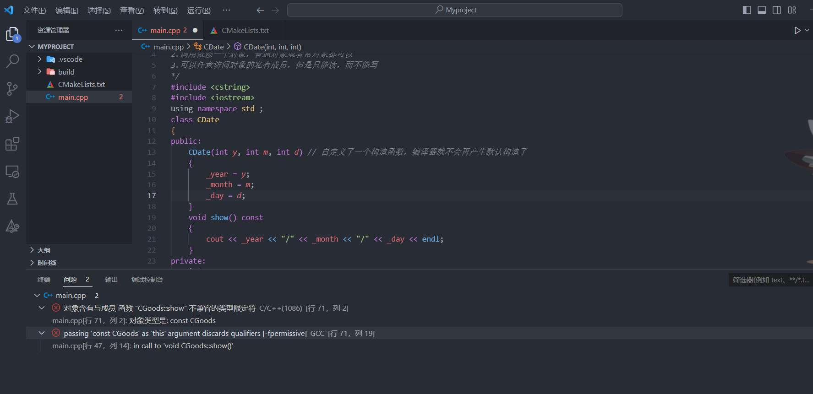

### 类的各种成员方法

#### 成员方法分为三种

+ 普通成员方法

  > **编译器会添加一个this形参变量**
  > 1.属于类的作用域
  > 2.调用该方法时，需要依赖一个对象    (常对象是无法调用的 实参:`const CGoods*   CGoods *this`)
  > 3.可以任意访问对象的私有成员   `public   private`   [注: `protected`的数据先不考虑，因为其只有在继承的时候才会起作用] 

+ 静态成员方法

  > ```C++
  > class CGoods{
  > public:
  > 	// 静态成员方法 没有this指针的
  > 	static void showCGoodsCount() // 打印的是所有商品共享的信息
  > 	{
  > 		cout << "所有商品的种类数量是：" << _count << endl;
  > 	}
  > 
  > } ; 
  > ```
  >
  > + 属于类的作用域
  >
  > + ==**核心区别**==：静态成员方法 没有`this` 指针，所以静态方法可以直接使用类作用域来调用，而普通方法存在`this` 指针，所以其需要类对象。
  >
  > + 如果方法访问的是静态成员变量，最好将方法定义为**静态成员方法**。
  >
  > + **因为静态成员方法不存在`this`指针，所以静态成员方法不能访问非静态成员变量**
  >
  >   ```C++
  >   class CGoods{
  >   public:
  >   	// 静态成员方法 没有this指针的
  >   	static void showCGoodsCount() // 打印的是所有商品共享的信息
  >   	{
  >   		cout << "所有商品的种类数量是：" << _count << endl;
  >   		cout << "name: " << _name << endl;  // 错误 不能访问非静态成员变量。
  >   	}
  >   } ; 
  >   ```
  >
  > + 使用类名作用域来调用方法
  >
  > + 可以任意访问对象的私有成员，仅限于不依赖于对象的成员(只能调用其他的`static`静态成员) 。

+ ==常方法==

  > ```C++
  > /*
  > const常成员方法 => const CGoods *this
  > 1.属于类的作用域
  > 2.调用依赖一个对象，普通对象或者常对象都可以
  > 3.可以任意访问对象的私有成员，但是只能读，而不能写
  > */
  > #include <cstring>
  > #include <iostream>
  > using namespace std ; 
  > class CDate
  > {
  > public:
  > 	CDate(int y, int m, int d) // 自定义了一个构造函数，编译器就不会再产生默认构造了
  > 	{
  > 		_year = y;
  > 		_month = m;
  > 		_day = d;
  > 	}
  > 	void show()const
  > 	{
  > 		cout << _year << "/" << _month << "/" << _day << endl;
  > 	}
  > private:
  > 	int _year;
  > 	int _month;
  > 	int _day;
  > };
  > 
  > /*
  > 构造函数的初始化列表 ： 可以指定当前对象成员变量的初始化方式
  > CDate信息   CGoods商品信息的一部分  a part of...  组合的关系
  > */
  > class CGoods
  > {
  > public:
  > 	// “CDate”: 没有合适的默认构造函数可用
  > 	CGoods(const char *n, int a, double p, int y, int m, int d)
  > 		:_date(y, m, d)
  > 		, _amount(a) // int _amount = a;
  > 		, _price(p) // #1 构造函数的初始化列表
  > 	{
  > 		// #2 当前类类型构造函数体
  > 		strcpy(_name, n);
  > 		_count++; // 记录所有产生的新对象的数量
  > 	}
  > 	// 普通成员方法
  > 	void show() // 打印商品的私有的信息 CGoods *this
  > 	{
  > 		cout << "name:" << _name << endl;
  > 		cout << "amount:" << _amount << endl;
  > 		cout << "price:" << _price << endl;
  > 		_date.show();
  > 	}
  > 	// 静态成员方法 没有this指针的
  > 	static void showCGoodsCount() // 打印的是所有商品共享的信息
  > 	{
  > 		cout << "所有商品的种类数量是：" << _count << endl;
  > 	}
  > private:
  > 	char _name[20];
  > 	int _amount;
  > 	double _price;
  > 	CDate _date;  // 成员对象  1.分配内存  2.调用构造函数
  > 	static int _count; // 不属于对象，而是属于类级别的 声明 用来记录商品对象的总数量
  > };
  > // static成员变量一定要在类外进行定义并且初始化
  > int CGoods::_count = 0;
  > int main()
  > {
  > 	const CGoods good5("非卖品商品5", 100, 35.0, 2019, 5, 12);
  > 	good5.show(); // CGoods::show(&good5)  const CGoods*  ->  CGoods *this
  > 
  > 	return 0;
  > }
  > ```
  >
  > 
  >
  > + 当对象是一个常量的时候，我们无法调用普通成员方法因为会丢失`const`限定符：
  >
  >   ```C++
  >   CGoods *this <- const CGoods*   这种转换是不被允许的！
  >   ```
  >
  > + 根据`const` 进行函数重载：
  >
  >   ```C++
  >   // 常成员方法  只要是只读操作的成员方法，一律实现成const常成员方法
  >   	void show() const // const CGoods *this
  >   	{
  >   		cout << "name:" << _name << endl;
  >   		cout << "amount:" << _amount << endl;
  >   		cout << "price:" << this->_price << endl;
  >   		_date.show();
  >   	}
  >   ```
  >
  >   当加上`const` 限定符的时候，产生的`this` 指针的类型就是`const CGoods *this` 类型了。
  >
  > + ==**对于不修改类对象数据的方法，我们最好要将其定义为常方法，为了保证常对象的正常调用！**==
  >
  > + `const`常成员方法 => `const CGoods *this`
  >
  > + 属于类的作用域
  >
  > + 调用需要依赖一个对象，依赖的对象为**普通对象**或者**常对象**都可以 ， 但**常对象**无法调用**普通方法** 。 
  >
  > + **==可以任意访问对象的私有成员，但是只能读，而不能写==**

#### 如何统计当前类的对象的个数

+ 使用静态成员变量：**静态成员变量在类体内仅仅是一个声明**，并且需要在类外进行定义：

  > ```C++
  > class CGoods
  > {
  > private:
  > 	static int _count ;  // 这个只能算是声明 ， 不属于对象，而是属于类级别的。
  > } ;
  > // static 成员变量一定要在类外进行定义 
  > int CGoods::_count = 0;   // 定义+初始化， 也可以不初始化。
  > ```
  >
  > + 当我们在计算类对象大小的时候，静态成员变量是不纳入计算的。
  > + **在虚拟地址空间中，静态成员变量所位于的位置是`.bss`或`.data`段** 
  > + **`static` 变量相当于是一个全局变量，只不过其作用域是在`CGoods`中** ，可以使用类作用域进行访问。

+ 在类的每个**可能产生对象**的函数或者内部都执行一次`_count` 的自增，从而统计类的对象的个数

  > ```C++
  > class{
  > public:
  > 	CGoods(const char *n, int a, double p, int y, int m, int d)
  > 		:_date(y, m, d)
  > 		, _amount(a) 
  > 		, _price(p) 
  > 	{
  > 		strcpy(_name, n);
  > 		_count++; // 记录所有产生的新对象的数量
  > 	}
  > 	
  > } ; 
  > ```
  >
  > 

+ 示例代码

```C++
#include <cstring>
#include <iostream>
using namespace std ; 
class CDate
{
public:
	CDate(int y, int m, int d) // 自定义了一个构造函数，编译器就不会再产生默认构造了
	{
		_year = y;
		_month = m;
		_day = d;
	}
	void show()const
	{
		cout << _year << "/" << _month << "/" << _day << endl;
	}
private:
	int _year;
	int _month;
	int _day;
};

class CGoods
{
public:
	// “CDate”: 没有合适的默认构造函数可用
	CGoods(const char *n, int a, double p, int y, int m, int d)
		:_date(y, m, d)
		, _amount(a) // int _amount = a;
		, _price(p) // #1 构造函数的初始化列表
	{
		// #2 当前类类型构造函数体
		strcpy(_name, n);
		_count++; // 记录所有产生的新对象的数量
	}
	// 普通成员方法
	void show() // 打印商品的私有的信息 CGoods *this
	{
		cout << "name:" << _name << endl;
		cout << "amount:" << _amount << endl;
		cout << "price:" << _price << endl;
		_date.show();
	}
	// 常成员方法  只要是只读操作的成员方法，一律实现成const常成员方法
	void show() const // const CGoods *this
	{
		cout << "name:" << _name << endl;
		cout << "amount:" << _amount << endl;
		cout << "price:" << this->_price << endl;
		_date.show();
	}
	// 静态成员方法 没有this指针的
	static void showCGoodsCount() // 打印的是所有商品共享的信息
	{
		cout << "所有商品的种类数量是：" << _count << endl;
	}
private:
	char _name[20];
	int _amount;
	double _price;
	CDate _date;  // 成员对象  1.分配内存  2.调用构造函数
	static int _count; // 不属于对象，而是属于类级别的 声明 用来记录商品对象的总数量
};
// static成员变量一定要在类外进行定义并且初始化
int CGoods::_count = 0;
int main()
{
	CGoods good1("商品1", 100, 35.0, 2019, 5, 12);
	good1.show();

	CGoods good2("商品2", 100, 35.0, 2019, 5, 12);
	good2.show();

	CGoods good3("商品3", 100, 35.0, 2019, 5, 12);
	good3.show();

	CGoods good4("商品4", 100, 35.0, 2019, 5, 12);
	good4.show();

	// 统计所有商品的总数量
	CGoods::showCGoodsCount();

	const CGoods good5("非卖品商品5", 100, 35.0, 2019, 5, 12);
	good5.show(); // CGoods::show(&good5)  const CGoods*  -> const CGoods *this

	return 0;
}
```


