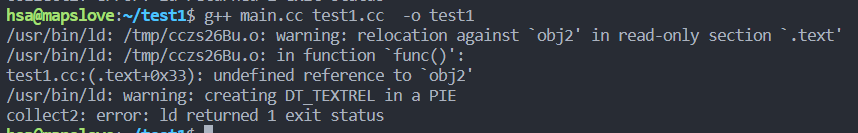
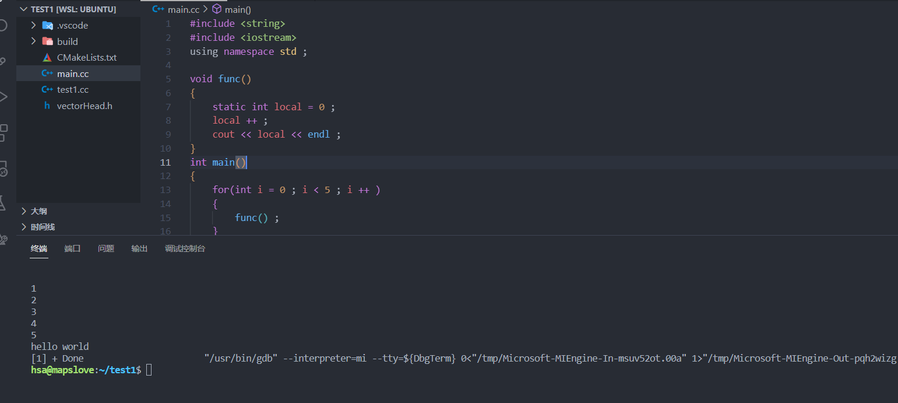
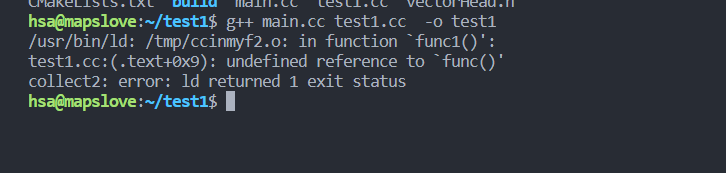
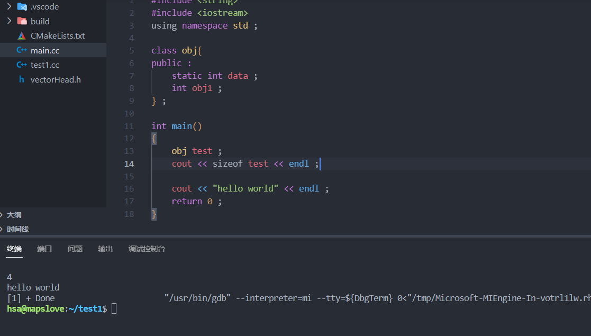
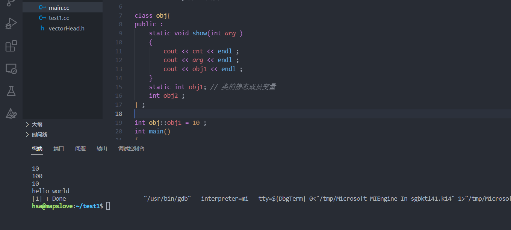
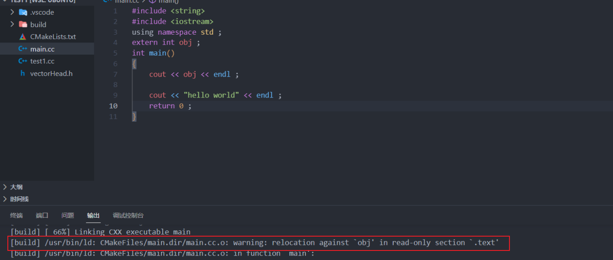
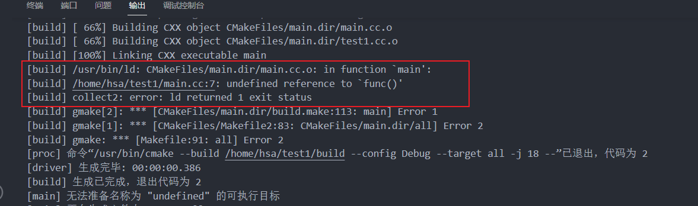
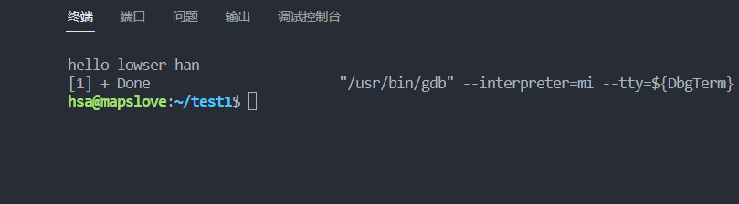
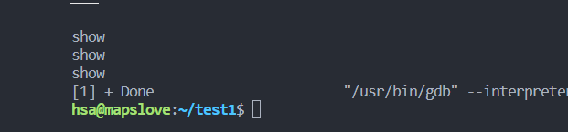
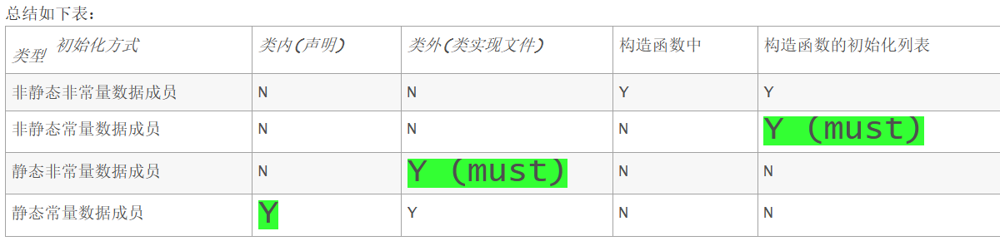

【注：`static` 和`extern`都是声明型关键字，都只在声明的时候出现，定义的时候不会出现。】


### 类的各种成员方法

#### 成员方法分为三种

+ 普通成员方法

  > **编译器会添加一个this形参变量**
  > 1.属于类的作用域
  > 2.调用该方法时，需要依赖一个对象    (常对象是无法调用的 实参:`const CGoods*   CGoods *this`)
  > 3.可以任意访问对象的私有成员   `public   private`   [注: `protected`的数据先不考虑，因为其只有在继承的时候才会起作用] 

+ 静态成员方法

  > ```C++
  > class CGoods{
  > public:
  > 	// 静态成员方法 没有this指针的
  > 	static void showCGoodsCount() // 打印的是所有商品共享的信息
  > 	{
  > 		cout << "所有商品的种类数量是：" << _count << endl;
  > 	}
  > 
  > } ; 
  > ```
  >
  > + 属于类的作用域
  >
  > + ==**核心区别**==：静态成员方法 没有`this` 指针，所以静态方法可以直接使用类作用域来调用，而普通方法存在`this` 指针，所以其需要类对象。
  >
  > + 如果方法访问的是静态成员变量，最好将方法定义为**静态成员方法**。
  >
  > + **因为静态成员方法不存在`this`指针，所以静态成员方法不能访问非静态成员变量**
  >
  >   ```C++
  >   class CGoods{
  >   public:
  >   	// 静态成员方法 没有this指针的
  >   	static void showCGoodsCount() // 打印的是所有商品共享的信息
  >   	{
  >   		cout << "所有商品的种类数量是：" << _count << endl;
  >   		cout << "name: " << _name << endl;  // 错误 不能访问非静态成员变量。
  >   	}
  >   } ; 
  >   ```
  >
  > + 使用类名作用域来调用方法
  >
  > + 可以任意访问对象的私有成员，仅限于不依赖于对象的成员(只能调用其他的`static`静态成员) 。

+ ==常方法==

  > ```C++
  > /*
  > const常成员方法 => const CGoods *this
  > 1.属于类的作用域
  > 2.调用依赖一个对象，普通对象或者常对象都可以
  > 3.可以任意访问对象的私有成员，但是只能读，而不能写
  > */
  > #include <cstring>
  > #include <iostream>
  > using namespace std ; 
  > class CDate
  > {
  > public:
  > 	CDate(int y, int m, int d) // 自定义了一个构造函数，编译器就不会再产生默认构造了
  > 	{
  > 		_year = y;
  > 		_month = m;
  > 		_day = d;
  > 	}
  > 	void show()const
  > 	{
  > 		cout << _year << "/" << _month << "/" << _day << endl;
  > 	}
  > private:
  > 	int _year;
  > 	int _month;
  > 	int _day;
  > };
  > 
  > /*
  > 构造函数的初始化列表 ： 可以指定当前对象成员变量的初始化方式
  > CDate信息   CGoods商品信息的一部分  a part of...  组合的关系
  > */
  > class CGoods
  > {
  > public:
  > 	// “CDate”: 没有合适的默认构造函数可用
  > 	CGoods(const char *n, int a, double p, int y, int m, int d)
  > 		:_date(y, m, d)
  > 		, _amount(a) // int _amount = a;
  > 		, _price(p) // #1 构造函数的初始化列表
  > 	{
  > 		// #2 当前类类型构造函数体
  > 		strcpy(_name, n);
  > 		_count++; // 记录所有产生的新对象的数量
  > 	}
  > 	// 普通成员方法
  > 	void show() // 打印商品的私有的信息 CGoods *this
  > 	{
  > 		cout << "name:" << _name << endl;
  > 		cout << "amount:" << _amount << endl;
  > 		cout << "price:" << _price << endl;
  > 		_date.show();
  > 	}
  > 	// 静态成员方法 没有this指针的
  > 	static void showCGoodsCount() // 打印的是所有商品共享的信息
  > 	{
  > 		cout << "所有商品的种类数量是：" << _count << endl;
  > 	}
  > private:
  > 	char _name[20];
  > 	int _amount;
  > 	double _price;
  > 	CDate _date;  // 成员对象  1.分配内存  2.调用构造函数
  > 	static int _count; // 不属于对象，而是属于类级别的 声明 用来记录商品对象的总数量
  > };
  > // static成员变量一定要在类外进行定义并且初始化
  > int CGoods::_count = 0;
  > int main()
  > {
  > 	const CGoods good5("非卖品商品5", 100, 35.0, 2019, 5, 12);
  > 	good5.show(); // CGoods::show(&good5)  const CGoods*  ->  CGoods *this
  > 
  > 	return 0;
  > }
  > ```
  >
  > 
  >
  > + 当对象是一个常量的时候，我们无法调用普通成员方法因为会丢失`const`限定符：
  >
  >   ```C++
  >   CGoods *this <- const CGoods*   这种转换是不被允许的！
  >   ```
  >
  > + 根据`const` 进行函数重载：
  >
  >   ```C++
  >   // 常成员方法  只要是只读操作的成员方法，一律实现成const常成员方法
  >   	void show() const // const CGoods *this
  >   	{
  >   		cout << "name:" << _name << endl;
  >   		cout << "amount:" << _amount << endl;
  >   		cout << "price:" << this->_price << endl;
  >   		_date.show();
  >   	}
  >   ```
  >
  >   当加上`const` 限定符的时候，产生的`this` 指针的类型就是`const CGoods *this` 类型了。
  >
  > + ==**对于不修改类对象数据的方法，我们最好要将其定义为常方法，为了保证常对象的正常调用！**==
  >
  > + `const`常成员方法 => `const CGoods *this`
  >
  > + 属于类的作用域
  >
  > + 调用需要依赖一个对象，依赖的对象为**普通对象**或者**常对象**都可以 ， 但**常对象**无法调用**普通方法** 。 
  >
  > + **==可以任意访问对象的私有成员，但是只能读，而不能写==**

#### 如何统计当前类的对象的个数

+ 使用静态成员变量：**静态成员变量在类体内仅仅是一个声明**，并且需要在类外进行定义：

  > ```C++
  > class CGoods
  > {
  > private:
  > 	static int _count ;  // 这个只能算是声明 ， 不属于对象，而是属于类级别的。
  > } ;
  > // static 成员变量一定要在类外进行定义 
  > int CGoods::_count = 0;   // 定义+初始化， 也可以不初始化。
  > ```
  >
  > + 当我们在计算类对象大小的时候，静态成员变量是不纳入计算的。
  > + **在虚拟地址空间中，静态成员变量所位于的位置是`.bss`或`.data`段** 
  > + **`static` 变量相当于是一个全局变量，只不过其作用域是在`CGoods`中** ，可以使用类作用域进行访问。

+ 在类的每个**可能产生对象**的函数或者内部都执行一次`_count` 的自增，从而统计类的对象的个数

  > ```C++
  > class{
  > public:
  > 	CGoods(const char *n, int a, double p, int y, int m, int d)
  > 		:_date(y, m, d)
  > 		, _amount(a) 
  > 		, _price(p) 
  > 	{
  > 		strcpy(_name, n);
  > 		_count++; // 记录所有产生的新对象的数量
  > 	}
  > 	
  > } ; 
  > ```
  >
  > 

+ 示例代码

```C++
#include <cstring>
#include <iostream>
using namespace std ; 
class CDate
{
public:
	CDate(int y, int m, int d) // 自定义了一个构造函数，编译器就不会再产生默认构造了
	{
		_year = y;
		_month = m;
		_day = d;
	}
	void show()const
	{
		cout << _year << "/" << _month << "/" << _day << endl;
	}
private:
	int _year;
	int _month;
	int _day;
};

class CGoods
{
public:
	// “CDate”: 没有合适的默认构造函数可用
	CGoods(const char *n, int a, double p, int y, int m, int d)
		:_date(y, m, d)
		, _amount(a) // int _amount = a;
		, _price(p) // #1 构造函数的初始化列表
	{
		// #2 当前类类型构造函数体
		strcpy(_name, n);
		_count++; // 记录所有产生的新对象的数量
	}
	// 普通成员方法
	void show() // 打印商品的私有的信息 CGoods *this
	{
		cout << "name:" << _name << endl;
		cout << "amount:" << _amount << endl;
		cout << "price:" << _price << endl;
		_date.show();
	}
	// 常成员方法  只要是只读操作的成员方法，一律实现成const常成员方法
	void show() const // const CGoods *this
	{
		cout << "name:" << _name << endl;
		cout << "amount:" << _amount << endl;
		cout << "price:" << this->_price << endl;
		_date.show();
	}
	// 静态成员方法 没有this指针的
	static void showCGoodsCount() // 打印的是所有商品共享的信息
	{
		cout << "所有商品的种类数量是：" << _count << endl;
	}
private:
	char _name[20];
	int _amount;
	double _price;
	CDate _date;  // 成员对象  1.分配内存  2.调用构造函数
	static int _count; // 不属于对象，而是属于类级别的 声明 用来记录商品对象的总数量
};
// static成员变量一定要在类外进行定义并且初始化
int CGoods::_count = 0;
int main()
{
	CGoods good1("商品1", 100, 35.0, 2019, 5, 12);
	good1.show();

	CGoods good2("商品2", 100, 35.0, 2019, 5, 12);
	good2.show();

	CGoods good3("商品3", 100, 35.0, 2019, 5, 12);
	good3.show();

	CGoods good4("商品4", 100, 35.0, 2019, 5, 12);
	good4.show();

	// 统计所有商品的总数量
	CGoods::showCGoodsCount();

	const CGoods good5("非卖品商品5", 100, 35.0, 2019, 5, 12);
	good5.show(); // CGoods::show(&good5)  const CGoods*  -> const CGoods *this

	return 0;
}
```


### `Static`关键字的作用

>  
>
>  #### **c++static关键字的作用**
>
>  以下是一般人都会背了的吧：
>
>  **c/c++共有**: 
>
>  + 修饰**全局变量**时，表明一个全局变量只对定义在同一文件中的函数可见。
>
>   >  测试代码：
>   >
>   >  ```C++
>   >  // main.cc
>   >  #include <string>
>   >  #include <iostream>
>   >  using namespace std ;
>   >  
>   >  extern void func() ; 
>   >  
>   >  int obj1 = 10 ; 
>   >  static int obj2 = 100 ;  
>   >  
>   >  int main()
>   >  {
>   >  	func() ; 
>   >  	cout << "hello world" << endl ; 
>   >  }
>   >  
>   >  
>   >  // test.cc
>   >  #include <iostream>
>   >  using namespace std ; 
>   >  extern int obj1 ; 
>   >  extern int obj2 ;  // 声明在其他的文件中存在obj2
>   >  void func()
>   >  {
>   >   cout << obj1 << endl ; 
>   >  
>   >   cout << obj2 << endl ; 
>   >   return ; 
>   >  }
>   >  
>   >  ```
>   >
>   >  两个文件在编译的时出现错误：
>   >
>   >  
>   >
>   >  但`obj1`实际上是在`test1`文件中是可见的。
>
>  + 修饰**局部变量**时，表明该变量的值不会因为函数终止而丢失。
>
>    > 测试代码：
>    >
>    > ```C++
>    > #include <string>
>    > #include <iostream>
>    > using namespace std ;
>    > 
>    > void func()
>    > {
>    > 	static int local = 0 ; 
>    > 	local ++ ;
>    > 	cout << local << endl ;   
>    > }
>    > int main()
>    > {
>    > 	for(int i = 0 ; i < 5 ; i ++ )
>    > 	{
>    > 		func() ; 
>    > 	}
>    > 	cout << "hello world" << endl ; 
>    > }
>    > ```
>    >
>    > 
>
>  + 修饰**函数**时，表明该函数只能同一文件中调用，不能被外部的函数调用。
>
>    > ```C++
>    > //test1.cc
>    > #include <iostream>
>    > using namespace std ; 
>    > extern void func() ; 
>    > void func1()
>    > {
>    >     func() ; 
>    > 
>    >     return ; 
>    > }
>    > 
>    > 
>    > // main.cc
>    > #include <string>
>    > #include <iostream>
>    > using namespace std ;
>    > 
>    > static void func()
>    > {
>    > 	static int local = 0 ; 
>    > 	local ++ ;
>    > 	cout << local << endl ;   
>    > }
>    > int main()
>    > {
>    > 	func() ; 
>    > 	cout << "hello world" << endl ; 
>    > }
>    > 
>    > ```
>    >
>    > 
>
>  **c++独有：**
>
>  + 修饰**类的数据成员**，表明对该类所有对象这个数据成员都只有一个实例。即该实例归 所有对象共有。
>
>    > ```C++
>    > #include <string>
>    > #include <iostream>
>    > using namespace std ;
>    > 
>    > class obj{
>    > public :
>    > 	static int data ;   // 位于  .data 段，是所有对象所共有的 
>    > 	int obj1 ; 
>    > } ; 
>    > 
>    > int main()
>    > {
>    > 	obj test ; 
>    > 	cout << sizeof test << endl ; 
>    > 
>    > 	cout << "hello world" << endl ; 
>    > 	return 0 ; 
>    > }
>    > ```
>    >
>    > 
>
>  + 用[static](https://so.csdn.net/so/search?q=static&spm=1001.2101.3001.7020)修饰不访问非静态数据成员的**类成员函数**。这意味着一个静态成员函数只能访问它的参数、类的静态数据成员和全局变量
>
>    > ```C++
>    > #include <string>
>    > #include <iostream>
>    > using namespace std ;
>    > 
>    > int cnt = 10 ; // 全局变量
>    > 
>    > class obj{
>    > public :
>    > 	static void show(int arg )
>    > 	{
>    > 		cout << cnt << endl ; 
>    > 		cout << arg << endl ; 
>    > 		cout << obj1 << endl ; 
>    > 	}
>    > 	static int obj1; // 类的静态成员变量
>    > 	int obj2 ; 
>    > } ; 
>    > 
>    > int obj::obj1 = 10 ; 
>    > int main()
>    > {
>    > 	obj test ; 
>    > 	obj::show(100) ;  
>    > 
>    > 	cout << "hello world" << endl ; 
>    > 	return 0 ; 
>    > }
>    > ```
>    >
>    > 
>
>  以下各部分总结转载自：[https://blog.csdn.net/majianfei1023/article/details/45290467](https://blog.csdn.net/majianfei1023/article/details/45290467)
>
>  **静态局部变量的特点(和局部变量的对比）**：
>
>  + 该变量根据是否初始化和其初始化的值存放于`.data`或`.bss`段。
>  + 静态局部变量在程序执行到该对象的声明处时被首次初始化，即以后的函数调用不再进行初始化(局部变量每次函数调用都会被初始化) ; 
>  + **静态局部变量一般在声明处初始化，如果没有显式初始化，会被程序自动初始化为0(局部变量不会被初始化);**
>  + 它始终驻留在`.data`或者`.bss`，直到程序运行结束。==但其作用域为局部作用域，也就是不能在函数体外面使用它(局部变量在栈区，在函数结束后立即释放内存);==
>
>  **以上我们就可以得出静态全局变量的特点：**
>
>  + 静态全局变量不能被其它文件所用(全局变量可以);
>
>    > ```C++
>    > //main.cc
>    > #include <string>
>    > #include <iostream>
>    > using namespace std ;
>    > extern int obj ; 
>    > int main()
>    > {
>    > 	cout << obj << endl ; 
>    > 
>    > 	cout << "hello world" << endl ; 
>    > 	return 0 ; 
>    > }
>    > //test1.cc
>    > #include <iostream>
>    > using namespace std ; 
>    > static int obj = 1010 ; 
>    > ```
>    >
>    > 
>
>  + 其它文件中可以定义相同名字的变量，不会发生冲突(自然了，因为`static`隔离了文件，其它文件使用相同的名字的变量，也跟它没关系了);
>
>    > ```C++
>    > // main.cc
>    > #include <string>
>    > #include <iostream>
>    > using namespace std ;
>    > static int obj = 10 ; // 全局变量
>    > 
>    > int main()
>    > {
>    > 	cout << obj << endl ; 
>    > 
>    > 	cout << "hello world" << endl ; 
>    > 	return 0 ; 
>    > }
>    > 
>    > // test1.cc
>    > #include <iostream>
>    > using namespace std ; 
>    > 
>    > int obj = 1010 ; 
>    > ```
>    >
>    > 两个文件中的名称不会冲突！
>
>  **所以，静态函数的好处跟静态全局变量的好处就类似了：**
>
>  + 静态函数不能被其它文件所用 ; 
>
>    > ```C++
>    > //main.cc
>    > #include <string>
>    > #include <iostream>
>    > using namespace std ;
>    > extern void func() ; 
>    > int main()
>    > {
>    > 	func() ;
>    > 	return 0 ; 
>    > }
>    > 
>    > //test1.cc
>    > #include <iostream>
>    > using namespace std ; 
>    > static void func()    // 静态函数
>    > {
>    >     cout << "hello world" << endl ;
>    > }
>    > ```
>    >
>    > 
>
>  + 其它文件中可以定义相同名字的函数，不会发生冲突;
>
>    > ```C++
>    > //main.cc
>    > #include <string>
>    > #include <iostream>
>    > using namespace std ;
>    > void func()
>    > {
>    > 	cout << "hello lowser han" << endl ; 
>    > }
>    > int main()
>    > {
>    > 	func() ;
>    > 	return 0 ; 
>    > }
>    > // test1.cc
>    > #include <iostream>
>    > using namespace std ; 
>    > static void func()
>    > {
>    >     cout << "hello world" << endl ;
>    > }
>    > ```
>    >
>    > 
>
>  **静态成员函数有特点**
>
>  + 静态成员之间可以相互访问，包括静态成员函数访问静态数据成员和访问静态成员函数;
>
>  + 非静态成员函数可以任意地访问静态成员函数和静态数据成员;
>
>  + 静态成员函数不能访问非静态成员函数和非静态数据成员 ; 
>
>  + 调用静态成员函数，可以用成员访问操作符(.)和(->)为一个类的对象或指向类对象的指针调用静态成员函数,也可以用类名::函数名调用(因为他本来就是属于类的，用类名调用很正常)
>
>    > ```C++
>    > #include <string>
>    > #include <iostream>
>    > using namespace std ;
>    > 
>    > class Test{
>    > public:
>    > 	int obj1 = 10 ; 
>    > 	static void show()
>    > 	{
>    > 		cout << "show " << endl ; 
>    > 	}
>    > } ; 
>    > 
>    > int main()
>    > {
>    > 	Test obj , *obj1 ; 
>    > 	obj1 = &obj ;
>    > 
>    > 	obj.show() ; 
>    > 	obj1->show() ; 
>    > 	Test::show() ;  
>    > 
>    > 	return 0 ; 
>    > }
>    > ```
>    >
>    > 
>
>  对于非静态数据成员，每个类对象都有自己的拷贝，而静态数据成员被当做类的成员，由该类型的所有对象共享访问，对该类的多个对象来说，静态数据成员只分配一次内存。
>
>  静态数据成员存放在`.data或.bss`段，其定义时要分配空间，所以不能在类内部定义。
>
>  ### **深究：**
>
>  + 在头文件把一个变量申明为static变量，那么引用该头文件的源文件能够访问到该变量吗？
>
>    > 答：可以。声明`static`变量一般是为了在本`cpp`文件中的`static`变量不能被其他的`cpp`文件引用，但是对于头文件，因为`cpp`文件中包含了头文件，故相当于该`static`变量在本`cpp`文件中也可以被见到。当多个`cpp`文件包含该头文件中，这个`static`变量将在各个`cpp`文件中将是独立的，彼此修改不会对相互有影响。
>
>    [https://blog.csdn.net/qq\_17368865/article/details/79110149](https://blog.csdn.net/qq_17368865/article/details/79110149)   （这篇文章谈到了头文件中声明static的利弊）
>
>  + 为什么静态成员函数不能申明为`const`
>
>    > 答：这是`C++`的规则，`const`修饰符用于表示函数不能修改成员变量的值，该函数必须是含有this指针的类成员函数，函数调用方式为thiscall，而类中的static函数本质上是全局函数，调用规约是\_\_cdecl或\_\_stdcall,不能用const来修饰它。一个静态成员函数访问的值是其**参数**、**静态数据成员**和**全局变量**，而这些数据都不是对象状态的一部分。而对成员函数中使用关键字const是表明：函数不会修改该函数访问的目标对象的数据成员。既然一个静态成员函数根本不访问非静态数据成员，那么就没必要使用const了
>
>  + 为什么不能在类的内部定义以及初始化`static`成员变量，而必须要放到类的外部定义
>
>    > 答：因为静态成员属于整个类，而不属于某个对象，如果在类内初始化，会导致每个对象都包含该静态成员，这是矛盾的。参
>    >
>    > 考:
>    >
>    > 
>    >
>    > 
>
>  + static关键字为什么只能出现在类内部的声明语句中，而不能重复出现在类外的定义中。
>
>    > 答：[https://blog.csdn.net/wcybrain/article/details/79048052](https://blog.csdn.net/wcybrain/article/details/79048052)        [https://blog.csdn.net/sinat\_36053757/article/details/72636903](https://blog.csdn.net/sinat_36053757/article/details/72636903)   这两篇博客解释了一下。总的来说就是：如果类外定义函数时在函数名前加了static，因为作用域的限制，就只能在当前cpp里用，类本来就是为了给程序里各种地方用的，其他地方使用类是包含类的头文件，而无法包含类的源文件。
>
>  + 为什么常量静态成员数据的初始化可以放在类内（注意：只有静态常量整型数据成员才可以在类中初始化)
>
>    > 答：是否可以这样理解: static数据成员在类外定义和初始化是为了保证只被定义和初始化一次,这样编译器就不必考虑类的函数里面第一个对static变量的’=’操作是赋值还是初始化了。 static const int可以在类里面初始化，是因为它既然是const的，那程序就不会再去试图初始化了。
>
>  + 为什么静态成员函数只能访问静态成员变量
>
>    > 答：
>    >
>    > 1.静态成员函数只属于类本身，随着类的加载而存在，不属于任何对象，是独立存在的
>    >
>    > 2.非静态成员当且仅当实例化对象之后才存在，静态成员函数产生在前，非静态成员函数产生在后，故不能访问
>    >
>    > 3.内部访问静态成员用self：：，而访问非静态成员要用this指针，静态成员函数没有this指针，故不能访问。
>
>  + 静态成员函数与非静态成员函数的区别
>
>    > 答：根本区别：静态成员函数不存在this指针，不能访问非静态成员变量。
>
>  + 为什么要用得静态成员变量和静态成员函数
>
>    > 答：为了实现共享。因为静态成员函数和静态成员变量属于类，不属于类的实体，这样可以被多个对象所共享
>
>  + （9）静态成员的作用、优点
>
>    > 答：静态成员函数主要为了调用方便，不需要生成对象就能调用。详细请看这两篇博客：[https://www.cnblogs.com/jack-wangchong/p/7404748.html](https://www.cnblogs.com/jack-wangchong/p/7404748.html)              [https://blog.csdn.net/qq\_38124695/article/details/78188411](https://blog.csdn.net/qq_38124695/article/details/78188411)

