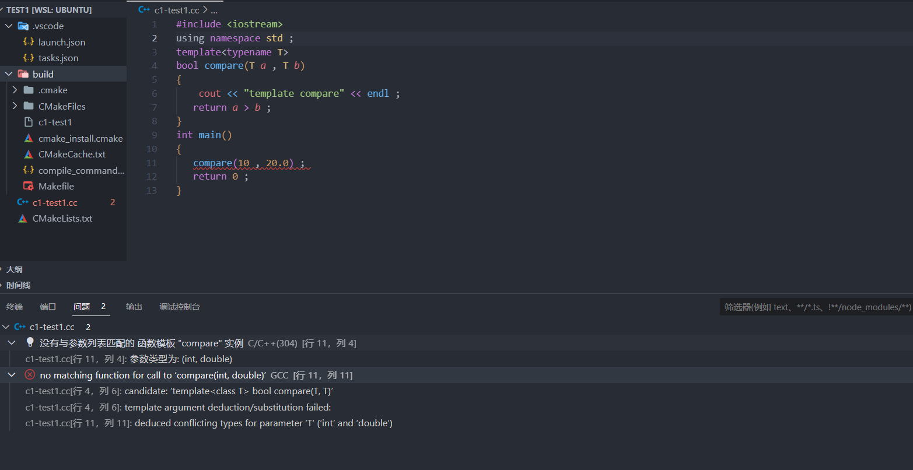
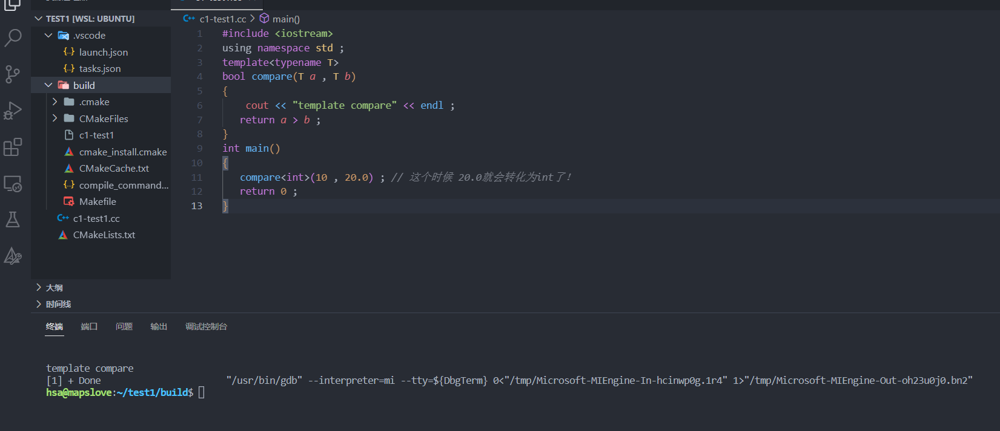
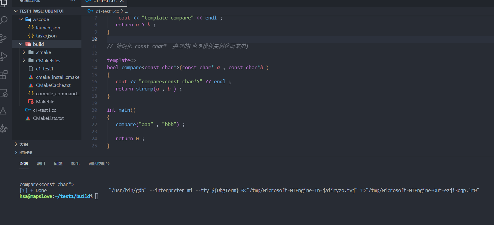
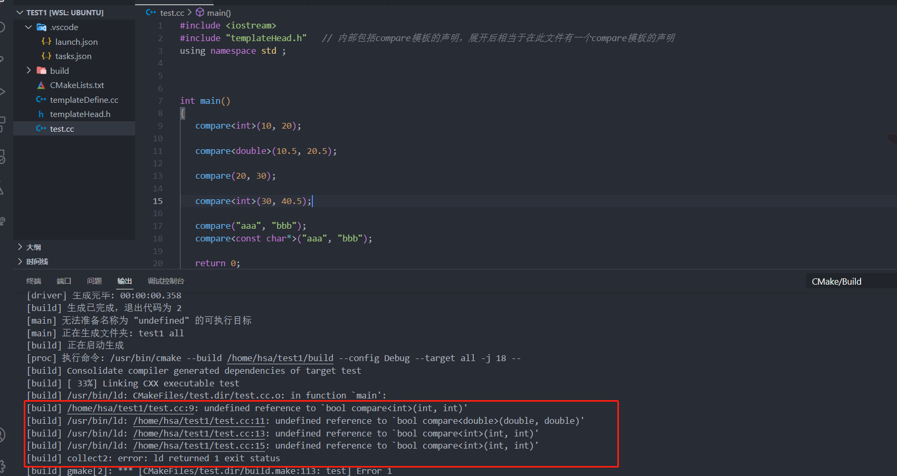

### 理解函数模板


#### 模板的意义： 

+ 对类型也可以进行参数化

+ 主要用于`C++`的库的开发
+ 程序员只需要注重对**函数内部的逻辑的实现**

#### 需要搞清楚的概念：

+ 函数模板     《= 不进行编译，因为类型不知道
+ 模板的实例化    《=  函数调用点进行实例化
+ 模板函数         《=  这个才是被编译器所编译的
+ 模板类型参数 ：通过 `typename/class` 定义
+ 模板非类型参数
+ 模板的实参推演  =》根据用户传入的实参类型，来推导模板类型 
+ 模板的特例化    =》 特殊(不是编译器提供的，而是开发者提供的)的实例化
+ 非模版函数的重载关系

#### 函数模版的特点

+ 无法编译
+ 当调用的时候才会实例化

#### 基础定义形式

```C++ 
template<typename T> // 使用关键字typename 或者 class 均可，但前者更加直观
bool compare(T a , T b)
{
  	cout << "template compare" << endl ; 
   return a > b ; 
}

int main()
{
   // 我们根据函数模板实例化出来的函数叫做 模板函数  bool compare(int , int)
   compare<int>(10 , 20) ; // 完整写法
   
   // 简单写法
   compare(10 , 20) ; 
   
    
   
   return 0 ; 
}
```

定义一个**函数模板**，其中模板类型参数为**`T`** 。 

**为什么可以存在两种实例化的方式**：当我们调用一个函数模板时，编译器(通常)用函数实参来为我们推断模板实参。编译器使用实参的类型来确定绑定到模板参数`T`的类型。所以我们在**函数模板**的实例化中可以**不指定模版参数** (因为编译器会隐式的推断)。

```C++ 
// 在main函数中的 

compare<int>(10 , 20) ;  //函数调用点
```

**在函数调用点** ， 编译器使用用户指定的类型，从原模板实例化一份函数代码出来：

```C++
bool compare<int>(int a , int b)
{	
	return a > b ; 
}
```

这个实例化出来的函数叫做**模板函数**

**根据函数模板进行实例化出来的模版函数**，在一份源文件中会产生一个，并且会在**符号表中产生符号**。 

#### 函数模版的重点掌握

+ 在**模版参数推演的过程中容易出现以下错误：**

  > ```C++
  > #include <iostream>
  > using namespace std ;
  > template<typename T> 
  > bool compare(T a , T b)
  > {
  >   	cout << "template compare" << endl ; 
  >    return a > b ; 
  > }
  > int main()
  > {
  >    compare(10 , 20.0) ; 
  >    return 0 ; 
  > }
  > ```
  >
  > 
  >
  > **这是模板参数类型推断中的常见错误**
  >
  > **解决方式**：**显示的**指定模板参数的类型！
  >
  > ```C++
  > #include <iostream>
  > using namespace std ; 
  > template<typename T> 
  > bool compare(T a , T b)
  > {
  >   	cout << "template compare" << endl ; 
  >    return a > b ; 
  > }
  > int main()
  > {
  >    compare<int>(10 , 20.0) ; // 这个时候 20.0就会转化为int了！ 
  >    return 0 ; 
  > }
  > ```
  >
  > 


+ **模板特例化的应用场景**

  > 对于某些类型来说，依赖编译器默认实例化的模版代码，代码处理逻辑是存在错误的：
  >
  > ```C++
  > #include <iostream>
  > using namespace std ; 
  > template<typename T> 
  > bool compare(T a , T b)
  > {
  >   	cout << "template compare" << endl ; 
  >    return a > b ; 
  > }
  > int main()
  > {
  >    compare("aaa" , "bbb") ; 
  >    
  >    return 0 ; 
  > }
  > ```
  >
  > 上述代码虽然能运行，但是`T`被推演出的类型为`const char * `  , 在内部比较的时候相当于比较的是指针的大小，实际上应该调用字符函数`strcmp()`。
  >
  > **解决方式**:==模板特例化==
  >
  > ```C++
  > #include <iostream>
  > #include <cstring>
  > using namespace std ; 
  > template<typename T> 
  > bool compare(T a , T b)
  > {
  >   	cout << "template compare" << endl ; 
  >    return a > b ; 
  > }
  > 
  > // 特例化 const char*  类型的(也是模板实例化而来的)
  > template<>
  > bool compare<const char*>(const char* a , const char*b )
  > {
  >    cout << "compare<const char*>" << endl ; 
  >    return strcmp(a , b ) ;  
  > }
  > 
  > int main()
  > {
  >    compare("aaa" , "bbb") ; 
  >    return 0 ; 
  > }
  > ```
  >
  > 
  >
  > 

+ **当源文件中存在和函数模版同名的普通函数，如果处理的是相同的类型并且调用点只有函数名没有模版类型参数，函数模版不会被实例化，而是直接调用普通函数**

  ```C++
  #include <iostream>
  #include <cstring>
  using namespace std ; 
  template<typename T> 
  bool compare(T a , T b)
  {
    	cout << "template compare" << endl ; 
     return a > b ; 
  }
  
  // 特例化 const char*  类型的(也是模板实例化而来的)
  template<>
  bool compare<const char*>(const char* a , const char*b )
  {
     cout << "compare<const char*>" << endl ; 
     return strcmp(a , b ) ;  
  }
  
  // 普通函数
  bool compare(const char* a , const char* b)
  {
    	cout << "normal compare" << endl ; 
     return a > b ; 
  }
  
  
  int main()
  {
     
     //编译器优先把compare 处理成为函数名字， 如果没有，才去找compare的模版
     compare("aaa" , "bbb") ; 
     
     
     return 0 ; 
  }
  ```

  


#### 示例代码

```C++
#include <iostream>
using namespace std;

// 函数模板
template<typename T> // 定义一个模板参数列表
bool compare(T a, T b) // compare是一个函数模板
{
	cout << "template compare" << endl;
   // 如果 T 是自定义类型的话，就会调用重载的 > 运算符了。
   return a > b ;  
}

// 告诉编译器，进行指定类型的模板实例化
template bool compare<int>(int, int);
template bool compare<double>(double, double);

// 针对compare函数模板，提供const char*类型的特例化版本
template<>
bool compare<const char*>(const char *a, const char *b)
{
	cout << "compare<const char*>" << endl;
	return strcmp(a, b) > 0;
}

// 非模板函数 - 普通函数
bool compare(const char*a, const char*b)
{
	cout << "normal compare" << endl;
	return strcmp(a, b) > 0 ;
}
```

#### 多文件工程下的模板的使用

> 如果把模板定义和调用模板的代码分离出来，会出现什么结果
>
> **`templateDefine.cpp`**
>
> ```C++
> #include <iostream>
> #include <cstring>
> using namespace std;
> 
> // 函数模板
> template<typename T> // 定义一个模板参数列表
> bool compare(T a, T b) // compare是一个函数模板
> {
> 	cout << "template compare" << endl;
>    // 如果 T 是自定义类型的话，就会调用重载的 > 运算符了。
>    return a > b ;  
> }
> 
> // 针对compare函数模板，提供const char*类型的特例化版本
> template<>
> bool compare<const char*>(const char *a, const char *b)
> {
> 	cout << "compare<const char*>" << endl;
> 	return strcmp(a, b) > 0;
> }
> 
> // 非模板函数 - 普通函数
> bool compare(const char*a, const char*b)
> {
> 	cout << "normal compare" << endl;
> 	return strcmp(a, b) > 0 ;
> }
> 
> ```
>
> **`templateHead.h`**
>
> ```C++
> #ifndef ADDITION_H
> #define ADDITION_H
> 
> // 函数模板的声明。
> template<typename T>
> bool compare(T a , T b ) ;
> 
> #endif 
> ```
>
> 
>
> **`test.cc`**
>
> ```C++
> #include <iostream>
> #include "templateHead.h"   // 内部包括compare模板的声明，展开后相当于在此文件有一个compare模板的声明
> using namespace std ; 
> 
> 
> int main()
> {
> 	compare<int>(10, 20);
>    
> 	compare<double>(10.5, 20.5);
> 	
>    compare(20, 30);
> 	
>    compare<int>(30, 40.5);
> 
> 	compare("aaa", "bbb");
> 	compare<const char*>("aaa", "bbb");
> 
> 	return 0;
> }
> ```
>
> 
>
> **报错原因**
>
> ```markdown
> 在templateDefine.cc 源文件中 ， 产生了 15 , 23 行的两个函数的函数符号，因为compare为模版，而模板是不被编译的 。
> 
> 在`test.cc` 文件中的:
> compare<int>(10, 20);
> compare<double>(10.5, 20.5);
> compare(20, 30);	
> compare<int>(30, 40.5);
> 以上四行代码均需要模版的实例化 ， 四者和在 `test.cc`中的compare类模板的声明共同作用下在符号表中产生了  函数引用的符号：
> compare<int> *UND*
> compare<double> *UND*
> 
> 在链接时期，需要找到两个函数的定义的位置，但由于在templateDefine.cc 文件中compare模版不会被编译，所以会报错，说是链接错误。
> 
> ```
>
> **解决方式**
>
> **`Version1`**: 如果还想保持这种**模板定义**和**调用点代码** 分离的形式，需要在**模板定义源文件**(`templateDefine.cc`)指定编译器生成相应`compare`实例化类型。
>
> ```C++
> // 告诉编译器，进行指定类型的模板实例化 , 不需要等到调用的时候在实例化
> // 实例化出 compare<int,int>  和 compare<double , double> 
> // 实例化定义:
> template bool compare<int>(int, int);
> template bool compare<double>(double, double) ; 
> 
> /*
> 相当于实例化出函数
> bool compare(int a, int b) 
> {
> 	cout << "template compare" << endl;
>    return a > b ;  
> }
> 
> bool compare(double a, double b) 
> {
> 	cout << "template compare" << endl;
>    return a > b ;  
> }
> */
>    
> 
> 注：类模板的实例化定义会实例化出该模板的所有成员，包括内联的成员函数，故所用类型必须能够用于模板的所有成员函数
> 
> ```
>
> **从而保证在寻找`test.cc`中的函数的定义的时候能够找到!** , 但这种形式有缺点，**一旦用户需要使用的类型比较多，代码会非常冗余!**
>
> 
>
> **`Version2`**:**在头文件中定义模版**  ， ==这种形式是最好的==
>
> `templateHead.h`
>
> ````C++
> #include <iostream>
> #include <cstring>
> using namespace std;
> 
> // 函数模板
> template<typename T> // 定义一个模板参数列表
> bool compare(T a, T b) // compare是一个函数模板
> {
> 	cout << "template compare" << endl;
>    // 如果 T 是自定义类型的话，就会调用重载的 > 运算符了。
>    return a > b ;  
> }
> 
> // 针对compare函数模板，提供const char*类型的特例化版本
> template<>
> bool compare<const char*>(const char *a, const char *b)
> {
> 	cout << "compare<const char*>" << endl;
> 	return strcmp(a, b) > 0;
> }
> 
> // 非模板函数 - 普通函数
> bool compare(const char*a, const char*b)
> {
> 	cout << "normal compare" << endl;
> 	return strcmp(a, b) > 0 ;
> }
> 
> ````
>
> `test.cc`
>
> ```C++
> #include <iostream>
> #include "templateHead.h"   // 内部包括compare模板的定义
> using namespace std ; 
> int main()
> {
> 	compare<int>(10, 20);
>    
> 	compare<double>(10.5, 20.5);
> 	
>    compare(20, 30);
> 	
>    compare<int>(30, 40.5);
> 
> 	compare("aaa", "bbb");
> 	compare<const char*>("aaa", "bbb");
> 
> 	return 0;
> }
> ```


### 非类型模板参数

> 一个非类型模板参数表示一个值而非一个类型。我们通过一个特殊的类型名而非关键字`class` 或`typename` 来指定非类型参数
>
> 当一个模板被实例化时，非类型参数被一个**用户提供**的或**编译器推断出的值所代替**，**这些值必须是常量表达式，从而允许编译器在编译时实例化模板**，例如：
>
> ```C++
> template<unsigned N , unsigned M>
> int compare(const char (&p1)[N] , const char (&p2)[M] )
> {
>    return strcmp(p1 , p2) ; 
> }
> 
> int main()
> {
>    compare("hi" , "mom" ) ; 
>    return 0 ; 
> }
> ```
>
> 编译器会根据传入的常量数组的大小推断出**非类型模版参数** `N` 和`M`的值，需要注意**编译器会在一个字符串常量的末尾插入一个空字符作为终结符**故会实例化出：
>
> ```C++
> int comapre(const char (&p1)[3] , const char (&p2)[4] ) ; 
> ```

+ 一个非类型参数可以是一个整型(`int , unsigned int , short , unsigned short , long , unsigned long , long long , unsigned long long  ` )  , 或者是一个指向**对象**或**函数类型**的指针或**(左值)引用** ， 绑定到**非类型整型参数** 的实参必须是一个常量表达式。绑定到指针或引用非类型参数的实参必须具有静态的生存期。我们不能用一个普通(非`static`)局部对象或动态对象作为**指针或引用非类型模板参数** 的实参。指针参数也可以用`nullptr` 或一个值为0的常量表达式来实例化。
+ 在模板定义内，模板非类型参数是一个常量值。在需要常量表达式的地方，可以使用非类型参数，例如，指定数组大小。


**非类型模板参数的模板实参必须是常量表达式！**


