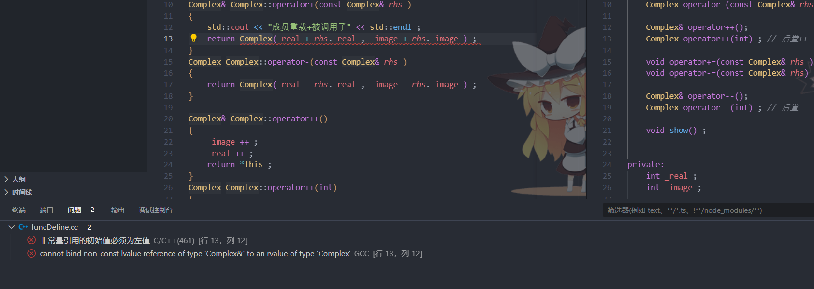
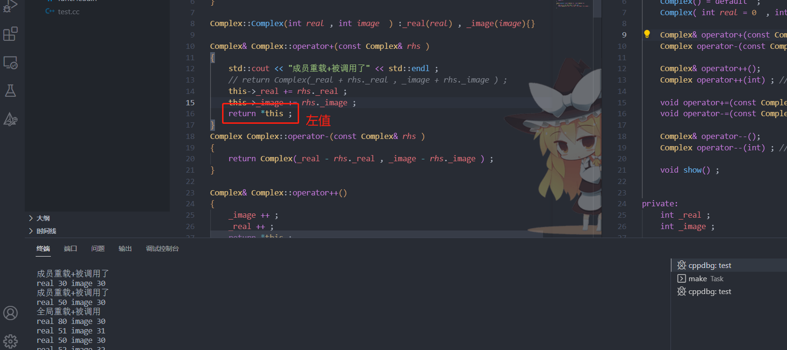
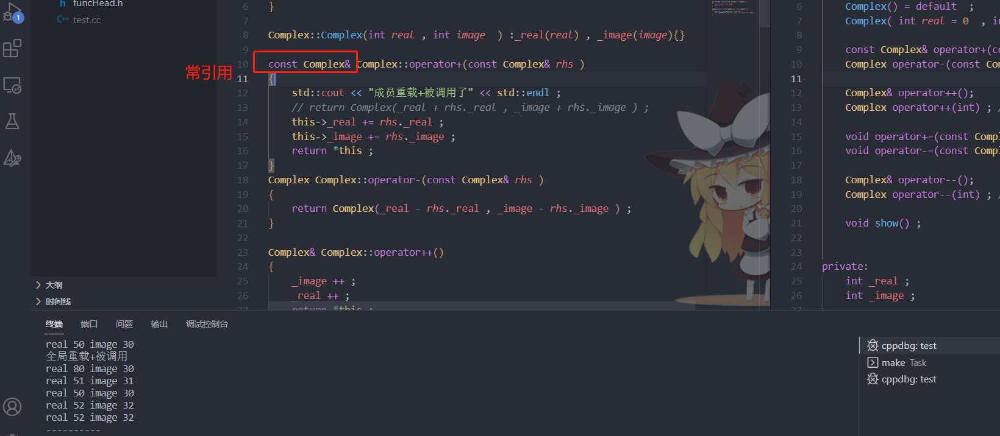
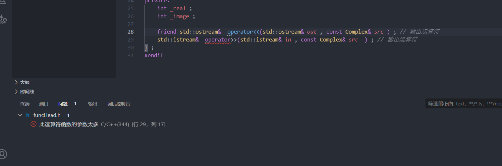
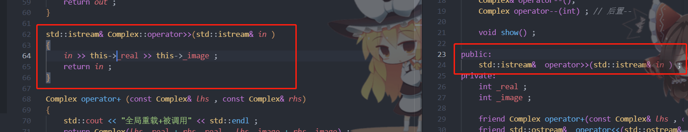

### **通过运算符重载实现复数类**


#### 前置知识

+ `C++`的运算符重载：使对象的运算表现得和编译器内置类型一样

+ 基本形式：

  ```C++
  T operator+(参数列表)
  {
     /*
     	重载内部逻辑实现
     */
  }
  ```

#### 通过运算符实现复数类的重载

+ 需要重载的运算符函数的声明

  > ```C++
  > Complex operator+(const Complex& rhs ) ; 
  > Complex operator-(const Complex& rhs ) ;
  > 
  > 
  > Complex& operator++();
  > Complex operator++(int) ; // 后置++
  > 
  > void operator+=(const Complex& rhs ) ; 
  > void operator-=(const Complex& rhs) ; 
  > 
  > Complex& operator--();
  > Complex operator--(int) ; // 后置--
  > 
  > // 下面三个运算符重载为全局的。
  > Complex operator+(const Complex& lhs , const Complex& rhs) ; 
  > ostream&  operator<< (ostream& out , const Complex& src ) ; // 输出运算符
  > istream&  operator>> (istream& in , const Complex& src  ) ; // 输出运算符
  > ```
  >
  > **编译器做对象运算的时候，会调用对象的运算符重载函数（优先调用成员方法）；如果没有成员方法就在全局作用域找合适的运算符重载函数**。
  >
  > + 重载运算符`<<` 和`>> ` 的返回类型为**流对象** ， 需要满足连续的输入和输出。
  >
  > + **全局重载运算符需要声明为`Complex`类的友元函数**
  >
  >   ```C++
  >   friend Complex operator+(const Complex& lhs , const Complex& rhs) ;
  >   
  >   // 注意这里的流对象不能是const 类型的
  >   friend ostream&  operator<< (ostream& out , const Complex& src ) ; 
  >   friend istream&  operator>> (istream& in , const Complex& src  ) ;
  >   ```

+ `ComplexHead.h`

  ```C++
  #ifndef MYCLASS
  #define MYCLASS
  #include <iostream>
  class Complex{
     public:
     Complex() = default  ; 
     Complex( int real = 0  , int image = 0) ; 
  
     const Complex& operator+(const Complex& rhs ) ;
     Complex operator-(const Complex& rhs ) ;
  
     Complex& operator++();
     Complex operator++(int) ; // 后置++
  
     void operator+=(const Complex& rhs ) ; 
     void operator-=(const Complex& rhs) ; 
  
     Complex& operator--();
     Complex operator--(int) ; // 后置--
  
     void show() ; 
  
  
     private:
     int _real ; 
     int _image ;
  
     friend Complex operator+(const Complex& lhs , const Complex& rhs) ; 
     friend std::ostream&  operator<<(std::ostream& out , const Complex& src ) ; // 输出运算符
     friend std::istream&  operator>>(std::istream& in , Complex& src  ) ; // 输出运算符
  } ;
  #endif 
  ```

  

+ `main.cc` 

  ```C++
  #include <iostream>
  #include "`ComplexHead.h"
  int main()
  {  
  
     Complex comp1(10, 10) ; 
  	Complex comp2(20, 20) ; 
  
  	// comp1.operator+(comp2) 加法运算符的重载函数
  	Complex comp3 = comp1 + comp2;
  	comp3.show();
  	Complex comp4 = comp1 + 20 ; // comp1.operator+(20) int->Complex  Complex(int)
  	comp4.show();
     
  	//            ::operator+(30, comp1)
  	Complex comp5 = 30 + comp1;
  	comp5.show() ; 
  
  	comp5 = comp1++; // ++ --单目运算符  operator++() 前置++  operator++(int) 后置++
  	comp1.show();
  	comp5.show();
  	//   Complex operator++()
  	comp5 = ++comp1;
  	comp1.show();
  	comp5.show();
  
  	// void comp1.operator+=(comp2)   ::operator+=(comp1, comp2)
  	comp1 += comp2;
  	
     //comp1.show(); // 对象信息的输出
  	//cout ::operator<<(cout, comp1)   void << endl;
  	//ostream& operator<<(ostream &out, const   Complex &src)
     
     std::cout << "----------" << std::endl ; 
  
  	std::cout << comp1 << std::endl;
  	std::cin >> comp1 >> comp2;
  	std::cout << comp1 << comp2 << std::endl;
  
      return 0;
  }
  ```

  

+ `ComplexDefine.cc`

  ```C++
  #include "ComplexHead.h" 
  #include <iostream>
  void Complex::show()
  {
      std::cout << "real " << _real << " image " << _image << std::endl ;  
  }   
  
  Complex::Complex(int real , int image  ) :_real(real) , _image(image){}
  
  const Complex& Complex::operator+(const Complex& rhs )
  {
      std::cout << "成员重载+被调用了" << std::endl ; 
      // return Complex(_real + rhs._real , _image + rhs._image ) ;  
      this->_real += rhs._real ; 
      this->_image += rhs._image ; 
      return *this ; 
  }
  Complex Complex::operator-(const Complex& rhs )
  {
      return Complex(_real - rhs._real , _image - rhs._image ) ; 
  }
  
  Complex& Complex::operator++()
  {   
      _image ++ ; 
      _real ++ ; 
      return *this ; 
  }
  Complex Complex::operator++(int)
  {
      return Complex(_real++ , _image++ ) ; 
  }
  
  void Complex::operator+=(const Complex& rhs )
  {
      _real = _real + rhs._real ; 
      _image = _image + rhs._image ; 
  }
  void Complex::operator-=(const Complex& rhs ) 
  {
      _real = _real - rhs._real ; 
      _image = _image - rhs._image ;
  }
  
  Complex& Complex::operator--()
  {   
      _image -- ; 
      _real -- ; 
      return *this ; 
  }
  Complex Complex::operator--(int)
  {
      return Complex(_real-- , _image--) ; 
  }
  
  std::ostream&  operator<<(std::ostream& out , const Complex& src ) 
  {
      out << "real " << src._real << " image " << src._image ; 
      return out ;  
  }
  
  std::istream&  operator>>(std::istream& in , Complex& src ) 
  {
      in >> src._real >> src._image ; 
      return in ;   
  }
  
  Complex operator+ (const Complex& lhs , const Complex& rhs)
  {
      std::cout << "全局重载+被调用" << std::endl ; 
      return Complex(lhs._real + rhs._real , lhs._image + rhs._image) ; 
  }
  
  ```

###需要解决的问题


+ 重载运算符`+` 的返回值是`Complex`  而不是`void ` 因为可能需要连续`+` ; ==这里可不可以返回`Complex&`?==

  **可以，不过我们实际返回的类型不能是局部变量**。

  解答：

  > 如果返回为`Complex&` 的话，假如有语句`Complex test =  comp1 + comp2 `  即使左侧返回的是引用，在赋给`test`的时候会执行拷贝构造函数。而不是将左侧返回的引用绑定到一个类型变量身上。
  >

  出现问题：

  

  

  + 错误点：**非常量引用的初始值必须是左值**

    > ```C++
    > Complex(_real + rhs._real , _image + rhs._image ) ;  
    > ```
    >
    > 构造的是一个临时对象，属于右值，不能引用不能绑定到右值身上！

  + 如果修改代码逻辑将实际返回类型修改为左值，然后函数返回类型修改为**引用**或者**常引用** 的结果：

    + 引用： `ok` 代码没问题

      

    + 常引用： `ok` 代码没问题

      

  + ==**为了保证和标准库的`+`运算符保持一致(标准库返回的就是一个右值)，虽然重载`+`的返回类型可以是`Conplex&` 或者`const Complex&` , 但我们应该将返回类型设置为`Complex`**==

+ 构造函数的默认参数在声明的时候给出还是在定义的时候给出？ 

  > + 构造函数在类内声明时提供了默认参数，在定义时就不能而不是不需要提供，提供就会造成重定义错误
  >
  > + 当采用**分离式编译**的时候，将**类的构造函数**放在一个`.cc`文件中将**类的声明**放在`.h`文件中，类的构造函数的**形参缺省值**应该在类中的**构造函数声明**中出现，因为不能重复定义，所以不能在类的`.cc`文件中再给构造函数提供**缺省值**了。当在使用类创建对象的`.cc`文件中我们传给构造函数的参数导致**需要使用到缺省值** ， ==如果在`.h`文件中类的构造函数的**形参缺省值**在类中的**构造函数声明**中**没有**出现== ，这个时候就会报错。**所以，类的构造函数最好是在类内进行定义** 。 

+ 类的友元声明放到，`public`和`private`的区别：

  > **友元声明只能出现在类定义的内部，但是在类内出现的具体位置不限**。**友元不是类的成员也不受它所在区域访问控制级别的约束**。==一般来说，最好在类定义开始或结束前的位置集中声明友元==。

  


+ 出现这种错误的解决方法

  

  + 为什么会报参数过多的错误？

    >  成员函数重载 `>>` 运算符的语法比较特殊，它不返回任何值（void），而是将数据直接存储在类的成员变量中。
    >
    > 在成员函数重载 `>>` 运算符时，**只能接受一个输入流对象参数**。这是因为成员函数内部已经可以访问类的其他成员变量，因此不需要额外的参数。
  > + 如果重载操作符`>>` 为`Complex` 类的内置函数，修改代码为：
  >
  >   
  >
  > + 我们的调用形式就应该是：
  >
  >   ```C++
  >     comp1.operator>>(std::cin) ;    // 注意将其在类中的声明调到public权限下！
  >   ```
  >
  > + **这种方法虽然行得通但和我们普通的形式是大大的不同的！** ， 最好的办法是：==**将`>>`运算符重载为全局的方法，而不是成员方法**== 


