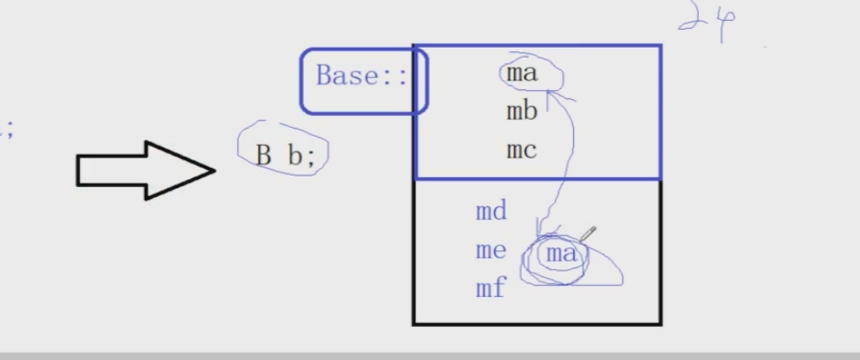
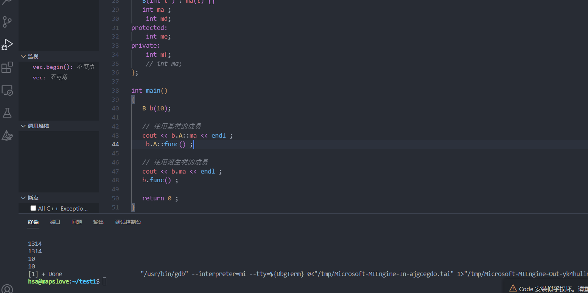

### 继承的基本意义

> + 可以做代码的复用
> + 在基类中给所有派生类提供统一的虚函数接口，让派生类进行重写，然后就可以使用多态了

**继承的存在的意义**：

+ ==代码的复用==: 它允许一个类（称为派生类或子类）从另一个类（称为基类或父类）继承属性和行为。继承的本质是子类从父类那里继承了父类的成员变量和成员函数，并且可以添加自己的成员变量和成员函数。

  > ```C++
  > #include <iostream>
  > using namespace std ; 
  > class A
  > {
  > public:
  > 	int ma;
  > protected:
  > 	int mb;
  > private:
  > 	int mc; // 自己或者友元能访问私有的成员
  > };
  > //继承 A 基类/父类   B 派生类/子类
  > class B : public A 
  > {
  > public:
  > 	void func() 
  > 	{
  > 		cout << ma << endl;
  > 	}
  > 	int md;
  > protected:
  > 	int me;
  > private:
  > 	int mf;
  > 	// int ma;
  > };
  > 
  > int main()
  > {
  > B b; 
  > 
  > return 0 ;
  > }
  > ```
  >
  > 上述代码中，**在`x86`体系下**对象`b`的大小是24(6个`int`类型的对象，一个4字节)。内存图为：
  >
  > 
  >
  > **即使在派生类中存在和基类相同名称的变量**：可以理解为==继承的时候连通作用域也一起继承了下来== 。
  >
  > 如果想访问派生类对象继承的基类的**同名函数**或对象可以这样写：
  >
  > ```C++
  > #include <iostream>
  > using namespace std ; 
  > class A
  > {
  > public:
  >  A()
  >  {
  >      ma = 1314 ; 
  >  }
  > void func()
  > {
  >    cout << ma << endl ; 
  > }
  > 	int ma;
  > protected:
  > 	int mb;
  > private:
  > 	int mc; // 自己或者友元能访问私有的成员
  > };
  > //继承 A 基类/父类   B 派生类/子类
  > class B : public A 
  > {
  > public:
  > 	void func() 
  > 	{
  > 		cout << ma << endl;
  > 	}
  > B(int t ) : ma(t) {}
  > int ma ; 
  > 	int md;
  > protected:
  > 	int me;
  > private:
  > 	int mf;
  > 	// int ma;
  > };
  > 
  > int main()
  > {
  > B b(10); 
  > 
  > // 使用基类的成员
  > cout << b.A::ma << endl ; 
  >  b.A::func() ;
  > 
  > // 使用派生类的成员
  > cout << b.ma << endl ; 
  > b.func() ; 
  > 
  > return 0 ;
  > }
  > ```
  >
  > 
  >
  > 

  


**类和类之间的关系**

+ 组合：`a part of `   一部分的关系

+ 继承 : `a kind of  `  一种的关系 

  > 派生类对于从**基类继承的成员变量和成员方法**的访问限定如何？
  >
  > ==基类中的成员在子类中的访问权限一定`<=` min(继承限定符 ， 基类中的访问权限)== ，规则是：开放性越小，其优先级越小，并且 优先级`public > protected > private > 不可见的` ;
  >
  > + `public` 继承:  在基类`A`中访问权限为`public    protected    private` 以`public` 方式让`B` 继承之后，`A` 中的**成员（成员变量、成员函数）**在`B` 中的权限分别为`public   protected    不可见的 ` ， 在外部(`main`函数中)的访问权限为`YES   NO    NO `
  >
  >   > ```C++
  >   > #include <iostream>
  >   > using namespace std;
  >   > class A
  >   > {
  >   > public:
  >   > 	A(int t) { ma = t ; }
  >   > 	void func1()
  >   > 	{
  >   > 		cout << ma << endl;
  >   > 	}
  >   > 
  >   > 
  >   > 	int ma;
  >   > protected:
  >   > 	void func2()
  >   > 	{
  >   > 		cout << mb << endl;
  >   > 	}
  >   > 	int mb;
  >   > private:
  >   > 	int mc; // 自己或者友元能访问私有的成员
  >   > 	void func3()
  >   > 	{
  >   > 		cout << mc << endl;
  >   > 	}
  >   > };
  >   > class B : public A
  >   > {
  >   > public:
  >   > 	B(int t) : A(t) {}
  >   > 
  >   > 	void func4()
  >   > 	{
  >   > 		cout << mc << endl;
  >   > 	}
  >   > 	void func5()
  >   > 	{
  >   > 		cout << mb << endl;
  >   > 		// 可以访问基类为protected 的成员，
  >   > 	}
  >   > protected:
  >   > 	int me;
  >   > private:
  >   > 	int mf;
  >   > };
  >   > 
  >   > int main()
  >   > {
  >   > 	B b(10);
  >   > 
  >   > 	// 基类中的public在派生类中为public
  >   > 	cout << b.ma << endl;
  >   > 	b.func1();
  >   > 
  >   > 	// 基类中的protected 在派生类中为 protected 
  >   > 	cout << b.mb << endl;  // 报错: 无法访问protected 成员(在"A"类中声明)
  >   > 	b.func2();             // 报错: 无法访问protected 成员(在"A"类中声明)
  >   > 
  >   > 
  >   > 	// 基类中的private 在派生类中为 不可见的 
  >   > 	cout << b.mc << endl;   // 报错: 无法访问private 成员(在"A"类中声明)
  >   > 	b.func3();              // // 报错: 无法访问private 成员(在"A"类中声明)
  >   > 
  >   > 
  >   > 	return 0;
  >   > }
  >   > ```
  >   >
  >   >  **注意，基类的`private` 在此种继承模式下在子类中的访问权限为** **不可见的** **不能通过`b`的成员方法来访问，==基类的私有成员即使被子类继承，其也只能被基类函数或者友元访问！==**
  >
  > + `protected` 继承:  在基类`A`中访问权限为`public    protected    private` 以`protected` 方式让`B` 继承之后，`A` 中的**成员（成员变量、成员函数）**在`B` 中的权限分别为`protected   protected    不可见的 ` ， 在外部(`main`函数中)的访问权限为`NO   NO    NO `
  >
  >   > ```C++
  >   > #include <iostream>
  >   > using namespace std;
  >   > class A
  >   > {
  >   > public:
  >   > 	A(int t) { ma = t ; }
  >   > 	void func1()
  >   > 	{
  >   > 		cout << ma << endl;
  >   > 	}
  >   > 
  >   > 
  >   > 	int ma;
  >   > protected:
  >   > 	void func2()
  >   > 	{
  >   > 		cout << mb << endl;
  >   > 	}
  >   > 	int mb;
  >   > private:
  >   > 	int mc; // 自己或者友元能访问私有的成员
  >   > 	void func3()
  >   > 	{
  >   > 		cout << mc << endl;
  >   > 	}
  >   > };
  >   > class B : protected A
  >   > {
  >   > public:
  >   > 	B(int t) : A(t) {}
  >   > 
  >   > 	void func4()
  >   > 	{
  >   > 		cout << mc << endl; // "A::mc": 无法访问 private 成员(在“A”类中声明)
  >   > 	}
  >   > 	void func5()
  >   > 	{
  >   > 		cout << mb << endl;
  >   > 		// 可以访问基类为protected 的成员，
  >   > 	}
  >   > protected:
  >   > 	int me;
  >   > private:
  >   > 	int mf;
  >   > };
  >   > 
  >   > int main()
  >   > {
  >   > 	B b(10);
  >   > 
  >   > 	// 基类中的public 在派生类中为 protected
  >   > 	cout << b.ma << endl; // 错误 “A::ma”不可访问，因为“B”使用“protected”从“A”继承
  >   > 	b.func1(); // 错误: “A::func1”不可访问，因为“B”使用“protected”从“A”继承
  >   > 
  >   > 	// 基类中的protected 在派生类中为 protected 
  >   > 	cout << b.mb << endl;  //  error C2248: “A::mb”: 无法访问 protected 成员(在“A”类中声明)
  >   > 	b.func2();             //  error C2248: “A::func2()”: 无法访问 protected 成员(在“A”类中声明)
  >   > 
  >   > 
  >   > 	// 基类中的private 在派生类中为 不可见的 
  >   > 	cout << b.mc << endl;   //  error C2248: “A::mc”: 无法访问 private 成员(在“A”类中声明)
  >   > 	b.func3();              // error C2248: “A::func3”: 无法访问 private 成员(在“A”类中声明)
  >   > 
  >   > 
  >   > 	return 0;
  >   > }
  >   > ```
  >   >
  >   >  **注意，基类的`private` 在此种继承模式下在子类中的访问权限为** **不可见的** **不能通过`b`的成员方法来访问，==基类的私有成员即使被子类继承，其也只能被基类函数或者友元访问！==**
  >
  > + `private` 继承:  在基类`A`中访问权限为`public    protected    private` 以`protected` 方式让`B` 继承之后，`A` 中的**成员（成员变量、成员函数）**在`B` 中的权限分别为`private   private   不可见的 ` ， 在外部(`main`函数中)的访问权限为`NO   NO    NO `
  >
  >   > ```C++
  >   > #include <iostream>
  >   > using namespace std;
  >   > class A
  >   > {
  >   > public:
  >   > 	A(int t) { ma = t ; }
  >   > 	void func1()
  >   > 	{
  >   > 		cout << ma << endl;
  >   > 	}
  >   > 
  >   > 
  >   > 	int ma;
  >   > protected:
  >   > 	void func2()
  >   > 	{
  >   > 		cout << mb << endl;
  >   > 	}
  >   > 	int mb;
  >   > private:
  >   > 	int mc; // 自己或者友元能访问私有的成员
  >   > 	void func3()
  >   > 	{
  >   > 		cout << mc << endl;
  >   > 	}
  >   > };
  >   > class B : private A
  >   > {
  >   > public:
  >   > 	B(int t) : A(t) {}
  >   > 
  >   > 	void func4()
  >   > 	{
  >   > 		cout << mc << endl; // "A::mc": 无法访问 private 成员(在“A”类中声明)
  >   > 	}
  >   > 	void func5()
  >   > 	{
  >   > 		cout << mb << endl;
  >   > 		// 可以访问基类为protected的成员，
  >   > 	}
  >   > protected:
  >   > 	int me;
  >   > private:
  >   > 	int mf;
  >   > };
  >   > 
  >   > int main()
  >   > {
  >   > 	B b(10);
  >   > 
  >   > 	// 基类中的public 在派生类中为 private
  >   > 	cout << b.ma << endl; //error C2247: “A::ma”不可访问，因为“B”使用“private”从“A”继承
  >   > 	b.func1(); // 错误: “A::func1”不可访问，因为“B”使用“private”从“A”继承
  >   > 
  >   >    
  >   > 	// 基类中的protected 在派生类中为 private
  >   > 	cout << b.mb << endl;  //   error C2248: “A::mb”: 无法访问 protected 成员(在“A”类中声明)
  >   > 	b.func2();             //  error C2248: “A::func2()”: 无法访问 protected 成员(在“A”类中声明)
  >   > 
  >   > 	// 基类中的private 在派生类中为 不可见的 
  >   > 	cout << b.mc << endl;   // error C2248: “A::mc”: 无法访问 private 成员(在“A”类中声明)
  >   > 	b.func3();              // error C2248: “A::func3”: 无法访问 private 成员(在“A”类中声明)
  >   > 	return 0;
  >   > }
  >   > ```
  >   >
  >   > **注意，基类的`private` 在此种继承模式下在子类中的访问权限为** **不可见的** **不能通过`b`的成员方法来访问，==基类的私有成员即使被子类继承，其也只能被基类函数或者友元访问！==**
  >
  > + **如果是多重继承**：==**明确继承而来的成员的访问权限只需要看其在直接基类中的访问权限！！**==
  >
  >   ```C++
  >   // 因为在B中变量ma的权限为public并且C类是按照public继承的，所以ma在C中为public
  >   class A{
  >   public: 
  >      int ma ; 
  >   }
  >   class B : public A 
  >   {}
  >   class C : public B 
  >   {
  >   private:
  >   }
  >   // 因为在B中变量ma的权限为private并且C类是按照public继承的，所以ma在C中为private
  >   class A{
  >   public: 
  >      int ma ; 
  >   }
  >   class B : private A 
  >   {}
  >   class C : public B 
  >   {
  >   private:
  >   }
  >   ```
  >
  >
  >   ```
  > 
  > **总结：**
  > 
  > > + 外部只能访问对象`public`的成员，`protected`和`private`的成员无法直接访问
  > > + 在继承结构中，**派生类从基类可以继承过来`private`的成员，但是派生类却无法直接访问**
  > > + `protected`和`private`的区别？在基类中定义的成员，想被派生类访问，但是不想被外部访问，
  > >   那么在基类中，把相关成员定义成`protected`保护的；如果派生类和外部都不打算访问，那么
  > >   在基类中，就把相关成员定义成`private`私有的。
  > 
  > **默认的继承方式是什么？**
  > 要看派生类是用`class`定义的，还是`struct`定义的？
  > `class`定义派生类，默认继承方式就是`private`私有的
  > `struct`定义派生类，默认继承方式就是`public`私有的
  >   ```

