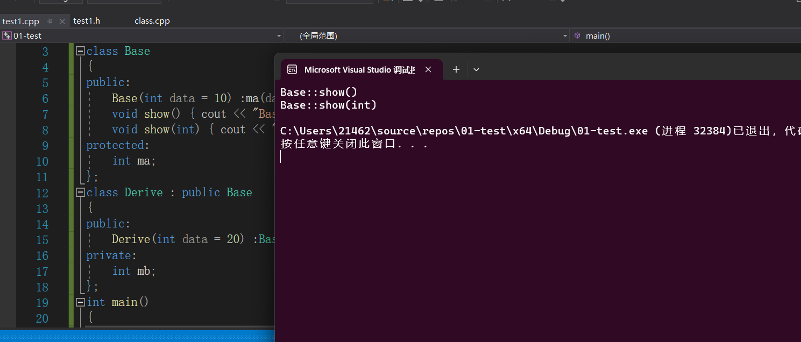
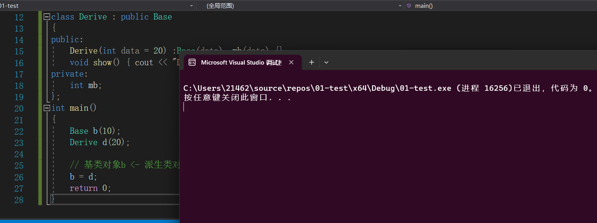
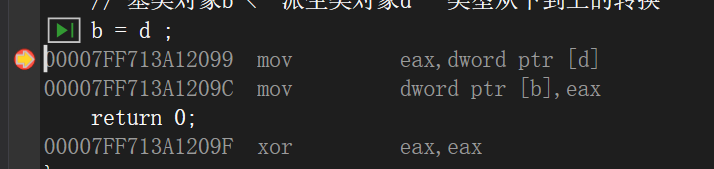
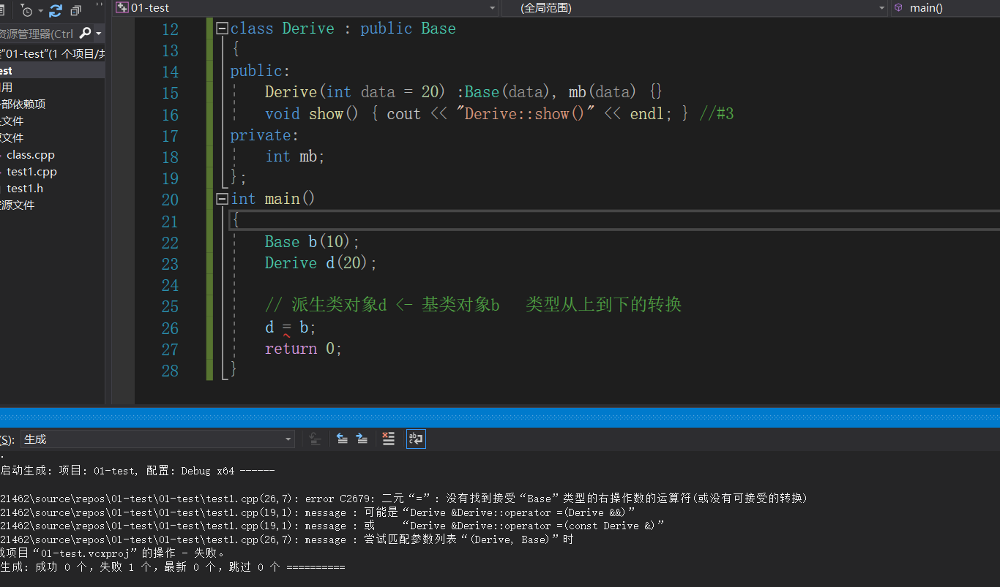
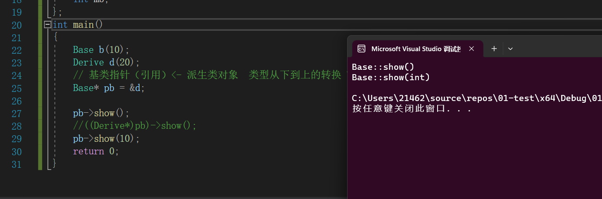
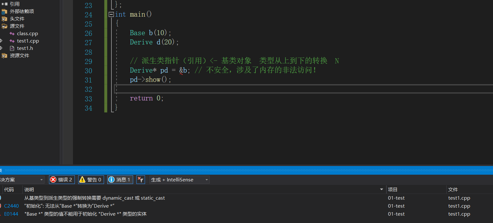
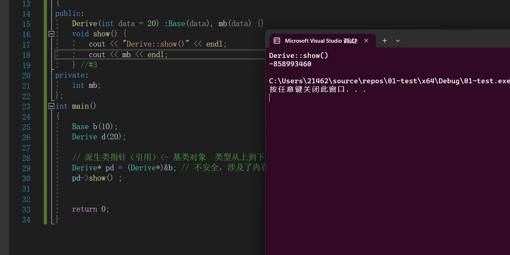

### `OOP`中的重载,隐藏，覆盖(覆盖的知识下一篇文章介绍)

#### 重载:一组函数要重载，==必须处在同一个作用域==当中；而且函数名字相同，参数列表不同。

> ```C++
> class Base
> {
> public:
> 	Base(int data = 10) :ma(data) {}
> 	void show() { cout << "Base::show()" << endl; } //#1
> 	void show(int) { cout << "Base::show(int)" << endl; }//#2
> protected:
> 	int ma;
> };
> class Derive : public Base 
> {
> public:
> 	Derive(int data = 20) :Base(data), mb(data) {}
> private:
> 	int mb;
> };
> int main()
> {
> 	Derive d ; 
> 	
>    d.show() ;
>    d.show(10) ; 
>    
>    return 0; 
> 
> } 
> ```
>
> 
>
> **基类中的show()方法构成了重载：** 一组函数要重载，==必须处在同一个作用域==当中；而且函数名字相同，参数列表不同。


#### 隐藏 : 主要指的是作用域的隐藏

> ```C++
> class Base
> {
> public:
> 	Base(int data = 10) :ma(data) {}
> 	void show() { cout << "Base::show()" << endl; } //#1
> 	void show(int) { cout << "Base::show(int)" << endl; }//#2
> protected:
> 	int ma;
> };
> class Derive : public Base 
> {
> public:
> 	Derive(int data = 20) :Base(data), mb(data) {}
> 	void show() { cout << "Derive::show()" << endl; } //#3
> private:
> 	int mb;
> };
> int main()
> {
> 	Derive d ; 
> 	
>    d.show() ;
>    d.show(10) ;  // 错误 "Derive::show 不接受1个"
>    
>    return 0; 
> 
> } 
> ```
>
> **隐藏**定义：**在继承结构中，派生类的同名成员，把基类的同名成员给隐藏调用了.如果一个函数名在基类和派生类相同，则在重载匹配的时候只在派生类的作用域内进行匹配，匹配不上则报错**。上述代码中的`Derive` 中的`show()`把`Base`类中的`show()`与`show(int)`隐藏了。 
>
> 当`d`调用`show()`的时候，==**只**==从派生类的作用域中进行**匹配** 。`ok` 可以匹配上
>
> 当`d`调用`show(int)`的时候，==**只**==从派生类的作用域中进行**匹配**  `no` 没有匹配的函数，报错!
>
> 如果想调用基类中的同名成员(假设`show()`的访问权限是`ok`的)，以`show`函数为例：
>
> ```C++
> class Base
> {
> public:
> 	Base(int data = 10) :ma(data) {}
> 	void show() { cout << "Base::show()" << endl; } //#1
> 	void show(int) { cout << "Base::show(int)" << endl; }//#2
> protected:
> 	int ma;
> };
> class Derive : public Base 
> {
> public:
> 	Derive(int data = 20) :Base(data), mb(data) {}
> 	void show() { cout << "Derive::show()" << endl; } //#3
> private:
> 	int mb;
> };
> int main()
> {
> 	Derive d ; 
> 	
>    d.show() ;
>    d.show(10) ;  // 错误 "Derive::show 不接受1个"
>    
>    d.Base::show() ; // ok 直接调用指定作用域内的函数。
>    return 0; 
> 
> } 
> ```


#### 继承中的类型转换问题

**把继承结构，也说成从上（基类）到下（派生类）的结构.**

> + 基类对象 `<-` 派生类对象
>
>   > ```C++
>   > class Base
>   > {
>   > public:
>   > 	Base(int data = 10) :ma(data) {}
>   > 	void show() { cout << "Base::show()" << endl; } //#1
>   > 	void show(int) { cout << "Base::show(int)" << endl; }//#2
>   > protected:
>   > 	int ma;
>   > };
>   > class Derive : public Base
>   > {
>   > public:
>   > 	Derive(int data = 20) :Base(data), mb(data) {}
>   > 	void show() { cout << "Derive::show()" << endl; } //#3
>   > private:
>   > 	int mb;
>   > };
>   > int main()
>   > {
>   > 	Base b(10);
>   > 	Derive d(20);
>   > 
>   > 	// 基类对象b <- 派生类对象d   类型从下到上的转换 
>   > 	b = d ; 
>   > 	return 0;
>   > }
>   > ```
>   >
>   > 
>   >
>   > 
>   >
>   > ****
>   >
>   > **相当于用派生类对象的基类部分来给基类对象进行初始化或拷贝**。**属于从下到上的转换.**
>
> + 派生类对象 `<-`基类对象
>
>   > ```C++
>   > class Base
>   > {
>   > public:
>   > 	Base(int data = 10) :ma(data) {}
>   > 	void show() { cout << "Base::show()" << endl; } //#1
>   > 	void show(int) { cout << "Base::show(int)" << endl; }//#2
>   > protected:
>   > 	int ma;
>   > };
>   > class Derive : public Base
>   > {
>   > public:
>   > 	Derive(int data = 20) :Base(data), mb(data) {}
>   > 	void show() { cout << "Derive::show()" << endl; } //#3
>   > private:
>   > 	int mb;
>   > };
>   > int main()
>   > {
>   > 	Base b(10);
>   > 	Derive d(20);
>   > 
>   > 	// 派生类对象d <- 基类对象b   类型从上到下的转换 
>   > 	d = b ;
>   > 	return 0;
>   > }
>   > ```
>   >
>   > 
>   >
>   > **因为用基类对象赋值给派生类对象最多将派生类对象的基类部分 '初始化'，而派生类的部分没有被初始化，这是不合法的**，==从上到下的转换==
>
> + 基类指针(引用) `<-` 派生类对象
>
>   > ```C++
>   > class Base
>   > {
>   > public:
>   > 	Base(int data = 10) :ma(data) {}
>   > 	void show() { cout << "Base::show()" << endl; } //#1
>   > 	void show(int) { cout << "Base::show(int)" << endl; }//#2
>   > protected:
>   > 	int ma;
>   > };
>   > class Derive : public Base
>   > {
>   > public:
>   > 	Derive(int data = 20) :Base(data), mb(data) {}
>   > 	void show() { cout << "Derive::show()" << endl; } //#3
>   > private:
>   > 	int mb;
>   > };
>   > int main()
>   > {
>   > 	Base b(10);
>   > 	Derive d(20);
>   > 	// 基类指针（引用）<- 派生类对象  类型从下到上的转换 Y
>   > 	Base *pb = &d;
>   > 	
>   >    pb->show() ;
>   > 	//((Derive*)pb)->show() ; //如果想通过 pb 指针访问基类的成员，需要先将指针进行一个强转
>   >    
>   >    //((Derive*)pb)->show(10) ; 
>   > 	pb->show(10); 
>   > 	return 0;
>   > }
>   > ```
>   >
>   > 
>   >
>   > **将派生类的地址给基类的指针。但需要注意的是，因为指针`pb`的类型为`Base*`其限制了指针的访问能力,==故只能访问派生类中的基类成员，派生类特有的无法访问，上图`show()`函数的调用版本可以印证==** 。**是一种类型由下到上的转换。**
>   >
>   > 
>
> + 派生类指针(引用) `<-`基类对象
>
>   > ```C++
>   > class Base
>   > {
>   > public:
>   > 	Base(int data = 10) :ma(data) {}
>   > 	void show() { cout << "Base::show()" << endl; } //#1
>   > 	void show(int) { cout << "Base::show(int)" << endl; }//#2
>   > protected:
>   > 	int ma;
>   > };
>   > class Derive : public Base
>   > {
>   > public:
>   > 	Derive(int data = 20) :Base(data), mb(data) {}
>   > 	void show() { cout << "Derive::show()" << endl; } //#3
>   > private:
>   > 	int mb;
>   > };
>   > int main()
>   > {
>   > 	Base b(10);
>   > 	Derive d(20);
>   > 
>   > // 派生类指针（引用）<- 基类对象  类型从上到下的转换  N
>   > 	Derive *pd = &b; // 不安全，涉及了内存的非法访问！
>   > 	pd->show() ; 
>   > 
>   > 	return 0;
>   > }
>   > ```
>   >
>   > 
>   >
>   > **派生类指针在访问内存的时候，因为其指向的是基类的内存，可能造成==内存的非法访问==** ，这是一种**不安全**的做法。下图在调用`Derive`类的方法，访问了一个非法内存`mb`。
>   >
>   > 
>
> ==**总结：在继承结构中进行上下的类型转换，默认只支持从下到上的类型转换**==

 


​	


