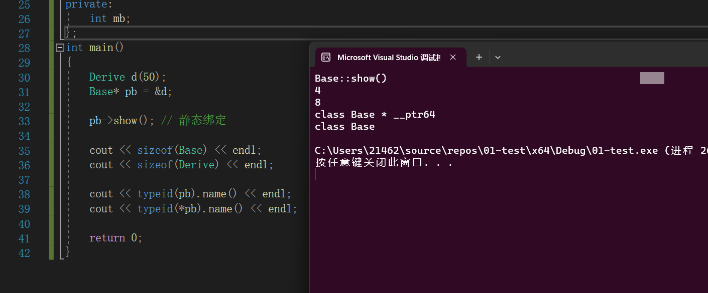
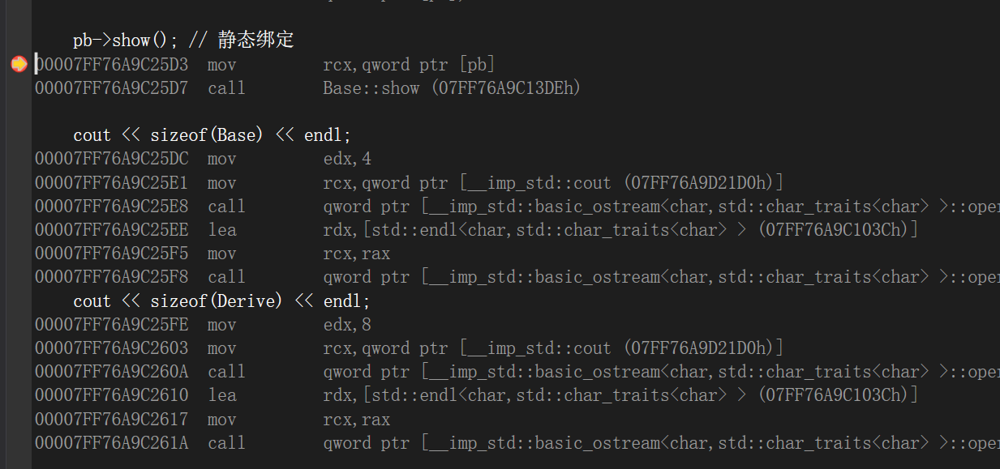
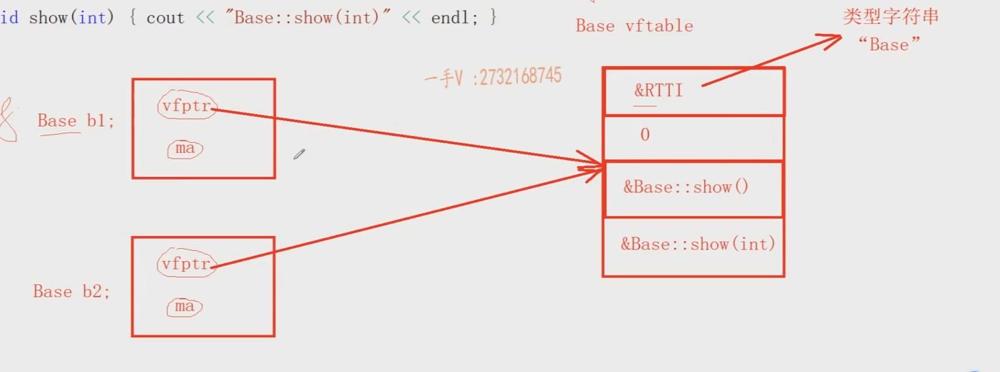
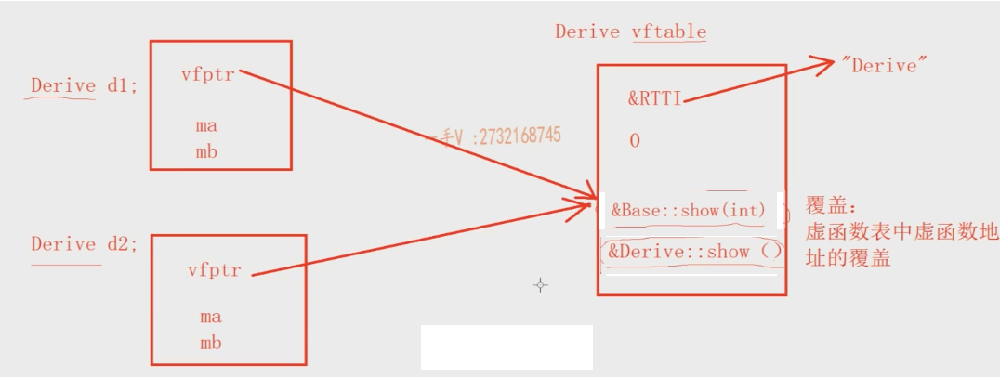
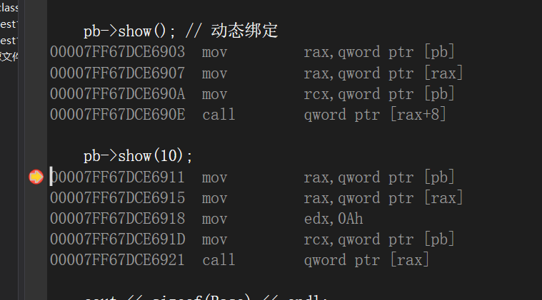
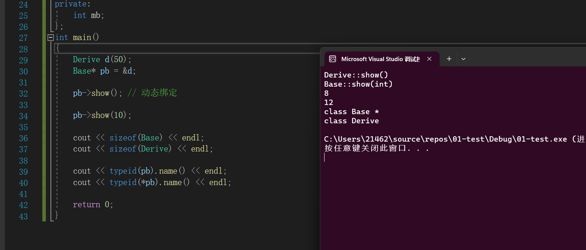
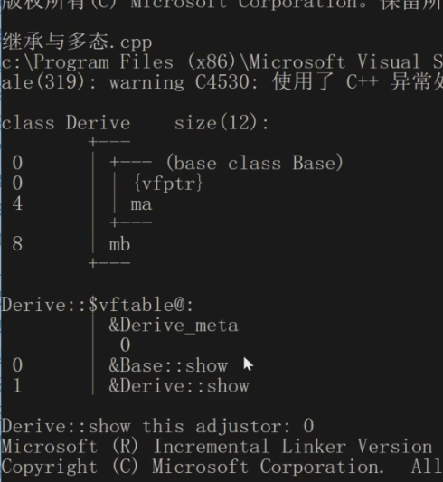

### 覆盖，虚函数，静态绑定，动态绑定

#### 静态的绑定: 在生成的汇编指令上直接`call` 具体的作用域下的函数，称为静态绑定。

> ```C++
> class Base
> {
> public:
> 	Base(int data = 10) :ma(data) {}
> 	void show() { cout << "Base::show()" << endl; }
> 	void show(int) { cout << "Base::show(int)" << endl; }
> 
> protected:
> 	int ma;
> };
> class Derive : public Base
> {
> public:
> 	Derive(int data = 20) :Base(data), mb(data) {}
> 	void show() { cout << "Derive::show()" << endl; }
> private:
> 	int mb;
> };
> int main()
> {
> 	Derive d(50);
> 	Base *pb = &d ;
>    
>    pb->show() ; // 静态绑定
>    /*
>     mov         rcx,qword ptr [pb] 
>     call        Base::show (07FF76A9C13DEh)  
> 	*/
>    
>    cout << sizeof(Base) << endl ; // 只有一个ma  大小为四字节
>    cout << sizeof(Derive) << endl ; // ma , mb 8字节
>    
>    cout << typeid(pb).name() << endl ;  // classs Base* 
>    cout << typeid(*pb).name() << endl ;  
>    
>    return 0; 
> } 
> ```
>
> 
>
> 
>
> **为什么`typeid(*pb).name()`**的结果为`class Base` ? 
>
> >  `*pb`的类型：Base -> 有没有虚函数
> >
> > + 如果`Base`没有虚函数，`*pb`识别的就是编译时期的类型  ,因为`pb`的类型为`Base*`所以  `*pb`的类型为`Base`。
> >
> > + 如果`Base`有虚函数，`*pb`识别的就是运行时期的类型 `RTTI`类型：
> >
> >   `pb  ->  d(vfptr)  ->  Derive vftable(RTTI) -> class Derive `


#### 虚函数:在函数的返回类型之前加上`virtual`关键字，函数就为虚函数

> **一个类中定义虚函数之后，类发生了什么改变**
>
> + 一个类里面定义了虚函数，那么==编译阶段==，编译器给这个**类**产生一个唯一的`vftable`虚函数表，虚函数表中主要存储的内容就是`RTTI(run time type information)`指针 ,虚函数的地址。当程序运行时，==每一张虚函数表都会加载到内存的`.rodata`区(这是一个只能读的内存)。==【注：`RTTI` 指针指向的是一个常量字符串其中存储的是类的名称，从而表示当前的虚函数表属于哪一个类。】
>
> +  一个类里面定义了**虚函数**，那么这个类定义的对象，其运行时，对象内存中的开始部分，多存储一个`vfptr`虚函数指针，指向相应类型的虚函数表`vftable`。一个类型定义的多个对象，它们的`vfptr`指针指向的都是同一张虚函数表。当你定义一个含有虚函数的类时，不管是否创建对象，都会为该类生成虚函数表。**虚函数表的存在是为了实现多态性和动态绑定的机制**，无论是否创建对象，它都是类的一部分。
>
> + 一个类里面虚函数的个数，不影响对象内存大小（因为`vfptr`大小是固定的），影响的是虚函数表的大小。
>
> + 如果**派生类中的方法**，和**基类继承来的某个方法**，==返回值、函数名、参数列表都相同==，而且基类的方法是`virtual`虚函数，那么派生类的这个方法，==自动处理成虚函数==.
>
>   > 覆盖也称为重写指的是==虚函数表中虚函数地址的覆盖==，在下面的代码中，派生类的`void show()` 函数被隐式的指定为==虚函数== ， 又因为在派生类中的`virtual void show()`和基类继承而来的`virtual void show()` ，==返回值、函数名、参数列表都相同== ，在`Derive`的虚函数表中，派生类的`virtual void show()` 会对基类的`virtual void show()` 进行覆盖！
>   >
>   > 
>   >
>   > 下述代码中的`Base`和`Derive`的虚函数表如图：
>   >
>   > `Base`的虚函数表
>   >
>   > 
>   >
>   > `Derive` 的虚函数表：注意，其中对基类继承来的`show()`进行了覆盖，并且在虚函数表中，出现的越早，虚函数的地址在虚函数表中的位置越靠前。
>   >
>   > 
>   >
>   > **虚函数表中的0代表的是`vfptr`在虚函数表中的偏移地址。如果不涉及到虚继承的话，每个含有虚函数的类的对象的开头一定放的是`vfptr`**
>   >
>   > ```C++
>   > class Base
>   > {
>   > public:
>   > 	Base(int data = 10) :ma(data) {}
>   > 	virtual void show() { cout << "Base::show()" << endl; }  // 虚函数
>   > 	virtual void show(int) { cout << "Base::show(int)" << endl; }	// 虚函数
>   > protected:
>   > 	int ma;
>   > };
>   > class Derive : public Base
>   > {
>   > public:
>   > 	Derive(int data = 20) :Base(data), mb(data) {}
>   > void show() { cout << "Derive::show()" << endl; }
>   > private:
>   > 	int mb;
>   > };
>   > int main()
>   > {
>   > 	Derive d(50);
>   > 	Base *pb = &d ;
>   > 
>   > /*
>   > 	pb->Base Base::show 如果发现show是普通函数，就进行静态绑定 call Base::show
>   > 
>   > 	pb->Base Base::show 如果发现show是虚函数，就进行动态绑定了
>   > 
>   > 	mov eax, dword ptr[pb]
>   > 	mov ecx, dword ptr[eax]
>   > 
>   > 	call ecx（虚函数的地址） 动态（运行时期）的绑定（函数的调用）
>   > 
>   > 	*/
>   > pb->show() ; // 动态绑定
>   > 
>   > pb->show(10) ; 
>   > 
>   > cout << sizeof(Base) << endl ; 
>   > cout << sizeof(Derive) << endl ; 
>   > 
>   > cout << typeid(pb).name() << endl ;  
>   > cout << typeid(*pb).name() << endl ;  
>   > 
>   > return 0; 
>   > } 
>   > ```
>   >
>   > **动态绑定：** 在执行函数调用的时候，最终生成的汇编指令是`call 寄存器` 内的地址，也就说，**我们调用的函数的地址在编译时期并不能确定**，需要在执行的时候，将前面的所有的指令都执行完之后，`寄存器`内才会存储正确的函数的地址。
>   >
>   > ==在执行`pb->show(10)`的时候的流程==: 
>   >
>   > > 首先编译器判断`Base::show(int)`是否为虚函数：如果不是，直接静态绑定；如果是虚函数，则进行动态绑定。
>   >
>   > 
>   >
>   > 上图，证明了`pb->show(10)`是动态绑定。
>   >
>   > 
>   >
>   > 在`x86`体系下： 
>   >
>   > `Base`类的大小：一个虚函数指针+`ma` =  4 + 4 = 8 字节
>   >
>   > `Derive`类的大小：一个虚函数指针 + `ma` + `mb` = 4 + 4 + 4 = 12 字节
>   >
>   > `typeid(*pb).name()`的结果为`class Derive` : 
>   >
>   > > `*pb`的类型：Base -> 有没有虚函数
>   > >
>   > > + 如果`Base`没有虚函数，`*pb`识别的就是==编译时期的类型==  ,因为`pb`的类型为`Base*`所以  `*pb`的类型为`Base`。
>   > >
>   > > + 如果`Base`有虚函数，`*pb`的结果的就是运行时期的类型 `RTTI`类型：
>   > >
>   > >   `pb  ->  d(vfptr)  ->  Derive vftable(RTTI) -> class Derive `
>   >
>   > 
>
> 
>
> > 根据`vs2019`的工具查看`vptr`在类对象内存中的位置：
> >
> > 示例代码：
> >
> > ```C++
> > class Base
> > {
> > public:
> > 	Base(int data = 10) :ma(data) {}
> > 	virtual void show() { cout << "Base::show()" << endl; }  // 虚函数
> > 	virtual void show(int) { cout << "Base::show(int)" << endl; }	// 虚函数
> > protected:
> > 	int ma;
> > };
> > class Derive : public Base
> > {
> > public:
> > 	Derive(int data = 20) :Base(data), mb(data) {}
> > void show() { cout << "Derive::show()" << endl; }
> > private:
> > 	int mb;
> > };
> > int main()
> > {
> > 	Derive d(50);
> > 	Base *pb = &d ;
> > 
> > /*
> > 	pb->Base Base::show 如果发现show是普通函数，就进行静态绑定 call Base::show
> > 
> > 	pb->Base Base::show 如果发现show是虚函数，就进行动态绑定了
> > 
> > 	mov eax, dword ptr[pb]
> > 	mov ecx, dword ptr[eax]
> > 
> > 	call ecx（虚函数的地址） 动态（运行时期）的绑定（函数的调用）
> > 
> > 	*/
> > pb->show() ; // 动态绑定
> > 
> > pb->show(10) ; 
> > 
> > cout << sizeof(Base) << endl ; 
> > cout << sizeof(Derive) << endl ; 
> > 
> > cout << typeid(pb).name() << endl ;  
> > cout << typeid(*pb).name() << endl ;  
> > 
> > return 0; 
> > } 
> > ```
> >
> > 
> >
> > 在`Derive`派生类对象的内存布局中，`vfptr`既属于`Base`类，也属于`Derive`类，并且`vfptr`处于内存地址的开头。
> >
> > 


