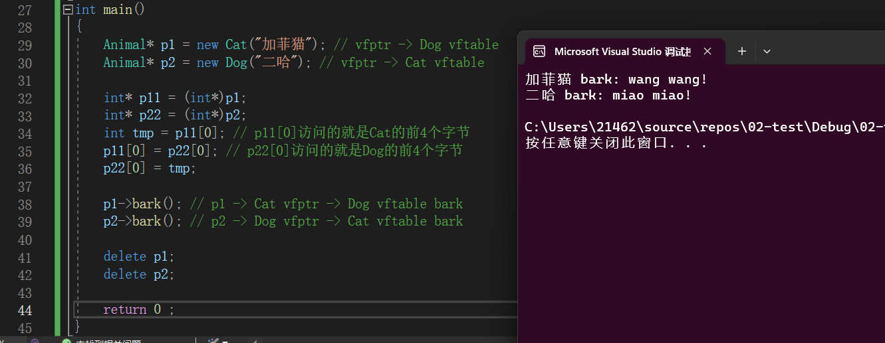
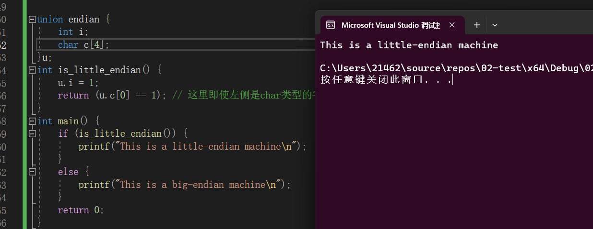
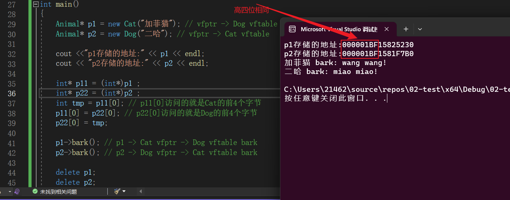
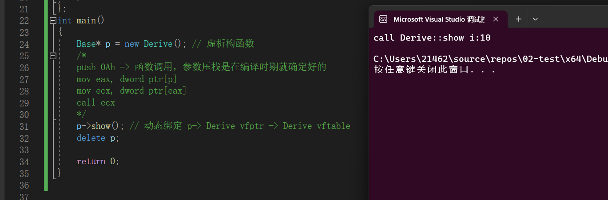
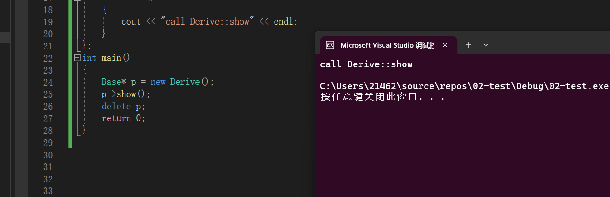
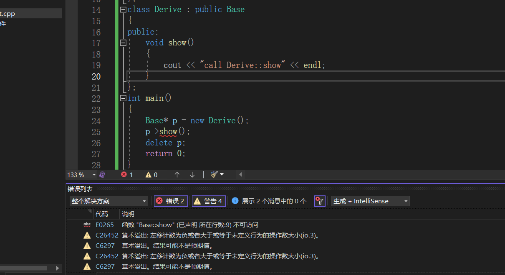
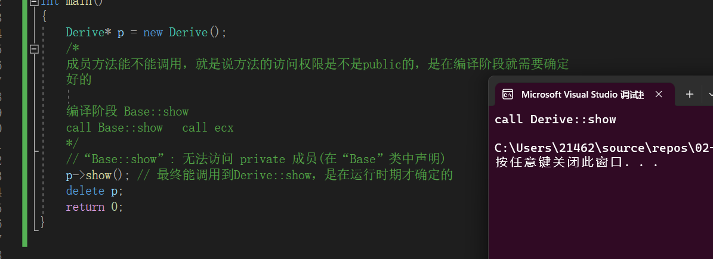
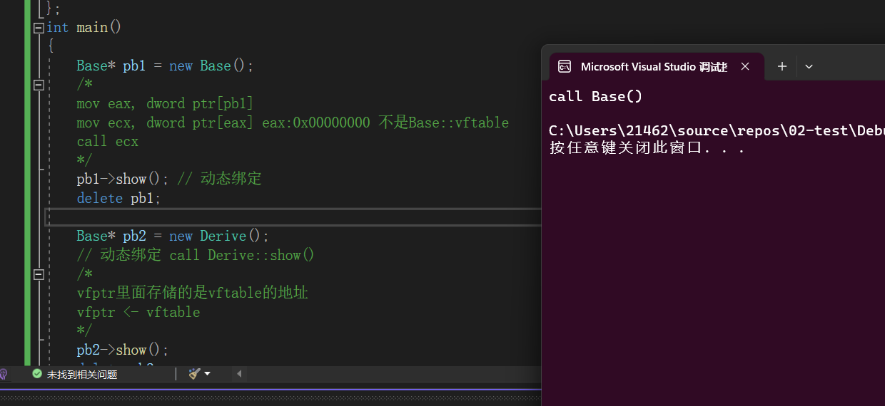
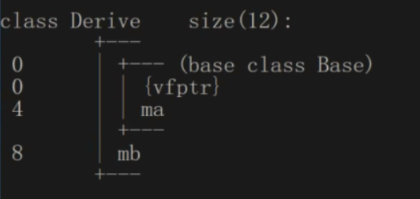

【**虚函数指针的交换**，中的需要解决的问题】

**如果是小端存储，并且两个指针的高四位字节不同，则会出现错误**：

==理论上是这样的，但是现在能力有限，无法开辟两个内存相距(1<<32)字节的内存==


## 继承多态的常见问题

####虚函数指针的交换

> ```C++
> class Animal
> {
> public:
> 	Animal(string name) :_name(name) {}
> 	// 纯虚函数
> 	virtual void bark() = 0;
> protected:
> 	string _name;
> };
> // 以下是动物实体类
> class Cat : public Animal
> {
> public:
> 	Cat(string name) :Animal(name) {}
> 	void bark() { cout << _name << " bark: miao miao!" << endl; }
> };
> class Dog : public Animal
> {
> public:
> 	Dog(string name) :Animal(name) {}
> 	void bark() { cout << _name << " bark: wang wang!" << endl; }
> };
> int main()
> {
> 	Animal *p1 = new Cat("加菲猫"); // vfptr -> Dog vftable
> 	Animal *p2 = new Dog("二哈"); // vfptr -> Cat vftable
> 
>    // vfptr的交换
> 	int *p11 = (int*)p1;
> 	int *p22 = (int*)p2;
> 	int tmp = p11[0]; // p11[0]访问的就是Cat的前4个字节
> 	p11[0] = p22[0]; // p22[0]访问的就是Dog的前4个字节
> 	p22[0] = tmp;
> 
> 	p1->bark(); // p1 -> Cat vfptr -> Dog vftable bark
> 	p2->bark(); // p2 -> Dog vfptr -> Cat vftable bark
> 
> 	delete p1;
> 	delete p2;
> 	
> 	return 0;
> }
> ```
>
> 

> 首先通过一个程序测定电脑为大端还是小端存储：
>
> > ```C++
> > union endian {
> >     int i;
> >     char c[4];
> > }u;
> > int is_little_endian() {
> >     u.i = 1 ; 
> >     return ( u.c[0] == 1) ; // 这里即使左侧是char类型的字符，但实际比较的是内存中存储的数值是否一致。  
> > }
> > int main() {
> >     if (is_little_endian()) {
> >         printf("This is a little-endian machine\n");
> >     }
> >     else {
> >         printf("This is a big-endian machine\n");
> >     }
> >     return 0;
> > }
> > 
> > ```
> >
> > ​	**本电脑是小端存储**
>
> 
>
> 注意，这种交换指针的方式在`x64`体系下==可能不行==：在`x64`体系下，指针的大小为8字节，`int`为`4`字节，在上图中的[32,36]行代码相当于是，将两个对象的`vptr`的低四字节进行了交换。**如果是小端存储，并且两个指针的高四位字节相同**，这样也可以实现`vptr`的交换：
>
> 
>
> **如果是小端存储，并且两个指针的高四位字节不同，则会出现错误**：
>
> ==理论上是这样的，但是现在能力有限，无法开辟两个内存相距(1<<32)字节的内存== ， 这里需要再验证一下


####虚函数中的形参默认值问题

> ```C++
> // 因为没有提供析构函数，这里没必要将基类的析构函数写为虚析构
> 
> class Base
> {
> public:
> 	virtual void show(int i = 10)
> 	{
> 		cout << "call Base::show i:" << i << endl;
> 	}
> };
> class Derive : public Base
> {
> public:
> 	void show(int i = 20)
> 	{
> 		cout << "call Derive::show i:" << i << endl;
> 	}
> };
> int main()
> {
> 	Base *p = new Derive(); // 虚析构函数
> 
> 	p->show(); // 动态绑定 p-> Derive vfptr -> Derive vftable
> 	delete p;
> 
> 	return 0;
> }
> 
> ```
>
> 结果：==为什么我们调用的是派生类的`show()`函数，但默认参数值却跟基类默认参数值的相同？==
>
> 
>
> 在编译时期，**调用一个函数需要先进行参数的压栈** , 但因为动态绑定是发生的运行时期，在编译`p->show()`的时候，编译器在查询`show`函数的时候，只能访问`Base`中的`show()` 因为这里没有提供参数，所以在参数入栈的时候直接`push 0Ah` ，之后生成动态绑定的指令：
>
> ```C++
> // p->show() 生成的指令
> 
> push 0Ah  //=> 函数调用，参数压栈是在编译时期就确定好的
> mov eax, dword ptr[p]
> mov ecx, dword ptr[eax]
> call ecx
> ```
>
> **当我们用基类指针实现动态绑定去调用派生类的虚函数的时候，派生类的虚函数的形参默认值是永远不会被使用的**


#### 访问权限和虚函数之间的关系

> **基类的`show` 为`public` , 派生类的为`private`**
>
> ```C++
> class Base
> {
> public:
> 	virtual void show()
> 	{
> 		cout << "call Base::show" << endl;
> 	}
> };
> class Derive : public Base
> {
> private:
> 	void show()
> 	{
> 		cout << "call Derive::show" << endl;
> 	}
> };
> int main()
> {
> 	Base* p = new Derive() ; 
>    p->show() ; 
>    delete p  ; 
> 	return 0;
> }
> ```
>
> 
>
> 在派生类中`show()`函数为`private`，为什么还能进行调用？
>
> > `p->show()`最终能调用到`Derive::show` 是在运行时期才确定的。
> >
> > 但是，成员方法能不能调用，就是说方法的访问权限是不是`public`的，是在**编译阶段就进行了检查** ，==如果通过某种方式，绕过了编译阶段的这种检查，就能运行【访问限定符就是控制在编译阶段】== 。在对`p->show()`进行权限检查的时候，因为处于编译阶段，只能看`Base::show`的访问权限，发现为`public`，可以通过编译！
> >
> > ==也就是说，只要通过了编译器的访问权限的检查，在运行时期，无论什么访问权限，我们都能访问！==
> >
> > 那么，这么写就是错误的了:
> >
> > ```C++
> > class Base
> > {
> > private:   // 基类中的为private
> > 	virtual void show()
> > 	{
> > 		cout << "call Base::show" << endl;
> > 	}
> > };
> > class Derive : public Base
> > {
> > public:  // 派生类中的为public
> > 	void show()
> > 	{
> > 		cout << "call Derive::show" << endl;
> > 	}
> > };
> > int main()
> > {
> > 	Base* p = new Derive() ; 
> >    p->show() ; // 编译时期检查的是Base::show()的访问权限
> >    delete p  ; 
> > 	return 0;
> > 
> > }
> > ```
> >
> > 
>
> **基类的`show`为`private`，派生类的为`public`**
>
> ```C++
> class Base
> {
> private:
> 	virtual void show()
> 	{
> 		cout << "call Base::show" << endl;
> 	}
> };
> class Derive : public Base
> {
> public:
> 	void show()
> 	{
> 		cout << "call Derive::show" << endl;
> 	}
> };
> int main()
> {
> 	Derive *p = new Derive() ; // 注意上两个版本的p的类型为Base* 
> 
>    // 这里检查 Derive::show() 的访问权限。
> 	p->show();  // 最终能调用到Derive::show，是在运行时期才确定的
> 	delete p;
> 	return 0;
> }
> ```
>
> 


####含有虚函数的类的对象的内存布局

> ```c++
> class Base
> {
> public:
> 	Base()
> 	{
> 		cout << "call Base()" << endl;
> 		clear();
> 	}
> 	void clear() { memset(this, 0, sizeof(*this)); }
> 	virtual void show()
> 	{
> 		cout << "call Base::show()" << endl;
> 	}
> };
> class Derive : public Base
> {
> public:
> 	Derive()
> 	{
> 		cout << "call Derive()" << endl;
> 	}
> 	void show()
> 	{
> 		cout << "call Derive::show()" << endl;
> 	}
> };
> int main()
> {
> 	Base *pb1 = new Base() ; 
> 	pb1->show(); // 为什么会报错。
> 	delete pb1;
> 
> 	Base *pb2 = new Derive() ; 
> 	pb2->show() ;    // 这个地方ok可以
> 	delete pb2 ;
> 
> 	return 0;
> }
> ```
> 
> 
> 
> 
> 
> 在`main`函数中可以分为两部分：
> 
> + 第一部分：
> 
>   ```C++
>   Base *pb1 = new Base() ;
>   pb1->show(); 
>  delete pb1;
>   ```
>
>   在执行`new Base()` 调用`Base`类的构造函数的时候，在`{`括号产生的指令中，将虚表的地址放入`vfptr`中，之后执行构造函数的函数体：
>
>   ```C++
>  Base()
>   {
>  		cout << "call Base()" << endl;
>   		clear() ; // 将当前对象的内存值全置为0
>   }
>   void clear() { memset(this, 0, sizeof(*this)); }
>   ```
> 
>  注意，在`Base`的构造函数中调用了`clear` 将对象内存中的值全都置为0，这里复习一下`Base`构造函数的`{`所产生的指令：
> 
>  ```C++
>   push ebp  // 调用方 栈顶 压栈
>   mov ebp, esp  // 将栈底指向栈顶
>   sub esp, 4Ch  // 开辟栈空间
>   rep stos esp    //<->ebp 0xCCCCCCCC(windows VS GCC/G++)
> 
>   // 如果是含有虚函数的类的构造函数的{ 所产生的指令对应的效果
>   vfptr <- &Base::vftable // 将虚表的地址放入vfptr中。
>   ```
>
>   `pb1->show()`产生的指令大概为：
>
>   ```C++
>   mov eax, dword ptr[pb1]
>   mov ecx, dword ptr[eax]   //此时 eax:0x00000000 不是Base::vftable的地址了
>   call ecx          
>   ```
>   	
>   **因为在运行的时候`call 0x00000000` , `call`这个地址会发生错误!**
> 
> + 第二部分：
>
>   根据第一部分提供的知识进行分析：
>
>   ```C++
>   Base *pb2 = new Derive() ; 
>   pb2->show() ;    
>   delete pb2 ;
>   ```
>
>   **首先，分析一下`Derive`**对象的内存布局：
>
> 
>
>  在`new Derive()`的时候：
>
> + 先调用`Base`的构造函数，先将`Base`的`vftable`的地址写入`vfptr`的内存中，之后执行`Base`的函数体：将[0,7]范围内的属于`Base`类的内存全部置为0。
> + 再调用`Derive`的构造函数，将`Derive`的`vftable`的地址写入`vfptr`的内存中，执行函数体。
> 
> 在`pb2->show()`的时候：因为此时`vfptr`中存储的是`Derive`的虚表的地址，这里能够实现正确的**动态绑定**。


