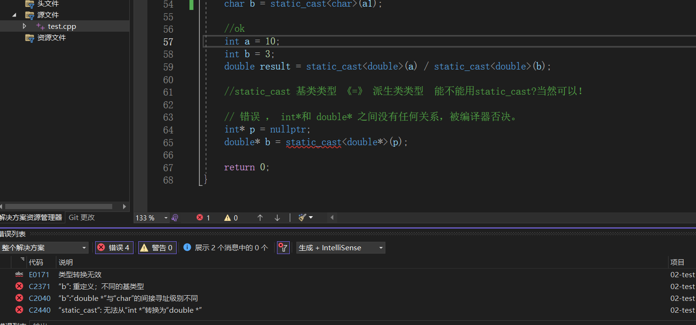
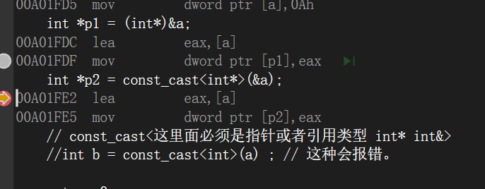
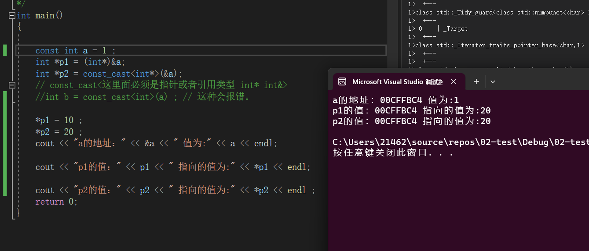
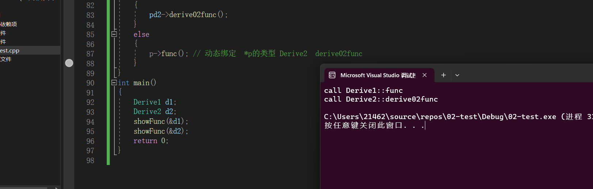

1 `C++`中基本数据类型
==============

`C++` 的基本数据类型中，可以分为4类：整形、浮点型、字符型、布尔型。其中数值类型包括整型与浮点型，字符类型为`char`型

1.  将浮点型给整型，舍弃其小数部分
2.  将整型给浮点型，数值不变，以指数形式存储
3.  `double`型给`float`型，注意数值范围溢出
4.  `char`型给整型，存入的对应的`ASCLL`码值
5.  `int short`和`long`型数据给`char`型变量，只将低八位原封不动的送到`char`型变量中
6.  有符号型数据给无符号型数据，连同原来的符号位一起传送（反之，一样，最高位作为符号位进行传送）

2 `static_cast`
===============

`static_cast`提供==编译器认为安全的类型转换==,强制将一种类型转换到另一种类型。==没有任何联系的类型之间的转换就被否定了==

`example`:

```C++
int main()
{
   // ok
   int a1 = 10 ;
   char b = static_cast<char>(a1) ;
   
   //ok
   int a =10;
	int b =3;
	double result =static_cast<double>(a) / static_cast<double>(b);
   
   //static_cast 基类类型 《=》 派生类类型  能不能用static_cast?当然可以！
   
   // 错误 ， int*和 double* 之间没有任何关系，被编译器否决。	
	int *p = nullptr;
	double* b = static_cast<double*>(p) ; // 报错，
   
 	/*
 	注意C语言的类型强转可以实现两个无关类型的转换
 	int* p = nullptr ; 
 	double* ptr = (double*)p ; 
 	
 	*/
   
   
   // reinterpret_cast 可以实现类似于C语言风格的强制类型转换。不太安全，
   // 指针b 一旦解引用，访问的就是八个字节，会出现内存安全的问题。
   double* b = reinterpret_cast<double*>(p) ; 
   
   return 0 ; 
}
```



==`static_cast`用于基类类型和派生类类型之间的相互转换:==

```C++
class A {};
class B : public A
{};
int main()
{
	A obj1;
	A* ptr = &obj1;

	B* ptr1 = static_cast<B*>(ptr) ;
	return 0;
}
```


3 `const_cast` （不建议使用）
======================

在`C`语言中，`const`修饰的变量用来表示该变量**只读**的特性，表示不可被修改。

而`const_cast`正是用于**强制去掉**这种不能被修改的**常量特性**，需要注意的是，==`const_cast`不是用于去除变量的常量性，而是去除指向常数对象的指针或者引用的常量性，即是去除常量性的**参数对象必须为指针或者引用**==

1.  常量指针转化为非常量指针，并且仍然指向原来的对象
2.  常量引用转化为非常量引用

`const_cast` 的使用

```C++
int main()
{

	const int a = 1 ; 
	int *p1 = (int*)&a;
	int *p2 = const_cast<int*>(&a);
	// const_cast<这里面必须是指针或者引用类型 T* 或 T& >
	//int b = const_cast<int>(a) ; // 这种会报错。
   
   // double *p2 = const_cast<int*>(&a) ; // 这种也是错误的，两边的类型去一定要相同:
   // 要么为 T* p = const_cast<T*>(address) ; 
   // 要么为 T& p = const_cast<T&>(address) ;

	*p1 = 10 ;  
	*p2 = 20 ; 
	cout << "a的地址：" << &a << " 值为:" << a << endl; 

	cout << "p1的值：" << p1 << " 指向的值为:" << *p1 << endl;

	cout << "p2的值：" << p2 << " 指向的值为:" << *p2 << endl ; 
	return 0;
}
```

和`C`语言的类型强转生成的指令是一样的：



执行结果：==这种转换总是造成未知的行为，看下图执行结果==




结果输出：通过指针的修改的值确实被改变了，修改了常量，但是对应的还是`a =10`的。一般的话，是不建议使用它，毕竟将变量声明为`const`类型常量就是不希望修改它，如果后面能修改，这就很**恐怖**了

这种`*q =20`的行为是`未定义行为语句`,这种语句的具体行为由编译器来自行决定如何处理。我们应当避免使用这种未定义行为的语句！

4 `reinterpret_cast`
====================

在`C++`语言中，`reinterpret_cast`（`reinterpret:重新解释`）==类似于`C`风格的类型转换==，有三种强制转换用途：

1）改变指针或引用类型；

2）将指针或者引用转变为一个足够长的整形；

3）将整形转换为指针或者引用类型。

用法：可以把指针转化成一个整数，也可以把一个整数转换成一个指针。

**在使用`reinterpret_cast`强制转换的过程仅仅是比特位的拷贝，在使用过程中需要十分谨慎！**

```C++
int *a =new int;
double *d =reinterpret_cast<double*> (a);
```


5 `dynamic_cast`（可用于继承里面转换）
===========================

用于继承里面转换格式：`dynamic_cast<derived*> (new base)`  ==【主要用在继承结构中，可以支持`RTTI`类型识别的上下转换】==

1.  上面三种都是**编译时**完成的，`dynamic_cast`是**运行时**处理的，运行时要进行类型检查。
  
2.  **不能用于内置的基本数据类型的强制转换**。
  
3.  `dynamic_cast`的转换如果成功的话**返回的是指向类的指针或者引用**，转换失败的话直接返回`NULL`
  
4.  使用条件，基类中一定要有虚函数，否则编译不通过；
  
    🤔需要有虚函数的原因：类中存在虚函数，就说明它有想要让基类指针/引用，指向派生类的对象的情况，此时转换才有意义。**运行时类型检查需要运行时类型信息，该信息存储在虚函数表中，只有定义了虚函数才会有虚函数表。**
    
5. 类的转换时候，进行上行转换时，`dynamic_cast`和`static_cast`的效果是一样的；下行转换时，`dynamic_cast`具有类型检查功能，比`static_cast`更安全。 

```C++
class Base
{
public:
	virtual void func() = 0;
};
class Derive1 : public Base
{
public:
	void func() { cout << "call Derive1::func" << endl; }
};
class Derive2 : public Base
{
public:
	void func() { cout << "call Derive2::func" << endl; }
	// Derive2实现新功能的API接口函数
	void derive02func() 
	{ 
		cout << "call Derive2::derive02func" << endl; 
	}
};
/*
typeid(*p).name() == "Derive"
*/
void showFunc(Base *p)
{
	// dynamic_cast会检查p指针是否指向的是一个Derive2类型的对象？
	// p->vfptr->vftable RTTI信息   如果是，dynamic_cast转换类型成功，
	// 返回Derive2对象的地址，给pd2；否则返回nullptr 
   
   // static_cast编译时期的类型转换  dynamic_cast运行时期的类型转换 支持RTTI信息识别
	
   Derive2 *pd2 = dynamic_cast<Derive2*>(p);
	if (pd2 != nullptr)
	{
		pd2->derive02func();
	}
	else
	{
		p->func(); // 动态绑定  *p的类型 Derive2  derive02func
	}
}
int main()
{
	Derive1 d1;
	Derive2 d2;
	showFunc(&d1);
	showFunc(&d2);
	return 0;
}

```

