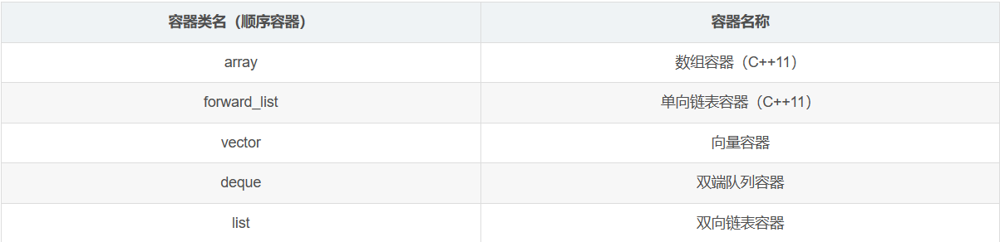
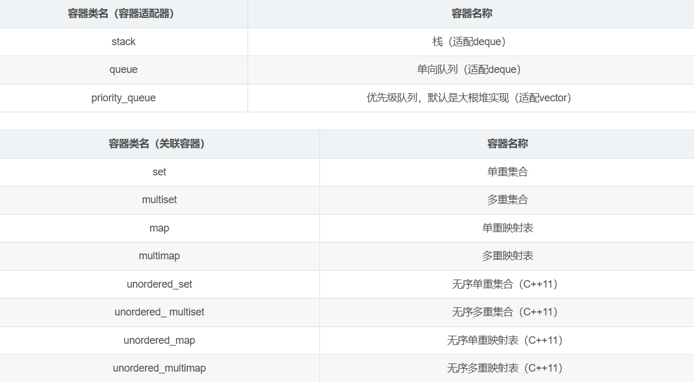
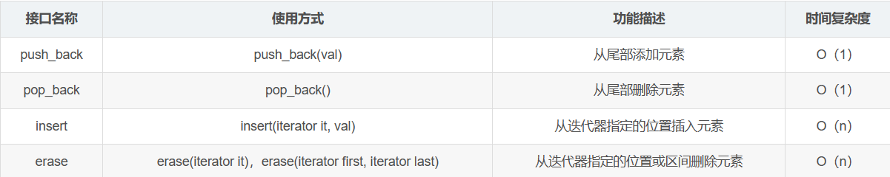
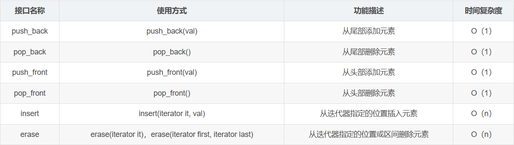
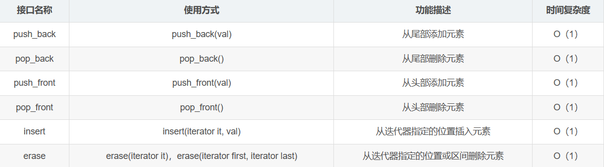
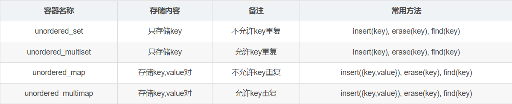

### 目录

*   [C++ STL容器分类](#)
*   [顺序容器](#)
*   [容器适配器](#)
*   [关联容器](#)
*   [近容器](#)
*   [C++STL容器的线程安全特性](#)
*   [C++ STL容器面经相关问题解答](#)

C++ STL容器分类
===========

C++校招面试过程中，STL容器是考察的一个重点，不仅仅通过代码考察容器的应用，还要通过回答问题考察容器的底层实现，大家平时刷题的时候，应该优先用STL容器、泛型算法来解决，不仅可以大大减少代码量，更能熟练掌握它们的应用。

通过下面表格，罗列一下常用到的C++STL容器（包含C++11新引入的容器）：





顺序容器
====

这部分对于顺序容器进行一下内容总结。

**要求必须掌握上面容器的这几点**：  

1.了解各个容器的用途，应用场景  

2.了解容器的底层数据结构，内存扩容方式  

3.常用数据增删改查的方法，以及各容器特有的成员方法  

4.各个容器之间的对比应用

**vector容器内容梳理**

* * *

**底层数据结构**：内存可以2倍扩容的数组，默认构造的`vec`对象底层没有分配空间，随着增加元素才从0-1-2-4-8-16-32…这样的方式进行扩容，所以vec容器初始的内存使用效率比较低，可以使用`reserve`方法进行优化。

**数据增删查接口**：



**reserve/resize成员方法**：reserve是给vector容器预留空间，并不增加元素个数，**主要用来解决vector容器初始的内存使用效率低的问题**；resize不仅会给vector底层开辟空间，还增加了相应个数的元素。

**遍历搜索容器**：  

1.可以通过迭代器遍历或者搜索容器，代码示例：

```C++
#include <iostream>
#include <vector>
using namespace std;

int main()
{
	// vector容器使用示例
	vector<int> vec;
	for (int i = 0; i < 20; ++i)
	{
		vec.push_back(rand() % 100);
	}
	// 遍历1
	vector<int>::iterator it1 = vec.begin();
	for (; it1 != vec.end(); ++it1)
	{
		cout << *it1 << " ";
	}
	// 遍历2
	auto it2 = vec.begin();
	for (; it2 != vec.end(); ++it2)
	{
		cout << *it2 << " ";
	}
	// 遍历3，foreach底层也是通过容器的迭代器实现的容器元素遍历
	for (int val : vec)
	{
		cout << val << " ";
	}
	// 遍历4
	for (int i = 0; i < vec.size(); ++i)
	{
		cout << vec[i] << " ";
	}
	return 0;
}
```

2.可以通过泛型算法对vector容器进行搜索，代码示例：

```C++
#include <iostream>
#include <vector>
#include <algorithm> 

using namespace std;

int main()
{
	// vector容器使用示例
	vector<int> vec;
	for (int i = 0; i < 20; ++i)
	{
		vec.push_back(rand() % 100);
	}

	// find演示vector中搜索20是否存在，如果存在则删除第一个20
	auto it1 = find(vec.begin(), vec.end(), 20);
	if (it1 != vec.end())
	{
		vec.erase(it1);
	}

	// 打印vector容器
	for_each(vec.begin(), 
		vec.end(), 
		[](int val)->void
		{
			cout << val << " ";
		});

	// 找第一个大于50的数字，打印出来
	auto it2 = find_if(vec.begin(), vec.end(),
		[](int val)->bool {return val > 50; });
	if (it2 != vec.end())
	{
		cout << "第一个大于50的数字是:" << *it2 << endl;
	}
	return 0;
}
```

**deque容器内容梳理**

* * *

**底层数据结构**：动态开辟的二维数组，和vector的底层数据结构不同，deque的第二维是按固定大小开辟的，==内存扩容时，扩容第一维的数组空间，每次按原空间2倍方式进行扩容，然后把第二维的所有数组调整到第一维数组的中间进行排列，上下预留位置空间，因为deque要支持头部和尾部的增加删除，这样的调整比较方便做头尾数据增删。==

**数据增删查接口**：



**list容器内容梳理**

* * *

**底层数据结构**：底层是一个带头节点的双向链表，节点内存非连续，扩容就是产生新的链表节点。

**数据增删查接口**：



从上面的list支持的方法接口可以看出来，对于增加和删除操作，list的花费是常量时间，但是它的搜索比较慢，总是从头节点开始，时间复杂度是O(n)。

**splice成员方法**：链表的每个节点是单独开辟的，所以链表在移动数据，或者两个链表之间移动数据的时候，直接把节点摘下来，接入到新的位置就可以了，效率比较高。示例代码如下：

```C++
#include <iostream>
#include <list>
#include <algorithm>
using namespace std;

int main()
{
	// 定义两个list容器 , list底层维护的是双向链表
	list<int> l1 ;
	list<int> l2;

	for (int i = 0; i < 10; ++i)
	{
		l1.push_back(i);
	}
	for (int i = 10; i < 20; ++i)
	{
		l2.push_back(i);
	}

	// 打印两个list容器的元素值
	for_each(l1.begin(), l1.end(), [](int val){cout << val << " "; });
	cout << endl;
	for_each(l2.begin(), l2.end(), [](int val) {cout << val << " "; });
	cout << endl;
	
	// 把list1容器的首元素0移动到末尾，只涉及指针域的改变，没有做任何的内存和数据拷贝操作
	l1.splice(l1.end(), l1, l1.begin());
	for_each(l1.begin(), l1.end(), [](int val) {cout << val << " "; });
	cout << endl;

	// 把l1容器的首元素移动到l2容器的末尾
	l2.splice(l2.end(), l1, l1.begin());
	for_each(l2.begin(), l2.end(), [](int val) {cout << val << " "; });
	cout << endl;

	// 把l1容器的所有元素移动到l2容器的末尾
	l2.splice(l2.end(), l1, l1.begin(), l1.end());
	for_each(l2.begin(), l2.end(), [](int val) {cout << val << " "; });
	cout << endl;

	return 0;
}
```


deque、list容器的遍历和vector容器类似，参考vector容器遍历的代码，自行测试。容器的方法，在C++11版本里面基本上都提供了相应的**带右值引用参数的重载函数**，**用来自动匹配右值参数，减少代码中临时量的开销，提高了资源利用率**。

各容器还有其它相关的通用方法，比如front，back，at，size，empty等，大家自行总结一下。从C++11开始，给每个容器都提供了emplace，emplace\_front，emplace\_back等相关的函数，**emplace和insert方法的功能相同，做添加元素之用**，不同的是，**emplace实现成模板成员方法**，而且带有右值引用参数，用一个方法统一处理左值参数和右值参数（通过引用折叠原理，引用折叠参考我的博客链接：[https://blog.csdn.net/QIANGWEIYUAN/article/details/88653747](https://blog.csdn.net/QIANGWEIYUAN/article/details/88653747) ），**但是C++11以后，各容器insert方法除了原有的左值引用参数版本，也都提供了右值引用参数的版本**，所以实际使用中，还是推荐优先使用insert方法。

另外C++11中，顺序容器还提供了**array（内存不可扩容的数组容器）**，**forward\_list单向链表容器**，操作比较简单，可以包含相应类名字的头文件，熟练它们的使用。

**看一下顺序容器的常见问题**： 
1.deque底层空间是连续的吗？ 
deque容器底层是动态开辟的二维数组，因此空间不是完全连续的，每一个小段第二维数组是连续的。

2.vector和deque的插入删除效率谁好一些？ 

vector底层是数组，内存连续，尾部的插入删除时间复杂度是O(1)，但是其它位置的插入删除则是O(n)，vector另一个优势是随机访问是O(1)，给一个下标index，可以通过vector\[index\]在O(1)时间内访问到元素的值（因为是数组嘛）；deque的头部和尾部插入删除都是O(1)，但是其它位置的插入删除是O(n)，由于deque底层内存不是完全连续的，所以在中间进行插入删除时，没有vector效率高（vector底层空间完全连续，数据移动的效率更高）。

3.vector和list如何选择？ 
vector和list如何选择，也是问数组和链表的具体应用，**数组随机访问快，插入删除慢；链表插入删除快，不支持随机访问**，因为节点的内存不连续，每次搜索都是从头节点开始。

4.迭代器失效的问题？ 
迭代器在遍历容器的过程中，是不允许修改容器的元素的，如果元素有增加或者删除，原来的迭代器就不能再用了，必须对迭代器进行更新，否则运行就会出问题。这个在课堂上我们也举过详细的案例，大家使用的时候多多注意。（也可以理解成，容器不允许在一个线程用迭代器遍历，另一个线程对容器元素进行增删操作。另外，**不同容器的迭代器也是不能比较的**，源代码的实现认为迭代器没有迭代同一个容器，它们之间的比较没意义）。

容器适配器
=====

stack，queue，priority\_queue之所以叫做**适配器**，是因为它们没有自己底层的数据结构，是依赖另外的容器来实现的功能，它们的方法，也是通过它们依赖的容器相应的方法实现的。

**stack**：默认依赖deque实现，提供了**push，pop，top，size，empty**这几个栈常用的方法。**依赖deque容器的原因**：  
==1.deque的第二维是按固定大小开辟的，相比于vector，初始内存使用效率高==  
==2.deque的内存是分段的，而vector需要一大片连续的空间，内存利用率高==

**queue**：默认依赖deque实现，提供了**push，pop，front，back，size，empty**这几个单向队列常用的方法，**依赖deque容器的原因**：  
==1.deque的第二维是按固定大小开辟的，相比于vector，初始内存使用效率高  
2.deque的内存是分段的，而vector需要一大片连续的空间，内存利用率高  
3.deque本身支持O(1)时间复杂度的头尾增加删除元素，适合实现队列结构==

**priority\_queue**：默认依赖vector实现，提供了**push，pop，top，size，empty**这几个优先级队列常用的方法。**依赖vector容器的原因**，是==priority\_queue默认需要在一个内存连续的数组中构建一个大根堆==，所以使用vector最合适（**底层就是一个数组，堆结构需要按下标计算根节点和左右孩子节点在数组中的位置**）。可以更改priority\_queue定义时的函数对象类型得到一个小根堆，如：

    // 默认是大根堆
    priority_queue<int> maxHeap;
    // 小根堆
    priority_queue<int, vector<int>, greater<int>> minHeap;


priority\_queue可以用来解决大数据top k问题的求解，参考我的另一篇博客：

关联容器
====

在实际问题场景中，除了我们常见的线性表结构，字符串，排序操作之外，散列表和红黑树也是非常常见的，有很多应用场景都会用到它们。

**散列表**虽然比较占空间，但是它的**增删查的都很快**，**趋近于O(1)**；**红黑树**也是一颗二叉排序树，所以入红黑树的数据都是经过排序的，它的增删查时间复杂度都是O($log_{2}n$)，对数时间，比哈希表慢，但是如果问题场景对数据的有序性有所要求，而且增删查的操作都比较多，那么就适合用红黑树结构，==哈希表里面的数据是无序的==

以**链式哈希表作为底层数据结构**的**无序关联容器**有：  
unordered\_set、unordered\_multiset、unordered\_map、unordered\_multimap，对比如下：



set只存储key，底层是哈希表，经常用来大数据查重复值或者去重复值；map存储key,value对，经常用来做哈希统计，统计大数据中数据的重复次数，当然它们的应用很广，不仅仅用在海量数据处理问题场景中。

**无序容器增删查代码示例**：

```C++
#include <iostream>
#include <unordered_set>
#include <string>
using namespace std;

int main()
{
	// 不允许key重复 改成unordered_multiset自行测试
	unordered_set<int> set1; 
	for (int i = 0; i < 100; ++i)
	{
		set1.insert(rand()%100+1);
	}
	cout << set1.size() << endl;

	// 寻找是否存在20并删除
	auto it1 = set1.find(20);
	if (it1 != set1.end())
	{
		set1.erase(it1);
	}

	// count返回set中有几个50=》最多是1个
	cout << set1.count(50) << endl;
	return 0;
}
```


```C++
#include <iostream>
#include <unordered_map>
#include <string>
using namespace std;

int main()
{
	// 定义一个无序映射表
	unordered_map<int, string> map;
	// 无序映射表三种添加[key,value]的方式
	map.insert({ 1000, "aaa" });
	map.insert(make_pair(1001, "bbb"));
	map[1002] = "ccc";

	// 遍历map表1
	auto it = map.begin();
	for (; it != map.end(); ++it)
	{
		cout << "key:" << it->first << " value:" << it->second << endl;
	}
	// 遍历map表2
	for (pair<int, string> &pair : map)
	{
		cout << "key:" << pair.first << " value:" << pair.second << endl;
	}

	// 查找key为1000的键值对，并且删除
	auto it1 = map.find(1000);
	if (it1 != map.end())
	{
		map.erase(it1);
	}

	return 0;
}
```


无序映射表还可以按哈希桶逐个进行遍历，代码示例如下：

```C++
#include <iostream>
#include <string>
#include <unordered_map>
int main()
{
	std::unordered_map<std::string, std::string> mymap =
	{
		{ "house", "maison" },
		{ "apple", "pomme" },
		{ "tree", "arbre" },
		{ "book", "livre" },
		{ "door", "porte" },
		{ "grapefruit", "pamplemousse" }
	};
	unsigned n = mymap.bucket_count(); //获取哈希桶的个数
	std::cout << "mymap has " << n << " buckets.\n";
	for (unsigned i = 0; i < n; ++i) // 逐个遍历哈希桶中的链表
	{
		std::cout << "bucket #" << i << " contains: ";
		for (auto it = mymap.begin(i); it != mymap.end(i); ++it)
			std::cout << "[" << it->first << ":" << it->second << "] ";
		std::cout << "\n";
	}

	return 0;
}
```

以**红黑树作为底层数据结构**的有序关联容器有： 
set、multiset、map、multimap和上面的无序容器相比较，除了底层的数据结构不同，其它的操作几乎都是一样的，上面无序容器的演示代码，换成有序容器同样可以正常执行。一般对于数据有序性没有要求的话，基本上都选择无序容器来使用；如果应用场景对于数据的有序性有所要求，那么就得选择有序关联容器了。

**考察有序容器的时候，经常会考察红黑树的结构定义，特征，增加删除操作具体怎么执行**，这属于高级数据结构里面的知识，后续我的博客里面会更新红黑树知识的讲解。

近容器
===

上面描述的顺序容器，容器是配置和关联容器归属于**C++STL的标准容器**，**近容器**指的是**数组类型**，**string字符串类型**，**bitset位图容器**（就是一个面向对象的位数组，可以用在大数据查重，Bloom Filter的实现，哈夫曼编码做文件压缩等用到位数组操作的场景），还有一些引用于数学运算的容器都归纳到近容器范畴里面。

C++STL容器的线程安全特性
===============

上面提到的C++STL中的容器，都没有考虑过多线程访问的情况，也就是说上面的容器是不能直接使用在多线程环境下的。如果要用，记得对容器的操作做线程间的互斥，保证容器操作的原子特性。

C++ STL容器面经相关问题解答
=================

这里把2017、2018年C++后台研发各厂相关面经题上，有关C++STL容器部分的问题进行一个介绍，帮助大家抓住这部分问题的主要考察点。

问题一：讲一下容器的空间配置器干什么用的？ 
容器的空间配置器的作用是把对象的内存开辟和构造过程分开，对象析构和内存释放分离开 。那为什么要把对象的内存开辟和构造（new的两个作用）分开，对象的析构和内存释放（delete的两个作用）分开呢？

1）因为在使用容器的过程中，构造一个容器，我们只想要容器的内存空间，并不需要给我们在内存上构造一堆无用的对象出来（直接用new没有办法避免这个问题）；当从容器中删除一个元素的时候，我们需要析构这个被删除对象，但是它占用的容器内存空间是不能释放的，因为容器还要使用；再比如我们需要释放一个容器的时候，需要先把容器里面有效对象元素析构一遍，而不是把容器所有元素都析构一遍（用delete无法避免这个问题），所以在操作容器的过程中，我们需要有选择性的分别去开辟内存，构造对象，析构对象，所以这就是空间配置器存在的意义。

2）==C++ 标准STL里面提供的allocator空间配置器，默认的内存分配和释放就是依赖malloc和free实现的。==SGI STL提供了两个版本的空间配置器，一级空间配置器和二级空间配置器。一级空间配置器的内存管理也是通过malloc和free实现的，但是SGI STL的二级空间配置器提供了一个内存池的实现。第二级配置器的设计思想为：

**1.如果配置区块超过128 bytes，则移交给第一级配置器处理 
2.如果配置区块小于128 bytes，则采用内存池管理（memory pool）。每次配置一大块内存，则维护对应的自由链表（free-list），下次若再有相同大小的内存需求，就直接从 free-list 中拨出（没有就继续配置内存，具体后面讲述），如果客端释换小额区块，就有配置器回收到 free-list 中。**

对于SGI STL的二级空间配置器的内存池实现机制，还是非常重要的，因为这既涉及了空间配置器，又涉及了一个内存池的实现机制，因此大家需要好好的理解它的原理，大家在手写C++空间配置器的过程中，使用过nginx的内存池作为空间配置器的内存管理方案，这又是一个新的积累，请仔细阅读这篇不错的介绍SGI STL二级空间配置器的博客（链接地址：[https://blog.csdn.net/wenqian1991/article/details/19605727](https://blog.csdn.net/wenqian1991/article/details/19605727) 共三篇文章），深入理解SGI STL版本的内存池实现。

问题二：map和set容器的实现原理？ 
C++ STL的set和map容器底层都是由红黑树来实现的，因此map和set的实现原理就是红黑树的实现原理，其中map是用来存储键值映射对的，它把\[key，value\]打包成pair对象存储在红黑树结构上，元素都是经过排序的，因此可以在O($log_{2}n$) 的时间复杂度内对set和map进行增删查操作，效率非常高。对于红黑树的阐述，以下罗列一些基本信息，更详细的红黑树理解，请参照扩展里面给出的链接地址。

红黑树是一棵非严格的平衡二叉树，左右子树的高度差不能超过较短子树高度的2倍，数据的增删查效率都比较高，平均时间复杂度在O($log_{2}n$) 。在此给出红黑树的定义：

**1）每个结点要么是红的，要么是黑的。 
2）根结点是黑的。 
3）每个叶结点，即空结点（NIL）是黑的。 
4）如果一个结点是红的，那么它的俩个儿子都是黑的。 
5）对每个结点，从该结点到其子孙结点的所有路径上包含相同数目的黑结点。**

红黑树不像AVL（平衡二叉树）树那样维持了二叉树的高度平衡（左右子树的高度差不能超过1），因此在插入删除数据时，所做的旋转操作比起红黑树来说，那就少很多了，因此其效率也比AVL树高；红黑树插入一个新节点，旋转的次数最多2次，删除一个节点旋转的次数最多3次。

在C++STL中，map和multimap，set和multiset这四种关联容器的底层都是由红黑树来实现的，因此如果要把自定义类类型作为set和map的元素类型的话，一定要给自定义类型提供operator>或者operator<比较运算符的重载函数，因为红黑树是一棵二叉排序树，入set和map的元素都是要经过排序的，请注意！

**红黑树讲解推荐博客**： [https://blog.csdn.net/yang\_yulei/article/details/26066409](https://blog.csdn.net/yang_yulei/article/details/26066409)

问题三：STL，map底层、deque底层、vector里的empty()和size()的区别、函数对象仿函数？

问题四：STL中的迭代器失效的问题？

问题五：STL中哪些底层由红黑树实现？

问题六：vector和list的区别，还有map的底层实现？

问题七：vector和数组的区别，STL的容器分类，各容器底层实现？

剩下的这些问题，请根据上面总结的内容仔细思考该怎么表达，总的来说STL的考察还是比较多的，可以自己数一数：  


