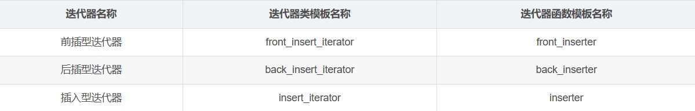

> 知识的学习在于点滴记录，坚持不懈；知识的学习要有深度和广度，不能只流于表面，坐井观天；知识要善于总结，不仅能够理解，更知道如何表达！

### 目录

*   [迭代器概念](#)
*   [iterator迭代器实现](#)
*   [容器迭代器失效问题](#)
*   [const\_iterator迭代器实现](#)
*   [reverse\_iterator和const\_reverse\_iterator的设计](#)
*   [insert插入型迭代器](#)
*   [流迭代器](#)

迭代器概念
=====

最近有人春招面试互联网大厂被问到这样一个问题：**迭代器有什么用处？泛型算法的参数为什么接收的都是迭代器？**

迭代器[iterator](https://so.csdn.net/so/search?q=iterator&spm=1001.2101.3001.7020)是C++ STL的组件之一，作用是**用来遍历容器**，而且是**通用的遍历容器元素的方式**，无论容器是基于什么数据结构实现的，**尽管不同的数据结构，遍历元素的方式不一样，但是用迭代器遍历不同容器的代码是完全一样的**。经典的迭代器遍历容器的代码如下：

```C++
vector<int>::iterator it = vec.begin();
for (; it != vec.end(); ++it)
{
	cout << *it << " ";
}
cout << endl;
```


```C++
unordered_set<int>::iterator it = us.begin();
for (; it != us.end(); ++it)
{
	cout << *it << " ";
}
cout << endl;
```


实际上，C++11新标准的foreach语句，对于容器的遍历就是通过迭代器iterator实现的，如果容器没有实现iterator迭代器，那么foreach语句也无法遍历容器，上面vector容器的遍历代码可以简化为：

```C++
for (int val : vec) // 实际上是用迭代器遍历容器vec
{
	cout << val << " ";
}
cout << endl;
```

**迭代器**一般**实现为容器的嵌套类型**，在容器内部提供具体的实现。但是容器不同，底层元素遍历的方式也不同，**那么为什么说迭代器遍历所有容器的方式是一样的呢**？那是因为迭代器提供了常用的operator!=，operator++，operator\*等运算符的重载函数，**把迭代容器的细节全部隐藏在这些通用的运算符重载函数里面，因此用户侧表现出来的就是，迭代器遍历所有容器的方式都是一样的，其实底层都是不一样的风景^^**！

所以刚开始的那个问题就可以回答了，**泛型算法是针对很多容器实现的通用算法，肯定需要一种统一的方式遍历容器的元素**，只有迭代器才能做到！

iterator迭代器实现
=============

这部分提供一个极简的vector容器实现，然后给它提供一个迭代器iterator的实现，看看容器迭代器的原理是什么，这里面容器的空间配置器直接使用C++标准库的allocator默认实现。

下面是极简vector容器以及迭代器的代码实现：

```C++
#include <iostream>

// 简单的vector容器实现，主要查看其嵌套类iterator迭代器的实现
template<typename T, 
	typename Alloc = std::allocator<T>>
class MyVector
{
public:
	MyVector(const Alloc &alloc = Alloc())
		:_allocator(alloc)
	{
		_first._ptr = _last._ptr = _end._ptr = nullptr;
	}

	template<typename T>
	void push_back(T &&val)    // 这里是一个模版方法
	{
		if (full())resize();
		_allocator.construct(_last._ptr, std::forward<T>(val));
		_last._ptr++;
	}

	void pop_back()
	{
		if (empty())
			return;
		_last._ptr--;
		_allocator.destroy(_last._ptr);
	}

	bool full()const { return _last._ptr == _end._ptr; }
	bool empty()const { return _first._ptr == _last._ptr; }

	// 容器迭代器的实现
	class iterator
	{
	public:
		friend class MyVector;
		iterator(T *ptr = nullptr)
			:_ptr(ptr) {}
		void operator++() { ++_ptr; }
		bool operator!=(const iterator &it) { return _ptr != it._ptr; }
		T& operator*() { return *_ptr; }
		T* operator->() { return _ptr; }
	private:
		T *_ptr;
	};
	// 容器的begin方法返回首元素迭代器
	iterator begin() { return iterator(_first._ptr); }
	// 容器的end方法返回末尾元素后继位置的迭代器
	iterator end() { return iterator(_last._ptr); }
private:
	iterator _first; // 指向数组其实地址
	iterator _last;  // 指向最后一个有效元素的后继位置
	iterator _end;   // 指向数据空间末尾元素的后继位置
	Alloc _allocator;// 容器底层的空间配置器

	// 容器的扩容函数
	void resize()
	{
		if (_first._ptr == nullptr)
		{
			_first._ptr = _allocator.allocate(1);
			_last._ptr = _first._ptr;
			_end._ptr = _first._ptr + 1;
		}
		else
		{
			int size = _last._ptr - _first._ptr;
			T *ptmp = _allocator.allocate(2 * size);
			for (int i = 0; i < size; ++i)
			{
				_allocator.construct(ptmp+i, _first._ptr[i]);
				_allocator.destroy(_first._ptr + i);
			}
			_allocator.deallocate(_first._ptr, size);
			_first._ptr = ptmp;
			_last._ptr = _first._ptr + size;
			_end._ptr = _first._ptr + 2 * size;
		}
	}
};
```


从上面的代码可以看到，容器的iterator实现成容器的嵌套类类型，提供了迭代容器常用的运算符重载函数，容器本身提供了begin和end方法，begin返回容器首元素的迭代器，end返回容器末尾元素后继位置的迭代器。

容器迭代器失效问题
=========

容器的迭代器失效问题还是比较常考到的，随着VS版本的迭代，g++版本的迭代，C++标准库容器以及迭代器的源码都有比较大的修改，但是迭代器失效的问题本质归纳起来就两点：

**1>不同容器的迭代器是不能进行比较的 
2>容器的元素进行增加、删除操作后，原来的迭代器就全部失效了**

这个从源码上能够清晰的看出来，**在两个迭代器iterator进行operator!=比较操作的时候**，**都会进行\_Compat这样的一个判断**：

```C++
const _Container_base12 *_Getcont() const noexcept
		{	// get owning container
		return (_Myproxy == nullptr ? nullptr : _Myproxy->_Mycont);
		}

void _Compat(const _Vector_const_iterator& _Right) const
		{	// test for compatible iterator pair
 #if _ITERATOR_DEBUG_LEVEL == 0
		(void)_Right;
 #else /* ^^^ _ITERATOR_DEBUG_LEVEL == 0 ^^^ // vvv _ITERATOR_DEBUG_LEVEL != 0 vvv */
		_STL_VERIFY(this->_Getcont() == _Right._Getcont(), "vector iterators incompatible");
 #endif /* _ITERATOR_DEBUG_LEVEL == 0 */
		}
```


用迭代器遍历容器的时候，每一次都会判断当前迭代器it != container.end()是否已经到达容器的末尾迭代器，当上面两个条件发生以后，这里\_STL\_VERIFY(this->\_Getcont() == \_Right.\_Getcont(), “vector iterators incompatible”);这个判断就失败了，程序运行报错，提示迭代器不匹配，意思就是迭代器失效了！

那迭代器失效怎么办？**答案就是要对迭代器进行实时更新**，如下面的代码：

```C++
#include <vector>
#include <iostream>
int main()
{
	std::vector<int> vec1;
	for (int i = 0; i < 20; ++i)
	{
		vec1.push_back(rand() % 100);
	}

	// 删除所有偶数
	auto it = vec1.begin();
	while (it != vec1.end())
	{
		if (*it % 2 == 0)
		{
			// 这里要对迭代器进行实时更新，否则容器元素改变，it迭代器失效！
			it = vec1.erase(it);
		}
		else
		{
			++it;
		}
	}

	for (int v : vec1)
	{
		std::cout << v << " ";
	}
	std::cout << std::endl;
	return 0;
}
```


const\_iterator迭代器实现
====================

const\_iterator和上面的普通iterator比较起来就是，**通过iterator可读可写，而const\_iterator只能读取容器元素，不能修改容器元素**，const\_iterator在设计上，一般作为iterator的基类而存在，因为一个iterator对象可以初始化const\_iterator，反过来是不行的，它们的操作几乎一样，除了读写权限不同。

在上面MyVector演示代码的基础上，实现const\_iterator常量迭代器，代码如下：

```C++
#include <iostream>

// 简单的vector容器实现，主要查看其嵌套类iterator迭代器的实现
template<typename T, 
	typename Alloc = std::allocator<T>>
class MyVector
{
public:
	MyVector(const Alloc &alloc = Alloc())
		:_allocator(alloc)
	{
		_first._ptr = _last._ptr = _end._ptr = nullptr;
	}

	template<typename T>
	void push_back(T &&val)
	{
		if (full())
			resize();
		_allocator.construct(_last._ptr, std::forward<T>(val));
		_last._ptr++;
	}

	void pop_back()
	{
		if (empty())
			return;
		_last._ptr--;
		_allocator.destroy(_last._ptr);
	}

	bool full()const { return _last._ptr == _end._ptr; }
	bool empty()const { return _first._ptr == _last._ptr; }

	// 容器常量迭代器的实现
	class const_iterator
	{
	public:
		friend class MyVector;
		const_iterator(T *ptr = nullptr)
			:_ptr(ptr) {}
		void operator++() { ++_ptr; }
		bool operator!=(const const_iterator &it) { return _ptr != it._ptr; }
		// 返回值被const修饰，只能读，不能修改
		const T& operator*()const { return *_ptr; }  // 返回常引用
		const T* operator->()const { return _ptr; } // 返回常指针
	protected:
		T *_ptr;
	};

	// 普通iterator继承自const_iterator
	class iterator : public const_iterator
	{
	public:
		iterator(T *ptr = nullptr)
			:const_iterator(ptr) {}
		// 返回类型是T&的普通引用，可读可写
		T& operator*() { return *const_iterator::_ptr; }
		T* operator->() { return const_iterator::_ptr; }
	};
	// 容器的begin方法返回首元素迭代器
	iterator begin() { return iterator(_first._ptr); }
	// 容器的end方法返回末尾元素后继位置的迭代器
	iterator end() { return iterator(_last._ptr); }

	// 常对象调用常begin和end方法返回的是常量迭代器，只能读容器数据，不能修改
	const_iterator begin()const { return const_iterator(_first._ptr); }
	const_iterator end()const { return const_iterator(_last._ptr); }

private:
	iterator _first; // 指向数组其实地址
	iterator _last;  // 指向最后一个有效元素的后继位置
	iterator _end;   // 指向数据空间末尾元素的后继位置
	Alloc _allocator;// 容器底层的空间配置器

	// 容器的扩容函数
	void resize()
	{
		if (_first._ptr == nullptr)
		{
			_first._ptr = _allocator.allocate(1);
			_last._ptr = _first._ptr;
			_end._ptr = _first._ptr + 1;
		}
		else
		{
			int size = _last._ptr - _first._ptr;
			T *ptmp = _allocator.allocate(2 * size);
			for (int i = 0; i < size; ++i)
			{
				_allocator.construct(ptmp+i, _first._ptr[i]);
				_allocator.destroy(_first._ptr + i);
			}
			_allocator.deallocate(_first._ptr, size);
			_first._ptr = ptmp;
			_last._ptr = _first._ptr + size;
			_end._ptr = _first._ptr + 2 * size;
		}
	}
};
```


可以写如下代码测试，常量迭代器只能读取，不能修改：

```C++
int main()
{
	MyVector<int> vec;
	for (int i = 0; i < 20; ++i)
	{
		vec.push_back(rand() % 100);
	}

	MyVector<int>::const_iterator cit = vec.begin();
	for (; cit != vec.end(); ++cit)
	{
		std::cout << *cit << " ";  // 这里*cit不能被赋值作为左值
	}
	std::cout << std::endl;

	return 0;
}
```


reverse\_iterator和const\_reverse\_iterator的设计
=============================================

实际上反向迭代器reverse\_iterator和反向常量迭代器const\_reverse\_iterator就是通过正向迭代器iterator和const\_iterator实现的，通过用正向迭代器实例化得到相应的反向迭代器，看下面代码演示实现：

```C++
#include <iostream>

// 反向迭代器实现
template<typename Iterator>
class _reverse_iterator
{
public:
	using value_type = typename Iterator::value_type;
	// 通过一个正向迭代器构建一个反向迭代器
	_reverse_iterator(Iterator it) :_it(it) {}

	template<typename Other>
	_reverse_iterator(const _reverse_iterator<Other> &src)
		: _it(src._it) {}

   // _reverse_iterator<const_iterator> rit  != _reverse_iterator<iterator> rend() ;  
   
   
	bool operator!= (const _reverse_iterator<Iterator> &it)
	{
      
		return _it != it._it; // 实际调用的还是正向迭代器的operator!=函数
	
   }
	void operator++() { --_it; } // 反向迭代器的++操作，就是正向迭代器的--操作
	value_type& operator*() { return *_it; }
	value_type* operator->() { return &(*this); } // 获取迭代的元素的地址
private: 
	Iterator _it; // 反向迭代器依赖容器的正向迭代器实现

	template<typename Other>
	friend class _reverse_iterator;
};

// 简单的vector容器实现，主要查看其嵌套类iterator迭代器的实现
template<typename T, 
	typename Alloc = std::allocator<T>>
class MyVector
{
public:
	// 类型前置声明
	class const_iterator;
	class iterator;
	// 定义反向迭代器和反向常量迭代器的类型名称
	using reverse_iterator = _reverse_iterator<iterator>;
	using const_reverse_iterator = _reverse_iterator<const_iterator>;

	MyVector(const Alloc &alloc = Alloc())
		:_allocator(alloc)
	{
		_first._ptr = _last._ptr = _end._ptr = nullptr;
	}
	template<typename T>
	void push_back(T &&val)
	{
		if (full())
			resize();
		_allocator.construct(_last._ptr, std::forward<T>(val));
		_last._ptr++;
	}

	void pop_back()
	{
		if (empty())
			return;
		_last._ptr--;
		_allocator.destroy(_last._ptr);
	}
	bool full()const { return _last._ptr == _end._ptr; }
	bool empty()const { return _first._ptr == _last._ptr; }
	// 容器常量迭代器的实现
	class const_iterator
	{
	public:
		using value_type = const T;

		friend class MyVector;
		const_iterator(T *ptr = nullptr)
			:_ptr(ptr) {}
		void operator++() { ++_ptr; }
		void operator--() { --_ptr; }
		bool operator!=(const const_iterator &it) { return _ptr != it._ptr; }
		// 返回值被const修饰，只能读，不能修改
		const T& operator*()const { return *_ptr; }
		const T* operator->()const { return _ptr; }
	protected:
		T *_ptr;
	};

	// 普通iterator继承自const_iterator
	class iterator : public const_iterator
	{
	public:
		using value_type = T;

		iterator(T *ptr = nullptr)
			:const_iterator(ptr) {}
		// 返回类型是T&的普通引用，可读可写
		T& operator*() { return *const_iterator::_ptr; }
		T* operator->() { return const_iterator::_ptr; }
	};
	// 容器的begin方法返回首元素迭代器
	iterator begin() { return iterator(_first._ptr); }
	// 容器的end方法返回末尾元素后继位置的迭代器
	iterator end() { return iterator(_last._ptr); }

	// 常对象调用常begin和end方法返回的是常量迭代器，只能读容器数据，不能修改
	const_iterator begin()const { return const_iterator(_first._ptr); }
	const_iterator end()const { return const_iterator(_last._ptr); }

	// rbegin返回的是最后一个有效元素的迭代器表示
	reverse_iterator rbegin() { return reverse_iterator(iterator(_last._ptr-1)); }
	
   // rend返回的是首元素的前导位置
	reverse_iterator rend() { return reverse_iterator(iterator(_first._ptr - 1)); }
	
   // rbegin返回的是最后一个有效元素的迭代器表示
	const_reverse_iterator rbegin()const { return const_reverse_iterator(iterator(_last._ptr - 1)); }
	
   // rend返回的是首元素的前导位置
	const_reverse_iterator rend()const { return const_reverse_iterator(iterator(_first._ptr - 1)); }
private:
	iterator _first; // 指向数组其实地址
	iterator _last;  // 指向最后一个有效元素的后继位置
	iterator _end;   // 指向数据空间末尾元素的后继位置
	Alloc _allocator;// 容器底层的空间配置器

	// 容器的扩容函数
	void resize()
	{
		if (_first._ptr == nullptr)
		{
			_first._ptr = _allocator.allocate(1);
			_last._ptr = _first._ptr;
			_end._ptr = _first._ptr + 1;
		}
		else
		{
			int size = _last._ptr - _first._ptr;
			T *ptmp = _allocator.allocate(2 * size);
			for (int i = 0; i < size; ++i)
			{
				_allocator.construct(ptmp+i, _first._ptr[i]);
				_allocator.destroy(_first._ptr + i);
			}
			_allocator.deallocate(_first._ptr, size);
			_first._ptr = ptmp;
			_last._ptr = _first._ptr + size;
			_end._ptr = _first._ptr + 2 * size;
		}
	}
};
```


上面新增加的代码，就是反向迭代器的代码，可以安装`Beyond Compare`软件来对比代码的更改，体会反向迭代器的优秀设计。代码测试如下：

```C++
int main()
{
	MyVector<int> vec;
	for (int i = 0; i < 20; ++i)
	{
		vec.push_back(rand() % 100);
	}

	// 正向遍历容器元素
	auto it = vec.begin();
	for (; it != vec.end(); ++it)
	{
		std::cout << *it << " ";
	}
	std::cout << std::endl;

	// 反向遍历容器元素
	MyVector<int>::const_reverse_iterator rit = vec.rbegin();
	for (; rit != vec.rend(); ++rit)
	{
		std::cout << *rit << " ";
		// *rit = 20; 反向常量迭代器不能修改容器元素的值
	}
	std::cout << std::endl;

	return 0;
}
```


当然实际使用中，左值的类型我们可以直接用auto关键字代替，通过自动推导右值的类型，我们就不用手动写复杂的类型了。

[insert](https://so.csdn.net/so/search?q=insert&spm=1001.2101.3001.7020)插入型迭代器
==============================================================================

C++标准库中提供了一些插入型迭代器，主要用于泛型算法当中，给容器添加元素，插入行迭代器有：



```C++
#include <vector>
#include <list>
#include <algorithm> // 包含泛型算法
#include <iterator> // 包含各类迭代器
using namespace std;

int main()
{
	vector<int> vec;
	for (int i = 0; i < 20; ++i)
	{
		vec.push_back(rand() % 100);
	}

	vector<int> vec2;
	// 通过back末尾插入型迭代器，把vec容器的元素按末尾插入方式，到vec2中
	copy(vec.begin(), vec.end(), back_inserter(vec2));
	for (int v : vec2)
	{
		cout << v << " ";
	}
	cout << endl;

	list<int> mylist;
	// 把vec容器的元素逆序，插入到list容器当中
	reverse_copy(vec.begin(), vec.end(), back_inserter(mylist));
	for (int v : mylist)
	{
		cout << v << " ";
	}
	cout << endl;

	return 0;
}
```


流迭代器
====

在C++中，不管是标准的输入输出流，还是文件流，或者是字符串流，也可以看作容器，那么C++库提供了流迭代器，看下面代码示例：

```C++
#include <vector>
#include <list>
#include <algorithm> // 包含泛型算法
#include <iterator> // 包含各类迭代器
using namespace std;

int main()
{
	vector<int> vec;
	// 通过输入流迭代器，从标准输入设备获取int，头插到vec容器当中
	copy(istream_iterator<int>(cin), istream_iterator<int>(),
		inserter(vec, vec.begin()));

	vector<int> vec2;
	copy(vec.begin(), vec.end(), back_inserter(vec2));
	// 通过输出流迭代器，把vec2容器的元素输出到cout中
	copy(vec2.begin(), vec2.end(), ostream_iterator<int>(cout, " "));
	cout << endl;

	list<int> mylist;
	reverse_copy(vec.begin(), vec.end(), back_inserter(mylist));
	// 通过输出流迭代器，把mylist容器的元素输出到cout中
	copy(mylist.begin(), mylist.end(), ostream_iterator<int>(cout, " "));
	cout << endl;

	return 0;
}
```

可以看到，借助copy泛型算法、插入行迭代器、istream\_iterator输入流迭代器和ostream\_iterator输出流迭代器，可以很方便的进行流操作，文件流和字符串流同理。

###泛型算法

```C++
#include <iostream>
#include <vector>
#include <algorithm> // 包含了C++ STL里面的泛型算法
#include <functional> // 包含了函数对象和绑定器
using namespace std;
/*
五、泛型算法 = template + 迭代器 + 函数对象
特点一：泛型算法的参数接收的都是迭代器
特点二：泛型算法的参数还可以接收函数对象（C函数指针）
sort,find,find_if,binary_search,for_each

绑定器 + 二元函数对象 =》 一元函数对象
bind1st：把二元函数对象的operator()(a, b)的第一个形参绑定起来
bind2nd：把二元函数对象的operator()(a, b)的第二个形参绑定起来
*/
int main()
{
	int arr[] = { 12,4,78,9,21,43,56,52,42,31};
	vector<int> vec(arr, arr+sizeof(arr)/sizeof(arr[0]));

	for (int v : vec)  // 范围遍历，底层会使用迭代器进行遍历
	{
		cout << v << " ";
	}
	cout << endl;

	// 默认小到大的排序
	sort(vec.begin(), vec.end());

	for (int v : vec)
	{
		cout << v << " ";
	}
	cout << endl;

	// 有序容器中进行二分查找
	if (binary_search(vec.begin(), vec.end(), 21)) 
	{
		cout << "binary_search 存在" << endl;
	}

	auto it1 = find(vec.begin(), vec.end(), 21);
	if (it1 != vec.end())
	{
		cout << "find 21存在" << endl;
	}

	// 传入函数对象greater，改变容器元素排序时的比较方式
	sort(vec.begin(), vec.end(), greater<int>() ) ;
	for (int v : vec)
	{
		cout << v << " ";
	}
	cout << endl;

	// 78 56 52 43 42 31 21 12 9 4
	// 把48按序插入到vector容器当中  找第一个小于48的数字
	// find_if需要的是一个一元函数对象
	// greater a > b    less a < b(48)
	auto it2 = find_if(vec.begin(), vec.end(),
		//bind1st(greater<int>(), 48));
		//bind2nd(less<int>(), 48));
		[](int val)->bool {return val < 48; });
	vec.insert(it2, 48);
	for (int v : vec)
	{
		cout << v << " ";
	}
	cout << endl;

	// for_each可以遍历容器的所有元素，可以自行添加合适的函数对象对容器
	// 的元素进行过滤
	for_each(vec.begin(), vec.end(), 
		[](int val)->void
	{
		if (val % 2 == 0)
		{
			cout << val << " ";
		}
	});
	cout << endl;

	return 0;
}
```


###函数对象

```C++
#include <iostream>
#include <queue>
#include <vector>
#include <set>
using namespace std;


#if 0
int main()
{
	set<int, greater<int>> set1;
	for (int i = 0; i < 10; ++i)
	{
		set1.insert(rand() % 100);
	}

	for (int v : set1)
	{
		cout << v << " ";
	}
	cout << endl;

	return 0;
}


int main()
{
	priority_queue<int> que1; // vector
	for (int i = 0; i < 10; ++i)
	{
		que1.push(rand() % 100);
	}

	while (!que1.empty())
	{
		cout << que1.top() << " ";
		que1.pop();
	}
	cout << endl;

	using MinHeap = priority_queue<int, vector<int>, greater<int>>;
	MinHeap que2; // vector
	for (int i = 0; i < 10; ++i)
	{
		que2.push(rand() % 100);
	}

	while (!que2.empty())
	{
		cout << que2.top() << " ";
		que2.pop();
	}
	cout << endl;

	return 0;
}

/*
// 通过函数指针调用函数，是没有办法内联的，效率很低，因为有函数调用开销


template<typename T>
inline bool mygreater(T a, T b)
{
	return a > b;
}
template<typename T>
inline bool myless(T a, T b)
{
	return a < b;
}
*/
/*
函数对象  =>  C语言里面的函数指针
1.通过函数对象调用operator()，可以省略函数的调用开销，比通过函数指针
调用函数（不能够inline内联调用）效率高

2.因为函数对象是用类生成的，所以可以添加相关的成员变量，用来记录函数对象使用
时更多的信息
*/
// C++函数对象的版本实现
template<typename T>
class mygreater
{
public:
	bool operator()(T a, T b) // 二元函数对象
	{
		return a > b;
	}
};
template<typename T>
class myless
{
public:
	bool operator()(T a, T b) // 二元函数对象
	{
		return a < b;
	}
};

// compare是C++的库函数模板
template<typename T, typename Compare>
bool compare(T a, T b, Compare comp)
{
   // 此处实现的是对函数对象的调用，可以内联，没有函数调用所带来的开销。
	return comp(a, b);  // operator()(a, b);
}
int main()
{
	cout << compare(10, 20, mygreater<int>()) << endl;
	cout << compare(10, 20, myless<int>()) << endl;

	return 0;
}
#endif
```

**通过函数指针调用函数，是没有办法内联的，效率低，因为存在函数调用开销**

> 原因：内联是将函数在调用点进行展开之后再编译，发生在编译期，但是在编译期无法通过函数指针明确其所指向的函数是否带有`inline`关键字，也就无法在调用点展开，也就是说，通过函数指针调用函数，无论函数是否存在`inline` 关键字，此函数都不会被内联。