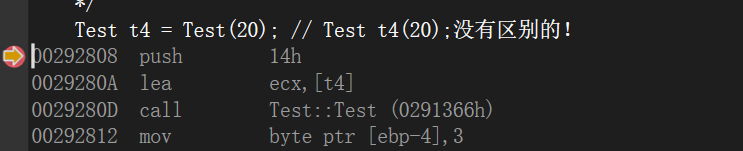
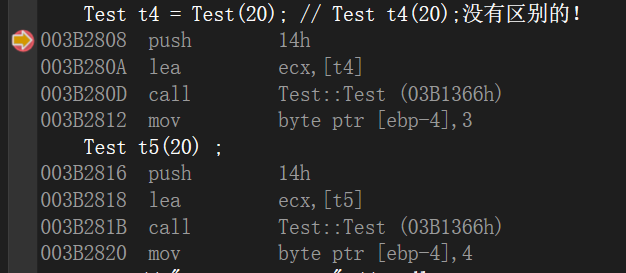
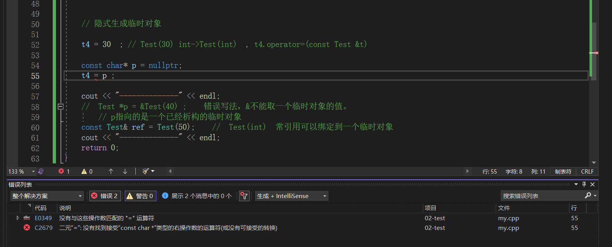
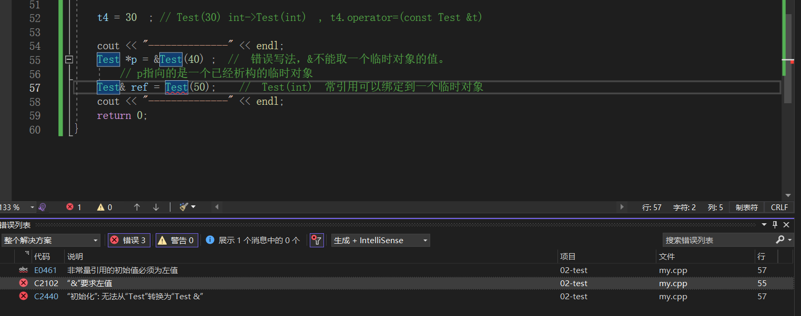

### 对象使用过程背后调用的方法


#### 示例代码

```C++
class Test
{
public:
	Test(int a = 10) :ma(a) 
	{ cout << "Test(int)" << endl; }
	~Test() 
	{ cout << "~Test()" << endl; }
	Test(const Test &t) :ma(t.ma) 
	{ cout << "Test(const Test&)" << endl; }
	Test& operator=(const Test &t)
	{
		cout << "operator=" << endl;
		ma = t.ma;
		return *this;
	}
private:
	int ma;
};
int main()
{
	Test t1; // Test(int)
	Test t2(t1); // Test(const Test &t)
	Test t3 = t1;  // Test(const Test &t)
	// Test(20) 显示生成临时对象  生存周期：所在的语句
	/*
	C++编译器对于对象构造的优化：用临时对象生成新对象的时候，临时对象
	就不产生了，直接构造新对象就可以了
	*/
	Test t4 = Test(20); // Test(int)
	cout << "--------------" << endl;

	
	t4 = t2; // t4.operator=(const Test &t)
	
	// 显式生成临时对象
	t4 = Test(30) ; //  Test(int) , t4.operator=(const Test &t)  , ~Test()
	t4 = (Test)30; // int->Test(int) ,  t4.operator=(const Test &t) , ~Test()

	// 隐式生成临时对象
	t4 = 30; // Test(30) int->Test(int)  , t4.operator=(const Test &t) , ~Test() 

	cout << "--------------" << endl;
//	Test *p = &Test(40) ;    错误写法，&不能取一个临时对象的值。
	// p指向的是一个已经析构的临时对象
	const Test &ref = Test(50) ;    //  Test(int)  常引用可以绑定到一个临时对象
	cout << "--------------" << endl;
	return 0;
}
```


#### 临时对象

> ==临时对象不会被分配内存，也就是说临时对象不存在地址，无法使用`&`符号对其取地址。==
>
> 第29行代码：
>
> ```C++
> Test t4 = Test(20);   // 等价于 t4(20); 
> ```
>
> 等号右侧会构造一个临时对象，但**C++编译器对于对象构造的优化：用临时对象生成新对象的时候，临时对象就不产生了，直接构造新对象就可以了。**
>
> 在`windows`平台下的`VS2022`得到汇编指令：
>
> 
>
> 四条指令的解释：
>
> + 20入栈
> + 将`t4`对象的地址放入`ecx`
> + 调用构造函数
> + 将数据3放入 [ebp - 4] 的内存中。
>
> **可以看到并没有临时对象的构造，说明被编译器优化了**。
>
> 
>
> 【注：两行代码的分别生成的最后一句指令略有不同，第一个移入的是3，第二个移入的是4，这个可能是和对象的个数有关，先暂时忽略，其他的部分均相同，说明符合猜想】


#### 使用临时对象给对象赋值所发生的调用

> 36行代码为例，显示构造临时对象：
>
> ```C++
> 	t4 = Test(30) ; //  Test(int) , t4.operator=(const Test &t)  , ~Test()
> ```
>
> 首先调用`Test(int)` 在`=`左侧**构造一个临时对象`_tmp`**，调用t4的赋值运算符`operator=(const Test &t)` ,  之后调用`~Test()`析构临时对象。==也就是说，临时对象的生命周期为当前行代码行！==
>
> 40行代码为例，隐式构造临时对象：【注：对于赋值来说，都是隐式的先将右侧的类型转换为左侧的类型，之后再进行赋值】
>
> ```C++
> t4 = 30; // Test(30) int->Test(int)  , t4.operator=(const Test &t) , ~Test()
> ```
>
> 右侧先调用`Test(int)`隐式构造一个临时对象，之后调用`operator=`给`t4`赋值，再调用析构函数`~Test()`析构临时对象。
>
> 在将30转换为`Test`类型的时候，编译器会查看`Test`的构造函数，如果存在参数为`int`的构造函数，则隐式转换成功，否则隐式转换失败。
>
> 因为`Test`没有接受`const char*` 为参数的构造函数，所以这种形式会报错：
>
> 
>
> 


### 指针不能指向一个临时对象,普通引用也不能绑定到一个临时对象上

> ```C++
> Test *p = &Test(40) ;    //错误，&不能取一个临时对象的值。
> // p指向的是一个已经析构的临时对象
> Test &ref = Test(50) ;
> ```
>
> 
>
> ==**常引用可以绑定到右值对象上**==：
>
> > 在C++中，`const` 引用可以绑定到右值（临时值）的原因是为了提供更灵活的编程方式和避免不必要的数据拷贝。
> >
> > 当使用 `const` 引用绑定到右值时，==编译器会生成一个临时的常量对象，并将右值的值复制到该临时对象中====。然后，`const` 引用就绑定到这个临时对象上。
> >
> > 这种行为使我们能够在函数参数、返回值等场景中，以更简洁的方式访问和使用临时值，同时避免了不必要的数据拷贝。
> >
> > 举个例子：
> >
> > ```C++
> > void printValue(const int& value) {
> >     cout << value << endl;
> > }
> > 
> > int main() {
> >     printValue(42);  // 可以直接传递右值作为参数
> >     return 0;
> > }
> > 
> > ```
> >
> > 在这个例子中，`printValue` 函数的参数是一个 `const` 引用，它可以绑定到整数常量 `42` 这个右值。当我们将右值传递给函数时，编译器会生成一个临时的常量对象，并将 `42` 的值复制到这个临时对象中。然后，`const` 引用绑定到这个临时对象上，允许我们在函数中以引用的方式访问这个临时对象。
> >
> > 总之，`const` 引用可以绑定到右值是为了提供更方便的编程方式，并避免不必要的数据拷贝。
>
> ==第45行代码中==：
>
> ```C++
> 	const Test &ref = Test(50) ;    //  Test(int)  常引用可以绑定到一个临时对象
> ```
>
> **一旦将常引用绑定到临时对象上，临时对象的声明周期就不再局限于当前代码，而是当常引用所在的作用域结束的时候，才会析构这个对象。**


####示例代码

```C++
class Test
{
public:
	// Test() Test(10) Test(10, 10)
	Test(int a = 5, int b = 5) 
		:ma(a), mb(b)
	{
		cout << "Test(int, int)" << endl;
	}
	~Test()
	{
		cout << "~Test()" << endl;
	}
	Test(const Test &src) 
		:ma(src.ma), mb(src.mb)
	{
		cout << "Test(const Test&)" << endl;
	}
	void operator=(const Test &src)
	{
		ma = src.ma; 
		mb = src.mb; 
		cout << "operator=" << endl;
	}
private:
	int ma;
	int mb;
};
Test t1(10, 10); // 1.Test(int, int)
int main()
{
	Test t2(20, 20); // 3.Test(int, int)
	Test t3 = t2; // 4.Test(const Test&)
	// static Test t4(30, 30);
	static Test t4 = Test(30, 30); // 5.Test(int, int)
	t2 = Test(40, 40); // 6.Test(int, int) operator= ~Test()
	
   // (50, 50) =  (Test)50; Test(int)   (50,50)是一个逗号表达式
	t2 = (Test)(50, 50); // 7.Test(int,int) operator=  ~Test()
	t2 = 60; //Test(int) 8.Test(int,int) operator= ~Test()
	Test *p1 = new Test(70, 70); // 9. Test(int,int) 
	Test *p2 = new Test[2]; // 10. Test(int,int) Test(int,int)
	//  Test *p3 = &Test(80, 80); // 11. Test(int,int)  ~Test()   这个在vs2022中会报错：&不能作用于右值
	const Test &p4 = Test(90, 90); // 12. Test(int,int)
	delete p1; // 13.~Test()
	delete[]p2; // 14. ~Test() ~Test()
}
Test t5(100, 100); // 2.Test(int, int)
```

+ ==**程序在执行期，并不是直接从`main`函数开始执行，而是先将全局变量先构造！**==

+ 静态局部变量的内存在执行的时候就已经事先分配好了，其初始化是在程序执行到其相关的代码的时候，并且静态局部变量存在的位置是`.data segment` .【注：第35行代码相当于是`static Test t4(30 , 30)`】