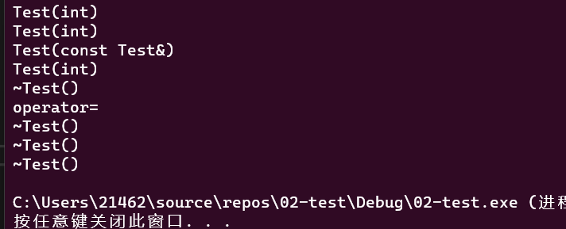
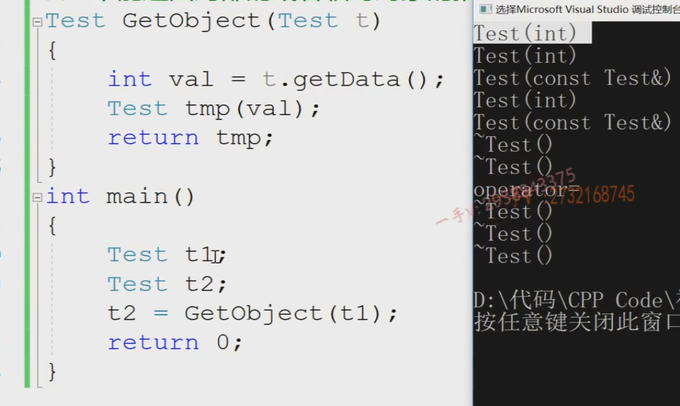
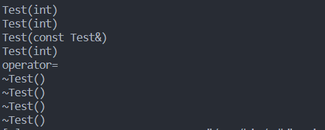

### 函数调用过程中对象调用的方法

```C++
class Test
{
public:
	// Test()  Test(20)
	Test(int data = 10) :ma(data)
	{
		cout << "Test(int)" << endl;
	}
	~Test()
	{
		cout << "~Test()" << endl;
	}
	Test(const Test &t):ma(t.ma)
	{
		cout << "Test(const Test&)" << endl;
	}
	void operator=(const Test &t)
	{
		cout << "operator=" << endl;
		ma = t.ma;
	}
	int getData()const { return ma; }
private:
	int ma;
};
Test GetObject(Test t) 
{
	int val = t.getData();
	Test tmp(val);
	return tmp; 
}
int main()
{
	Test t1;
	Test t2 ;
   t2 = GetObject(t1);
	return 0;
}
```

+ 不能返回局部的或者临时对象的指针或引用,也就是`GetObject`不能写成下面的形式：

  > ```C++
  > Test* GetObject(Test &t) 
  > {
  > 	int val = t.getData();
  > 	Test tmp(val) ; 
  >    return &tmp ; 
  > }
  > 
  > 
  > Test& GetObject(Test& t )
  > {
  >    int val = t.getData();
  > 	Test tmp(val) ;
  >    return tmp ; 
  > }
  > ```
  >
  > **即使这两种形式能够通过编译，但逻辑上仍然是不安全的。**

+ 详析35行代码`Test t2 = GetObject(t1);`的调用过程：

  > **对于不同的栈帧上的对象，无法直接进行赋值，所以临时对象有时会被创造出来**
  >
  > ==相同的代码，在不同的编译器上的结果不同==：
  >
  > > 上述代码在`Windows下的vs2022`结果为：
  > >
  > > 
  > >
  > > > 解释：
  > > >
  > > > + 构造`t1` 调用`Test(int)`
  > > > + 构造`t2` 调用`Test(int)`
  > > > + 从实参`t1`到形参`t` 调用`Test(const Test&)` 
  > > > + 构造局部变量`tmp`调用`Test(int)`
  > > > + `GetObject()`栈帧结束，析构栈帧中的内容`tmp` 调用`~Test()` 【注:根据02的内容，形参的内存其实在`main`函数栈帧中，所以这里只会析构一个`tmp`】
  > > > + 给`t2`赋值调用`operator=` , 【==这里没有产生临时对象，可能是编译器认为`tmp`即将被销毁，就不进行临时对象的开辟了==】
  > > > + `main`函数栈帧结束，析构形参`t`在`main`函数中的内存，析构`t1`,`t2` ，调用三次`~Test()` 
  > > >
  > > > 
  > >
  > > + 在`Windows的vs2019`编译的结果为：
  > >
  > > 
  > >
  > > > + 构造`t1` 调用`Test(int)`
  > > > + 构造`t2` 调用`Test(int)`
  > > > + 从实参`t1`到形参`t` 调用`Test(const Test&)` 
  > > > + 构造局部变量`tmp`调用`Test(int)`
  > > > + 在`main`函数栈帧中创建一个临时对象，接受函数的返回值调用`Test(const Test&)`
  > > > + `GetObject()`栈帧结束，析构栈帧中的内容`tmp` 和形参`t`调用两次`~Test()` 【注:这里和上一次情况不同】
  > > > + 用临时对象给`t2`赋值调用`operator=` ， 之后析构临时对象调用`~Test()`
  > > > + `main`函数栈帧结束,析构`t1`,`t2` ，调用两次`~Test()` 
  > >
  > > + 在`Linux下的gcc`编译的结果为：
  > >
  > > 
  > >
  > > > + 构造`t1` 调用`Test(int)`
  > > > + 构造`t2` 调用`Test(int)`
  > > > + 从实参`t1`到形参`t` 调用`Test(const Test&)` 
  > > > + 构造局部变量`tmp`调用`Test(int)`
  > > > + 使用`tmp`给`t2`赋值，调用`operator=`
  > > > + `GetObject()`栈帧结束，析构栈帧中的内容`tmp` 和形参`t`调用两次`~Test()` 
  > > > + `main`函数栈帧结束,析构`t1`,`t2` ，调用两次`~Test()` 


