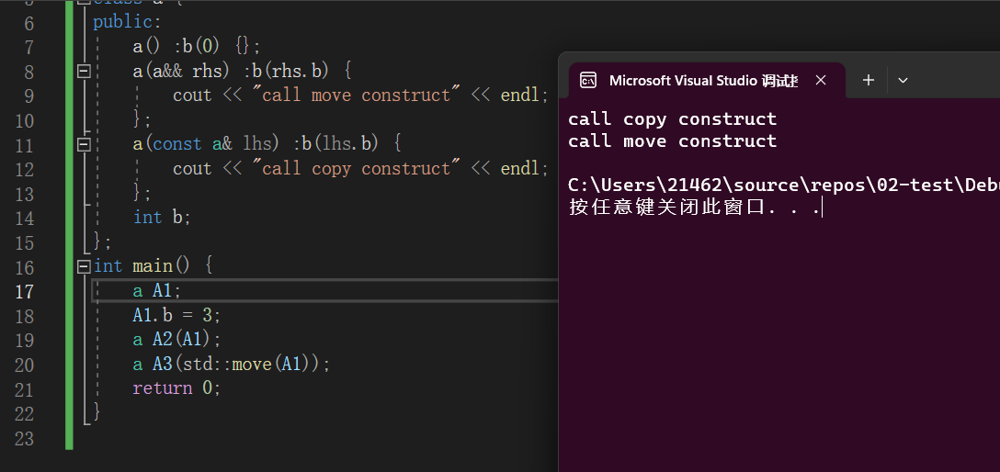

 【注：`std::forward()和std::move()`均位于头文件<utility>中】

解释明白以下三个问题：  

+ 什么是右值引用？ 
+ 右值引用有什么好处 
+ 右值引用的使用说明

#### 1.什么是右值引用

  首先介绍下**左右值**：  

+ 左值： 
  1）左值可以取地址 
  2）左值可以修改 
  3）左值可以放在等号左右两边 
+ 右值： 
  1）右值不可以取地址 
  2）右值不可以直接修改 
  3）右值只能放在等号右边 
  4）右值往往是没有名称的
+ 关于右值，C++11将右值分了两类：**纯右值、将亡值**。从例子上看： 
    1）纯右值 ：int a = 3; 就是指等号右边的常数，上式中的3 
      2）将亡值其实就是中间变量的过渡，过渡之后就消亡，可以细分两种 ：
       （1）函数的临时返回值 int a = f(3); f(3)的返回值是右值，副本拷贝给a，然后消失 
       （2）表达式 像(x+y)，其中(x+y)是 右值

  在左右值使用时有三个原则，不能违反原则，否则编译无法通过： 
  **原则1：右值可以赋给左值，左值不能给右值(左值权限更大)**

```C++
int a = 3;  // a是左值，3是右值
int d = a;  // d和a都是左值，左值可以赋给左值
int &&d = a; × // 右值引用左值不行
int &&d = 10;  // 右值引用右值可以
int &&d = f(10);  // 右值引用右值可以
```


  ==原则2：右值无法修改==【只能通过右值引用修改右值】

```C++
int a = 10;  // 10是右值常数，无法修改
int x = y = 10 ; 
(x + y) = 100 ; // (x + y)为右值，无法修改
```


  ==原则3：编译器允许为左值建立引用，不可以为右值建立引用==

```C++
int num = 10;
int &b = num;  √  // num是左值，可以左值建立引用
int &b = 10; ×  // 10是右值，不可以右值建立引用
```


有一个问题存在：==只有左值可以修改，那如果想对右值进行修改怎么办？ 解决办法就是——右值引用==

  **右值引用的语法：&&** 
  使用右值引用需要注意三个问题： 
  ==1）右值引用必须要进行初始化==

```C++
int && a;  //错误 必须初始化
```


  ==2)不能绑定到左值上==

```C++
int num = 10;
int && a = num; × //不能绑定到左值
int && a = 10; √ 
```


  ==3)右值引用可以对右值进行修改==

```C++
int &&a = 10 ;    // 这里的a是右值引用，其实是10
a = 100 ;
```


  可以发现当对右值加上引用后可以修改值也可以修改地址，从功能上升为左值。所以有一种说法：**右值引用的本质就是不用拷贝的左值**。

#### 2.右值引用的好处？

  先想想引用的目的，传递参数有两种方式：值传递和引用传递。**二者相比引用传递的优势就是通过传递地址，来减少一次拷贝**。在常规写程序的时候，使用的都是左值引用。左值引用有两个使用场景：函数传参、函数返回值。 
  1）函数传参：int f(int &a); 
  2）函数返回值：int& f() ; 
  以上两种情况使用的都是引用传递相比于值传递减少了拷贝次数。但有一种情况会出问题：就是返回值是一个临时对象。如下代码：

    A& f() {
    	A a;
    	return a;
    }


  当返回对象a的地址时，其实a作为在栈上的临时对象，作用域已经到了，被析构。这样如果外界再对这个地址进行访问时，就会出现问题。这也左值引用的一个弊端，而右值引用的出现就是为了解决这个问题。那右值引用是怎么解决返回的临时变量析构？ **当返回值为右值引用时，会把返回的临时变量中的资源居为己用，仍保持了有效性，也避免了拷贝**。


#### 移动语义和完美转发

c++11中引入了左右值的概念，通常认为具名的，可赋值的变量为左值，不具名的，不可赋值的变量为右值。其中对右值提供了两个实用的函数`std::move()`和`std::forword()`，==分别被称为移动语义和完美转发==，本文我们对这两个函数进行讨论，在讨论之前，我们先了解引用折叠。

引用折叠
----

c++的[编译器](https://so.csdn.net/so/search?q=%E7%BC%96%E8%AF%91%E5%99%A8&spm=1001.2101.3001.7020)按照如下规则进行引用折叠：  


移动语义
----

`std::move()`通常被称为剪切操作，但个人认为这样称呼其实不太恰当，因为`std::move`只是将一个左值转换为右值，并不涉及内存的移动，称为剪切还是有些不恰当。我们来`g++`对看看`std::move()`的实现。

```C++
template <typename T>
typename remove_reference<T>::type&& move(T&& t)
{
	return static_cast<typename remove_reference<T>::type&&>(t);
}
```

从代码中可以看出，move函数实际上是一种静态转换，先从传入的参数中萃取出参数类型T，然后利用`static_cast`转换转换左右值类型。**另一个问题是为什么函数的参数类型是T&&？**这与我们上面介绍的引用折叠有关，假设我们传入的类型是左值，那么参数类型是T&& &=T&，如果我们传入的参数是右值，那么参数类型是T&& &&=T&&，这样就巧妙地保留了我们传入参数的类型。 
现在我们已经了解了移动语义的原理和实现，下面我们介绍下移动语义的应用场景。**移动语义可以在不对内存进行操作的情况下改变对象的所有权，我们可以通过类似下面的代码调用移动构造函数，这样可以提高程序的效率**，实际上stl中的容器也正式这样做的。

```C++
class a{
public:
    a():b(0){};
    a(a&& rhs):b(rhs.b){
        cout << "call move construct" << endl;
    };
    a(const a& lhs):b(lhs.b){
        cout << "call copy construct" << endl;
    };
    int b;
};
int main(){
    a A1;
    A1.b = 3;
    a A2(A1);
    a A3(std::move(A1));
    return 0;
}
```

下面的图片是代码的运行结果： 


完美转发
----

完美转发的概念只对模板编程且对函数性能非常讲究的时候才有用。在讲完美转发之前需先理解一个概念：**引用折叠**。

### 引用折叠

引用折叠是模板编程中的一个概念，是为了解决模板推导后出现双重引用（如下所示）的情况。

    - 左值-左值 T& &
    - 左值-右值 T& &&
    - 右值-左值 T&& &
    - 右值-右值 T&& &&


假设一个模板函数的定义如下：

```C++
template<typename T>
void PrintType(T&& param){ ... }
```


当T为int &类型，则`param`被推导成int & &&类型，而c++语法是不允许这种双重引用类型存在的（可以自己测试下定义一个双重引用变量，编译器将提示错误），所以便制定了引用折叠的**规则**，具体规则如下：

> 模板编程中参数类型推导出现双重引用时，双重引用将被折叠成一个引用，要么是左值引用，要么是右值引用。 折叠规则就是：如果任一引用为左值引用，则结果为左值引用。否则（即两个都是右值引用），结果为右值引用。

根据规则上述例子中`param`最终被折叠成int &类型。

这里提个关于模板类型推导的题外话：模板类型推导时，有时候并不像看到的那么直接，比如下面例子：

```C++
int a = 0;          // 左值
PrintType(a);       // 传入左值
```


可能很多人的第一反应就是T被推导成int类型，其实不然，试想下如果T被推导成int类型，那么`param`形参就变成int &&类型，这显然无法通过编译，因为无法将一个左值赋给一个右值引用，所以这里编译器会将T推导成int &类型而不是int。

### 完美转发 std::forward

回到完美转发的议题上，如果上述`PrintType`定义成如下形式：

```C++
template<typename T>
void PrintType(T&& param){ actualRun(param); }
```


那么其仅仅起到一个参数转发的作用，实际执行动作的是`actualRun`函数。这时候我们希望的动是`PrintType`能完全依照模板参数的类型将参数传递给`actualRun`函数，即`param`是左值时，传递给`actualRun`的也是左值，`param`是右值时，传递给`actualRun`的也是右值，这也就是**完美转发**的定义。

这似乎是理所当然的事，但其实不然，前面提到**右值引用本身却是一个左值**，假设如果传入的参数是一个X类型的右值，则`param`被推导成X && && 类型，引用折叠后变成X &&类型，而传递到`actualRun`却是一个左值类型，这时候调用将是`actualRun`的左值参数版本（假设`actualRun`定义了多个重载版本），显然偏离了我们的本意。

那该如何解决这个问题实现完美转发呢？答案是`std::forward`，将上述函数重新定义如下，即可实现完美转发：

```C++
template<typename T>
void PrintType(T&& param){ actualRun(std::forward(param); }
```


那么`std::forward`是如何做到完美转发的呢？先看下`std::forward`的大致定义：

```C++
// 精简了标准库的代码，在细节上可能不完全正确，但是足以让我们了解转发函数 forward 的了
template<typename T>
T&& forward(T &param){
    return static_cast<T&&>(param);
}
```


仔细分析一下这段代码：

**可以看到，不管T是值类型，还是左值引用，还是右值引用，T&经过引用折叠，都将是左值引用类型。也就是forward 以左值引用的形式接收参数 `param`**

接下来我们考虑各种参数类型来看下forward究竟是如何实现完美转发的：

1.传入 `PrintType` 实参是右值类型： 根据以上的分析，可以知道T将被推导为值类型，也就是不带有引用属性，假设为 int 。那么，将T = int 带入forward。

```C++
int&& forward(int &param){
    return static_cast<int&&>(param);
}
```


`param`在`forward`内被强制类型转换为 int &&，还是右值引用。最终保持了实参的右值属性，转发正确。

2.传入 `PrintType` 实参是左值类型：

根据以上的分析，可以知道T将被推导为左值引用类型，假设为int&。那么，将T = int& 带入forward。

```C++
int& && forward(int& &param){
    return static_cast<int& &&>(param);
}
```


引用折叠一下就是 int &类型，转发正确。
