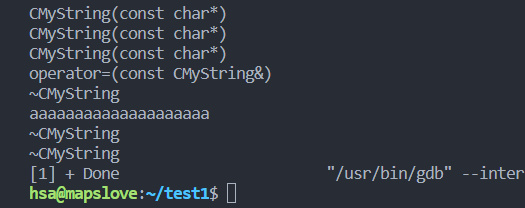
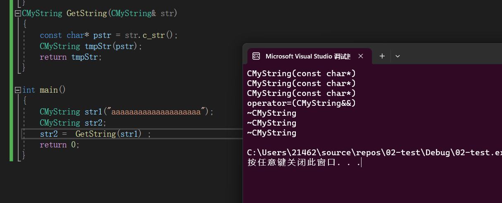

```C++
class CMyString
{
public:
	CMyString(const char *str = nullptr)
	{
		cout << "CMyString(const char*)" << endl;
		if (str != nullptr)
		{
			mptr = new char[strlen(str) + 1];
			strcpy(mptr, str);
		}
		else
		{
			mptr = new char[1];
			*mptr = '\0';
		}
	}
	~CMyString()
	{
		cout << "~CMyString" << endl;
		delete[]mptr;
		mptr = nullptr;
	}
	// 带左值引用参数的拷贝构造
	CMyString(const CMyString &str)
	{
		cout << "CMyString(const CMyString&)" << endl;
		mptr = new char[strlen(str.mptr) + 1];
		strcpy(mptr, str.mptr);
	}
   // 带右值引用参数的拷贝构造
   CMyString(CMyString &&str)
   {
      cout << "CMyString(CMyString &&str)" << endl ; 
      mptr = str.mptr ; 
      str.mptr = nullptr ;
   }
	// 带左值引用参数的赋值重载函数
	CMyString& operator=(const CMyString &str)
	{
		cout << "operator=(const CMyString&)" << endl;
		if (this == &str)
			return *this;

		delete[]mptr;

		mptr = new char[strlen(str.mptr) + 1];
		strcpy(mptr, str.mptr);
		return *this;
	}

   
	const char* c_str()const { return mptr; }
private:
	char *mptr;

	friend CMyString operator+(const CMyString &lhs,
		const CMyString &rhs);
	friend ostream& operator<<(ostream &out, const CMyString &str);
};
CMyString GetString(CMyString &str)
{
	const char* pstr = str.c_str();
	CMyString tmpStr(pstr);
	return tmpStr;
}

int main()
{
	CMyString str1("aaaaaaaaaaaaaaaaaaaa");
	CMyString str2;
	str2 = GetString(str1);
	cout << str2.c_str() << endl;

	return 0;
}

//VS2019下的执行结果，和下图中在VS2022和gcc中存在区别
/*
CMyString(const char*)
CMyString(const char*)
CMyString(const char*)
CMyString(const CMyString&) =>  tmpStr拷贝构造main函数栈帧上的临时对象
~CMyString
operator=(const CMyString&) =>  main函数栈帧上的临时对象给t2赋值
~CMyString
aaaaaaaaaaaaaaaaaaaa
~CMyString
~CMyString
*/
```

在80行代码的函数调用存在的问题：

> 每个`CMyString`内部维护的有一个`char*` 指针，在`GetString`返回的时候会在`main`函数栈帧中会构造一个临时对象将`tmp`中的字符拷贝给临时对象，之后析构`tmp`，调用`operator=`赋值给`str2` ,之后析构临时对象释放相应的内存资源，这样造成了极大的浪费。

执行结果：



【注：在`VS2022`和`gcc`两个编译器下，在第80行代码均没有产生隐式的临时对象，但施磊老师所讲的这里应该产生一个临时对象】


#### 为`CMyString`添加移动构造和移动赋值

> 【注：**一个右值引用本身是一个左值**】
>
> ```C++
> class CMyString
> {
> public:
> 	CMyString(const char *str = nullptr)
> 	{
> 		cout << "CMyString(const char*)" << endl;
> 		if (str != nullptr)
> 		{
> 			mptr = new char[strlen(str) + 1];
> 			strcpy(mptr, str);
> 		}
> 		else
> 		{
> 			mptr = new char[1];
> 			*mptr = '\0';
> 		}
> 	}
> 	~CMyString()
> 	{
> 		cout << "~CMyString" << endl;
> 		delete[]mptr;
> 		mptr = nullptr;
> 	}
> 	// 带左值引用参数的拷贝构造
> 	CMyString(const CMyString &str)
> 	{
> 		cout << "CMyString(const CMyString&)" << endl;
> 		mptr = new char[strlen(str.mptr) + 1];
> 		strcpy(mptr, str.mptr);
> 	}
>    // 带右值引用参数的拷贝构造
>    CMyString(CMyString &&str)
>    {
>       cout << "CMyString(CMyString &&str)" << endl ; 
>       mptr = str.mptr ; 
>       str.mptr = nullptr ;
>    }
> 	// 带左值引用参数的赋值重载函数
> 	CMyString& operator=(const CMyString &str)
> 	{
> 		cout << "operator=(const CMyString&)" << endl;
> 		if (this == &str)
> 			return *this;
> 
> 		delete[]mptr;
> 
> 		mptr = new char[strlen(str.mptr) + 1];
> 		strcpy(mptr, str.mptr);
> 		return *this;
> 	}
> 	// 带右值引用参数的赋值重载函数
>    CMyString& operator=(CMyString &&str) // 临时对象
>    {
>       cout << "operator=(CMyString&&)" << endl;
>       if (this == &str)
>          return *this;
> 
>       delete[]mptr;
> 
>       mptr = str.mptr;
>       str.mptr = nullptr;
>       return *this;
>    }
>    
> 	const char* c_str()const { return mptr; }
> private:
> 	char *mptr;
> 
> 	friend CMyString operator+(const CMyString &lhs,
> 		const CMyString &rhs);
> 	friend ostream& operator<<(ostream &out, const CMyString &str);
> };
> 
> CMyString GetString(CMyString &str)
> {
> 	const char* pstr = str.c_str();
> 	CMyString tmpStr(pstr);
> 	return tmpStr;
> }
> 
> int main()
> {
> 	CMyString str1("aaaaaaaaaaaaaaaaaaaa");
> 	CMyString str2;
> 	str2 = GetString(str1);
> 	cout << str2.c_str() << endl;
> 	return 0;
> }
> ```
>
> 在`VS2022`下的编译结果：【注：在当前版本编译器即使不是使用临时对象初始化对象，也会将临时对象优化掉】
>
> 
>
> 在给`str2`进行赋值的时候，调用的是**移动赋值**
>
> 使用**移动赋值**和**移动构造**的优点：不用频繁的开辟内存，极大的提升了效率


### 对于`CMyString`的扩展

示例代码：

```C++
class CMyString
{
public:
	CMyString(const char *str = nullptr)
	{
		cout << "CMyString(const char*)" << endl;
		if (str != nullptr)
		{
			mptr = new char[strlen(str) + 1];
			strcpy(mptr, str);
		}
		else
		{
			mptr = new char[1];
			*mptr = '\0';
		}
	}
	~CMyString()
	{
		cout << "~CMyString" << endl;
		delete[]mptr;
		mptr = nullptr;
	}
	// 带左值引用参数的拷贝构造
	CMyString(const CMyString &str)
	{
		cout << "CMyString(const CMyString&)" << endl;
		mptr = new char[strlen(str.mptr) + 1];
		strcpy(mptr, str.mptr);
	}
	// 带右值引用参数的拷贝构造
	CMyString(CMyString &&str) // str引用的就是一个临时对象
	{
		cout << "CMyString(CMyString&&)" << endl;
		mptr = str.mptr;
		str.mptr = nullptr;
	}
	// 带左值引用参数的赋值重载函数
	CMyString& operator=(const CMyString &str)
	{
		cout << "operator=(const CMyString&)" << endl;
		if (this == &str)
			return *this;

		delete[]mptr;

		mptr = new char[strlen(str.mptr) + 1];
		strcpy(mptr, str.mptr);
		return *this;
	}
	// 带右值引用参数的赋值重载函数
	CMyString& operator=(CMyString &&str) // 临时对象
	{
		cout << "operator=(CMyString&&)" << endl;
		if (this == &str)
			return *this;

		delete[]mptr;

		mptr = str.mptr;
		str.mptr = nullptr;
		return *this;
	}
	const char* c_str()const { return mptr; }
private:
	char *mptr;

	friend CMyString operator+(const CMyString &lhs,
		const CMyString &rhs);
	friend ostream& operator<<(ostream &out, const CMyString &str);
};
CMyString operator+(const CMyString &lhs,
	const CMyString &rhs)
{
	CMyString tmpStr;
	tmpStr.mptr = new char[strlen(lhs.mptr) + strlen(rhs.mptr) + 1];
	strcpy(tmpStr.mptr, lhs.mptr);
	strcat(tmpStr.mptr, rhs.mptr);
	return tmpStr ;
}
ostream& operator<<(ostream &out, const CMyString &str)
{
	out << str.mptr;
	return out;
}
```

> 关于`CMyString operator+(const CMyString &lhs,const CMyString &rhs)`的优化
>
> **Version1**
>
> ```C++
> CMyString operator+(const CMyString &lhs,
> 	const CMyString &rhs)
> {
> 	char *ptmp = new char[strlen(lhs.mptr) + strlen(rhs.mptr) + 1] ; 
> 	strcpy(ptmp, lhs.mptr);
> 	strcat(ptmp, rhs.mptr);
> 	return CMyString(ptmp);
> }
> ```
>
> > 缺点：`ptmp`指针所指向的内存无法进行释放，每执行一次函数，就会泄漏一部分的堆内存。
>
> **Version2**
>
> ```C++
> CMyString operator+(const CMyString &lhs,const CMyString &rhs)
> {
> 	char *ptmp = new char[strlen(lhs.mptr) + strlen(rhs.mptr) + 1] ; 
> 	strcpy(ptmp, lhs.mptr);
> 	strcat(ptmp, rhs.mptr) ;
> 	CMyString  tmpStr(ptmp) ; 
>    delete []ptmp ; 
>    return tmpStr ;  
> }
> ```
>
> > 缺点：`ptmp`的开辟和释放以及`tmpStr`底部的内存的开辟和释放的效率太低。
>
> **Version3**最终版本
>
> ```C++
> CMyString operator+(const CMyString &lhs,const CMyString &rhs)
> {
> 	CMyString tmpStr;
> 	tmpStr.mptr = new char[strlen(lhs.mptr) + strlen(rhs.mptr) + 1];
> 	strcpy(tmpStr.mptr, lhs.mptr);
> 	strcat(tmpStr.mptr, rhs.mptr);
> 	return tmpStr ;  
> }
> ```
>
> > 这里只涉及了`tmpStr`的底部的内存的开辟和释放，并且在返回的时候调用的是移动赋值或移动构造
>
> **笔试题：**
>
> ```C++
> int main()
> {
>    CMyString str1 = "aaa" ; 
>    vector<CMyString> vec ; 
>    vec.reverse(10) ; 
>    
>    vec.push_back(str1) ;
>    vec.push_back(CMyString("bbb")) ; 
>    return 0 ; 
> }
> ```
>
> 问：第八行和第7行代码匹配的是**拷贝构造**还是**移动构造**
>
> > + 第7行匹配的是**拷贝构造**
> > + 第八行匹配的是**移动构造**