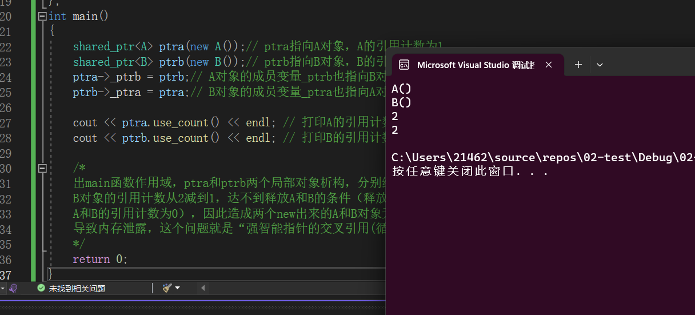
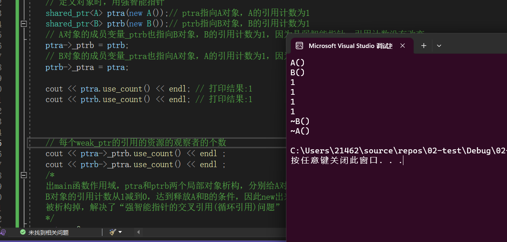

*   [智能指针介绍](#)
*   [自己实现智能指针](#)
*   [不带引用计数的智能指针](#)
*   [带引用计数的智能指针shared\_ptr、weak\_ptr](#)
*   [智能指针的交叉引用（循环引用）问题](#)
*   [多线程访问共享对象问题](#)
*   [自定义删除器](#)

[智能指针](https://so.csdn.net/so/search?q=%E6%99%BA%E8%83%BD%E6%8C%87%E9%92%88&spm=1001.2101.3001.7020)介绍
------------------------------------------------------------------------------------------------------

学习C++的人，一直在接触裸指针，一边感受着它的强大，一边感受着它的坑爹。当然，坑不坑爹在于开发者，指针本身近乎完美，但奈何用的人比较猥琐，给自己埋下无数的坑，还哭喊着指针不好用，那么今天要介绍的智能指针可以释放大家在使用裸指针时的一些压力，当然智能指针无法替代裸指针的全部功能。

裸指针到底有什么不好，写过一些C++代码的人应该都能知道，比如下面的原因：

1.  忘记释放资源，导致资源泄露（常发生内存泄漏问题）
2.  同一资源释放多次，导致释放野指针，程序崩溃
3.  明明代码的后面写了释放资源的代码，但是由于程序逻辑满足条件，从中间return掉了，导致释放资源的代码未被执行到，懵
4.  代码运行过程中发生异常，随着异常栈展开，导致释放资源的代码未被执行到，懵

总之，智能指针的**智能**二字，主要体现在用户可以不关注资源的释放，因为智能指针会帮你完全管理资源的释放，它会保证无论程序逻辑怎么跑，正常执行或者产生异常，资源在到期的情况下，一定会进行释放。

C++11库里面，提供了**带引用计数的智能指针和不带引用计数的智能指针**，这篇文章主要介绍它们的原理和应用场景，包括`auto_ptr，scoped_ptr，unique_ptr，shared_ptr，weak_ptr`。

自己实现智能指针
--------

为了更好的理解C++库中智能指针的原理，我们首先需要自己实现一个简单的智能指针，窥探一下智能指针的基本原理，就是利用**栈上的对象出作用域会自动析构**这么一个特点，把资源释放的代码全部放在这个析构函数中执行，就达到了所谓的**智能**指针。对比下面的两块代码：

1. 使用裸指针

    ```C++
    int main()
    {
    	int *p = new int;
    	/*其它的代码...*/
    	/*
    	如果这里忘记写delete，或者上面的代码段中程序return掉了，
    	没有执行到这里，都会导致这里没有释放内存，内存泄漏
    	*/
    	delete p;
    
    	return 0;
    }
    
    ```

2.  使用智能指针

    ```C++
    template<typename T>
    class CSmartPtr
    {
    public:
    	CSmartPtr(T *ptr = nullptr) :mptr(ptr) {}
    	~CSmartPtr() { delete mptr; }
    private:
    	T *mptr;
    };
    
    int main()
    {
    	CSmartPtr<int> ptr(new int);
    	/*其它的代码...*/
    
    	/*由于ptr是栈上的智能指针对象，不管是函数正常执行完，还是运行过程中出现
    	异常，栈上的对象都会自动调用析构函数，在析构函数中进行了delete
    	操作，保证释放资源*/
    	return 0;
    }
    
    ```

上面这段代码就是一个非常简单的智能指针，主要用到了这两点： 
1）**智能指针体现在把裸指针进行了一次面向对象的封装，在构造函数中初始化资源地址，在析构函数中负责释放资源** 
2）**利用栈上的对象出作用域自动析构这个特点，在智能指针的析构函数中保证释放资源**

所以，智能指针一般都是定义在栈上的，曾经有一个面试问题，问“**能不能在堆上定义智能指针？**”，如这段代码`**CSmartPtr \*p = new CSmartPtr(new int)**;`大家应该能看出来，这里定义的p虽然是智能指针类型，但它实质上还是一个裸指针，因此p还是需要进行手动delete，又回到了最开始裸指针我们面临的问题。

当然，智能指针要做到和裸指针相似，还得提供裸指针常见的\***和->两种运算符的重载函数**，使用起来才真正的和裸指针一样，代码扩充如下：

```C++
template<typename T>
class CSmartPtr
{
public:
	CSmartPtr(T *ptr = nullptr) :mptr(ptr) {}
	~CSmartPtr() { delete mptr; }

	T& operator*() { return *mptr; }
	const T& operator*()const { return *mptr; }

	T* operator->() { return mptr; }
	const T* operator->()const { return mptr; }
private:
	T *mptr;
};
int main()
{
	CSmartPtr<int> ptr(new int);
	*ptr = 20;
	cout << *ptr << endl;
	return 0;
}
```


上面的这个智能指针，使用起来就和普通的裸指针非常相似了，但是它还存在很大的问题，看下面的代码：

```C++
int main()
{
	CSmartPtr<int> ptr1(new int);
	CSmartPtr<int> ptr2(ptr1);
	return 0;
}
```


这个main函数运行，代码直接崩溃，**问题出在默认的拷贝构造函数做的是浅拷贝，两个智能指针都持有一个new int资源，`ptr2`先析构释放了资源，到`ptr1`析构的时候，就成了delete野指针了，造成程序崩溃**。所以这里引出来智能指针需要解决的两件事情：

1.  怎么解决智能指针的浅拷贝问题
2.  多个智能指针指向同一个资源的时候，怎么保证资源只释放一次，而不是每个智能指针都释放一次，造成代码运行不可预期的严重后果

我们一起看看C++库中提供的智能指针是怎么解决上面提到的问题的。

不带引用计数的智能指针
-----------

C++库中提供的不带引用计数的智能指针主要包括：`auto_ptr，scoped_ptr，unique_ptr，`下面一一进行介绍。

1.  `auto_ptr` 
    先浏览一下`auto_ptr`的**主要源码**，如下：

    ```C++
    template<class _Ty>
    	class auto_ptr
    	{	// wrap an object pointer to ensure destruction
    public:
    	typedef _Ty element_type;
    
    	explicit auto_ptr(_Ty * _Ptr = nullptr) noexcept
    		: _Myptr(_Ptr)
    		{	// construct from object pointer
    		}
    
    	/*这里是auto_ptr的拷贝构造函数，
    	_Right.release()函数中，把_Right的_Myptr
    	赋为nullptr，也就是换成当前auto_ptr持有资源地址
    	*/
    	auto_ptr(auto_ptr& _Right) noexcept
    		: _Myptr(_Right.release())
    		{	// construct by assuming pointer from _Right auto_ptr
    		}
    		
    	_Ty * release() noexcept
    		{	// return wrapped pointer and give up ownership
    		_Ty * _Tmp = _Myptr;
    		_Myptr = nullptr;
    		return (_Tmp);
    		}
    private:
    	_Ty * _Myptr;	// the wrapped object pointer
    };
    
    ```
    
    

从`auto_ptr`的源码可以看到，只有最后一个`auto_ptr`智能指针持有资源，原来的`auto_ptr`都被赋`nullptr`了，考虑如下代码：

```C++
int main()
{
	auto_ptr<int> p1(new int);
	/*
	经过拷贝构造，p2指向了new int资源，
	p1现在为nullptr了，如果使用p1，相当于
	访问空指针了，很危险
	*/
	auto_ptr<int> p2 = p1;
	*p1 = 10;
	return 0;
}
```


上面的程序，如果用户不了解`auto_ptr`的实现，代码就会出现严重的问题。记得曾经一个面试题问过“**`auto_ptr`能不能使用在容器当中？**”，看下面的代码描述：

```C++
int main()
{
	vector<auto_ptr<int>> vec;
	vec.push_back(auto_ptr<int>(new int(10)));
	vec.push_back(auto_ptr<int>(new int(20)));
	vec.push_back(auto_ptr<int>(new int(30)));
	// 这里可以打印出10
	cout << *vec[0] << endl;
	vector<auto_ptr<int>> vec2 = vec;
	/* 这里由于上面做了vector容器的拷贝，相当于容器中
	的每一个元素都进行了拷贝构造，原来vec中的智能指针
	全部为nullptr了，再次访问就成访问空指针了，程序崩溃
	*/
	cout << *vec[0] << endl;
	return 0;
}
```


所以不要在容器中使用`auto_ptr`，**C++建议最好不要使用`auto_ptr`**，除非应用场景非常简单。

【总结】：**`auto_ptr`智能指针不带引用计数，那么它处理浅拷贝的问题，是直接把前面的`auto_ptr`都置为nullptr，只让最后一个`auto_ptr`持有资源。**

2.  `scoped_ptr` 
    先浏览一下`scoped\_ptr`的源码，如下：

    ```C++
    template<class T> class scoped_ptr // noncopyable
    {
    private:
        T * px;
    	
    	/*
    	私有化拷贝构造函数和赋值函数，这样scoped_ptr的智能指针
    	对象就不支持这两种操作，从根本上杜绝浅拷贝的发生
    	*/
        scoped_ptr(scoped_ptr const &);
        scoped_ptr & operator=(scoped_ptr const &);
     
        typedef scoped_ptr<T> this_type;
    		
    	/*
    	私有化逻辑比较运算符重载函数，不支持scoped_ptr的智能指针
    	对象的比较操作
    	*/
        void operator==( scoped_ptr const& ) const;
        void operator!=( scoped_ptr const& ) const;
     
    public:
        typedef T element_type;
        explicit scoped_ptr( T * p = 0 ): px( p ) // never throws
        {
    #if defined(BOOST_SP_ENABLE_DEBUG_HOOKS)
            boost::sp_scalar_constructor_hook( px );
    #endif
        }
     
    #ifndef BOOST_NO_AUTO_PTR
    	/*支持从auto_ptr构造一个scoped_ptr智能指针对象，
    	但是auto_ptr因为调用release()函数，导致其内部指
    	针为nullptr*/
        explicit scoped_ptr( std::auto_ptr<T> p ) BOOST_NOEXCEPT : px( p.release() )
        {
    #if defined(BOOST_SP_ENABLE_DEBUG_HOOKS)
            boost::sp_scalar_constructor_hook( px );
    #endif
        }
     
    #endif
    	/*析构函数，释放智能指针持有的资源*/
        ~scoped_ptr() // never throws
        {
    #if defined(BOOST_SP_ENABLE_DEBUG_HOOKS)
            boost::sp_scalar_destructor_hook( px );
    #endif
            boost::checked_delete( px );
        }
    };
    
    ```
    

从`scoped_ptr`的源码可以看到，该智能指针由于私有化了拷贝构造函数和`operator=`赋值函数，因此**从根本上杜绝了智能指针浅拷贝的发生，所以`scoped_ptr`也是不能用在容器当中的，如果容器互相进行拷贝或者赋值，就会引起`scoped_ptr`对象的拷贝构造和赋值，这是不允许的，代码会提示编译错误**。

`auto_ptr`和`scoped_ptr`这一点上的区别，有些资料上用**所有权**的概念来描述，道理是相同的，**`auto_ptr`可以任意转移资源的所有权，而`scoped_ptr`不会转移所有权**（因为拷贝构造和赋值被禁止了）。

3.  `unique_ptr` 
    如果要深入了解`unique_ptr`，需要先了解C++的右值引用原理，请参考我的另外一篇博客，链接地址：[https://blog.csdn.net/QIANGWEIYUAN/article/details/88653747](https://blog.csdn.net/QIANGWEIYUAN/article/details/88653747)  
    先看看`unique_ptr`的部分源码如下：

    ```C++
    template<class _Ty,
    	class _Dx>	// = default_delete<_Ty>
    	class unique_ptr
    		: public _Unique_ptr_base<_Ty, _Dx>
    	{	// non-copyable pointer to an object
    public:
    	typedef _Unique_ptr_base<_Ty, _Dx> _Mybase;
    	typedef typename _Mybase::pointer pointer;
    	typedef _Ty element_type;
    	typedef _Dx deleter_type;
    
    	/*提供了右值引用的拷贝构造函数*/
    	unique_ptr(unique_ptr&& _Right) noexcept
    		: _Mybase(_Right.release(),
    			_STD forward<_Dx>(_Right.get_deleter()))
    		{	// construct by moving _Right
    		}
    	
    	/*提供了右值引用的operator=赋值重载函数*/
    	unique_ptr& operator=(unique_ptr&& _Right) noexcept
    		{	// assign by moving _Right
    		if (this != _STD addressof(_Right))
    			{	// different, do the move
    			reset(_Right.release());
    			this->get_deleter() = _STD forward<_Dx>(_Right.get_deleter());
    			}
    		return (*this);
    		}
    
    	/*
    	交换两个unique_ptr智能指针对象的底层指针
    	和删除器
    	*/
    	void swap(unique_ptr& _Right) noexcept
    		{	// swap elements
    		_Swap_adl(this->_Myptr(), _Right._Myptr());
    		_Swap_adl(this->get_deleter(), _Right.get_deleter());
    		}
    
    	/*通过自定义删除器释放资源*/
    	~unique_ptr() noexcept
    		{	// destroy the object
    		if (get() != pointer())
    			{
    			this->get_deleter()(get());
    			}
    		}
    	
    	/*unique_ptr提供->运算符的重载函数*/
    	_NODISCARD pointer operator->() const noexcept
    		{	// return pointer to class object
    		return (this->_Myptr());
    		}
    
    	/*返回智能指针对象底层管理的指针*/
    	_NODISCARD pointer get() const noexcept
    		{	// return pointer to object
    		return (this->_Myptr());
    		}
    
    	/*提供bool类型的重载，使unique_ptr对象可以
    	直接使用在逻辑语句当中，比如if,for,while等*/
    	explicit operator bool() const noexcept
    		{	// test for non-null pointer
    		return (get() != pointer());
    		}
        
        /*功能和auto_ptr的release函数功能相同，最终也是只有一个unique_ptr指针指向资源*/
    	pointer release() noexcept
    		{	// yield ownership of pointer
    		pointer _Ans = get();
    		this->_Myptr() = pointer();
    		return (_Ans);
    		}
    
    	/*把unique_ptr原来的旧资源释放，重置新的资源_Ptr*/
    	void reset(pointer _Ptr = pointer()) noexcept
    		{	// establish new pointer
    		pointer _Old = get();
    		this->_Myptr() = _Ptr;
    		if (_Old != pointer())
    			{
    			this->get_deleter()(_Old);
    			}
    		}
    	/*
    	删除了unique_ptr的拷贝构造和operator=赋值函数，
    	因此不能做unique_ptr智能指针对象的拷贝构造和
    	赋值，防止浅拷贝的发生
    	*/
    	unique_ptr(const unique_ptr&) = delete;
    	unique_ptr& operator=(const unique_ptr&) = delete;
    	};
    
    ```
    

从上面看到，`unique_ptr`有一点和`scoped_ptr`做的一样，就是**去掉了拷贝构造函数和operator=赋值重载函数，禁止用户对`unique_ptr`进行显示的拷贝构造和赋值，防止智能指针浅拷贝问题的发生**。

**但是`unique_ptr`提供了带右值引用参数的拷贝构造和赋值**，也就是说，`unique_ptr`智能指针可以通过右值引用进行拷贝构造和赋值操作，或者在产生`unique_ptr`临时对象的地方，如把`unique_ptr`作为函数的返回值时，示例代码如下：

```C++
// 示例1
unique_ptr<int> ptr(new int);
unique_ptr<int> ptr2 = std::move(ptr); // 使用了右值引用的拷贝构造
ptr2 = std::move(ptr); // 使用了右值引用的operator=赋值重载函数
```


```C++
// 示例2
unique_ptr<int> test_uniqueptr()
{
	unique_ptr<int> ptr1(new int);
	return ptr1;
}
int main()
{
	/*
	此处调用test_uniqueptr函数，在return ptr1代码
	处，调用右值引用的拷贝构造函数，由ptr1拷贝构造ptr
	*/
	unique_ptr<int> ptr = test_uniqueptr();
	return 0;
}
```

`unique_ptr`还提供了`reset`重置资源,`swap`交换资源等函数，也经常会使用到。**可以看到，`unique_ptr`从名字就可以看出来，最终也是只能有一个该智能指针引用资源，因此建议在使用不带引用计数的智能指针时，可以优先选择`unique_ptr`智能指针**。

带引用计数的智能指针`shared_ptr`、`weak_ptr`
-------------------------------

这里主要介绍`shared_ptr`和`weak_ptr`两个智能指针，**什么是带引用计数的智能指针**？当允许多个智能指针指向同一个资源的时候，**每一个智能指针都会给资源的引用计数加1，当一个智能指针析构时，同样会使资源的引用计数减1，这样最后一个智能指针把资源的引用计数从1减到0时，就说明该资源可以释放了**，由最后一个智能指针的析构函数来处理资源的释放问题，这就是引用计数的概念。

要对资源的引用个数进行计数，那么大家知道，**对于整数的++或者- -操作，它并不是线程安全的操作，因此`shared_ptr`和`weak_ptr`底层的引用计数已经通过`CAS`操作，保证了引用计数加减的原子特性，因此`shared_ptr`和`weak_ptr`本身就是线程安全的带引用计数的智能指针**。

曾经有一道面试的问题这样问“**`shared_ptr`智能指针的引用计数在哪里存放？**”，当然，这个问题需要看`shared_ptr`的源码了，如下：

```C++
private:
	/*
	下面这两个是shared_ptr的成员变量，_Ptr是指向内存资源的指针，_Rep是
	指向new出来的计数器对象的指针，该计数器对象包含了资源的一个引用计数器count
	*/
	element_type * _Ptr{nullptr};
	_Ref_count_base * _Rep{nullptr};
```


因此，**`shared_ptr`智能指针的资源引用计数器在内存的heap堆上**。`shared_ptr`一般被称作**强智能指针**，`weak_ptr`被称作**弱智能指针**，它们有下边两个非常重要的应用场景需要注意。

智能指针的交叉引用（循环引用）问题
-----------------

请看下面的这个代码示例：

```C++
#include <iostream>
#include <memory>
using namespace std;

class B; // 前置声明类B
class A
{
public:
	A() { cout << "A()" << endl; }
	~A() { cout << "~A()" << endl; }
	shared_ptr<B> _ptrb; // 指向B对象的智能指针
};
class B
{
public:
	B() { cout << "B()" << endl; }
	~B() { cout << "~B()" << endl; }
	shared_ptr<A> _ptra; // 指向A对象的智能指针
};
int main()
{
	shared_ptr<A> ptra(new A());// ptra指向A对象，A的引用计数为1
	shared_ptr<B> ptrb(new B());// ptrb指向B对象，B的引用计数为1
	ptra->_ptrb = ptrb;// A对象的成员变量_ptrb也指向B对象，B的引用计数为2
	ptrb->_ptra = ptra;// B对象的成员变量_ptra也指向A对象，A的引用计数为2

	cout << ptra.use_count() << endl; // 打印A的引用计数结果:2
	cout << ptrb.use_count() << endl; // 打印B的引用计数结果:2

	/*
	出main函数作用域，ptra和ptrb两个局部对象析构，分别给A对象和
	B对象的引用计数从2减到1，达不到释放A和B的条件（释放的条件是
	A和B的引用计数为0），因此造成两个new出来的A和B对象无法释放，
	导致内存泄露，这个问题就是“强智能指针的交叉引用(循环引用)问题”
	*/
	return 0;
}
```

代码打印结果： 



可以看到，A和B对象并没有进行析构，通过上面的代码示例，能够看出来“交叉引用”的问题所在，就是对象无法析构，资源无法释放，那怎么解决这个问题呢？请注意强弱智能指针的一个重要应用规则：**定义对象时，用强智能指针`shared_ptr`，在其它地方引用对象时，使用弱智能指针`weak_ptr`**。

**弱智能指针`weak_ptr`区别于`shared_ptr`之处在于**：

1.  `weak_ptr`不会改变资源的引用计数，只是一个观察者的角色，通过观察`shared_ptr`来判定资源是否存在
2.  `weak_ptr`持有的引用计数，不是资源的引用计数，而是同一个资源的观察者的计数(也就是引用同一个资源的`weak_ptr`的数量)
3.  `weak_ptr`没有提供常用的指针操作，无法直接访问资源，需要先通过lock方法提升为`shared_ptr`强智能指针，才能访问资源

那么上面的代码怎么修改，**也就是如何解决带引用计数的智能指针的交叉引用问题**，代码如下：

```C++
#include <iostream>
#include <memory>
using namespace std;

class B; // 前置声明类B
class A
{
public:
	A() { cout << "A()" << endl; }
	~A() { cout << "~A()" << endl; }
	weak_ptr<B> _ptrb; // 指向B对象的弱智能指针。引用对象时，用弱智能指针
};
class B
{
public:
	B() { cout << "B()" << endl; }
	~B() { cout << "~B()" << endl; }
	weak_ptr<A> _ptra; // 指向A对象的弱智能指针。引用对象时，用弱智能指针
};
int main()
{
    // 定义对象时，用强智能指针
	shared_ptr<A> ptra(new A());// ptra指向A对象，A的引用计数为1
	shared_ptr<B> ptrb(new B());// ptrb指向B对象，B的引用计数为1
	// A对象的成员变量_ptrb也指向B对象，B的引用计数为1，因为是弱智能指针，引用计数没有改变
	ptra->_ptrb = ptrb;
	// B对象的成员变量_ptra也指向A对象，A的引用计数为1，因为是弱智能指针，引用计数没有改变
	ptrb->_ptra = ptra;

	cout << ptra.use_count() << endl; // 打印结果:1
	cout << ptrb.use_count() << endl; // 打印结果:1

	/*
	出main函数作用域，ptra和ptrb两个局部对象析构，分别给A对象和
	B对象的引用计数从1减到0，达到释放A和B的条件，因此new出来的A和B对象
	被析构掉，解决了“强智能指针的交叉引用(循环引用)问题”
	*/
	return 0;
}
```

代码打印如下：  



可以看到，A和B对象正常析构，问题解决！

[多线程](https://so.csdn.net/so/search?q=%E5%A4%9A%E7%BA%BF%E7%A8%8B&spm=1001.2101.3001.7020)访问共享对象问题
--------------------------------------------------------------------------------------------------

有一个用C++写的开源网络库，`muduo`库，作者陈硕，大家可以在网上下载到`muduo`的源代码，该源码中对于智能指针的应用非常优秀，其中**借助`shared_ptr`和`weak_ptr`解决了这样一个问题，多线程访问共享对象的线程安全问题**，解释如下：线程A和线程B访问一个共享的对象，如果线程A正在析构这个对象的时候，线程B又要调用该共享对象的成员方法，此时可能线程A已经把对象析构完了，线程B再去访问该对象，就会发生不可预期的错误。

先看如下代码：

```C++
#include <iostream>
#include <thread>
using namespace std;

class Test
{
public:
	// 构造Test对象，_ptr指向一块int堆内存，初始值是20
	Test() :_ptr(new int(20)) 
	{
		cout << "Test()" << endl;
	}
	// 析构Test对象，释放_ptr指向的堆内存
	~Test()
	{
		delete _ptr;
		_ptr = nullptr;
		cout << "~Test()" << endl;
	}
	// 该show会在另外一个线程中被执行
	void show()
	{
		cout << *_ptr << endl;
	}
private:
	int *volatile _ptr;
};
void threadProc(Test *p)
{
	// 睡眠两秒，此时main主线程已经把Test对象给delete析构掉了
	std::this_thread::sleep_for(std::chrono::seconds(2));
	/* 
	此时当前线程访问了main线程已经析构的共享对象，结果未知，隐含bug。
	此时通过p指针想访问Test对象，需要判断Test对象是否存活，如果Test对象
	存活，调用show方法没有问题；如果Test对象已经析构，调用show有问题！
	*/
	p->show();
}
int main()
{
	// 在堆上定义共享对象
	Test *p = new Test();
	// 使用C++11的线程类，开启一个新线程，并传入共享对象的地址p
	std::thread t1(threadProc, p);
	// 在main线程中析构Test共享对象
	delete p;
	// 等待子线程运行结束
	t1.join();
	return 0;
}
```


运行上面的代码，发现在`main`主线程已经`delete`析构`Test`对象以后，子线程`threadProc`再去访问`Test`对象的`show`方法，无法打印出`*_ptr`的值20。可以用`shared_ptr`和`weak_ptr`来解决多线程访问共享对象的线程安全问题，上面代码修改如下：

```C++
#include <iostream>
#include <thread>
#include <memory>
using namespace std;

class Test
{
public:
	// 构造Test对象，_ptr指向一块int堆内存，初始值是20
	Test() :_ptr(new int(20)) 
	{
		cout << "Test()" << endl;
	}
	// 析构Test对象，释放_ptr指向的堆内存
	~Test()
	{
		delete _ptr;
		_ptr = nullptr;
		cout << "~Test()" << endl;
	}
	// 该show会在另外一个线程中被执行
	void show()
	{
		cout << *_ptr << endl;
	}
private:
	int *volatile _ptr;
};
void threadProc(weak_ptr<Test> pw) // 通过弱智能指针观察强智能指针
{
	// 睡眠两秒
	std::this_thread::sleep_for(std::chrono::seconds(2));
	/* 
	如果想访问对象的方法，先通过pw的lock方法进行提升操作，把weak_ptr提升
	为shared_ptr强智能指针，提升过程中，是通过检测它所观察的强智能指针保存
	的Test对象的引用计数，来判定Test对象是否存活，ps如果为nullptr，说明Test对象
	已经析构，不能再访问；如果ps!=nullptr，则可以正常访问Test对象的方法。
	*/
	shared_ptr<Test> ps = pw.lock();
	if (ps != nullptr)
	{
		ps->show();
	}
}
int main()
{
	// 在堆上定义共享对象
	shared_ptr<Test> p(new Test);
	// 使用C++11的线程，开启一个新线程，并传入共享对象的弱智能指针
	std::thread t1(threadProc, weak_ptr<Test>(p));
	// 在main线程中析构Test共享对象
	// 等待子线程运行结束
	t1.join();
	return 0;
}
```


运行上面的代码，`show`方法可以打印出20，**因为main线程调用了`t1.join()`方法等待子线程结束，此时`pw`通过`lock`提升为`ps`成功**，见上面代码示例。

如果设置`t1`为分离线程，让`main`主线程结束，`p`智能指针析构，进而把`Test`对象析构，此时`show`方法已经不会被调用，**因为在`threadProc`方法中，`pw`提升到`ps`时，`lock`方法判定`Test`对象已经析构，提升失败**！`main`函数代码可以如下修改测试：

```C++
int main()
{
	// 在堆上定义共享对象
	shared_ptr<Test> p(new Test);
	// 使用C++11的线程，开启一个新线程，并传入共享对象的弱智能指针
	std::thread t1(threadProc, weak_ptr<Test>(p));
	// 在main线程中析构Test共享对象
	// 设置子线程分离
	t1.detach();
	return 0;
}
```


该`main`函数运行后，最终的`threadProc`中，`show`方法不会被执行到。**以上是在多线程中访问共享对象时，对`shared_ptr`和`weak_ptr`的一个典型应用**。

自定义删除器
------

我们经常用智能指针管理的资源是堆内存，当智能指针出作用域的时候，在其析构函数中会`delete`释放堆内存资源，但是除了堆内存资源，智能指针还可以管理其它资源，比如打开的文件，此时对于文件指针的关闭，就不能用`delete`了，这时我们需要自定义智能指针释放资源的方式，先看看`unique_ptr`智能指针的析构函数代码，如下：

```C++
~unique_ptr() noexcept
{	// destroy the object
if (get() != pointer())
	{
	this->get_deleter()(get()); // 这里获取底层的删除器，进行函数对象的调用
	}
}
```

从`unique_ptr`的析构函数可以看到，如果要实现一个自定义的删除器，实际上就是定义一个函数对象而已，示例代码如下：

==思考一下面代码中的第15行，为什么不需要传入一个额外的类型对象==

```C++
class FileDeleter
{
public:
	// 删除器负责删除资源的函数
	void operator()(FILE *pf)
	{
		fclose(pf);
	}
};
int main()
{
   // 由于用智能指针管理文件资源，因此传入自定义的删除器类型FileDeleter
   
   // 思考一下这个地方为什么不需要传入一个额外的类型对象。
	unique_ptr<FILE, FileDeleter> filePtr(fopen("data.txt", "w")) ; 
	return 0;
}
```


当然这种方式需要定义额外的函数对象类型，不推荐，可以用C++11提供的函数对象function和lambda表达式更好的处理自定义删除器，代码如下：

```C++
int main()
{
	// 自定义智能指针删除器，关闭文件资源
	unique_ptr<FILE, function<void(FILE*)>> 
		filePtr(fopen("data.txt", "w"), [](FILE *pf)->void{fclose(pf);});

	// 自定义智能指针删除器，释放数组资源
	unique_ptr<int, function<void(int*)>>
		arrayPtr(new int[100], [](int *ptr)->void {delete[]ptr; });

	return 0;
}
```


如果想进一步了解智能指针，可以查看智能指针的源码实现，或者看`muduo`网络库的源码。