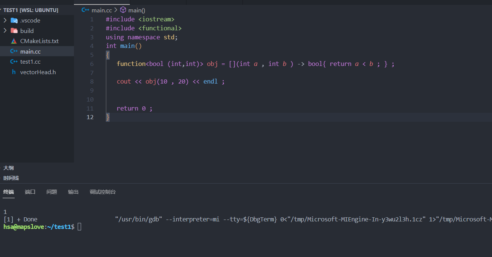

###`function`函数的应用：

**`function`**是可调用对象的封装器，可以把`std::function`看做一个函数对象，用于表示函数这个抽象概念。`std::function`的实例可以存储，复制和调用任何可调用对象，存储的可调用对象称为`std::function`的目标，若`std::function`不含目标，则称其为空，调用空的`std::function`的目标会抛出`std::bad_function_call`异常。


**示例1：**

```C++
void hello1()
{
	cout << "hello world!" << endl;
}
void hello2(string str) // void (*pfunc)(string)
{
	cout << str << endl;
}
int sum(int a, int b)
{
	return a + b;
}

class Test
{
public: // 必须依赖一个对象void (Test::*pfunc)(string)
	void hello(string str) { cout << str << endl; }
};
int main()
{
	/*
	1.用函数类型实例化function
	2.通过function调用operator()函数的时候，需要根据函数类型传入相应的参数
	*/
	// 从function的类模板定义处，看到希望用一个函数类型实例化function
	function<void()> func1 = hello1 ; 
	func1(); // func1.operator()() => hello1()

	function<void(string) > func2 = hello2 ;
	func2("hello hello2!"); // func2.operator()(string str) => hello2(str)

	function<int(int, int)> func3 = sum;
	cout<<func3(20, 30)<<endl;

	// operator()
	function<int(int, int)> func4 = [](int a, int b)->int {return a + b; };
	cout << func4(100, 200) << endl;

	function<void( Test* , string)> func5 = &Test::hello;
	Test obj ; 
   func5(&obj, "call Test::hello!") ; // 注: 这里不能写为 func5(&Test() , "call Test::hello")因为现在不允许使用&获得右值对象的地址。 

	return 0;
}
```

> + 区分函数类型和函数指针类型：
>
>   ```C++
>   //函数类型: 
>   void() 
>   //函数指针类型
>   void(*)()
>   ```
>
> + 可以封装`lambda`表达式
>
>   ```C++
>   function<int(int, int)> func4 = [](int a, int b)->int {return a + b; };
>   cout << func4(100, 200) << endl;
>   ```
>
> + ==封装成员函数(注意写法)==
>
>   ```C++
>   // 可调用对象的类型需要添加一个类类型的指针。
>   function<void(TEst* , string ) > func5 = &Test::hello ; 
>   // 第一个参数需要传入一个具体对象的地址
>   Test obj ; 
>   func5(&obj, "call Test::hello!") ; // 注: 这里不能写为 func5(&Test() , "call Test::hello")因为现在不允许使用&获得右值对象的地址。
>   ```
>
>   


#### `function`的应用：保留`lambda` 、函数、函数指针、函数对象的类型。

下面代码的基本逻辑：使用`map`映射，将功能映射到`function`上，通过`function`封装器，可以将以不同形式实现的功能聚合起来，便于用户访问。例如：==借书==是通过函数实现的， ==还书==是通过函数对象实现的，但都可以通过`map<int,function<void()>>`进行统一的访问。【这种设计方式符合软件的设计原则:**对扩展开放，对修改关闭**】


```C++
#include <iostream>
#include <vector> 
#include <map>
#include <functional>  // 使用function函数对象类型
#include <algorithm>
#include <ctime>
#include <string>
using namespace std;

/*
C++11提供的绑定器和函数对象
           bind   function
		     C++ STL  bind1st和bind2nd =》 本身还是一个函数对象
function : 绑定器，函数对象，lambda表达式 它们只能使用在一条语句中
*/

class doBack{
public:
	void operator()()
	{
		cout << "return book" << endl ; 
	}
} ; 

void doShowAllBooks() { cout << "查看所有书籍信息" << endl; }
void doBorrow() { cout << "借书" << endl; }
//void doBack() { cout << "还书" << endl; }
void doQueryBooks() { cout << "查询书籍" << endl; }
void doLoginOut() { cout << "注销" << endl; }

int main()
{
	int choice = 0;
	//       C的函数指针
	doBack obj ; 
	map<int, function<void()> > actionMap;
	actionMap.insert({ 1, doShowAllBooks }); // insert(make_pair(xx,xx));
	actionMap.insert({ 2, doBorrow }) ; 
	actionMap.insert({ 3, doBack() } ) ; // value值传入的是一个函数对象
	actionMap.insert({ 4, doQueryBooks });
	actionMap.insert({ 5, doLoginOut });

	for (;;)
	{
		cout << "-----------------" << endl;
		cout << "1.查看所有书籍信息" << endl;
		cout << "2.借书" << endl;
		cout << "3.还书" << endl;
		cout << "4.查询书籍" << endl;
		cout << "5.注销" << endl;
		cout << "-----------------" << endl;
		cout << "请选择:";
		cin >> choice;

		auto it = actionMap.find(choice); // map  pair  first second
		if (it == actionMap.end())
		{
			cout << "输入数字无效，重新选择!" << endl;
		}
		else
		{
			it->second() ; // ()是函数调用符
		}
	}

	return 0;
}
```


思考：其实`function`可以用来扩大`lambda`的使用范围：

```C++
#include <iostream>
#include <functional>
using namespace std;
int main()
{	
   function<bool (int,int)> obj = [](int a , int b ) -> bool{ return a < b ; } ;
   
   cout << obj(10 , 20) << endl ;   
   
   
   return 0 ; 
}
```



==确实可以==。


### `function`的底层实现原理

